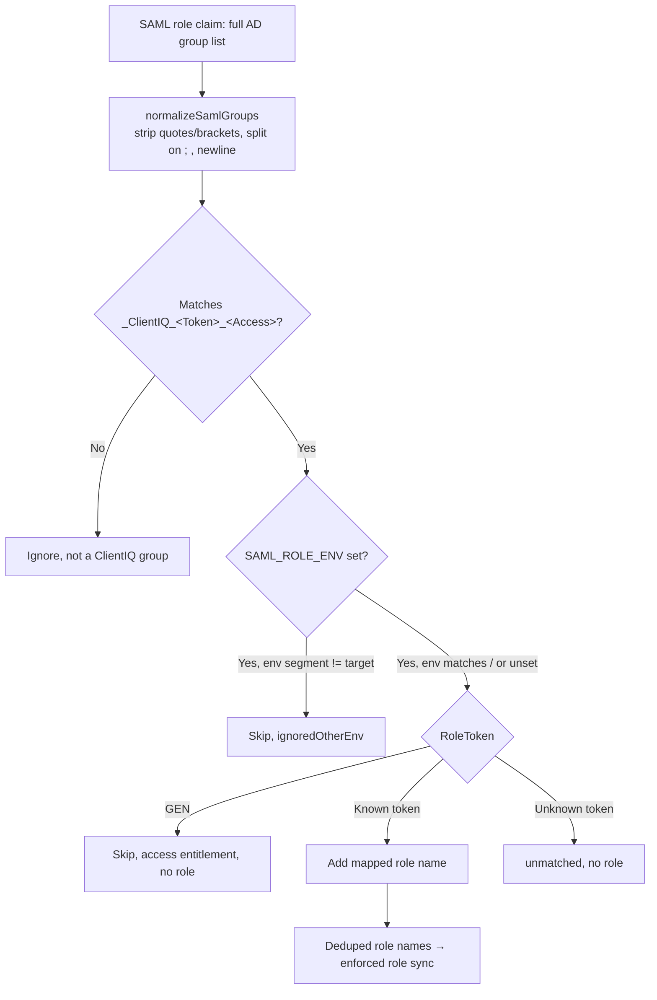

# Active Directory Security Groups

*Last reviewed: 2026-07-01. Source of truth: application code (ClientIQ / Banking Client 360).*

## Purpose

This is the operational registry of the Active Directory security groups that grant
access to the **ClientIQ / Banking Client 360** application and control which
application role each user receives. It documents:

- the `<PREFIX>_<ENV>_APP_ClientIQ_<RoleToken>_<Access>` group naming convention;
- how each group's **RoleToken** resolves to a ClientIQ application role (and its
  privilege level);
- how the same on-prem AD serves multiple deployment environments through the
  `SAML_ROLE_ENV` scoping variable;
- the `GEN` access-only entitlement and the default-role safety net;
- the group registry itself (owners and data classifications require governance
  sign-off; see `[CONFIRM]` markers).

Group membership is delivered to ClientIQ in the SAML `role` claim at login (SSO is
enabled in **preprod and prod only**; dev and test use local/mock auth). Role
assignment is driven entirely by a convention-based code mapper,
`server/auth/adGroupRoleMap.ts`, **not** by any database table. The resolved role
*names* are matched case-insensitively against rows in the SQL Server `role` table.

---

## 1. Group naming convention

Every ClientIQ security group follows this structure
(`server/auth/adGroupRoleMap.ts:5-15`):

```
<PREFIX>_<ENV>_APP_ClientIQ_<RoleToken>_<Access>
```

| Segment | Values | Effect on the granted role |
|---|---|---|
| `<PREFIX>` | e.g. `CTRL`, `IAM` | None. Naming/ownership convention only. |
| `<ENV>` | `DEV`, `TST`, `STG`, `PRD` (also `PRE` for the preprod admin group, see §4) | Used **only** for environment scoping (§3). Ignored for role selection. |
| `APP_ClientIQ` | literal | Marks the group as a ClientIQ application group. |
| `<RoleToken>` | e.g. `Teller`, `BranchManager`, `AppAdmin` | **The only segment that selects the application role** (§2). |
| `<Access>` | `RO`, `RW`, `MOD`, `ADM`, `EXEC` | None. The suffix is descriptive; it does **not** change the granted role or its permissions. |

Key point: **only the RoleToken determines the ClientIQ role.** The environment
segment and the access suffix are ignored when selecting a role
(`adGroupRoleMap.ts:12-15`). The RoleToken is captured by a case-insensitive,
end-anchored regex:

```
/_ClientIQ_([A-Za-z]+)_(?:RO|RW|MOD|ADM|EXEC)$/i   // CLIENTIQ_GROUP_RE, adGroupRoleMap.ts:64
```

A group that does not match this pattern (for example, a non-ClientIQ AD group) is
ignored entirely.

---

## 2. RoleToken → application role mapping

The mapper resolves the captured RoleToken (lowercased) to a ClientIQ application
role name via `AD_GROUP_TOKEN_TO_ROLE` (`adGroupRoleMap.ts:41-58`). The role names on
the right **must** exist as rows in the SQL Server `role` table.

| RoleToken (case-insensitive) | ClientIQ application role | Privilege level |
|---|---|---|
| `AppAdmin`, `APPSVCS` | System Admin | 4 |
| `BranchManager` | Branch Manager | 3 |
| `BusinessBanker`, `AsstManager` (assistantmanager) | BRS | 2 |
| `LoanOfficer` | Loan Officer | 2 |
| `Risk` | Risk Analyst | 1 |
| `Compliance` | Compliance Officer | 1 |
| `Teller` | Teller | 1 |
| `DataAnalyst` | Teller | 1 |
| `GEN` | *(no role, access entitlement only, see §5)* | n/a |

Notes:

- **`DataAnalyst` is not a distinct application role.** Members of a `DataAnalyst`
  group receive the **Teller** role (privilege 1); there is no "Data Analyst" role in
  the `role` table (`adGroupRoleMap.ts:57`).
- **`BusinessBanker` and `AsstManager` both resolve to the `BRS` role**
  ("Business Relationship Specialist", privilege 2) (`adGroupRoleMap.ts:48-49`).
  **Dependency:** a role row named exactly `BRS` must exist in the SQL Server `role`
  table. `BRS` is **not** created by the seed script (`scripts/seed.ts` seeds separate
  "Assistant Manager" and "Business Banker" roles), and no in-repo migration creates
  it. If the `BRS` row is absent, the role does not resolve and affected users fall
  back to the default role (§5).

  > **[CONFIRM]** Confirm the `BRS` role row (privilege level 2) exists in the SQL
  > Server `role` table for preprod and prod. It is not created by any in-repo seed or
  > migration script.

- `LoanOfficer`, `Risk`, and `Compliance` each map to their own dedicated role;
  privilege levels for Loan Officer (2), Risk Analyst (1), and Compliance Officer (1)
  come from the RBAC seed (`scripts/seed.ts`).

If a group matches the ClientIQ naming pattern but its RoleToken is not in the map, it
is collected as **unmatched** for operator visibility and grants no role
(`adGroupRoleMap.ts:157-159`).

---

## 3. Environment scoping: `SAML_ROLE_ENV`

The bank runs **one on-prem Active Directory**. A single user is therefore typically a
member of the ClientIQ groups for *every* deployment environment (both `STG` and `PRD`,
for example). Without scoping, the preprod deployment would honor a user's `PRD` groups
and prod would honor their `STG` groups (`adGroupRoleMap.ts:116-129`).

To prevent this, each deployment sets the **`SAML_ROLE_ENV`** environment variable.
When set, only groups whose `<ENV>` segment matches the deployment's env are honored;
groups from other environments are skipped (collected as `ignoredOtherEnv`)
(`adGroupRoleMap.ts:143-150`). When unset, every environment's groups are honored
(backwards-compatible).

`SAML_ROLE_ENV` is normalized (trim + uppercase, with aliases) to one of
`DEV`/`TST`/`STG`/`PRD` (`normalizeRoleEnv`, `adGroupRoleMap.ts:78-86`):

| `SAML_ROLE_ENV` input | Resolves to |
|---|---|
| `DEV`, `Development` | `DEV` |
| `TST`, `Test` | `TST` |
| `STG`, `Stage`, `Staging`, `Pre`, `PreProd`, `Pre-Prod` | `STG` |
| `PRD`, `Prod`, `Production` | `PRD` |
| unset / unrecognized | *(unscoped: all environments honored)* |

### Per-deployment values

SSO is enabled only in preprod and prod. The Azure DevOps pipeline sets
`SAML_ROLE_ENV` per stage via the `SAMLRoleEnv` pipeline variable
(→ `$env:SAML_ROLE_ENV`):

| Environment | Deploy stage | `SAML_ROLE_ENV` | Honored group ENV segment |
|---|---|---|---|
| dev | Deploy_Dev | `DEV` (SSO off; local/mock auth) | `DEV` |
| test | Deploy_Test | `TST` (SSO off; local/mock auth) | `TST` |
| **preprod** | Deploy_Preprod | **`STG`** | `CTRL_STG_APP_ClientIQ_*` |
| **prod** | Deploy_Prod, Deploy_Prod2 | **`PRD`** | `CTRL_PRD_APP_ClientIQ_*` |

*Source: `azure-pipelines.yml` per-stage `SAMLRoleEnv`; preprod `STG`
(`:181-182`), prod `PRD` (`:207-208`, `:233-234`).*

**Consequence:** a user who is a Teller in `STG` and a Branch Manager in `PRD`
resolves to **Teller in preprod** and **Branch Manager in prod**: the same AD
membership, different effective role per deployment.

### Environment-scoping flow



---

## 4. The administrative group: token differs by environment

The code comment (`adGroupRoleMap.ts:27-39`) documents that the **admin group token
differs by environment**, per the bank's IdP entitlement list:

- **Preprod** uses the `APPSVCS` token, in the form `CTRL_PRE_..._APPSVCS_ADM`.
- **dev / test / stg / prod** use the `AppAdmin` token.

The mapper accepts **both** tokens and maps each to the **System Admin** role
(privilege 4); `appsvcs` and `appadmin` are both keys in `AD_GROUP_TOKEN_TO_ROLE`
(`adGroupRoleMap.ts:43-44`). Because the environment segment is ignored for role
selection, both group-name forms resolve identically.

> **[CONFIRM]** The preprod administrative group name is inconsistent between sources:
> the legacy registry lists `CTRL_STG_APP_ClientIQ_AppAdmin_ADM` (STG + AppAdmin),
> while the code comment describes `CTRL_PRE_..._APPSVCS_ADM` (PRE + APPSVCS) as the
> preprod form. Confirm the exact preprod admin group name and its `<ENV>` segment with
> the IAM/AD entitlement source of truth. Note: whichever form is registered, both the
> `APPSVCS` and `AppAdmin` tokens resolve to the System Admin role, so role assignment
> is unaffected; this is a registry-naming discrepancy, not a mapping error.
>
> If the preprod admin group uses the `PRE` env segment, verify it is honored under
> `SAML_ROLE_ENV=STG`: the env normalizer maps the *variable value* `PRE` → `STG`, but
> the group's own `<ENV>` segment is matched by `GROUP_ENV_RE`
> (`/^[A-Za-z]+_(DEV|TST|STG|PRD)_APP_/i`, `adGroupRoleMap.ts:67`), which recognizes
> only `DEV`/`TST`/`STG`/`PRD`. A group whose segment is literally `PRE` would not
> match the target env `STG` and would be skipped as `ignoredOtherEnv`.

---

## 5. The `GEN` access entitlement and the default-role safety net

### `GEN`: app access only, no role

The `GEN` token (e.g. `IAM_<ENV>_APP_RSA_ClientIQ_GEN_EXEC`) is the "may access the
app" entitlement. It is in `ACCESS_ONLY_TOKENS` (`adGroupRoleMap.ts:60-61`) and is
skipped during mapping (`adGroupRoleMap.ts:152-153`); it grants **no application
role by itself**. A user who holds only `GEN`/RSA access is authenticated but has no
AD-derived role, so they receive the configured default role rather than being blocked.

### Default / fallback role

When a user's groups map to no ClientIQ role (or when the resolved role names are
absent from the `role` table), the enforced role sync applies the fallback role
`SAML_DEFAULT_ROLE_NAME` (default **`Branch Manager`**)
(`server/routes/auth.ts:357`; `server/storage/sqlServerEmployee.ts:359`).

A two-tier "never strand a user" guarantee ensures an authenticated RSA user is never
left role-less:

1. **In the sync**: if AD groups yield no role, the fallback role is applied
   (`sqlServerEmployee.ts:367-372`).
2. **Bulletproof ACS fallback**: after permissions load, if the user still has zero
   roles, `ensureEmployeeHasDefaultRoleSqlServer()` grants the default role
   (`server/routes/auth.ts:412-424`; `server/storage/sqlServerEmployee.ts:208-290`).

The user is stranded on "Awaiting Role Assignment" **only** if even the fallback role
itself is missing from the `role` table (`defaultRoleMissing`,
`server/routes/auth.ts:428-430`): a genuine misconfiguration.

---

## 6. Pre-prod (STG) group registry

The pre-prod deployment runs with `SAML_ROLE_ENV=STG` and therefore honors only the
`STG`-segment ClientIQ groups below. The **Resolved role** and **Privilege** columns
are code-verifiable (`server/auth/adGroupRoleMap.ts:41-58`); the **Owner** and **Data
classification** columns are governance metadata that is not represented in the
codebase and must be confirmed (see the `[CONFIRM]` note at the end of this section).

| AD security group | RoleToken | Resolved ClientIQ role | Privilege | Purpose |
|---|---|---|---|---|
| `CTRL_STG_APP_ClientIQ_Teller_RO` | Teller | Teller | 1 | Access for Tellers. |
| `CTRL_STG_APP_ClientIQ_Risk_RO` | Risk | Risk Analyst | 1 | Access for Risk users. |
| `CTRL_STG_APP_ClientIQ_LoanOfficer_RW` | LoanOfficer | Loan Officer | 2 | Access for Loan Officers. |
| `CTRL_STG_APP_ClientIQ_DataAnalyst_RO` | DataAnalyst | **Teller** | 1 | Access for Data Analysts. Maps onto Teller permissions; there is no separate Data Analyst role. |
| `CTRL_STG_APP_ClientIQ_Compliance_RO` | Compliance | Compliance Officer | 1 | Access for Compliance users. |
| `CTRL_STG_APP_ClientIQ_BusinessBanker_RW` | BusinessBanker | **BRS** | 2 | Access for Banking Relationship Specialists / Lending Specialists. Requires a `BRS` role row (§2). |
| `CTRL_STG_APP_ClientIQ_BranchManager_MOD` | BranchManager | Branch Manager | 3 | Access for Branch Managers and Operations Managers. |
| `CTRL_STG_APP_ClientIQ_AppAdmin_ADM` | AppAdmin | System Admin | 4 | Administrative access. See §4 re: the `APPSVCS`/`PRE` preprod naming discrepancy. |
| `IAM_STG_APP_RSA_ClientIQ_GEN_EXEC` | GEN | *(none: access entitlement only)* | n/a | RSA "may access the app" entitlement. Grants no role by itself; user receives the default role (§5). |

Reminder: the access suffix (`RO`/`RW`/`MOD`/`ADM`/`EXEC`) is descriptive only and does
not change the granted role; the actual permission set comes from the resolved role's
privilege level and grants (see the RBAC documentation).

> **[CONFIRM]** The group **owner** and **data-classification** for each group must be
> confirmed with the IAM/AD governance team. These fields are outside the code's scope
> and are not verifiable from source. The legacy registry recorded them as:
> Data Classification **Confidential** for all groups; owners, Teller/LoanOfficer/
> BusinessBanker/BranchManager: *Operations Administration Manager*; Risk: *Risk
> Manager*; Compliance: *Compliance Manager*; DataAnalyst/AppAdmin: *Application
> Services Manager*. Validate each against the current group owner of record.

---

## 7. Production (PRD) group registry

Production is a distinct HA deployment (two app servers, `Deploy_Prod` +
`Deploy_Prod2`) that runs with `SAML_ROLE_ENV=PRD` and therefore honors only the
`PRD`-segment groups. By the naming convention (§1) and the same RoleToken mapping
(§2), the production groups mirror the pre-prod set with a `PRD` env segment, for
example `CTRL_PRD_APP_ClientIQ_BranchManager_MOD` → Branch Manager
(`adGroupRoleMap.ts:7`) and `IAM_PRD_APP_RSA_ClientIQ_GEN_EXEC` → access-only.

The RoleToken → role mapping is identical to §2 (the mapper does not distinguish env
for role selection). The production admin group uses the `AppAdmin` token per the code
comment (§4).

> **[CONFIRM]** The exact production (`CTRL_PRD_*` / `IAM_PRD_*`) group names, their
> owners, and data classifications are not present in the codebase. Confirm the full
> production group registry with the IAM/AD governance team. The application code
> resolves any `CTRL_PRD_APP_ClientIQ_<RoleToken>_<Access>` group by its RoleToken per
> the §2 mapping regardless of the exact registered name.

---

## 8. Operational reference

| Concern | Detail | Source |
|---|---|---|
| Where mapping lives | Convention-based code mapper; no DB table on the login path | `server/auth/adGroupRoleMap.ts` |
| How groups arrive | SAML `role` claim (multi-valued array or delimited string), parsed by `normalizeSamlGroups` | `adGroupRoleMap.ts:102-114` |
| Which segment picks the role | RoleToken only; ENV + Access suffix ignored | `adGroupRoleMap.ts:12-15`, `:64` |
| Env scoping | `SAML_ROLE_ENV` (STG=preprod, PRD=prod); unset = all envs | `adGroupRoleMap.ts:78-86`, `:143-150` |
| Access-only token | `GEN` → no role → default role | `adGroupRoleMap.ts:60-61`, `:152-153` |
| Default role | `SAML_DEFAULT_ROLE_NAME`, default `Branch Manager` | `server/routes/auth.ts:357`, `:412-430` |
| Role names required in DB | System Admin, Branch Manager, BRS, Teller, Loan Officer, Risk Analyst, Compliance Officer | `adGroupRoleMap.ts:22-25` |
| Role reconciliation | AD-derived roles are re-synced (assigned/revoked) every login; admin-granted roles are never auto-revoked | `server/storage/sqlServerEmployee.ts:355-468` |

For how resolved roles translate into permissions and how role sync reconciles
`employee_role` on each login, see the RBAC and SAML/AD documentation.
