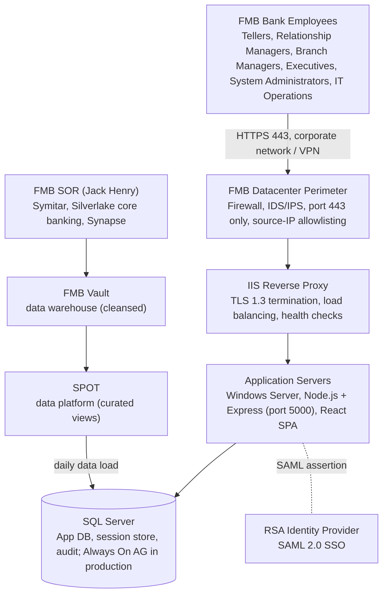
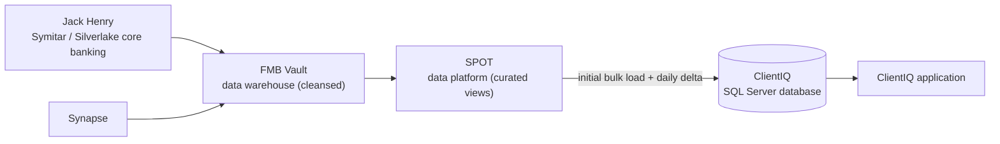
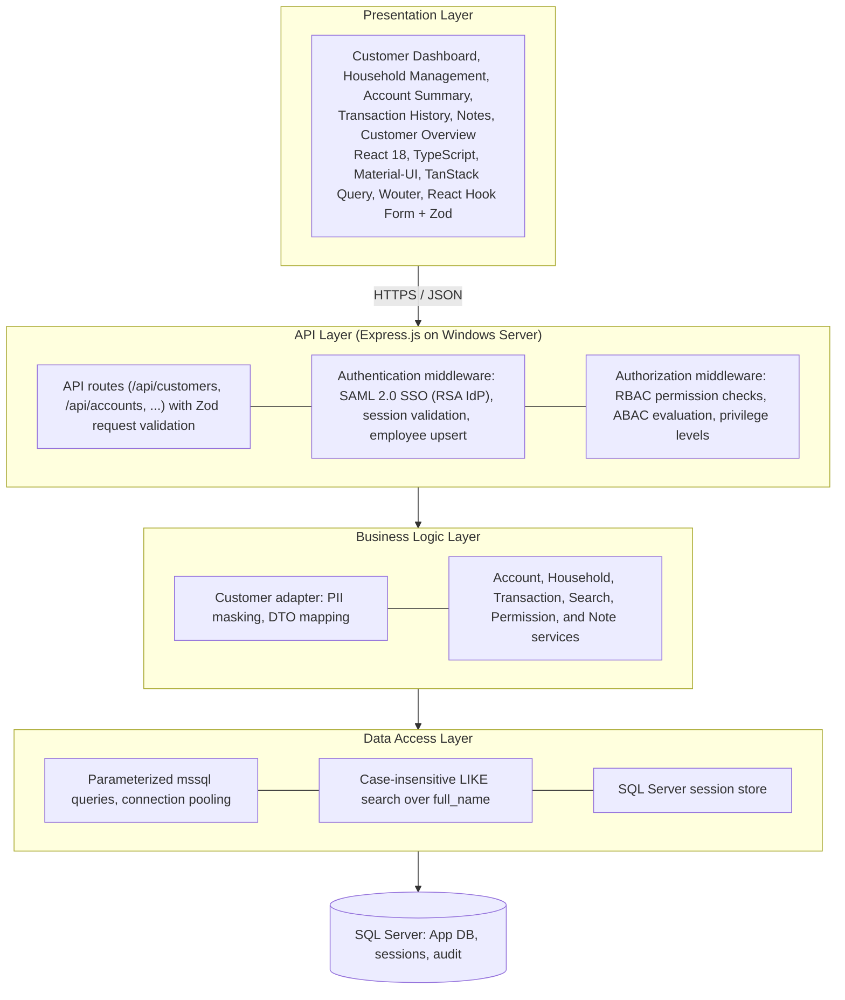
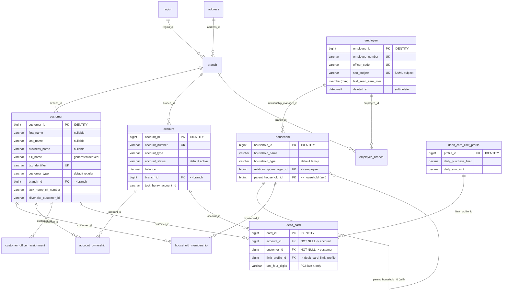
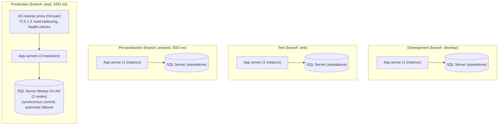
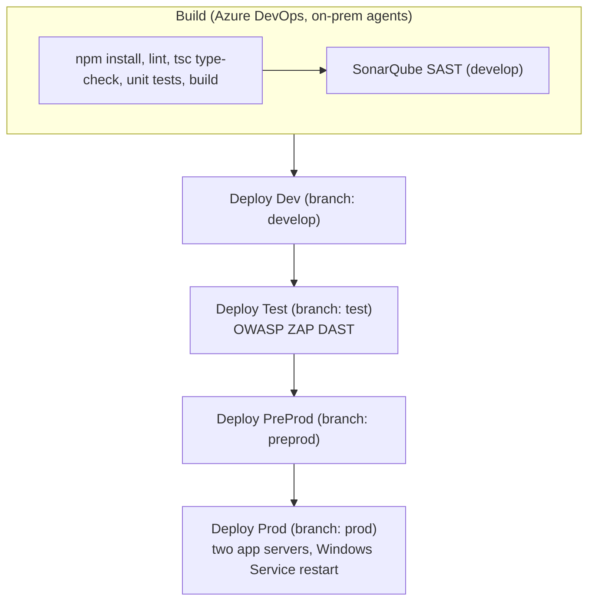
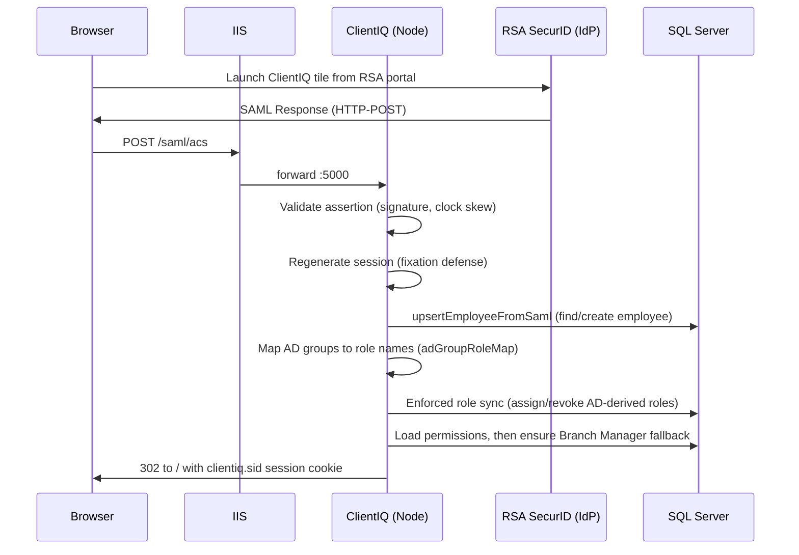

# ClientIQ: System Architecture Document

**Farmers and Merchants Bank (FMB)**

| Field | Value |
|---|---|
| Document Classification | Internal - Confidential |
| Customer | Farmers and Merchants Bank |
| Version | 1.0 |
| Date | November 13, 2025 |
| Document Owner | Enterprise Architecture & Engineering |
| Distribution | FMB Technology Leadership, Engineering Teams, Solution Architects |

## Executive Summary

The ClientIQ platform is an enterprise-grade customer intelligence system deployed on Farmers and Merchants Bank's on-premise Windows Server infrastructure. The system provides a unified 360-degree view of customer relationships, accounts, transactions, and household information, consolidating data from FMB's System of Record (SOR) through the Vault and SPOT data platforms into a high-performance application database.

**Deployment Architecture:**
- Infrastructure: On-premise Windows Server 2019+ hosts
- Database: Microsoft SQL Server 2019+ (Always On Availability Groups in production)
- Reverse Proxy: IIS on Windows Server for TLS 1.3 termination and load balancing
- Authentication: RSA SAML 2.0 SSO integration (preprod and production)
- Environments: Development, Test, Pre-production, Production
- Data Pipeline: SOR to Vault to SPOT to ClientIQ application database (initial bulk load plus daily delta updates)

**Key Technology Stack:**
- Frontend: React 18 + TypeScript + Material-UI
- Backend: Express.js + Node.js hosted on Windows Server
- Database: Microsoft SQL Server (case-insensitive search over the unified `full_name` column)
- Session Management: SQL Server session store
- Authentication: RSA Identity Provider via SAML 2.0

---

## 1. Introduction

### 1.1 System Overview

The ClientIQ platform consolidates customer data from FMB's System of Record through the Vault and SPOT data platforms, delivering a comprehensive 360-degree view of customer relationships, accounts, transactions, and household information. The system is designed specifically for FMB's on-premise Windows Server infrastructure, using Microsoft SQL Server as the primary data store.

**Core Capabilities:**
- **Customer Intelligence:** Unified customer profiles with household relationships, account aggregation, and transaction history
- **Customer Data Management:** Customer information viewing with support for individual, business, and trust customer types
- **Account Management:** Account viewing with multi-owner support, debit card information, and transaction history
- **Search and Discovery:** Fast customer lookup by name, tax id, or core-banking identifier, with relevance indicators
- **Customer Notes:** Full CRUD operations on customer notes with versioning and audit trails

**Technical Foundation:**
- React 18 + TypeScript single-page application
- Express.js REST API layer hosted on Node.js (Windows Server)
- Microsoft SQL Server 2019+ with Always On Availability Groups (production)
- RSA SAML 2.0 SSO authentication (preprod and production)
- IIS reverse proxy for TLS termination and load balancing

### 1.2 High Level Architecture Overview

The solution is built as a responsive web application that supports Single Sign-On (SSO) for secure access. The application architecture is organized into logical layers, fronted by IIS and backed by SQL Server, with data delivered from the FMB core-banking pipeline.

![ClientIQ layered architecture. Bands top to bottom: Web / Edge (IIS on Windows Server, TLS 1.3 termination and reverse proxy to Node on port 5000), Presentation (React 18 + MUI SPA, Wouter routing, TanStack Query), Application and Business (middleware chain, REST API, domain services), Data Access (row-to-DTO adapters, SqlServerSearchProvider, parameterized mssql), and Data (the SOR to VAULT to SPOT to ClientIQ SQL Server daily data-load flow). The RSA SecurID / Active Directory identity provider connects to the Application tier, and an Observability element spans the Data Access and Data tiers.](images/architecture-layered.png)

The application architecture is organized into multiple logical layers:

- **Interface Layer:** Web user interface supporting responsive design and secure client interactions.
- **Application Services Layer:** Implements business logic for client data presentation, entitlement enforcement, and user management.
- **Integration Layer:** Provides secure API and service connectivity with JHA (Jack Henry) core banking and supporting systems.
- **Data Layer:** Consumes curated data from Vault and SPOT sources and supports data engineering functions for performance, enrichment, and governance.

The architecture includes foundational components for security, reliability, and operational excellence:

- **Security:** SSO integration, TLS 1.3 encryption, and user entitlements using RBAC and ABAC models.
- **Observability:** Centralized logging, application health checks, and alerting for proactive monitoring.
- **DevSecOps Enablement:** Automated CI/CD pipelines, code scanning (SAST/DAST), and controlled environment promotion for safe and efficient delivery.

### 1.3 Technical Architecture

**Layered Architecture Pattern:** The system employs a clear separation of concerns across five layers:

1. **Presentation Layer:** React components with Material-UI, responsive design
2. **API Layer:** RESTful endpoints (unversioned today; URL versioning is a roadmap item, see [§5.2](#52-integration-architecture))
3. **Business Logic Layer:** Service adapters with PII masking, permission checks
4. **Data Access Layer:** SQL Server parameterized queries, connection pooling
5. **Integration Layer:** Scheduled data loads (SOR to Vault to SPOT), SAML authentication

**Architectural Patterns:**
- **DTO Pattern:** Data Transfer Objects with PII masking via customer adapters
- **Data Pipeline:** Scheduled data loads from SOR to Vault to SPOT to App DB (initial bulk plus daily deltas)
- **Data Access:** Raw parameterized `mssql` queries against SQL Server (no stored-procedure application layer)
- **Session Management:** SQL Server session store with secure cookie configuration

**Technology Strategy:**
- **Windows Integration:** Node.js hosted on Windows Server with an IIS reverse proxy
- **SQL Server Optimization:** Non-clustered indexes on search and join columns, query optimization, Always On AG in production
- **Scalability:** Horizontal scaling of the application tier behind IIS in production
- **Developer Experience:** TypeScript-first development, automated testing, CI/CD

### 1.4 Security Posture

The platform implements defense-in-depth security controls following banking industry best practices:

**Authentication and Authorization:**
- **Enterprise SSO:** SAML 2.0 integration with RSA Identity Provider (enabled in preprod and production; dev and test use local mock authentication)
- **Session Management:** Secure cookies (HttpOnly, SameSite), SQL Server session store
- **Access Control:** RBAC (multiple roles and privilege levels) plus ABAC (attribute-based permissions)
- **Permission Enforcement:** Role-gated API requests validated against user permissions

**Data Protection:**
- **In Transit:** TLS 1.3 encryption via the IIS reverse proxy
- **At Rest:** SQL Server Transparent Data Encryption (TDE)
- **In Use:** PII masking (tax id rendered as `XXX-XX-1234`)
- **In Logs:** Sensitive data redacted (no tax id, account numbers, or passwords)

**Network Security:**
- IIS reverse proxy for load balancing and TLS termination
- Firewall rules restricting access to the FMB corporate network
- IDS/IPS integration for threat detection

**Audit Logging:**
- Audit trails for customer notes and role management
- Long-term retention in SQL Server audit tables

> **[CONFIRM]** TDE enablement, IDS/IPS integration, and the audit-retention schedule are infrastructure and policy facts to confirm with FMB security and DBA teams.

### 1.5 Architectural Principles

The platform is architected according to enterprise-grade principles ensuring scalability, security, and maintainability:

| Principle | Implementation |
|---|---|
| On-Premise First | Windows Server hosts, SQL Server Always On, on-prem IIS |
| Security by Design | Defense-in-depth: TLS 1.3, TDE, RBAC/ABAC, RSA SAML SSO, PII masking |
| Enterprise Integration | SOR to Vault to SPOT to App DB pipeline, scheduled SQL loads |
| API First | RESTful API-driven architecture |
| Data Sovereignty | Role-based permissions, data masking |
| Regulatory Compliance | Designed to support compliance requirements |
| Windows Native | Node.js on Windows, SQL Server integration, Active Directory compatibility |
| High Availability | SQL Server Always On Availability Groups, automatic failover (production) |

### 1.6 Key Non-Functional Requirements

**Performance:**
- Fast transaction and customer-profile response times
- Fast customer search via indexed `LIKE` lookups on the unified `full_name` column
- Support for multiple concurrent FMB staff users
- Handles large customer databases with fast search

**Scalability:**
- Horizontal scaling of the application tier behind IIS in production
- SQL Server session store for stateful session management
- Support for enterprise-scale customer databases

**Availability:**
- High-availability SLA in production
- SQL Server Always On Availability Groups for automatic failover
- IIS reverse proxy with health checks and failover

**Security:**
- End-to-end TLS 1.3 encryption
- Data masking for PII in the UI and logs
- Audit logging for notes and role management

**Compliance Standards:**
- Customer data protected with encryption (TLS 1.3, SQL Server TDE)
- Audit logging for notes and role management
- PII masking in the UI and logs
- Role-based access control for data segregation

---

## 2. System Context

### 2.1 System Context Diagram

The ClientIQ system operates within FMB's on-premise datacenter environment. FMB staff reach the application over HTTPS on the corporate network; the application integrates with the core-banking data pipeline and the RSA identity provider.



### 2.2 FMB Data Pipeline Architecture (SOR to Vault to SPOT to App DB)

The application database is populated through a multi-stage pipeline. Source records originate in the FMB System of Record (Jack Henry Symitar and Silverlake core banking, plus Synapse), land in the Vault data warehouse, are curated into SPOT, and are then loaded into the ClientIQ SQL Server database on a daily cadence (initial bulk load followed by daily deltas).



In the current implementation, the SPOT feed surfaces as the Jack Henry views (`TheSpot`, `TheSpotPreProd`, and the `TheVault` landing view), and the loads are scheduled SQL scripts executed in foreign-key dependency order with idempotent `MERGE` / `NOT EXISTS` guards. There is no SSIS orchestration or staging-table layer committed in the application repository.

> **[CONFIRM]** The scheduled orchestration (SQL Agent job or equivalent) and the refresh window that drives the daily delta loads in preprod and production.

### 2.3 External System Interfaces

| System | Integration Type | Protocol | Data Flow | Authentication |
|---|---|---|---|---|
| FMB SOR (Jack Henry Symitar) | Batch data load | SQL Server / views | Inbound (SOR to Vault) | Windows Auth |
| FMB SOR (Silverlake) | Batch data load | SQL Server / views | Inbound (SOR to Vault) | Windows Auth |
| Synapse | Batch data load | SQL Server / views | Inbound (to Vault) | Windows Auth |
| FMB Vault / SPOT | Scheduled load | SQL Server views | Inbound (SPOT to App DB) | Windows Auth |
| RSA Identity Provider | SAML 2.0 | HTTPS / XML | Bidirectional (auth) | X.509 Certificate |

### 2.4 Stakeholder Analysis

| Stakeholder Group | Primary Needs | System Interaction | Success Metrics |
|---|---|---|---|
| Tellers | Fast customer lookup, transaction viewing | Read-only customer profiles, account balances | Fast customer lookup |
| Relationship Managers | Comprehensive customer intelligence, notes | Full CRUD on customer notes, household management | 360-degree view completeness |
| Branch Managers | Team oversight, customer service management | RM capabilities plus team reports | System usage, customer satisfaction |
| Executives | Strategic analytics, portfolio insights | Dashboards, executive reports (read-only) | Strategic insight availability |
| System Administrators | User management, system configuration | Full administrative access, role assignment | System availability |
| IT Operations | Monitoring, incident response | Infrastructure management, log analysis | Fast MTTR |

---

## 3. Logical Component Architecture

### 3.1 Component Structure and Responsibilities

The platform follows a layered architecture pattern with clear separation of concerns. Each layer exposes a narrow contract to the layer above it, and the data-access layer is the only tier that talks to SQL Server.



**Layer responsibilities:**
- **Presentation:** Customer Dashboard, Household Management, Account Summary, Transaction History, Notes, and Customer Overview screens. Technology: React 18, TypeScript, Material-UI, TanStack React Query (server state), Wouter (routing), React Hook Form + Zod (forms).
- **API:** Express route definitions, Zod request validation, standardized error handling; SAML authentication middleware (session validation, employee lookup/upsert from SAML assertions); authorization middleware (RBAC checks, ABAC conditional evaluation, privilege-level verification).
- **Business Logic:** Customer adapter (PII masking, DTO mapping), Account/Household/Transaction/Search services, Permission service (ABAC evaluation, audit logging), Note service (versioning, soft delete).
- **Data Access:** SQL Server access via the `mssql` driver with parameterized queries and connection pooling; case-insensitive `LIKE` search over `full_name`; SQL Server session store with automatic cleanup.

---

## 4. Data Architecture and Information Management

### 4.1 Data Storage Strategy

**SQL Server Primary Database:**
- **Primary Database:** Microsoft SQL Server 2019+ with Always On Availability Groups (production)
- **Session Store:** SQL Server session table for stateful session management
- **Audit Store:** SQL Server audit tables (`audit_event`, `role_audit_log`, `permission_denial_log`) for regulatory retention

**Data Flow Patterns:**
1. **Write Operations:** Application writes are limited to the Notes module and RBAC/role administration
2. **Read Operations:** Served from the primary (and a read-only secondary replica where configured)
3. **Session Management:** SQL Server session store with automatic cleanup
4. **Audit Logs:** Write-through to audit tables for role and note actions
5. **Search Queries:** Indexed case-insensitive `LIKE` lookups on `full_name`
6. **Data Loads:** SPOT to App DB scheduled loads (initial bulk plus daily delta)

### 4.2 Search Implementation

Customer search is a case-insensitive substring match on the unified `full_name` column (and tax id / core-banking identifiers), using `COLLATE Latin1_General_CI_AS`. Non-clustered indexes on the search and join columns back the queries.

```sql
-- Customer search (case-insensitive LIKE over the unified full_name column)
SELECT customer_id, full_name, customer_type
FROM customer
WHERE full_name COLLATE Latin1_General_CI_AS LIKE '%' + @term + '%'
   OR tax_identifier LIKE @term + '%'
ORDER BY customer_id;

-- Supporting indexes (see scripts/create_performance_indexes.sql)
CREATE INDEX idx_customer_full_name ON customer(full_name);
CREATE INDEX idx_customer_tax_id ON customer(tax_identifier);
```

> **[CONFIRM]** If phonetic or similarity ranking is required, SQL Server `SOUNDEX` / `DIFFERENCE` (2019) or `STRING_SIMILARITY` (2022+) can be introduced; the production endpoint currently uses substring `LIKE`.

### 4.3 Core Data Models

The core entity relationships are shown below (customers, households, employees, accounts, debit cards, and their junctions). The complete 40-table model is maintained in the companion ERD document.



### 4.4 Database Schema Highlights (SQL Server)

Representative DDL for the `customer` table. Conditional name requirements (individual vs business/trust) are enforced in application code (Zod discriminated union), not by a database CHECK constraint.

```sql
CREATE TABLE customer (
  customer_id            BIGINT IDENTITY(1,1) PRIMARY KEY,

  -- Individual customer fields
  first_name             NVARCHAR(100),
  last_name              NVARCHAR(100),
  middle_name            NVARCHAR(100),
  date_of_birth          DATE,

  -- Business customer fields
  business_name          NVARCHAR(200),
  dba_name               NVARCHAR(200),

  -- Unified search field (populated by the load)
  full_name              NVARCHAR(200),

  -- Identification (masked in UI)
  tax_identifier         NVARCHAR(20) UNIQUE,
  government_id          NVARCHAR(50),

  -- Classification
  customer_type          NVARCHAR(20) NOT NULL DEFAULT 'regular',
  customer_status        NVARCHAR(20) DEFAULT 'active',

  -- Compliance
  kyc_status             NVARCHAR(20),
  risk_rating            NVARCHAR(20),

  -- Flags
  is_employee            BIT DEFAULT 0,
  vip_customer           BIT DEFAULT 0,
  is_deceased            BIT DEFAULT 0,

  -- Core banking integration
  jack_henry_cif_number  NVARCHAR(20),
  silverlake_customer_id NVARCHAR(20)
);

-- Supporting indexes
CREATE INDEX idx_customer_full_name ON customer(full_name);
CREATE INDEX idx_customer_tax_id    ON customer(tax_identifier);
CREATE INDEX idx_customer_status    ON customer(customer_status);
CREATE INDEX idx_customer_type      ON customer(customer_type);
```

The SQL Server session store is a `sessions` table (`session_id`, `session_data`, `expires_at`); expired rows are cleaned up automatically by the application session layer on a short interval.

### 4.5 Data Loading (Vault / SPOT to App DB)

The application database is loaded from the SPOT curated views on a scheduled cadence. Loads run in foreign-key dependency order: lookups first (`branch`, `note_category`, `transaction_category`), then `customer` and `employee`, then `address`, `contact_info`, `account`, and ownership/household/transaction tables. Loaders are idempotent via `MERGE` or `NOT EXISTS` guards, keyed on `jack_henry_cif_number`, `account_number`, `officer_code`, or `branch_code`. Transaction history is loaded for a rolling recent window.

RBAC tables are not part of the data load. SQL Server environments bootstrap RBAC separately via the role-provisioning scripts (`ensure_branch_manager_role.sql`, `ensure_rbac_provenance_columns.sql`).

> **[CONFIRM]** Whether a staging-table and data-quality-validation layer is desired between SPOT and the App DB; the current loaders read SPOT views directly.

### 4.6 Data Retention and Privacy

| Data Type | Retention | Deletion Method | Regulatory Basis |
|---|---|---|---|
| Customer PII | Per policy after account closure | Purge after retention | GLBA, state banking laws |
| Account Data | Per policy after closure | Archival then purge | Reg CC, Reg E, UCC |
| Transactions | Per policy | Archival then purge | Regulatory requirements |
| Debit Card Data | Per policy after cancellation | Store last 4 only; purge after retention | PCI DSS |
| Audit Logs | Long-term (regulatory) | Indexed storage in SQL Server | Regulatory requirements |
| Customer Notes | Per policy (legal hold) | Soft delete (`is_deleted` flag) | Internal policy |
| Session Data | Standard session duration | Automatic cleanup | Security policy |

**PII Handling:**
- **At Rest:** SQL Server TDE (Transparent Data Encryption) for database files
- **In Transit:** TLS 1.3 for all network communication (IIS reverse proxy)
- **In Use:** PII fields masked in the UI (tax id rendered as `XXX-XX-1234`)
- **In Logs:** PII fields redacted (never log tax id, account numbers, or passwords)

> **[CONFIRM]** Exact retention periods per data type against FMB's records-retention schedule.

---

## 5. Technology Stack and Integration Patterns

### 5.1 Technology Stack Specification for FMB

**Frontend Technologies:**

| Category | Technology | Version | Purpose |
|---|---|---|---|
| UI Framework | React | 18.x | Component-based UI |
| Language | TypeScript | 5.x | Type-safe development |
| Build Tool | Vite | 5.x | Build and dev server |
| UI Library | Material-UI (MUI) | 7.x | Enterprise components |
| State Management | TanStack React Query | 5.x | Server-state caching |
| Routing | Wouter | 3.x | SPA routing |
| Form Handling | React Hook Form | 7.x | Performant forms |
| Validation | Zod | 3.x | Schema validation |

**Backend Technologies:**

| Category | Technology | Version | Purpose |
|---|---|---|---|
| Runtime | Node.js | 20.x (LTS) | JavaScript runtime |
| Framework | Express.js | 4.x | Web framework |
| Language | TypeScript | 5.x | Type-safe backend |
| Database Driver | mssql | 12.x | SQL Server driver |
| SAML Authentication | @node-saml/passport-saml | 5.x | SAML 2.0 SSO |
| Session Store | connect-mssql | current | SQL Server sessions |
| Runtime Launcher | tsx | 4.x | TypeScript execution |

**Database Technologies:**

| Category | Technology | Purpose |
|---|---|---|
| Primary Database | SQL Server 2019+ | Relational database |
| Search | Indexed `LIKE` on `full_name` | Substring customer search |
| High Availability | Always On AG (production) | Automatic failover |
| Encryption | TDE | Data-at-rest encryption |
| Session Management | SQL Server table | Session persistence |
| Data Loading | Scheduled SQL (SQL Agent) | Vault / SPOT to App DB |

**Infrastructure Technologies:**

| Category | Technology | Purpose |
|---|---|---|
| Operating System | Windows Server 2019+ | App server hosting |
| Reverse Proxy | IIS | Load balancing, TLS 1.3 termination |
| CI/CD | Azure DevOps | Automated build and deploy |
| Secrets Management | Windows / secured config | Credential storage |

### 5.2 Integration Architecture

**Integration Patterns for FMB:**

1. **SAML 2.0 SSO (Authentication)**
   - Use Case: Enterprise authentication via RSA Identity Provider (preprod and production)
   - Protocol: HTTPS / XML (SAML assertions)
   - Flows: SP-initiated login
   - Assertion Validation: signature verification, audience restriction, timestamp checks
2. **Scheduled Data Load (Data Integration)**
   - Use Case: Daily delta loads from SPOT to the App DB
   - Protocol: SQL Server views (SPOT)
   - Schedule: daily (configurable)
   - Processing: FK-ordered idempotent `MERGE` / `NOT EXISTS` loads

**API Versioning Strategy:** The API is currently unversioned (routes are served under `/api/*` with no `/api/v1` prefix). URL versioning and a deprecation policy are a roadmap item.

**Integration Security:**
- **TLS 1.3:** all external communications encrypted
- **IP Allowlisting:** production access restricted to the FMB network

### 5.3 API Catalog (Abridged)

**Customer APIs:**
- `GET /api/customers/search?q={query}` : customer search (indexed `LIKE`)
- `GET /api/customers/:id` : customer profile with nested data
- `GET /api/customers/:id/accounts` : customer accounts
- `GET /api/customers/:id/transactions` : customer transactions
- `GET /api/customers/:id/households` : customer households
- `GET /api/customers/:id/notes` : customer notes
- `POST /api/customers/:id/notes` : create customer note
- `PATCH /api/notes/:id` : update note (creates a new version)
- `DELETE /api/notes/:id` : soft-delete note

**Account APIs:**
- `GET /api/accounts/:id` : account details
- `GET /api/accounts/:id/owners` : account owners
- `GET /api/accounts/:id/transactions` : account transactions
- `GET /api/accounts/:id/debit-cards` : debit cards for account

**Household APIs:**
- `GET /api/households/:id` : household details
- `GET /api/households/:id/members` : household members
- `GET /api/households/:id/accounts` : household accounts

**Authentication APIs:**
- `GET /saml/login` : initiate SAML login (RSA IdP)
- `POST /saml/acs` : Assertion Consumer Service
- `GET /saml/metadata` : Service Provider metadata
- `GET /saml/logout` : initiate logout

**Authorization APIs:**
- `GET /api/auth/permissions` : user permissions
- `POST /api/auth/check-permission` : conditional permission check
- `GET /api/admin/users` : list users (admin only)
- `POST /api/admin/users/:id/roles/manual` : assign role (admin only)

---

## 6. Infrastructure and Deployment Architecture

### 6.1 FMB Deployment Topology (Four Environments)

ClientIQ runs in four environments: dev, test, preprod, and prod. Dev, test, and preprod each run a single application server and a single SQL Server database. Production is the high-availability tier: an IIS reverse-proxy pair fronts two application servers, backed by a SQL Server Always On Availability Group. SAML SSO is enabled in preprod and production only; dev and test use local mock authentication.



**Environment Specifications:**

| Environment | App Servers | SQL Server | IIS | SSO | Purpose |
|---|---|---|---|---|---|
| Development | 1 | Standalone | Single | Off (mock) | Feature dev, integration testing |
| Test | 1 | Standalone | Single | Off (mock) | QA and regression testing |
| Pre-production | 1 | Standalone | Single | On (RSA) | Pre-production validation |
| Production | 2 | Always On AG (2-node) | HA pair | On (RSA) | Live system, high-availability SLA |

> **[CONFIRM]** Host FQDNs, IIS binding and ARR configuration, TLS certificate owners/paths, the production load-balancer product, and SQL Server Always On node sizing.

### 6.2 Deployment Strategy for FMB

Deployment promotes through the four environments in order (develop, test, preprod, prod). Each stage is driven by the Azure DevOps pipeline:

1. **Development:** Developers commit to the `develop` branch. Azure DevOps triggers the build pipeline (install, lint, type-check, unit tests, build) and deploys to the dev environment for smoke testing.
2. **Test:** Changes promote to the `test` branch and deploy to the test environment for QA and regression testing.
3. **Pre-production:** Changes promote to the `preprod` branch and deploy to preprod (SSO enabled) for pre-production validation.
4. **Production:** Changes promote to the `prod` branch and deploy to the two production application servers during a scheduled window, followed by post-deployment validation and monitoring.

Deployment is performed by PowerShell remoting from the Azure DevOps pipeline: copy the build artifact to the target host, stop the Windows Service, optionally refresh dependencies, and start the Windows Service.

> **[CONFIRM]** Blue-green / zero-downtime cutover in production is a target capability; confirm whether it is in place or planned.

### 6.3 CI/CD Pipeline for FMB (Azure DevOps)

The pipeline triggers on the `develop`, `test`, `preprod`, and `prod` branches. Pushing to GitHub `main` does not deploy to any environment.



**Quality Gates:** all tests passing (unit, integration), no critical security findings, successful TypeScript compilation, SonarQube SAST on `develop`, and OWASP ZAP DAST after the Test deploy.

---

## 7. Cross-Cutting Technical Capabilities

### 7.1 Security Architecture for FMB

**Authentication Flow (RSA SAML 2.0 SSO):** SAML SSO is enabled in preprod and production. The flow: a browser launches ClientIQ from the RSA portal; the IdP posts a SAML Response to `/saml/acs` through IIS to the Node application on port 5000; the application validates the assertion, regenerates the session, upserts the employee, maps AD groups to application roles, synchronizes roles, and issues a secure session cookie.



**Authorization (RBAC + ABAC):** The authentication middleware validates the session against the SQL Server session table. The authorization middleware calls `permissionService.checkPermission(employeeId, permissionCode)`, evaluating RBAC (does the user's role grant the permission) and ABAC (do attributes match, for example a branch restriction). Denials are logged to the audit tables and return HTTP 403; grants proceed and the action is logged.

**Data Protection:**

| Data State | Mechanism | Implementation |
|---|---|---|
| At Rest | SQL Server TDE | Database files encrypted |
| In Transit | TLS 1.3 | IIS reverse proxy, all HTTPS |
| In Use | PII masking | Tax id rendered `XXX-XX-1234`; account numbers never logged |
| In Logs | PII redaction | Logger redacts tax id and passwords |

**Audit Logging:** User actions and security events are written to the SQL Server audit tables. The unified stream is `audit_event`, complemented by `role_audit_log` and `permission_denial_log`, indexed for lookup by employee and event type.

### 7.2 Monitoring and Observability

**Application Metrics (production):**
- **Request Metrics:** HTTP request rate, error rate, latency
- **Database Metrics:** query execution time, connection-pool usage, Always On AG status
- **Session Metrics:** active sessions, session creation/destruction rate
- **Security Metrics:** failed login attempts, permission denials
- **Business Metrics:** customer searches, notes created, households viewed

**Health Checks:** The application exposes `GET /api/health`, returning service status; it is used for reverse-proxy and monitoring health probes.

**Logging:**
- **Application Logs:** structured logger output (log level via `LOG_LEVEL`)
- **Audit Logs:** SQL Server audit tables for notes and role management
- **System Logs:** Windows Event Log integration

> **[CONFIRM]** The monitoring/alerting stack, health-probe expectations, and SLA targets for production.

### 7.3 Backup and Data Protection

**Backup Strategy:**
- **SQL Server Backups:** regular full, differential, and transaction-log backups
- **Retention:** short-term online, mid-term nearline, long-term archival (compliance)
- **Backup Validation:** periodic restore test to a lower environment

**SQL Server Always On Availability Groups (production):**
- **Primary Node:** read/write operations
- **Secondary Node:** replication, read-only queries
- **Automatic Failover:** health-detection-driven failover

> **[CONFIRM]** Backup cadence and retention tiers, Always On replication mode (synchronous/asynchronous), and RPO/RTO targets with the FMB DBA team.
