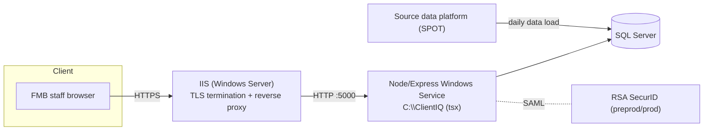
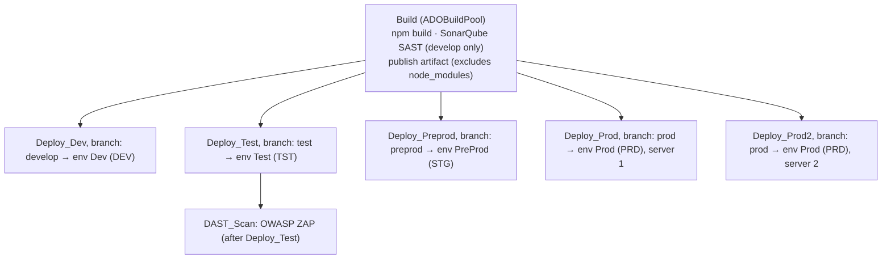
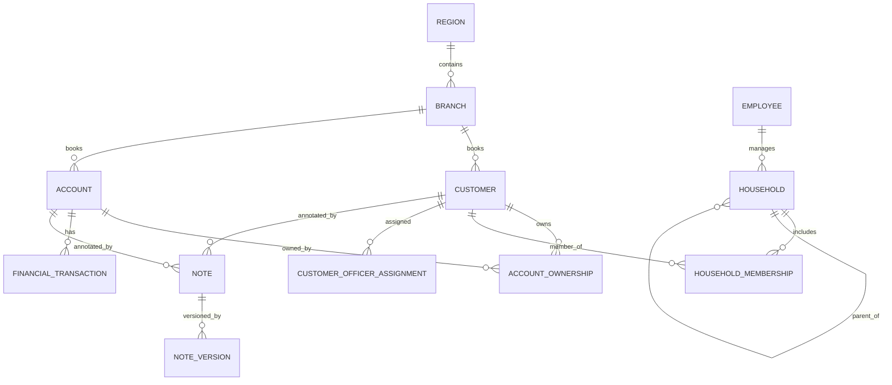
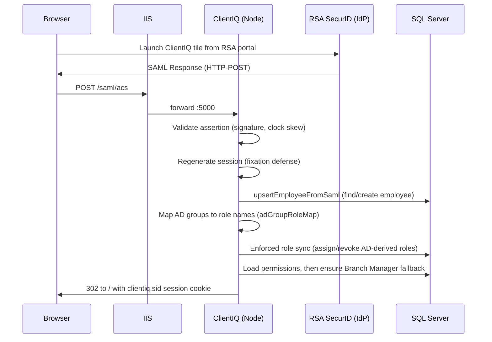
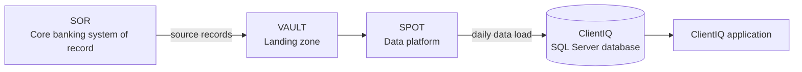

# ClientIQ / Banking Client 360: System Architecture

*Last reviewed: 2026-07-01 · Source of truth: application code (ClientIQ / Banking Client 360).*

## Purpose & Overview

ClientIQ (also branded "Banking Client 360") is an on-premise customer-360 CRM for Farmers &
Merchants Bank (FMB). It gives bank staff a unified view of customers, households, accounts,
transactions, contacts, and notes, sourced from the Jack Henry core-banking data platform.

This is the single authoritative system-architecture document. It supersedes the earlier
"ClientIQ Architecture V2.2" overview and the retired enterprise-architecture blueprint, both of
which described aspirational or incorrect designs. Every statement here is grounded in the
application source code and infrastructure scripts in this repository, or explicitly flagged for
human confirmation where the fact lives outside the codebase.

**Technology at a glance:**

| Layer | Technology |
|---|---|
| Web / proxy tier | IIS on Windows Server (TLS termination, reverse proxy to Node); see [§3](#3-deployment-topology) |
| Application runtime | Node.js + Express + TypeScript, run via `tsx` |
| Frontend | React 18 + Material-UI single-page app (Vite build) |
| Database | Microsoft SQL Server (only) |
| Authentication | RSA SecurID Access SAML 2.0 SSO (preprod & prod); local/mock auth (dev & test) |
| CI/CD | Azure DevOps pipeline; PowerShell-remoting deploy to a Windows Service |

> **[CONFIRM]** Document version and owner. `package.json` reports version `1.0.0`; treat the
> published doc version, owner, approvers, and distribution list as organizational metadata a human
> must supply. Reconcile against any existing governance record.

---

## 1. Architectural Principles

- **On-premise, Windows-native.** The app runs as a Windows Service on Windows Server hosts under
  `C:\ClientIQ`, fronted by IIS, backed by SQL Server. There is no cloud/container tier.
- **Single database engine, SQL Server.** All runtime data access targets Microsoft SQL Server.
  The runtime connection manager (`server/dbConnection.ts`) is SQL-Server-only.
- **Read-oriented CRM over core-banking data.** ClientIQ is primarily a read/aggregate surface over
  data groomed from Jack Henry views; the only substantial write surface is the Notes module and
  RBAC/role administration.
- **Defense in depth for access control.** Enterprise SSO (SAML/RSA) for authentication; RBAC with
  privilege-level inheritance plus limited ABAC for authorization; a unified audit-event stream.
- **DTO boundary.** Adapters map database rows to API DTOs and mask PII (e.g. tax id) before it
  leaves the server.

---

## 2. Layered Component Architecture

ClientIQ is a layered TypeScript monorepo: a React SPA (`client/`), an Express API (`server/`), and
shared types/validation (`shared/schema.ts`). A single Node process serves both the API and the
compiled/served SPA on one port.

![ClientIQ layered architecture. Bands top to bottom: Web / Edge (IIS on Windows Server, TLS termination and reverse proxy to Node on port 5000), Presentation (React 18 + MUI SPA, Wouter routing, TanStack Query), Application & Business (middleware chain, REST API, domain services), Data Access (row-to-DTO adapters, SqlServerSearchProvider, parameterized mssql), and Data (the SOR to VAULT to SPOT to ClientIQ SQL Server daily data-load flow). The RSA SecurID / Active Directory identity provider connects to the Application tier.](images/architecture-layered.png)

### 2.1 Presentation layer (`client/`)

- React 18 + TypeScript SPA, built with Vite. UI is predominantly Material-UI (MUI); the shell uses
  a neutral gray theme while page bodies re-theme to the green/gold banking palette (`#1b4d20`).
- Routing is client-side via `wouter`; URL query params (`customerId`, `householdId`, `accountId`)
  are the source of truth for the selected entity (`client/src/lib/navigation.ts`).
- Server state is managed by TanStack Query (`client/src/lib/queryClient.ts`), fetching with
  `credentials: include`.
- Primary screens: the Client dashboard (`/ciq/client`), Accounts (`/ciq/accounts`), Household
  (`/ciq/household`), and the admin User Management page (`/admin/users`).
- Global search box lives in the header (`client/src/components/CustomerSearch.tsx`), debounced
  250 ms, calling `GET /api/customers/search`.
- The on-page tab strip in `CustomerDashboard` is commented out; navigation between
  Client/Accounts/Household is via the left navbar + URL, not an on-screen tab bar.

### 2.2 API layer (`server/routes.ts`, `server/routes/`)

- Express REST endpoints. **Routes are unversioned:** there is no `/api/v1` / `/api/v2` prefix and
  no `X-API-Version` header anywhere in the codebase. The surface is `/api/customers`,
  `/api/accounts`, `/api/households`, `/api/notes`, `/api/admin/*`, `/api/auth/*`, and the SP
  endpoints `/saml/*`.
- Request bodies validated with Zod schemas from `shared/schema.ts`.
- Middleware order (`server/index.ts:13-67`): `correlationIdMiddleware` → `express.json` /
  `urlencoded` → authentication branch (SAML or dev-mock) → `requestLoggerMiddleware`. A JSON error
  handler and the SPA-serving branch are registered inside the async bootstrap.

### 2.3 Business-logic & services layer

- **Adapters** (`server/adapters/`) map DB rows to API DTOs and enforce that DB column names never
  leak to the frontend. `customerAdapter` masks the tax id to `XXX-XX-<last4>`.
- **`permissionService`** resolves a user's effective permissions and evaluates permission checks.
- **`auditService`** classifies and persists audit events to `audit_event`.
- **`roleTestService`** allows an admin to preview another role's permission set (disabled in
  production).
- **`samlRoleMappingService`** provides admin CRUD over the `saml_role_mapping` table (see
  [§6.4](#64-two-role-mapping-mechanisms); not on the login path).
- **Search** is provided through `SearchProviderFactory`, which returns a `SqlServerSearchProvider`
  in production (see [§5](#5-search)).

### 2.4 Data-access layer

- Production data access is via the `mssql` driver against SQL Server. `server/dbConnection.ts`
  builds a single lazily-initialized connection pool (see [§4.1](#41-connection-management)).
- `shared/schema.ts` provides Drizzle-derived TypeScript types and Zod insert schemas used across
  the app. These are a **type-generation layer only**; they are not a second runtime database
  engine (see [§4.2](#42-schema-and-type-generation)).
- The production RBAC and employee read/write path uses raw parameterized `mssql` queries in
  `server/storage/roleManagement/sqlServer.ts` and `server/storage/sqlServerEmployee.ts`.

### 2.5 Integration surfaces

- **Jack Henry data platform:** the SQL Server database is groomed from Jack Henry views (see
  [§7](#7-data-pipeline-etl)).
- **RSA SecurID Access (SAML IdP):** enterprise SSO in preprod and prod (see
  [§6](#6-authentication--sso-saml--active-directory)).

---

## 3. Deployment Topology

ClientIQ runs in **four environments: dev, test, preprod, and prod**. Each of dev, test, and
preprod runs a single application server and a single SQL Server database; prod is the
high-availability tier with a load-balanced app pair.

### 3.1 Environment / host matrix

Hostnames and cluster names below are from the ClientIQ logical diagram (2026-06-29).

| Environment | App host(s) | App hostname | SQL Server host | Databases |
|---|---|---|---|---|
| Dev | `CIQ-DEVAPP01` | `dev-clientiq.fmb.com` | Always On cluster `HUB-SQL1TST-LIS` | `ClientIQ`, `RBR` |
| Test | `CIQ-TSTAPP01` | `test-clientiq.fmb.com` | `PYT-TSTAPP01` | `ClientIQDev`, `RBRDev` |
| PreProd | `CIQ-PREAPP01` | `preprod-clientiq.fmb.com` | `DLK-SQL01` | `ClientIQPreProd`, `RBRPreProd` |
| Prod | Load-balanced `CIQ-APP01`, `CIQ-APP02` | `clientiq.fmb.com` | Always On cluster `CIQ-SQL01-LIS` | `ClientIQ`, `RBR` |

Notes:
- The database/host names above are as drawn on the logical diagram and are not derivable from the
  application code. See the `[CONFIRM]` block below.
- Local developer runs use `Start-Dev.ps1`, which points at test SQL Server `HUB-SQL1TST-LIS`,
  database `ClientIQdev`.

> **[CONFIRM]** Real host FQDNs, cluster membership, load-balancer product/config for the prod app
> pair (`CIQ-APP01` / `CIQ-APP02`), IIS site bindings and ARR/reverse-proxy configuration, TLS
> certificate owners and paths, and the exact prod database topology. None of these are defined in
> the repository; validate with FMB infrastructure/ops.

### 3.2 Web / proxy tier: IIS

- The Node application listens on **plain HTTP, port 5000, bound `0.0.0.0`**
  (`server/index.ts:98-102`). A single un-firewalled port serves both the API and the client;
  the code comment states all other ports are firewalled at the host/infra level.
- SAML callback/entity/entrypoint URLs are all `https://` (`portal.fmb.com`,
  `<SAMLHost>/saml/acs`), and the Node process has no TLS listener of its own. **IIS terminates TLS
  and reverse-proxies to the Node process on HTTP :5000.**
- The IIS site configuration (bindings, certificates, ARR rewrite rules) is not stored in this
  repository.

> **[CONFIRM]** IIS binding specifics (site names, host headers, ports), the TLS certificate
> (issuer, owner, path, renewal), and ARR/URL-Rewrite rules that forward `clientiq.fmb.com` traffic
> to `http://127.0.0.1:5000`.

### 3.3 Application runtime: Windows Service via `tsx`

The application is installed to `C:\ClientIQ` and runs as a Windows Service on each app host. Logs
are written to `C:\ClientIQ\logs\` (`errors.log`).

> **Runtime configuration note (dev/prod mismatch).** The Azure DevOps deploy generates a
> `C:\ClientIQ\Start-Server.ps1` that launches the app with
> `npx tsx watch --clear-screen=false server/index.ts` and **`NODE_ENV=development`**
> (`PipelineTemplates/start-script.yml`). It runs TypeScript directly from source, not the
> compiled `dist/index.js`, and not `NODE_ENV=production`. Consequences:
> - the SPA is served through the **Vite dev middleware path**, not static `dist/public`
>   (`server/index.ts:88-92`);
> - the **dev/mock authentication branch is active unless `SAML_ENABLED=true`**;
> - the session cookie `secure` flag is false, the main SQL pool trusts the server certificate, and
>   the default log level is `debug`.
>
> The `npm start` "production" path (`NODE_ENV=production node dist/index.js`) exists in
> `package.json` but is not what the pipeline deploys.

> **[CONFIRM]** Whether the Windows Service definition (or a service wrapper env) overrides
> `NODE_ENV`/`SAML_ENABLED` for preprod/prod at runtime. The service-to-script binding is configured
> outside this repository.

### 3.4 CI/CD: Azure DevOps

CI/CD is an Azure DevOps pipeline (`azure-pipelines.yml`) with reusable templates under
`PipelineTemplates/`. **Preprod and prod deploy from Azure DevOps branches, not from GitHub `main`.
Pushing to GitHub `main` deploys nowhere.**

| Branch | Stage | ADO environment | Variable group | `SAMLRoleEnv` → `SAML_ROLE_ENV` |
|---|---|---|---|---|
| `develop` | `Deploy_Dev` | Dev | `VG-Dev` | `DEV` |
| `test` | `Deploy_Test` (+ `DAST_Scan`) | Test | `VG-Test` | `TST` |
| `preprod` | `Deploy_Preprod` | PreProd | `VG-Preprod` | `STG` |
| `prod` | `Deploy_Prod` | Prod (server 1) | `VG-Prod` | `PRD` |
| `prod` | `Deploy_Prod2` | Prod (server 2) | `VG-Prod2` | `PRD` |

Pipeline behavior:
- **Build stage** runs `npm run build` (Vite client build + esbuild server bundle). `npm ci` on the
  build agent runs **only** when the commit message contains the literal string `npm ci`. The
  published artifact **excludes `node_modules`**, `PipelineTemplates/`, `azure-pipelines.yml`, and
  `.git/`. The private npm registry is the FMB Nexus proxy
  (`farmers-merchants-bank.repo.sonatype.app`).
- **SonarQube (SAST)** runs on the `develop` branch only.
- **OWASP ZAP (DAST)** runs after the Test deploy (`dast-scan.yml`) and fails the build on any
  high-severity finding.
- **Deploy** (`deploy-nodejs.yml`) uses PowerShell Remoting (`New-PSSession -ComputerName`) to each
  target host: copy artifact to `C:\ClientIQ` → `Stop-Service` → optional `npm ci` on the target
  (again, only if the commit message contains `npm ci`) → `Start-Service`. `node_modules` on the
  target is refreshed only on that gated `npm ci`.
- **Prod is deployed to two servers** via two stages (`Deploy_Prod`, `Deploy_Prod2`), both gated on
  the `prod` branch.

> **Pipeline gap (as written):** `prod` is not listed in the `trigger:` block of
> `azure-pipelines.yml`, yet two `prod`-conditioned deploy stages exist. A `prod` deploy therefore
> comes from a manual/other trigger not declared in that file.

The four environments are dev, test, preprod, and prod as listed above; there is no separate
user-acceptance tier, no GitHub-`main`-driven promotion, no blue-green cutover, and no Docker,
Kubernetes, Helm, or GitHub Actions in this system. Deployment is the Azure DevOps +
PowerShell-remoting Windows-Service model described above.

---

## 4. Data Architecture

### 4.1 Connection management

- `server/dbConnection.ts` ("MS SQL Server only, on-prem deployment") builds an `mssql`
  `ConnectionPool` from environment variables and exposes `getDatabase()` returning
  `{ type: 'mssql', pool }`.
- Connection config (`server/dbConnection.ts:22-39`): `user`/`password`/`server`/`database` from
  `MSSQL_*` (falling back to `DB_*`, then defaults `localhost` / `ClientIQ`); options
  `encrypt: true`, `trustServerCertificate: (NODE_ENV === 'development')`, `enableArithAbort: true`,
  30 s connect/request timeouts.
- **Connection pool: `max: 10`, `min: 0`, `idleTimeoutMillis: 30000`.** The pool is a lazily
  initialized module-level singleton.

> **Connection-encryption reality (not the clean "TLS 1.3/TDE" picture):** all deploy/start scripts
> set `MSSQL_ENCRYPT="false"` and `MSSQL_TRUST_SERVER_CERTIFICATE="true"`. The main pool hard-codes
> `encrypt: true` but derives `trustServerCertificate` solely from `NODE_ENV==='development'` (and
> the pipeline runs with `NODE_ENV=development`). The session-store connection honors the
> `MSSQL_ENCRYPT`/`MSSQL_TRUST_SERVER_CERTIFICATE` vars instead. Net: DB-link encryption cannot be
> confirmed as "TLS 1.3 enforced" from the repository.

> **[CONFIRM]** SQL Server TDE (encryption at rest), enforced TLS for DB connections, backup
> cadence/retention, and Always On availability-group configuration, all ops-layer facts not
> present in the repository.

### 4.2 Schema and type-generation

- `shared/schema.ts` defines **35 tables** used for TypeScript type inference (`$inferSelect`) and
  Zod insert schemas consumed app-wide. This schema file is a **type-generation and
  validation layer**; the physical production database is Microsoft SQL Server and is managed by
  the SQL scripts described in [§4.4](#44-schema-change--infrastructure-scripts) and by manual DDL.
  The Drizzle Kit CLI (`drizzle-kit`, `db:push`) is a developer tool and is not applied to the
  production SQL Server.
- **ID convention:** primary keys are `BIGINT IDENTITY`; foreign keys are `BIGINT`. Natural-key PKs
  exist on `sic_code` and `privilege_level`. Junction tables use composite unique/primary keys.
  Note: SQL Server returns `BIGINT` values as JavaScript strings, so numeric coercion is required at
  API boundaries.

### 4.3 Core domain model

Key entities (from `shared/schema.ts`):

- **`customer`**: central entity. Supports individual and business/organization shapes. Selected
  columns: `customer_type` (varchar, **default `"regular"`**), `customer_status` (default
  `"active"`), `tax_identifier` (unique), `full_name` (generated, used for search),
  `jack_henry_cif_number`, `silverlake_customer_id`, and flags `is_employee` / `vip_customer` /
  `is_deceased`.
  - Name/type validation is a **Zod discriminated union on `customerType`**
    (`shared/schema.ts:907-929`): `individual` / `premium` / `regular` require first + last name and
    forbid `business_name`; `business` / `trust` require `business_name` and forbid first/last name.
    There is **no** `estate` type and **no** `CK_customer_name_type` CHECK constraint; the only
    DB-level CHECK in the schema is `note.check_note_one_target`.
- **`account`**: `account_number` (unique), type/subtype/status, balances, `branch_id` FK, and
  core-banking identifiers (`jack_henry_account_id`, `silverlake_account_structure`).
- **`household` / `household_membership`**: households with a relationship-manager FK to
  `employee`, B2B self-referencing parent/subsidiary hierarchy, and ownership-percentage on
  membership rows.
- **`financial_transaction`**: `account_id` is **nullable**; the ETL now pivots joins on
  `account_number` (denormalized onto the transaction row). Includes amount, transaction/posting
  dates, category FK, running balances, `source_system` (default `"jack_henry"`), and a
  dedup unique key on `(account_id, source_system, source_transaction_id)`.
- **`employee`**: HR identity plus SAML/SSO fields: `sso_subject` (unique), `email`,
  `last_seen_saml_role` (widened to `NVARCHAR(MAX)` in SQL Server, see
  [§4.4](#44-schema-change--infrastructure-scripts)), `last_login_at`.
- **Notes module**: `note` (immutable identity + target reference), `note_version` (content +
  full version history, one current version enforced), `note_category` (hierarchical),
  `note_audit_log`. Supports soft delete, legal hold, visibility levels, and PST timestamp
  formatting.
- **RBAC tables**: `privilege_level`, `role`, `permission`, `role_permission`, `employee_role`,
  `saml_role_mapping`, plus audit/history tables (see [§8](#8-authorization-rbac--abac)).

### 4.4 Schema-change & infrastructure scripts

Production SQL Server schema is managed by idempotent scripts under `scripts/` and
`Insert Queries/Schema Changes/`, not by Drizzle Kit. Notable scripts:

- `scripts/create_audit_event_table.sql`: creates `dbo.audit_event` and its 7 indexes.
- `scripts/create_sessions_table.sql` / `scripts/fix_sessions_table.sql`: the `connect-mssql-v2`
  session store (see [§6.5](#65-session-store)).
- `scripts/create_performance_indexes.sql`: post-load nonclustered indexes on
  `financial_transaction`, `account_ownership`, `account`, and `customer`.
- `scripts/ensure_branch_manager_role.sql`: guarantees a `Branch Manager` role exists so SAML
  auto-provisioned users always get a default role.
- `scripts/ensure_rbac_provenance_columns.sql`: adds `employee_role.assigned_by` (AD-derived vs
  admin-assigned provenance) required by enforced role sync.
- `scripts/widen_employee_last_seen_saml_role.sql`: widens `employee.last_seen_saml_role` to
  `NVARCHAR(MAX)` (IdPs can send the full multi-KB AD group list; the prior `varchar(255)` caused
  SQL Server truncation errors that stranded SSO users).
- `Insert Queries/Schema Changes/`: adds and backfills the denormalized
  `financial_transaction.account_number` and `note.cif_number` columns.

> Note: `scripts/validate-schema.js` and `drizzle.config.ts` are developer-tooling artifacts of the
> Drizzle type layer; they do not reflect the production SQL Server schema and should not be treated
> as authoritative for it.

---

## 5. Search

Global search is a single unified box (`GET /api/customers/search`) returning results grouped into
Clients, Accounts, and Households.

- The search provider is selected at runtime by `server/adapters/search/SearchProviderFactory.ts`;
  in production this resolves to `SqlServerSearchProvider`.
- **Matching is a case-insensitive substring `LIKE`.** The SQL Server query
  (`server/storage/sqlServerCustomerSearch.ts:37-108`) builds a pattern `%<query>%` and applies
  `COLLATE Latin1_General_CI_AS LIKE @searchPattern` across `first_name`, `last_name`,
  `business_name`, `full_name`, `tax_identifier`, `silverlake_customer_id`, and
  `CONCAT(first_name, ' ', last_name)`.
- There is **no relevance ranking** and **no full-text index**; the search uses plain substring
  matching, not `CONTAINS` / `CONTAINSTABLE`, and not fuzzy/phonetic scoring. (A header comment in
  `SqlServerSearchProvider.ts` references full-text search, but the executed production path is the
  `LIKE` query above.)
- Balance-bearing identifiers are stripped from a search row when the user lacks
  `account.view.balances`.

---

## 6. Authentication & SSO (SAML / Active Directory)

Authentication mode is selected by `SAML_ENABLED` and `NODE_ENV` in `server/index.ts:21-64`:

| Mode | Condition | Behavior |
|---|---|---|
| **SAML SSO** | `SAML_ENABLED === 'true'` | Session + Passport + SAML strategy + global `authGate` |
| **Dev/mock auth** | `SAML_ENABLED` off **and** `NODE_ENV === 'development'` | Injects `req.employeeId = 1` (Sarah Johnson, System Admin) |
| **No auth** | `SAML_ENABLED` off and non-development | Logs a warning; no auth mounted |

**SSO is enabled in preprod and prod only.** In dev and test, `SAML_ENABLED=false` and the app uses
the local/mock auth path.

### 6.1 Identity provider

- IdP is **RSA SecurID Access**, reached through the F&M Bank RSA portal (`portal.fmb.com`). SP =
  ClientIQ.
- Library: **`@node-saml/passport-saml` v5** (`package.json`). RSA signs the **SAML Response
  wrapper**, not the assertion, so both `wantAssertionsSigned` and `wantAuthnResponseSigned` are
  `false` (passport-saml still requires at least one signed element). `audience` validation and
  `validateInResponseTo` are disabled to match the RSA IdP.
- Login is effectively **IdP-initiated via the RSA portal tile**: RSA only emits a `SAMLResponse`
  when the user launches ClientIQ from the portal, so the app's sign-in page links to the portal
  rather than auto-redirecting.

> There is **no local password store and no password hashing** in the application. Authentication is
> SSO-only; `bcryptjs`, although present in `package.json`, is not imported anywhere in `server/`.

### 6.2 Login flow (ACS)

On a successful assertion (`server/routes/auth.ts:264-476`): the employee is found or auto-created
(auto-creation is safe because RSA already gates who can authenticate), AD-group-driven role sync
runs, the session is populated with roles + permissions, and a bulletproof default-role fallback
runs so an authenticated user is never stranded role-less.

### 6.3 AD-group → role mapping (code convention)

Role assignment on login is driven by a **code-based naming convention**
(`server/auth/adGroupRoleMap.ts`), not by a database mapping table. The AD group list arrives in the
SAML `role` claim.

- Group convention: `<PREFIX>_<ENV>_APP_ClientIQ_<RoleToken>_<Access>` (e.g.
  `CTRL_PRD_APP_ClientIQ_BranchManager_MOD`). Only the `RoleToken` matters; the `Access` suffix
  (RO/RW/MOD/ADM/EXEC) is ignored.
- **Environment scoping via `SAML_ROLE_ENV`** (`DEV`/`TST`/`STG`/`PRD`): because a single on-prem AD
  carries every environment's ClientIQ groups, each deployment honors only groups whose env segment
  matches its `SAML_ROLE_ENV`. Unset ⇒ all environments honored. This is why each ADO deploy stage
  sets `SAMLRoleEnv` (dev=`DEV`, test=`TST`, preprod=`STG`, prod=`PRD`).
- Token → role mapping resolves role **names** against the `role` table case-insensitively. The
  `gen` token grants app access but no role; it falls back to the default role.

> **Role-name dependency:** the AD-group map references role names including `System Admin`,
> `Branch Manager`, `BRS`, `Teller`, `Loan Officer`, `Risk Analyst`, `Compliance Officer`. The
> `BRS` role (mapped from the `businessbanker`/`assistantmanager` AD tokens) is **not** created by
> the seed or any in-repo migration.
>
> **[CONFIRM]** That a `BRS` role row exists in each SQL Server environment (or that the AD map
> should instead resolve to the seeded `Business Banker` / `Assistant Manager` roles). If `BRS` is
> absent, affected users fall back to Branch Manager.

### 6.4 Two role-mapping mechanisms

- **AD-group convention** (`adGroupRoleMap.ts`): the live login path.
- **`saml_role_mapping` table**: an admin-managed DB table (CRUD via `/api/admin/saml-mappings`,
  gated by `user_management.*`). Its role-assignment logic (`samlRoleMappingService.processSamlRole`)
  is **not called on login** and is dormant in the SQL Server path. It does not drive role
  assignment.

### 6.5 Session store

- Sessions are **SQL Server-backed** via `express-session` + `connect-mssql-v2`
  (`server/auth/session.ts`). The session table is `dbo.sessions` with columns
  `sid NVARCHAR(255) PK`, `session NVARCHAR(MAX)`, `expires DATETIME`
  (`scripts/create_sessions_table.sql`). Expired rows are auto-removed every 15 minutes; there is
  no cleanup stored procedure.
- **Store TTL is 12 hours.** The **cookie** `maxAge` is 1 hour idle with rolling refresh,
  `httpOnly`, `sameSite: 'lax'`, `secure` only in production. Cookie name is **`clientiq.sid`**.
- `sameSite: 'lax'` is deliberate: `'strict'` would drop the cookie on the redirect chain following
  the cross-site SAML HTTP-POST, causing a re-auth loop.

---

## 7. Data Pipeline (ETL)

ClientIQ is a read-mostly reporting database, loaded on a daily cadence from the bank's
core-banking data platform. The end-to-end lineage is **SOR to VAULT to SPOT to ClientIQ**:

- **SOR** is the core-banking system of record.
- Source records land in **VAULT**, the landing zone.
- Data then moves from VAULT into **SPOT**, the data platform that ClientIQ reads from.
- A **daily data load** populates the ClientIQ SQL Server database from SPOT.

Within the repository, the SPOT feed surfaces as the Jack Henry views (`TheSpot`, `TheSpotPreProd`,
and the `TheVault` landing view). There is **no SSIS orchestration, no staging tables, and no
stored-procedure loader in the repository.**

- The ETL is a set of **hand-run SQL files** under `Insert Queries/` (plus
  `Insert Queries/Lookup Tables/` and `Insert Queries/Schema Changes/`), executed **manually in
  foreign-key dependency order** against `ClientIQPreProd.dbo.*`.
- **Load order** (FK-driven): lookups first (`branch`, `note_category`, `transaction_category`) →
  `customer`, `employee` → `address`, `contact_info`, `account`, `customer_officer_assignment` →
  `entity_address`, `account_ownership`, `household` → `household_membership`, `contact_history`,
  `debit_card`, `financial_transaction`. Every downstream join keys on `jack_henry_cif_number`,
  `account_number`, `officer_code`, or `branch_code`.
- Loaders are largely idempotent via `MERGE` or `NOT EXISTS` guards; a few plain-`INSERT` loaders
  (`address.sql`, `contact_info.sql`) are not guarded and will duplicate on re-run.
- **`financial_transaction.sql` loads only the last 13 months** of transactions and pivots joins on
  `account_number`. Debit cards are loaded only for active checking/business-checking accounts.
- **RBAC tables are not loaded by the ETL.** SQL Server environments bootstrap RBAC separately via
  `ensure_branch_manager_role.sql`, `ensure_rbac_provenance_columns.sql`, and
  `widen_employee_last_seen_saml_role.sql` (see [§4.4](#44-schema-change--infrastructure-scripts)).

A separate faker-based seed (`scripts/seed.ts`) generates synthetic data for the developer/type
abstraction; it is not the production loader and should not be conflated with the SQL Server ETL.

> **[CONFIRM]** Whether an out-of-repo SSIS/SQL-Agent job (or any scheduled orchestration) drives
> these loads on a cadence in preprod/prod, and the actual refresh schedule. The repository shows
> only manually executed SQL files; any automated schedule is not evidenced here.

---

## 8. Authorization (RBAC + ABAC)

### 8.1 Privilege levels and roles

- **5 privilege levels (0-4):** Read-Only (0), Staff (1), Manager (2), Senior/Branch (3),
  System Admin (4). Level 0 is defined but no seeded role uses it.
- **9 seeded roles** (`scripts/seed.ts:117-127`): System Admin (4), Branch Manager (3), Assistant
  Manager (2), Loan Officer (2), Business Banker (2), Teller (1), Customer Service Rep (1),
  Risk Analyst (1), Compliance Officer (1).

### 8.2 Effective-permission model

A user's effective permissions are the **union** of:

1. **Privilege-level inheritance**: every active permission whose `min_privilege_level ≤` the
   user's max privilege level is granted automatically.
2. **Explicit `role_permission` grants**: only needed for level-1 roles (which cannot inherit the
   level-2 permissions).

There are **11 seeded permissions** (e.g. `accounts.view`, `account.view.balances`,
`transaction.view`, `customer.view.*`, `household.view`, `users.view`, `users.assign_roles`,
`user_management.*`). Only System Admin (level 4) can assign roles or manage SAML mappings; users
at level ≥3 (Branch Manager, System Admin) can view users.

### 8.3 Enforcement and gaps

- Server enforcement is via `requirePermission` middleware (`server/middleware/permissions.ts`) on
  accounts, transactions, and admin routes. The React client mirrors these gates with
  `PermissionGuard` / `usePermissions`, but the server is the real enforcement point.
- **Not every route is permission-gated.** The **Notes** surface (all CRUD) and the
  `deposit-summary` / `deposit-trend` endpoints are **authentication-only**: there is no
  `requirePermission` on them and **no `notes.*` permission exists anywhere** in schema, seed, or
  DB. Any authenticated employee can read/write notes regardless of role.

### 8.4 ABAC

- The single seeded ABAC permission is **`transaction.view`**: viewing the transactions of a
  customer who is themselves a bank employee (`customer.isEmployee === true`) is denied unless the
  viewer's privilege level is ≥3.
- This restriction is evaluated by the Drizzle-path `permissionService`. In the SQL Server path,
  `permissionService.checkPermission` returns `{ allowed: true }` early when the Drizzle `db` handle
  is null, and the SQL Server store's own `checkPermission` implements **branch/region** restrictions
  instead of the employee-record restriction.

> **[CONFIRM]** Whether the `customer.isEmployee` (level-3) ABAC control actually fires in the SQL
> Server production path. The two ABAC implementations diverge (employee-record vs branch/region),
> and the employee-record control may not be enforced unless the SQL Server `permission.conditions`
> data encodes it. Validate against the live SQL Server permission data.

### 8.5 Role sync & provenance

On each SSO login, enforced sync reconciles AD-derived roles:

- Rows with `employee_role.assigned_by IS NULL` are **AD/system-derived** and may be revoked when
  the corresponding AD group is no longer present.
- Rows with `assigned_by IS NOT NULL` are **admin-assigned** and are never auto-revoked.
- A guaranteed **Branch Manager** fallback (configurable via `SAML_DEFAULT_ROLE_NAME`) ensures an
  authenticated user is never left role-less unless that role is missing from the `role` table.

### 8.6 Not implemented

- The `role_change_request` approval workflow table exists but has **no implementing code**.
- `role_audit_log` has **no writer**; auditing is done via `audit_event`, `employee_role_history`,
  and `permission_denial_log` instead.
- `updateUserStatus` / `employee_status_history` writes and the SQL Server `getUserById` are
  unimplemented placeholders.

---

## 9. Audit & Observability

### 9.1 Audit-event stream

- The unified audit table is **`audit_event`** (`scripts/create_audit_event_table.sql`;
  `shared/schema.ts:854-887`), with columns `event_id`, `event_type`, `category`, `severity`,
  `correlation_id` (uniqueidentifier), `employee_id`, `session_id`, `ip_address`, `user_agent`, `action`,
  `outcome`, `resource_type`/`resource_id`/`resource_name`, `metadata` (JSON), `source`
  (`server`/`client`), `module`, `occurred_at`, `created_at`. There is **no** `audit_log` or
  `event_store` table.
- `server/services/auditService.ts` classifies and persists events; `shared/auditEvents.ts` defines
  the taxonomy, categories (`authentication`, `authorization`, `pii_access`, `financial_data`,
  `data_modification`, `admin_action`, `navigation`, `search`, `error`) and severities
  (`critical`/`high`/`medium`/`low`).
- Every `requirePermission` grant and deny emits an authorization audit event; permission denials
  also write **`permission_denial_log`**.
- Route-level audit middleware (`server/middleware/routeAudit.ts`) records customer/account/PII
  access independently of the RBAC events; correlation IDs are attached per request.

### 9.2 Logging & health

- Application logging is a **custom structured logger** (`server/services/logger.ts`), not Winston.
  Default level is `debug` in development and `info` otherwise; overridable via `LOG_LEVEL`.
  Deployed stderr is redirected to `C:\ClientIQ\logs\errors.log`.
- The process forces `TZ=America/Los_Angeles` (PST) at startup.
- There is **no `/health` route handler** in the application. `/health` appears only as an
  `authGate` allowlist entry; no endpoint currently responds there.

> **[CONFIRM]** Monitoring/alerting, SLA targets, and whether an external health probe is expected
> (and if a `/health` endpoint should be added). These are ops concerns not defined in the
> repository.

### 9.3 PII protection

- Implemented masking: the customer **tax id** is masked to `XXX-XX-<last4>` in `customerAdapter`
  before leaving the server; **account numbers** are masked to the last 5 digits in the UI
  (`AccountList`).

> **[CONFIRM]** SQL Server TDE, TLS 1.3 enforcement, HSM/tokenization, PCI DSS posture, GLBA/Reg
> retention schedules, and the 7-year retention claims. These are compliance/ops assertions that
> cannot be verified from the codebase.

---

## 10. Technology Stack (verified against `package.json`)

Versions below are read from the live `package.json` (semver ranges shown as pinned baselines).

**Frontend:**

| Component | Technology | Version |
|---|---|---|
| UI framework | React | 18.3.1 |
| Language | TypeScript | 5.6.3 |
| Build tool | Vite | 5.4.19 |
| UI library | Material-UI (MUI) | 7.3.2 |
| Styling | Tailwind CSS | 4.1.3 |
| Server state | TanStack React Query | 5.60.5 |
| Routing | Wouter | 3.3.5 |
| Forms | React Hook Form | 7.55.0 |
| Validation | Zod | 3.24.2 |
| Dates | date-fns | 3.6.0 |
| Charts | Recharts | 2.15.2 |

**Backend:**

| Component | Technology | Version |
|---|---|---|
| Runtime | Node.js | see `[CONFIRM]` below |
| Framework | Express | 5.2.1 |
| Language | TypeScript | 5.6.3 |
| SQL Server driver | mssql | 12.0.0 |
| SAML SSO | @node-saml/passport-saml | 5.1.0 |
| Passport | passport | 0.7.0 |
| Session store | connect-mssql-v2 | 6.0.0 |
| Type/schema layer | drizzle-orm / drizzle-kit | 0.39.3 / 0.30.4 |
| TS execution | tsx | 4.19.1 |
| Server bundler | esbuild | 0.25.0 |

Build scripts (`package.json`): `dev` = `NODE_ENV=development tsx server/index.ts`; `build` =
`vite build && esbuild server/index.ts ... --outdir=dist`; `start` =
`NODE_ENV=production node dist/index.js`; `check` = `tsc`; `db:push` = `drizzle-kit push`.

> **[CONFIRM]** The target Node.js runtime version. `package.json` does not pin an `engines.node`
> value; the ADO build agent's `NodeTool` version (declared in pipeline variables) is the effective
> version; confirm with FMB ops.

---

## 11. Known Divergences & Caveats

- **Deployed runtime runs from TypeScript source with `NODE_ENV=development`** (`tsx watch`), so it
  uses the Vite dev-middleware path and the dev/mock-auth branch unless `SAML_ENABLED=true`
  ([§3.3](#33-application-runtime--windows-service-via-tsx)).
- **Two independent dialect/vendor switches** in the type/search layers (`DATABASE_DIALECT` in
  `dbConfig`, `DB_VENDOR` in `SearchProviderFactory`) both default to a non-SQL-Server value when
  unset; production deploy scripts set `DATABASE_DIALECT=sqlserver` and `DB_VENDOR=mssql`. The
  runtime data pool is hard-wired to SQL Server regardless.
- **Dead deploy-time environment variables:** `HOST`, `MSSQL_PORT`, `SAML_ENTITY_ID`, and
  `SAML_IDP_INITIATED_URL` are set by the start scripts but never read by application code (the app
  binds `0.0.0.0` in code and uses `SAML_ISSUER` rather than `SAML_ENTITY_ID`).
- **Plaintext secrets in the repo:** `Start-Dev.ps1` contains a hard-coded MSSQL password and a
  hard-coded `SESSION_SECRET`.
- **`prod` is missing from the pipeline `trigger:` block** despite having two prod deploy stages
  ([§3.4](#34-cicd--azure-devops)).

---

## 12. Confirmation Checklist (human input required)

| # | Item to confirm | Owner |
|---|---|---|
| 1 | Document version, owner, approvers, distribution | Doc owner |
| 2 | Host FQDNs, prod LB product/config, DB cluster topology | FMB infrastructure |
| 3 | IIS bindings, TLS cert (issuer/owner/path/renewal), ARR rules | FMB infrastructure |
| 4 | Whether the Windows Service overrides `NODE_ENV`/`SAML_ENABLED` in preprod/prod | FMB ops |
| 5 | SQL Server TDE, DB-connection TLS, backup cadence/retention, Always On config | FMB DBA |
| 6 | Existence of `BRS` role rows in each SQL Server environment | RBAC/AD owner |
| 7 | Whether the employee-record ABAC control fires in SQL Server prod | Engineering |
| 8 | Any out-of-repo SSIS/scheduled ETL job and its cadence | Data engineering |
| 9 | Monitoring/alerting, SLAs, health-probe expectations | FMB ops |
| 10 | Compliance posture (PCI/GLBA), retention schedules | Compliance |
| 11 | Target Node.js runtime version | FMB ops |
