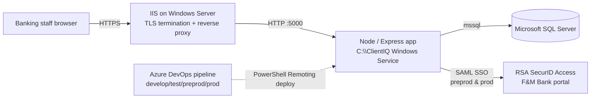

# ClientIQ (Banking Client 360): Product & Architecture Overview

*Last reviewed: 2026-07-01 · Source of truth: application code (ClientIQ / Banking Client 360).*

## Purpose

ClientIQ (also referred to as **Banking Client 360**) is an on-premises, enterprise customer-relationship platform for a financial institution. It gives banking staff a consolidated 360-degree view of a customer (profile, accounts, transactions, deposits and relationship analytics, household relationships, debit cards, and collaborative notes) behind role-based access control and SAML single sign-on.

This document describes the application as it is actually built: a **Microsoft SQL Server**-backed React/Express app, deployed on Windows Servers via Azure DevOps, with a code-driven **SAML + Active Directory** authentication and role-provisioning subsystem. It corrects earlier overviews that described a two-database platform, similarity-based fuzzy search, and a CI/CD governance framework that are not part of the running system.

> **[CONFIRM]** Document owner, last-published date, and doc version. The `package.json` version is `1.0.0`; treat the doc version as unconfirmed until a human sets it.

---

## Core Features

### 1. Customer Search & Discovery

A single unified search box (`client/src/components/CustomerSearch.tsx`, rendered in the header) queries `GET /api/customers/search` with a 250 ms debounce and groups results into three sections (**Clients**, **Accounts**, and **Households**), each with counts and keyboard navigation.

- **Multi-field matching**: searches customer first/last name, business name, generated full name, tax identifier, Silverlake customer ID, and the concatenated `first + last` name.
- **Matching engine (production = SQL Server)**: a **case-insensitive `LIKE` substring** match using `COLLATE Latin1_General_CI_AS`, implemented in `server/storage/sqlServerCustomerSearch.ts:103-126`. Search is substring containment; it is not similarity, phonetic, or full-text search. A query for `Smith` matches any record whose searched fields contain the literal substring `smith` (case-insensitive); it will not surface `Smyth`.
- **Balance-aware results**: identifiers that expose balance data are withheld from a result row when the user lacks the `account.view.balances` permission (`CustomerSearch.tsx:133-136`).
- **Navigation**: selecting a result routes to the client, account, or household view via URL query params.

### 2. Customer Profile Management

Customers use a polymorphic data model validated by a Zod discriminated union on `customer_type` (`shared/schema.ts:907-929`):

| Customer type | Name requirement |
|---|---|
| `individual` / `premium` / `regular` | `first_name` + `last_name` required; `business_name` forbidden |
| `business` | `business_name` required; individual name fields forbidden |
| `trust` | `business_name` required; individual name fields forbidden |

A generated `full_name` column backs unified search (`shared/schema.ts:114-115`). The Client tab (`CustomerOverview.tsx`) surfaces name, status, VIP/employee/birthday/type chips, CIF number, branch, preferred name, date of birth, customer-since date, gender, and a **masked** tax ID (`XXX-XX-<last4>`, applied in `server/adapters/customerAdapter.ts`). "View Full Details" opens `CustomerDetailModal`, which fetches `/api/customers/:id/details`. Contact information and officer assignments render alongside in `ContactInformation` and `Officers`.

### 3. Account & Relationship Summary

The relationship-summary KPI band (`client/src/components/Middle.tsx`), gated by `customer.view.relationship_summary`, shows four cards (Total Deposits, Total Loans, Last Login, and Recent Contacts), each with a quarter-over-quarter (QoQ) change indicator. Deposits and loans are computed as independent QoQ series.

> **[CONFIRM]** The historical-comparison window used for QoQ (an earlier overview stated "90-day snapshots"; no server calculation in the reviewed code confirms a specific window). Note that the SQL Server transaction ETL loads only the **last 13 months** of transactions (`Insert Queries/financial_transaction.sql:42,92`), which bounds any history-based comparison.

Example dollar figures that appeared in earlier documentation (e.g. deposits `$35,078.34` at `+52.03%`) were illustrative placeholders, not live values, and are omitted here.

### 4. Interactive Account Management

The Accounts view (`AccountSummaryTableVersion.tsx`, `AccountList.tsx`) presents a customer's portfolio, split into **Owned** and **Affiliated (non-owned)** accounts, with type filtering (All / Deposits / Loans), free-text search, sortable balance/status columns, pagination, status color chips, and account-number masking. Selecting an account drives the transaction history and, on the Account Summary tab, the detail view (`AccountDetailOption2.tsx`).

Account records are stored in the `account` table (`shared/schema.ts:188-219`) with a **free-text `account_type` column**; there is no enumerated set of account types enforced at the schema level. The account types that actually appear depend on the data path:

- **Dev/demo (faker seed, `scripts/seed.ts:14`)** generates: `checking`, `savings`, `loan`, `credit_card`, `cd`, `money_market`.
- **Preprod/prod (SQL Server ETL, `Insert Queries/account.sql`)** loads accounts from the Jack Henry deposit and loan views (`COMBINED_DEPO_VIEW_CURR`, `LOAN_VIEW_CURR`).

> **[CONFIRM]** The full set of `account_type` values present in preprod/prod data (sourced from the Jack Henry views), and whether credit-card accounts are loaded in production. Card *management* in the application is specifically **debit cards** (see Feature 7); a "credit card" account type exists in the faker seed, but its presence in production data is not established from the repository.

Displayed account details include account number and type, current/available balance, interest rate, credit limit, open/closed/maturity dates, and status. Balance and interest-rate columns render only for users with `account.view.balances`.

### 5. Transaction History & Analytics

Transaction history (`TransactionHistory.tsx`) is account-scoped or customer-scoped via `/api/accounts/:id/transactions` or `/api/customers/:id/transactions`. Rows are drawn from the `financial_transaction` table (`shared/schema.ts:380-425`) and show amount, running ledger balance (`ledger_balance_after`), transaction code/type, description, merchant, and dates, with a Deposits/Spending/Net quick-stats bar, per-code icons and labels (DD, ATM, BILLPAY, MOBDEP, ZELLE, WIRE, ACH, POS, INT, FEE), client-side search, and pagination. All amounts and timestamps are formatted in Pacific time (`useDateFormatter`).

Note on data provenance: the SQL Server ETL joins transactions on `account_number` (with `financial_transaction.account_id` now nullable) and loads only the last 13 months.

### 6. Debit Card Management

Debit cards (`debit_card` table; `DebitCardDetailModal.tsx`) are surfaced from `/api/accounts/:id/debit-cards`. Business rules are enforced by **SQL Server database triggers** (documented in `shared/schema.ts:430-450`): a card may be issued only to a `checking` or `business_checking` account, and the cardholder must be a valid owner of the linked account. Only the last four digits, card brand, and token references are stored (PCI-DSS aligned); full PAN/CVV/PIN are never stored. Cards support active/inactive/expired/blocked states and expiration tracking.

### 7. Enterprise Notes Module

The notes subsystem (`NotesSection.tsx`, backed by the `note` / `note_version` / `note_audit_log` / `note_category` tables) supports customer- and account-level notes with:

- Full version history and a version-history modal.
- Hierarchical categories, importance (low/medium/high/urgent), visibility (public/internal/confidential), pinning, soft delete/restore, and legal-hold retention.
- A per-operation audit trail (`note_audit_log`) capturing create/update/delete/restore/view with actor, correlation ID, and IP.
- A `note.cif_number` denormalized Jack Henry CIF, populated server-side on create/update.

> **Access note:** the notes surface is gated by authentication only. There is **no `notes.*` permission** defined anywhere in the schema, seed, or code; any authenticated employee can read and write notes regardless of role (`server/routes.ts` notes handlers; the UI renders `NotesSection` without a `PermissionGuard`). See [Security & Access Control](#security--access-control).

### 8. Household Relationship Mapping

The Household view (`client/src/pages/HouseholdPage.tsx`, gated by `household.view`) aggregates a household's summary (assets, liabilities, risk, type), a members table (relationship role, ownership percentage, head-of-household, join date), an accounts table reusing the account grid, household notes, and parent/subsidiary drill-down. Households are modeled by `household` and `household_membership` (customer↔household M:N with ownership percentage and control type), supporting family and business (B2B, parent/subsidiary) structures.

### 9. Risk & Compliance Fields

The customer record carries compliance attributes: `kyc_status`, `kyc_last_updated`, `risk_rating`, and flags such as `is_employee`, `vip_customer`, and `is_deceased` (`shared/schema.ts:100-163`). These are stored, displayed, and searchable customer attributes.

> **[CONFIRM]** Whether AML transaction monitoring, OFAC screening, or an automated compliance-review calendar are in scope. Earlier documentation listed "AML monitoring," "OFAC screening," and "next review scheduling"; the reviewed schema and code expose KYC status, risk rating, and employee/VIP/deceased flags, but no OFAC/AML screening engine or review-scheduling logic was found. State only what a human confirms is implemented.

---

## Security & Access Control

Access control is central to the current application and is enforced on two layers: **SAML SSO authentication** and a **role-based / attribute-based permission model** driven by Active Directory group membership.

### Authentication (SAML SSO)

- **Where SSO is on:** SAML SSO is enabled in **preprod and prod only** (`SAML_ENABLED=true`). In **dev and test**, SSO is off (`SAML_ENABLED=false`) and the app uses a local/mock auth path (`server/index.ts` injects a development System Admin identity when `NODE_ENV=development`).
- **Identity provider:** RSA SecurID Access, reached through the F&M Bank RSA portal. Users launch ClientIQ from the portal tile; RSA POSTs a SAML response to the SP Assertion Consumer Service at `/saml/acs` (`server/routes/auth.ts`).
- **Session store:** `express-session` backed by SQL Server (`connect-mssql-v2`), cookie `clientiq.sid`, `SameSite=Lax` (required for the SAML HTTP-POST binding).
- **Auto-provisioning:** an authenticated RSA user with no employee row is auto-created (`server/storage/sqlServerEmployee.ts`), deemed safe because RSA already gates who may authenticate.

### AD-group → role provisioning

Role assignment on login is **code-based** and keyed on role **names**, not on a database mapping table (`server/auth/adGroupRoleMap.ts`):

- AD groups arrive in the SAML `role` claim and follow the naming convention `<PREFIX>_<ENV>_APP_ClientIQ_<RoleToken>_<Access>`. Only the `RoleToken` selects a role; the access suffix (RO/RW/MOD/ADM/EXEC) is ignored.
- `SAML_ROLE_ENV` (normalized to `DEV` / `TST` / `STG` / `PRD`) scopes provisioning to the current deployment's environment, because one on-prem AD carries every environment's ClientIQ groups. A user who is Teller in the `STG` groups and Branch Manager in the `PRD` groups resolves to Teller in preprod and Branch Manager in prod.
- On each login the sync **reconciles** AD-derived roles: roles no longer present in the (env-scoped) groups are revoked, newly present roles are assigned. Provenance is tracked by `employee_role.assigned_by`: `NULL` marks an AD/system-derived assignment (subject to auto-revoke), non-`NULL` marks an admin assignment (never auto-revoked).
- **Guaranteed fallback:** if AD yields no role (or the sync errors), the user is granted `SAML_DEFAULT_ROLE_NAME` (default **Branch Manager**) so no authenticated user is stranded on "Awaiting Role Assignment". `scripts/ensure_branch_manager_role.sql` guarantees that role exists.

> **[CONFIRM]** The `BRS` ("Business Relationship Specialist") role. The AD-group map (`adGroupRoleMap.ts:48-49`) maps the `businessbanker` and `assistantmanager` tokens to a role named `BRS`, but no seed or in-repo migration creates a `BRS` row (the seed instead defines `Business Banker` and `Assistant Manager`). Confirm which role rows exist in each SQL Server environment.

> **[CONFIRM]** AD group owners and the exact AD group names provisioned per environment.

A separate `saml_role_mapping` table and admin CRUD (`/api/admin/saml-mappings`) exist for name→role mappings, but they are **not on the login path** in the current SQL Server flow. Role assignment on login is entirely the convention-based AD-group mapping above.

### Roles, privilege levels, and permissions

The model uses **5 privilege levels (0 to 4)** and **9 seeded roles** (`scripts/seed.ts:107-127`):

| Privilege level | Name | Roles at this level |
|---|---|---|
| 4 | System Admin | System Admin |
| 3 | Senior/Branch | Branch Manager |
| 2 | Manager | Assistant Manager, Loan Officer, Business Banker |
| 1 | Staff | Teller, Customer Service Rep, Risk Analyst, Compliance Officer |
| 0 | Read-Only | *(defined but unused by any seeded role)* |

**11 permission codes** are seeded (`scripts/seed.ts:133-154`), e.g. `accounts.view`, `account.view.balances`, `transaction.view`, `customer.view.relationship_summary`, `customer.view.recent_activity`, `customer.view.deposits`, `household.view`, `users.view`, `users.assign_roles`, `user_management.view`, `user_management.assign_roles`.

A user's effective permissions are the **union** of two tiers:

1. **Privilege-level inheritance**: every active permission whose `min_privilege_level ≤ the user's max privilege level` is granted automatically. Consequence: level-2-and-above roles inherit all view permissions without any explicit grant.
2. **Explicit role grants**: rows in `role_permission`. Only level-1 roles receive explicit grants (Teller and Customer Service Rep get 7 permissions each; Risk Analyst and Compliance Officer get 6 read-only permissions each, without `transaction.view`).

Only **System Admin (level 4)** can assign roles or manage SAML mappings; **level ≥ 3** (Branch Manager, System Admin) can view the user list.

### Attribute-based control (ABAC)

One permission is attribute-based: **`transaction.view`** restricts viewing the transactions of a customer who is themselves a bank employee (`customer.isEmployee = true`) unless the viewer has privilege level ≥ 3.

> **[CONFIRM]** Whether the employee-customer ABAC restriction fires in the SQL Server production path. The rule is evaluated in the ORM-abstraction permission service, which is a no-op in SQL Server mode; the SQL Server permission store implements branch/region restrictions instead. Confirm the production `permission.conditions` data encodes the intended employee-record restriction (`server/storage/roleManagement/sqlServer.ts`).

### Enforcement

- **Server-side:** `requirePermission` middleware (`server/middleware/permissions.ts`) gates the accounts, transactions, and admin routes; every grant and deny emits an audit event. **Deposit-summary/trend endpoints and all notes endpoints are authentication-only**, not permission-gated.
- **Client-side (presentation):** `PermissionGuard` and the `usePermissions` hooks gate the Household, Accounts, and Account Summary tabs, the relationship/recent-activity/deposits cards, balance columns, and the admin nav link. The client is fail-closed while permissions load.

### Audit

All security-relevant activity flows into a unified `audit_event` stream (`shared/auditEvents.ts`; `server/services/auditService.ts`), covering authentication, authorization grants/denials, PII and financial-data access, data modifications, admin actions, navigation, and search, plus `permission_denial_log` and `employee_role_history`. (The `role_change_request` and `role_audit_log` tables are defined in the schema but are not written by current code.)

---

## Technical Architecture

### Stack

| Layer | Technology |
|---|---|
| Frontend | React 18 + **Material-UI (MUI)**, including `@mui/x-data-grid` |
| Backend | Express 5 + TypeScript (Node) |
| Database | **Microsoft SQL Server only** (`mssql` driver) |
| ORM / types | Drizzle ORM (schema in `shared/schema.ts`) |
| Server state | TanStack Query (React Query v5) |
| Client routing | `wouter` |
| Auth | `@node-saml/passport-saml`, `express-session` + `connect-mssql-v2` |

shadcn/ui + Radix primitives exist under `client/src/components/ui/*`, but they are largely unused scaffolding in the active screens; only a couple (Toaster, TooltipProvider) are wired at the app root. The UI is predominantly MUI.

### Database

ClientIQ runs on **Microsoft SQL Server exclusively**, in every environment. The runtime connection manager (`server/dbConnection.ts`) is SQL Server only: `getDatabase()` returns an `mssql` pool, and the non-SQL-Server helpers throw. Physical SQL Server schema is managed by idempotent scripts under `scripts/` and `Insert Queries/Schema Changes/` (plus manual DDL).

The Drizzle schema (`shared/schema.ts`) is written with the Drizzle ORM's type layer and serves as the source of TypeScript types and Zod insert/validation schemas used app-wide. It is an internal type/abstraction detail. It is not a second live database backend, and there is no runtime path to any engine other than SQL Server.

**Schema scope:** ~40 tables spanning the core banking domain (region, branch, employee, address, contact, customer, household, account, and their junction tables), reference/lookup tables (SIC codes, transaction and note categories), financial transactions, the notes module, and the RBAC/audit subsystem (privilege levels, roles, permissions, role/permission grants, employee-role assignments, SAML role mapping, and multiple audit/history tables). Key traits:

- IDs are `BIGINT IDENTITY`; SQL Server returns bigints as JavaScript strings, so numeric coercion is applied at boundaries.
- UUID columns exist for transfer groups and audit correlation; JSON columns (`NVARCHAR(MAX)` on SQL Server) carry metadata and ABAC config.
- The one explicit schema `CHECK` constraint requires a note to target exactly one of customer or account. Debit-card business rules are enforced by SQL Server triggers.
- Performance indexes are created post-load via `scripts/create_performance_indexes.sql` (nonclustered indexes with `INCLUDE` columns). There is no similarity-based or full-text search index; search uses `LIKE` (see Feature 1).

### Data integrity

- **Type-safe contracts:** Zod schemas validate API inputs (notably the polymorphic `insertCustomerSchema`).
- **DTO adapters:** `server/adapters/*` map DB rows to API DTOs and mask sensitive fields (SSN/tax ID → `XXX-XX-<last4>`), preventing raw DB field names from leaking to the client.
- **Null safety:** defensive handling for missing/incomplete data across the transaction and analytics paths.

---

## Test & Environment Data

There are **two independent data-load paths**; they populate different environments and must not be conflated.

| Path | Engine | Populates | Data |
|---|---|---|---|
| `scripts/seed.ts` (faker) | Drizzle abstraction / dev | dev / demo | Deterministic synthetic data (`faker.seed(12345)`) |
| `Insert Queries/*.sql` (ETL) | SQL Server | preprod / prod | Real data from Jack Henry views (`TheSpot`/`TheSpotPreProd`/`TheVault`) |

**Faker seed volumes** (`scripts/seed.ts`): 8 branches, employees per branch, **1,200 customers** whose type is chosen randomly from `individual` / `business` / `trust` / `estate` (so per-type counts are non-deterministic), 400 households, 1 to 5 accounts per customer, and debit cards for active checking accounts. Employee `#1` (Sarah Johnson, System Admin) is a guaranteed admin test login. (Earlier documentation cited a fixed "505 customers / 175 individual / 159 business / 171 trust" split, which does not match the seed and omits the `estate` type.)

**SQL Server ETL** loads production/preprod data in FK-dependency order (lookups → customer/employee → addresses/contacts/accounts → memberships/transactions), keyed on `jack_henry_cif_number`, `account_number`, `officer_code`, and `branch_code`. RBAC tables are **not** loaded by the ETL; SQL Server environments bootstrap RBAC separately (`ensure_branch_manager_role.sql`, `ensure_rbac_provenance_columns.sql`, `widen_employee_last_seen_saml_role.sql`). Transaction data is time-boxed to the **last 13 months**.

### Jack Henry integration

The data model follows Jack Henry core-banking conventions: `jack_henry_cif_number` and `silverlake_customer_id` on customers, `jack_henry_account_id` and Silverlake account structure on accounts, and transaction codes/categories sourced from Jack Henry views. Source of truth for production/preprod is the Jack Henry `TheSpot`/`TheVault` view family via the SQL Server ETL.

---

## Deployment & CI/CD

- **Environments:** dev, test, preprod, prod. dev, test, and preprod each run a single app server against a single SQL Server database; prod is the higher-availability tier (the pipeline deploys to two app servers).
- **CI/CD:** **Azure DevOps** (`azure-pipelines.yml`). The pipeline triggers on the `develop`, `test`, and `preprod` branches and has deploy stages for `develop`→Dev, `test`→Test, `preprod`→PreProd, and `prod`→Prod (two stages). Each stage sets `SAMLRoleEnv` for that environment (`DEV`/`TST`/`STG`/`PRD`).
- **GitHub `main` deploys nowhere.** Preprod and prod deploy from the Azure DevOps branches above; pushing to GitHub `main` does not reach any environment.
- **Deploy mechanism:** PowerShell Remoting to Windows Servers: copy the build artifact to `C:\ClientIQ`, stop the Windows Service, optionally `npm ci` (only when the commit message contains that string), then restart the service.
- **Security tooling:** SonarQube SAST runs on the `develop` branch; OWASP ZAP DAST runs after the `test` deploy and fails the build on any high-severity finding. (There are no pre-commit governance hooks, no dependency-audit CI step, and no contract/DTO or architecture-enforcement scripts in the repository; earlier documentation described a "CI/CD Governance" framework that does not exist.)
- **Web tier:** **IIS** (Internet Information Services on Windows Server) fronts the Node/Express app, terminating TLS and reverse-proxying to the Node process on HTTP port `5000`.

> **[CONFIRM]** IIS site bindings, ARR/reverse-proxy configuration, TLS certificate owners and paths, real hostnames/FQDNs, the exact prod load-balancer topology across the two app servers, backup cadence, SLAs, support contacts, and compliance posture. None of these are defined in the repository.

---

## Key Characteristics

1. **SQL Server everywhere**: a single database engine across all environments; no runtime alternate backend.
2. **Substring search**: case-insensitive `LIKE` matching across name/business/full-name/tax-id/Silverlake-id fields on SQL Server.
3. **SAML + AD-group RBAC**: production login via RSA SecurID SSO, with per-login, environment-scoped, code-based AD-group→role reconciliation and a guaranteed Branch Manager fallback.
4. **Two-tier permissions**: privilege-level inheritance combined with explicit role grants, enforced server-side and mirrored in the UI.
5. **Polymorphic customers**: Zod-validated conditional name requirements by customer type.
6. **Unified audit**: a single `audit_event` stream plus permission-denial and role-history logs.
7. **Azure DevOps delivery**: branch-driven deploys to Windows Services, GitHub `main` deploying nowhere.
