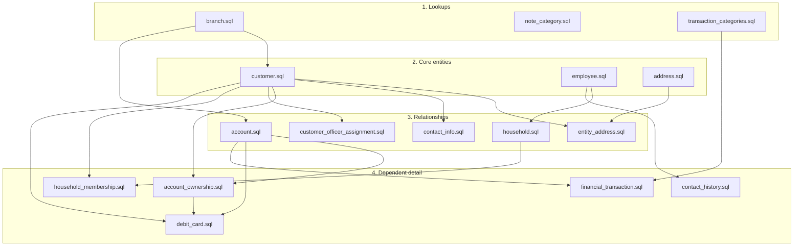

# Data Grooming for Testing: ClientIQ / Banking Client 360

*Last reviewed: 2026-07-02 - Source of truth: application code*

## Purpose / Overview

This guide tells the Data team **which tables to load, in which order, from which loader**, so that RBAC-gated and relationship features work in a ClientIQ (Banking Client 360) test environment. It is a data-load recipe, not a schema reference.

The single most important thing to understand before loading anything: **ClientIQ has two disjoint data-load worlds that must not be conflated.**

| World | Engine | Loader | Purpose |
|-------|--------|--------|---------|
| Faker dev/demo seed | dev abstraction (see below) | `scripts/seed.ts` | Deterministic synthetic fixtures for local dev / demo |
| SQL Server ETL | **Microsoft SQL Server** | `Insert Queries/*.sql` → `ClientIQPreProd.dbo.*` | Grooms real preprod/prod data from upstream banking views |

A **preprod or prod-shaped SQL Server test environment is groomed by the `Insert Queries/*.sql` ETL**, not by the faker seed. The faker seed targets the repo's internal dev data-layer abstraction and does not run against SQL Server (its sequence-reset step is a no-op on SQL Server; see [§6](#6-known-gaps-and-caveats)). Pick the correct world for your target before you copy any statement out of this doc.

The database is **Microsoft SQL Server in every environment** (dev, test, preprod, prod). There is no other production engine. Search in the app is a case-insensitive `LIKE` substring match.

---

## Table of contents

1. [Two data-load paths](#1-two-data-load-paths)
2. [RBAC bootstrap (do this first)](#2-rbac-bootstrap-do-this-first)
3. [SQL Server ETL load order](#3-sql-server-etl-load-order)
4. [Faker seed load order (dev only)](#4-faker-seed-load-order-dev-only)
5. [SQL Server infra prerequisites](#5-sql-server-infra-prerequisites)
6. [Known gaps and caveats](#6-known-gaps-and-caveats)
7. [Test scenarios enabled by the data](#7-test-scenarios-enabled-by-the-data)

---

## 1. Two data-load paths

### 1.1 Faker dev seed: `scripts/seed.ts`

- Generates deterministic synthetic data (`faker.seed(12345)`, `scripts/seed.ts:12`).
- `main()` self-invokes on import (`scripts/seed.ts:833`), so the file is run directly (e.g. `tsx scripts/seed.ts`). There is **no `npm run seed` / `db:seed` script** wired in `package.json`.
- Loads branches, employees, the full RBAC chain, customers, addresses/contacts, households, accounts, and debit cards (see [§4](#4-faker-seed-load-order-dev-only)).
- This is the only loader that produces a **guaranteed admin test login**: `employee_id = 1` is hardcoded to *Sarah Johnson, System Admin* (`scripts/seed.ts:54-69`, assigned System Admin at `:216-218`), matching the dev mock user.

Use this for local dev and demos only.

### 1.2 SQL Server ETL: `Insert Queries/*.sql`

- Targets `ClientIQPreProd.dbo.*` and sources Jack Henry views (`TheSpot`, `TheSpotPreProd`, `TheVault`).
- Run manually, in FK-dependency order (there is **no orchestrator script** in the repo).
- Does **not** touch RBAC tables; RBAC must be bootstrapped separately (see [§2](#2-rbac-bootstrap-do-this-first)).
- Most loaders are idempotent (`MERGE` or `NOT EXISTS` guards); a few plain-`INSERT` loaders are not (see [§6](#6-known-gaps-and-caveats)).

This is what a preprod-shaped test environment is actually populated from.

> **[CONFIRM]** The `Insert Queries/*.sql` files target the literal database name `ClientIQPreProd`. If grooming a differently-named test database (e.g. a dedicated QA instance), the three-part names in every `.sql` file must be repointed. Confirm the target DB name with the DBA before running.

### 1.3 Which tables have a SQL Server loader

Only the tables below have a real loader in `Insert Queries/`. Any other table in the schema (for example `region`, the `sic_code` family, `debit_card_limit_profile`, `entity_contact`, `note` / `note_version`, `online_banking_*`, `employee_branch`) has **no SQL Server ETL**; it is populated by neither the ETL nor the seed and must be hand-loaded if a test needs it.

| Table | Loader file |
|-------|-------------|
| `branch` (+ `address` type `'Branch'`) | `Lookup Tables/branch.sql` |
| `note_category` | `Lookup Tables/note_category.sql` |
| `transaction_category` | `Lookup Tables/transaction_categories.sql` |
| `customer` | `customer.sql` |
| `employee` | `employee.sql` |
| `address` | `address.sql` |
| `entity_address` | `entity_address.sql` |
| `contact_info` | `contact_info.sql` |
| `contact_history` | `contact_history.sql` |
| `account` | `account.sql` |
| `account_ownership` | `account_ownership.sql` |
| `customer_officer_assignment` | `customer_officer_assignment.sql` |
| `household` | `household.sql` |
| `household_membership` | `household_membership.sql` |
| `debit_card` | `debit_card.sql` |
| `financial_transaction` | `financial_transaction.sql` |

---

## 2. RBAC bootstrap (do this first)

Role-gated UI and API depend on the RBAC chain being fully populated. **On SQL Server the ETL never loads RBAC tables**, so RBAC is bootstrapped separately.

### 2.1 RBAC FK dependency / load order

The chain is FK-driven (verified against `shared/schema.ts`):

```
privilege_level  (root, no FK)                         schema.ts:654
  └─ role.privilege_level        → privilege_level.level        schema.ts:665
       ├─ permission.min_privilege_level → privilege_level.level schema.ts:684
       ├─ role_permission.role_id       → role.role_id          schema.ts:698
       │   role_permission.permission_id → permission.permission_id schema.ts:699
       ├─ employee_role.role_id         → role.role_id          schema.ts:711
       │   employee_role.employee_id    → employee.employee_id  schema.ts:710
       └─ saml_role_mapping.role_id     → role.role_id          schema.ts:731
```

**Load order (each depends on the prior):**

1. `privilege_level`
2. `role`
3. `permission`
4. `role_permission`
5. `employee_role`  (requires `employee` rows to already exist)
6. `saml_role_mapping`  (**admin-managed at runtime, not seeded by anything**; see [§2.5](#25-how-saml--role-actually-resolves))

### 2.2 Privilege levels (`scripts/seed.ts:107-113`)


| level | levelName |
|------:|-----------|
| 0 | Read-Only |
| 1 | Staff |
| 2 | Manager |
| 3 | Senior/Branch |
| 4 | System Admin |

### 2.3 Roles (`scripts/seed.ts:117-127`), all `is_system_role=true`, `is_active=true`

| role_name | privilege_level |
|-----------|:---------------:|
| System Admin | 4 |
| Branch Manager | 3 |
| Assistant Manager | 2 |
| Loan Officer | 2 |
| Business Banker | 2 |
| Teller | 1 |
| Customer Service Rep | 1 |
| Risk Analyst | 1 |
| Compliance Officer | 1 |

### 2.4 Permissions (`scripts/seed.ts:133-154`)

Eleven permission codes. `min_privilege_level` gates inheritance; roles at or above that level get the permission implicitly.

| permission_code | min_priv | attribute-based |
|-----------------|:--------:|:---------------:|
| `accounts.view` | 2 | no |
| `account.view.balances` | 2 | no |
| `transaction.view` | 2 | **yes** |
| `customer.view.relationship_summary` | 1 | no |
| `customer.view.recent_activity` | 1 | no |
| `customer.view.deposits` | 1 | no |
| `household.view` | 2 | no |
| `users.view` | 3 | no |
| `users.assign_roles` | 4 | no |
| `user_management.view` | 4 | no |
| `user_management.assign_roles` | 4 | no |

**`transaction.view` is the only attribute-based permission.** Its meaning comes entirely from its `attributeConfig` payload; setting `is_attribute_based=1` without the conditions produces a permission with an empty rule. The exact condition (`scripts/seed.ts:136-145`):

```json
{
  "conditions": [{
    "attribute": "customer.isEmployee",
    "operator": "equals",
    "value": true,
    "denyIfMatch": true,
    "minPrivilegeOverride": 3,
    "reason": "Employee customer records require Level 3+ access"
  }]
}
```

This means: viewing the **transaction history of a bank-employee customer** requires privilege level 3+. It gates transactions only, not all of an employee-customer's data.

> **[CONFIRM]** The SQL Server DDL for the `permission` table and the exact column/JSON shape it reads for attribute-based rules is not derivable from the repo `.sql` files (no ETL loads `permission`). Confirm with the DBA which column holds the attribute config and whether the SQL Server store actually evaluates this `isEmployee` rule; see the enforcement caveat in [§7](#7-test-scenarios-enabled-by-the-data).

### 2.4.1 Role-permission grant model

- **Level 2+ roles inherit permissions via `min_privilege_level`**; no explicit `role_permission` rows are created for them.
- **Explicit `role_permission` grants are created only for Level 1 roles** (`scripts/seed.ts:159-188`):
  - **Teller** and **Customer Service Rep** each get 7 permissions: `accounts.view`, `account.view.balances`, `transaction.view`, `customer.view.relationship_summary`, `customer.view.recent_activity`, `customer.view.deposits`, `household.view`.
  - **Risk Analyst** and **Compliance Officer** each get 6 read-only permissions (the same list minus `transaction.view`).

### 2.5 How SAML to role actually resolves

On preprod/prod, roles are **assigned per-login by SAML AD-group sync**, not by hand-inserted `employee_role` rows. (SSO/SAML is on in **preprod and prod only**; dev and test use local/mock auth with `SAML_ENABLED=false`.)

Resolution is **app code keyed on `role.role_name`**, not the `saml_role_mapping` table:

- `server/auth/adGroupRoleMap.ts` holds `AD_GROUP_TOKEN_TO_ROLE`. The right-hand values **must exist as rows in the `role` table**; the file states plainly (`adGroupRoleMap.ts:22-27`) that no DB table is involved and resolved role *names* are looked up against `role`.
- Resolution happens via `resolveRolesByNameSqlServer()` (`server/storage/sqlServerEmployee.ts:375,475`), with a fallback role name.

The AD map emits these role names (`adGroupRoleMap.ts:43-57`):

| AD-group token | emitted role name |
|----------------|-------------------|
| `appsvcs`, `appadmin` | `System Admin` |
| `branchmanager` | `Branch Manager` |
| `businessbanker`, `assistantmanager` | **`BRS`** |
| `loanofficer` | `Loan Officer` |
| `risk` | `Risk Analyst` |
| `compliance` | `Compliance Officer` |
| `teller`, `dataanalyst` | `Teller` |

**Mismatch to resolve before RBAC testing:** the AD map emits **`BRS`**, but the seed's role list ([§2.3](#23-roles-scriptsseedts117-127-all-is_system_roletrue-is_activetrue)) has no `BRS` row; it has `Business Banker` and `Assistant Manager` instead. Any AD group mapping to `BRS` will strand its users on **"Awaiting Role Assignment"** unless a `BRS` role row exists.

> **[CONFIRM]** Whether a `BRS` role row must be created in preprod/prod (and at what privilege level, per `adGroupRoleMap.ts` this tier is privilege 2) is a data/identity-governance decision. Confirm with the AD-group / entitlement owner before grooming RBAC for a SSO environment.

A `saml_role_mapping` service does exist (`server/services/samlRoleMappingService.ts`) for enforced-sync mappings managed in the UI (Level-4 `user_management.*` permissions), but **no seed or `.sql` script populates it**. Do not assume it is pre-populated.

### 2.6 SQL Server RBAC bootstrap scripts (run these)

Because the ETL loads no RBAC, SQL Server environments rely on standalone idempotent scripts in `scripts/`:

| Script | What it guarantees |
|--------|--------------------|
| `scripts/ensure_branch_manager_role.sql` | A `Branch Manager` role (privilege_level=3) exists so SAML auto-provisioned users get a default role on first sign-in (`:13-40`). Reactivates an inactive row rather than duplicating (`:20-25`). |
| `scripts/ensure_rbac_provenance_columns.sql` | Adds `employee_role.assigned_by` (`:19`) and optional `employee_role_history` columns (`:33-49`). **Required before enforced AD-group role sync works.** Provenance rule: `assigned_by IS NULL` = AD/system-derived (may be auto-revoked by sync); `assigned_by IS NOT NULL` = admin-assigned, never auto-revoked (`:8-9`). |
| `scripts/widen_employee_last_seen_saml_role.sql` | Widens `employee.last_seen_saml_role` to `NVARCHAR(MAX)` (`:17-18`). Without it, IdPs sending the full AD group list overflow `varchar(255)`, causing SQL error 2628, aborting the employee upsert and stranding SSO users on "Awaiting Role Assignment" (`:4-7`). |

If a specific test user needs an explicit role that AD sync will not grant, insert an `employee_role` row directly (set `assigned_by` non-NULL so enforced sync will not revoke it).

---

## 3. SQL Server ETL load order

Run in this order. Every downstream join keys on `jack_henry_cif_number`, `account_number`, `officer_code`, or `branch_code`, so the lookups and core entities must precede everything keyed off them.



### 3.1 Lookups (load first)

| Order | File | Loads | Key notes |
|:-----:|------|-------|-----------|
| 1 | `Lookup Tables/branch.sql` | `dbo.address` (type `'Branch'`) + `dbo.branch` | Hardcoded staging `#branch_data` of **38** real branch rows (Long Beach / Orange County, CA) with `branch_code`/name/address (`branch.sql:14-52`). MERGEs addresses, then inserts branches joined on address (`:64-102`). **Must precede customer and account** (both join `branch_code`). Populates only `branch_code`/`branch_name`/`address_id`; it does **not** set `region_id` (`:91-93`). |
| 2 | `Lookup Tables/note_category.sql` | `dbo.note_category` | 10 fixed categories with `IDENTITY_INSERT ON`, explicit IDs 1 to 10 (`:1-27`). |
| 3 | `Lookup Tables/transaction_categories.sql` | `dbo.transaction_category` | Loads `category_code`, `group_code`, `name` from `TheSpotPreProd.dbo.TXN_TYP` (`:11`); dedups on `category_code` and `name` (`:12-20`). **Must precede `financial_transaction.sql`**, which joins on `transaction_category.category_code` (**`category_code` is the load and join key**, `financial_transaction.sql:41`). |

### 3.2 Core entity loads

| Order | File | Target | Source | Key dependency |
|:-----:|------|--------|--------|----------------|
| 4 | `customer.sql` | `customer` | `TheSpotPreProd.dbo.TEST_CUST_VIEW_CURR` (`:83`) | **Needs `branch` first** (LEFT JOIN `branch` on `branch_code = cust_branch_nbr`, `:84-85`). Derives `customer_status` from lifecycle codes (`:50-55`), concats `inquiry_code` (`:74-82`), sets VIP/deceased flags (`:70-71`). Does **not** set `is_employee` (see [§7](#7-test-scenarios-enabled-by-the-data)). |
| 5 | `employee.sql` | `employee` | `EMPL_VIEW` (priority 1) + `CUST_VIEW_CURR` branch officers / sales associates (priority 2) (`:29-71`) | Dedups on `officer_code` via `ROW_NUMBER() PARTITION BY officer_code ORDER BY source_priority` (`:23-26`). `officer_code` is the join key used by household / contact_history / customer_officer_assignment. |
| 6 | `address.sql` | `address` | `TheSpot.dbo.cust_view_curr` | Inserts 3 address types, `PRIMARY` (`:12-20`), `PF` (`:34-42`), `IRS` (`:56-64`), each `DISTINCT` where source is non-null. **Plain `INSERT`, not guarded; re-running duplicates.** |

### 3.3 Relationship and dependent-detail loads

| Order | File | Target | Source | Key dependency |
|:-----:|------|--------|--------|----------------|
| 7 | `entity_address.sql` | `entity_address` | `cust_view_curr` + `customer` + `address` | **Needs `customer` + `address`.** Links via `customer.jack_henry_cif_number = v.cif_nbr`, matches `address` rows by type+lines+city+state+zip (`:17-33`, `:50-66`, `:82-96`). `NOT EXISTS` guard, idempotent. |
| 8 | `contact_info.sql` | `contact_info` | `cust_view_curr` + `customer` | **Needs `customer`.** `CROSS APPLY` fans out 6 contact channels (email primary/secondary, phone home/business/cell/other-cell) (`:31-40`); nulls out `'N/A'`/`'0'`/empty (`:14-21`); `can_contact` from `do_not_call_flg` (`:26`). **Plain `INSERT`, not guarded; re-running duplicates.** |
| 9 | `account.sql` | `account` | `COMBINED_DEPO_VIEW_CURR` (deposits) + `LOAN_VIEW_CURR` (loans) (`:37,77`) | **Needs `branch`.** Two `MERGE` statements on `account_number`. See the deposit-MERGE caveat in [§6](#6-known-gaps-and-caveats). |
| 10 | `customer_officer_assignment.sql` | `customer_officer_assignment` | `CUST_VIEW_CURR` (`:11`) | **Needs `customer`.** `CROSS APPLY` maps `BRANCH_OFFCR_CD`→`'BRANCH_OFFICER'` and `CUST_SALES_ASSOC_CD`→`'SALES_ASSOC'` (dedup if equal) (`:14-25`); `NOT EXISTS` guard, idempotent. |
| 11 | `household.sql` | `household` (+ ALTERs) | `HH_VIEW` (`:27`) | **Needs `employee`.** First idempotently ALTERs in `jack_henry_household_number` + `relationship_manager_code` (`:1-13`). MERGE on `jack_henry_household_number` (`:15-71`); resolves RM via `employee.officer_code = HH_VIEW.OFFCR_CD` (`:28-29`). |
| 12 | `account_ownership.sql` | `account_ownership` | `TEST_CUST_ACCT_RELS_VIEW` (`:19`) | **Needs `account` + `customer`.** Joins account by `account_number`, customer by CIF (`:20-23`); `is_primary_owner` from `REL_TYP_DESC = 'Primary account owner'` (`:14-18`). |
| 13 | `household_membership.sql` | `household_membership` | `HOUSEHOLD_MAP` + `HH_VIEW` (`:27-29`) | **Needs `household` + `customer`.** MERGE on `(household_id, customer_id)` (`:38-39`); head-of-household flag from `CIF_ID = HOH_CIF_NBR` (`:7-23`). |
| 14 | `contact_history.sql` | `contact_history` | `TheSpotPreProd.dbo.CUST_COMMS_VIEW` (`:27`) | **Needs `customer` + `employee`.** Joins customer by CIF (`:30-31`); resolves employee via `EMPL_VIEW.FMB_ID → OFFFCR_CD → employee.officer_code` (`:34-38`). |
| 15 | `debit_card.sql` | `debit_card` | `TheSpotPreProd.dbo.DBT_CRD_VIEW` (`:21`) | **Needs `account` + `account_ownership` (primary owner) + `customer`.** MERGE on `(account_id, last_four_digits)`; joins ownership `is_primary_owner=1` and customer by CIF. Carries **inline limit columns**; see [§3.4](#34-debit-card-limits-are-inline-on-sql-server). |
| 16 | `financial_transaction.sql` | `financial_transaction` | `COMBINED_DEPO_TXN_VIEW` + `LOAN_TXN_VIEW` (`:37,87`) | **Needs `account` + `transaction_category`.** Two INSERTs (deposit `:3-49`, loan `:53-99`). Joins account by `account_number`, LEFT JOIN category by `category_code = TRANSACTION_CD` (`:41,91`). **Loads only the last 13 months** (`TRANSACTION_DT >= DATEADD(MONTH,-13,...)`, `:42,92`). `NOT EXISTS` guard on `(account_id, source_system, source_transaction_id)`, idempotent. |

### 3.4 Debit-card limits are inline on SQL Server

The SQL Server `debit_card` ETL has **no `limit_profile_id` FK and no `debit_card_limit_profile` dependency**. Limits are inline columns sourced from `DBT_CRD_VIEW` (`debit_card.sql:7-9`):

- `daily_withdrawal_limit` from `DLY_WTDWL_LMT`
- `daily_purchase_limit` from `DLY_POS_LMT`
- `daily_transaction_limit` from `DLY_TXN_LMT`

The `debit_card_limit_profile` FK model exists **only in the faker seed path** ([§4](#4-faker-seed-load-order-dev-only)). Do not load or expect a `debit_card_limit_profile` table on SQL Server.

### 3.5 Schema Changes (run before dependent app writes/queries)

`Insert Queries/Schema Changes/` holds idempotent DDL migrations the app relies on:

| File | Effect | When needed |
|------|--------|-------------|
| `financial_transaction_add_account_number.sql` | Adds nullable `financial_transaction.account_number` + index `idx_transaction_account_number` (`:12,23`). | Denormalized account number for Operations queries; legacy rows stay NULL, future writes populate from `account.account_number`. |
| `financial_transaction_backfill_account_number.sql` | Backfills `account_number` from `account` for legacy rows where NULL and `account_id` is present (`:12-17`). | **Required before** the app repoints transaction queries from `ft.account_id` onto `ft.account_number`; ETL no longer reliably populates `ft.account_id` (`:2-4`). Remaining NULLs are orphans needing separate ETL repair; verify with `SELECT COUNT(*) ... WHERE account_number IS NULL` (`:7`). |
| `note_add_cif_number.sql` | Adds nullable `note.cif_number` + index `idx_note_cif_number` (`:12,23`). | Populated server-side on note create/update; legacy notes stay NULL until edited. |

---

## 4. Faker seed load order (dev only)

`main()` runs these in order (`scripts/seed.ts:812-823`). This path targets the dev data-layer abstraction, **not** SQL Server.

| Order | Function (`scripts/seed.ts`) | Produces |
|:-----:|------------------------------|----------|
| 1 | `generateBranches()` (`:22`) | **8** branches (root of most FKs). `region` here is a plain string field, not a `region` table row (`:39`). |
| 2 | `generateEmployees()` (`:48`) | Sarah Johnson (System Admin, `employee_id=1`) + 15 to 35 per branch. |
| 3 | `seedRBAC()` (`:103`) | privilege_level, role, permission, role_permission, employee_role (see [§2](#2-rbac-bootstrap-do-this-first)). |
| 4 | `generatePersons()` (`:251`) | **1200** customers, polymorphic individual/business/trust/estate (`:257-291`). Does **not** set `isEmployee`. |
| 5 | `generateAddressesAndContacts()` (`:298`) | 1 to 3 addresses + 2 to 5 contacts per customer, plus `entity_address` / `entity_contact` links (`:307-387`). |
| 6 | `generateHouseholds()` (`:392`) | **400** households + memberships (`:405-465`). See household-membership bug in [§6](#6-known-gaps-and-caveats). |
| 7 | `generateAccounts()` (`:469`) | 1 to 5 accounts per customer + `account_ownership` (`:477-551`). |
| 8 | `generateDebitCardLimitProfiles()` (`:556`) | **8** fixed limit profiles (`:559-632`), dev-only FK model. |
| 9 | `generateDebitCards()` (`:638`) | Debit cards for **active checking / business_checking** accounts only (`:642-659`); requires active customer + active primary ownership. |
| 10 | `resetSequences()` (`:785`) | Sequence reset, **no-op / errors on SQL Server** (dev-abstraction idiom, wrapped in try/catch, `:804-806`). |

**Role coverage note:** only `employee_id=1` is a deterministic role assignment (System Admin). All other active employees get a **weighted-random** role (`:200-231`); inactive employees get **no** role (`:212`). Per-employee role coverage is nondeterministic except employee #1.

---

## 5. SQL Server infra prerequisites

Not business data, but **required for the app / role-gated features to run** on SQL Server. Run these when standing up a fresh SQL Server test environment:

| File | Purpose |
|------|---------|
| `scripts/create_sessions_table.sql` | Creates `dbo.sessions` for `connect-mssql-v2`. **Required by `server/auth/session.ts` when `SAML_ENABLED=true`** (preprod/prod). DB user needs `db_datareader`/`db_datawriter`/`db_ddladmin`. |
| `scripts/fix_sessions_table.sql` | Repairs a `sessions` table whose `sid` is under 255 chars (drops/recreates, `:18-23`). Fixes "String or binary data would be truncated ... column 'sid'" on first login (`:5-7`). |
| `scripts/create_audit_event_table.sql` | Creates `dbo.audit_event` + 7 indexes for audit logging (`:6-54`); FK `employee_id → employee` (`:13`). |
| `scripts/create_performance_indexes.sql` | Perf indexes on `financial_transaction`, `account_ownership`, `account`, `customer` (`:10-55`). "Especially important after large data loads" (`:3`). |
| `scripts/diagnose_transaction_data.sql` | **Diagnostic only** (no writes); counts transactions, checks orphaned `account_id`s, per-customer coverage (`:5-45`). Use when a customer shows no transactions. |

---

## 6. Known gaps and caveats

Verify these before trusting groomed test data.

1. **Idempotency is not uniform.** Most `.sql` loaders use `MERGE` or `NOT EXISTS` guards (safe to re-run). The plain-`INSERT` loaders, **`address.sql` and `contact_info.sql`**, are **not** guarded and will duplicate on re-run. Groom on a clean target or add guards.
2. **`account.sql` deposit MERGE.** The file has two `MERGE`s but the deposit MERGE block (`:3-41`) appears to lack its `WHEN MATCHED / NOT MATCHED` action clauses (only the loan MERGE, `:83-134`, has them). **Verify the deposit MERGE actually inserts deposit accounts as written** before relying on deposit-account test data.
3. **Transactions are time-boxed to 13 months** (`financial_transaction.sql:42,92`). Date-range tests older than 13 months will see no data.
4. **Seed household membership bug (dev path).** `generateHouseholds()` inserts `customerId: customer.customerId` (the column object, not the per-row value) at `scripts/seed.ts:450`, while `generateAddressesAndContacts` and `generateAccounts` correctly use the per-row `customerId`. Household membership rows may be malformed; verify before relying on faker household data.
5. **`resetSequences()` is dev-only.** It uses sequence idioms that no-op or error on SQL Server (`scripts/seed.ts:799-806`), caught in try/catch. Harmless, but do not expect it to do anything on SQL Server.
6. **`region` is effectively unpopulated in both paths.** `branch.region_id` is a real FK in `shared/schema.ts`, but `branch.sql` never sets it (`:91-93`) and no ETL loads a `region` table; in the faker seed, `region` is just a string field on `branch` (`:39`). If a test needs regions, they must be hand-loaded and `branch.region_id` set manually.
7. **Tables with no loader at all.** `region`, the `sic_code` family (`sic_code`, `customer_sic_code`, `account_sic_code`), `debit_card_limit_profile` (SQL Server), `entity_contact`, `note` / `note_version`, `online_banking_user` / `online_banking_login_event`, and `employee_branch` (schema `shared/schema.ts:288`) are loaded by neither the ETL nor the seed. Only `note_category` is loaded on the notes side. Hand-load any of these that a test requires.

---

## 7. Test scenarios enabled by the data

| Scenario | Data required | Notes |
|----------|---------------|-------|
| Basic role-gated login | RBAC bootstrap ([§2](#2-rbac-bootstrap-do-this-first)) + at least one `employee_role`. | On SQL Server preprod/prod, roles are driven by **SAML AD-group sync keyed on role name**, not hand-inserted `employee_role` rows. For a deterministic non-SSO login, the faker seed's `employee_id=1` (System Admin) is the only guaranteed admin account. |
| Account / balance visibility | `customer`, `account`, `account_ownership`. | `accounts.view` (Level 2+) and `account.view.balances` (Level 2+); Level 1 Teller/CSR get explicit grants. |
| Household relationships | `household`, `household_membership` (+ `customer`, `employee` RM). | `household.view` (Level 2+). Verify seed household-membership bug ([§6](#6-known-gaps-and-caveats)) if using faker data. |
| Debit-card features | Active checking/business-checking `account` + active primary `account_ownership` + active `customer`. | If those statuses are absent, **no debit cards are generated** in the seed; the ETL similarly requires `is_primary_owner=1`. SQL Server cards carry inline limits ([§3.4](#34-debit-card-limits-are-inline-on-sql-server)). |
| Transaction history | `financial_transaction` (+ `transaction_category`, `account`). | Only last 13 months exist. Notes and Operations transaction queries also depend on the `account_number` schema changes ([§3.5](#35-schema-changes-run-before-dependent-app-writes-queries)). |
| Employee-customer transaction protection | A customer with `is_employee = 1`, a Level 1 user (should be blocked from transactions), and a Level 3 user (should see them). | **Applies specifically to `transaction.view`**; it gates a bank-employee customer's *transaction history* (requires privilege ≥ 3), not all their data (`scripts/seed.ts:136-145`). **Neither loader sets `is_employee=1`** (`generatePersons()` never sets it; `customer.sql` has no mapping), so the tester must set it by hand to exercise this scenario. See the enforcement caveat below. |
| Notes | `note_category` (loaded) + `note` / `note_version` (**no loader; hand-load**). | Notes are **authentication-only, not permission-gated**; any authenticated employee can read/write notes regardless of role (no `notes.*` permission exists; the Notes UI renders with no permission guard, `client/src/components/CustomerDashboard.tsx:863-869`). Do not expect a role to block notes. |

> **[CONFIRM]** Enforcement of the employee-customer `transaction.view` rule on SQL Server is unverified. The attribute-based rule is authored for the dev-abstraction permission service; the SQL Server permission store implements branch/region conditions and may not evaluate the `customer.isEmployee` rule. Confirm with engineering whether this control actually fires in preprod/prod before treating it as a passing security test.

---

## References

- Schema / FK truth: `shared/schema.ts`
- Roles & permissions: `docs/roles-and-permissions.md`
- SQL-Server-specific schema notes: `docs/database-design-sqlserver.md`
- Faker seed: `scripts/seed.ts`
- SQL Server ETL: `Insert Queries/*.sql`, `Insert Queries/Lookup Tables/`, `Insert Queries/Schema Changes/`
- SQL Server infra / RBAC bootstrap: `scripts/*.sql`
- SAML → role resolution: `server/auth/adGroupRoleMap.ts`, `server/storage/sqlServerEmployee.ts`, `server/services/samlRoleMappingService.ts`

> **[CONFIRM]** Document owner / author and the published-copy revision date. The prior in-repo markdown and the published PDF carried divergent dates and authors; this rewrite intentionally omits an author line rather than assert one.
