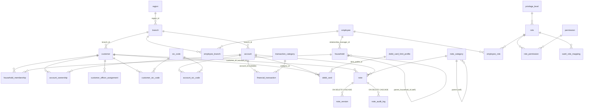

# Database Design: ClientIQ / Banking Client 360

*Last reviewed: 2026-07-01 · Source of truth: application code (ClientIQ / Banking Client 360).*

## Purpose / Overview

This is the schema reference for **ClientIQ / Banking Client 360**, an on-prem banking
customer-360 CRM. It is written for data engineers who work on analytics, reporting, ETL,
and integration against the production database.

The production database engine is **Microsoft SQL Server** in every environment (dev, test,
preprod, prod). The application connects to SQL Server exclusively; the runtime connection
manager (`server/dbConnection.ts:1-4,49-52`) builds an `mssql` connection pool and nothing
else.

One implementation detail matters for reading this document. The canonical schema is authored
in Drizzle ORM as table definitions in `shared/schema.ts`; those definitions exist to generate
TypeScript types and Zod validation schemas used across the app. They are **not** applied to
the production database by a migration tool. Production SQL Server DDL is managed by hand and
by the idempotent scripts described in [§10](#10-schema-management-no-numbered-migrations).
Wherever this document shows DDL it uses **SQL Server** syntax (`BIGINT IDENTITY`, `NVARCHAR(MAX)`,
`DATETIME2`, `BIT`, `UNIQUEIDENTIFIER`).

> **[CONFIRM]** Document version and owner. This reference is derived from application code;
> there is no authoritative version string in the code. `package.json` reports application
> version `1.0.0`.

---

## 1. Schema Summary

`shared/schema.ts` defines **40 tables**, grouped by domain below. Two additional tables exist
only as SQL Server DDL and are **not** in `shared/schema.ts`: the `sessions` table
([§10.2](#102-sessions-ddl-only)) used for SAML session storage, and a standalone physical
`audit_event` DDL script that mirrors the `audit_event` table definition
([§10.1](#101-scriptssql)).

| Domain | Tables | Members |
| --- | --- | --- |
| Core banking | 8 | `region`, `branch`, `employee`, `address`, `contact_info`, `customer`, `household`, `account` |
| Relationships / junctions | 6 | `entity_address`, `entity_contact`, `household_membership`, `account_ownership`, `employee_branch`, `customer_officer_assignment` |
| Reference / lookup | 4 | `sic_code`, `customer_sic_code`, `account_sic_code`, `transaction_category` |
| Financial transactions | 1 | `financial_transaction` |
| Cards | 2 | `debit_card_limit_profile`, `debit_card` |
| Dashboard / activity | 3 | `online_banking_user`, `online_banking_login_event`, `contact_history` |
| Notes module | 4 | `note_category`, `note`, `note_version`, `note_audit_log` |
| RBAC + audit | 12 | `privilege_level`, `role`, `permission`, `role_permission`, `employee_role`, `saml_role_mapping`, `role_audit_log`, `permission_denial_log`, `employee_status_history`, `employee_role_history`, `role_change_request`, `audit_event` |

**Total: 40** tables in `shared/schema.ts`, plus `sessions` (DDL-only).

Some RBAC/audit tables (`role_change_request`, `role_audit_log`, `employee_status_history`) are
defined in the schema but are not exercised by production code paths at this time; they are
documented here as defined-but-not-yet-wired.

### Conventions

- **Primary keys.** Almost all PKs are `BIGINT IDENTITY(1,1)` (authored as Drizzle `bigserial`).
  Exceptions are natural-key PKs: `sic_code.sic_code` and `privilege_level.level` are plain
  `BIGINT`. Several junction tables use a composite key instead of a surrogate PK, noted per table.
- **Foreign keys.** Authored with Drizzle `.references()`, mapping to `BIGINT` FK columns.
- **Timestamps.** Most tables carry `created_at DATETIME2 DEFAULT GETDATE()` and
  `updated_at DATETIME2 DEFAULT GETDATE()`. Deviations are called out per table.
- **BIGINT-as-strings.** SQL Server returns `BIGINT` values to the Node driver as JavaScript
  strings. Application code coerces to `Number` at every boundary; downstream consumers reading
  the DB directly should expect 64-bit integer identifiers.

### Data type mapping

The schema is authored in Drizzle types; those map to SQL Server physical types as follows.

| Drizzle type | SQL Server type | Notes |
| --- | --- | --- |
| `bigserial` | `BIGINT IDENTITY(1,1)` | Auto-increment surrogate key |
| `bigint` | `BIGINT` | 64-bit integer (returned to Node as string) |
| `text` | `NVARCHAR(MAX)` | Unicode long text |
| `varchar(n)` | `VARCHAR(n)` | String |
| `boolean` | `BIT` | 1 / 0 |
| `timestamp` | `DATETIME2` | Date + time |
| `date` | `DATE` | Date only |
| `decimal(p,s)` | `DECIMAL(p,s)` | Exact numeric |
| `jsonb` | `NVARCHAR(MAX)` | JSON stored as text (query with `JSON_VALUE` / `OPENJSON`) |
| `uuid` | `UNIQUEIDENTIFIER` | GUID |

---

## 2. Entity Relationship Overview



Address and contact linkage is **polymorphic**: `entity_address` and `entity_contact` join any
entity (`entity_type` + `entity_id`) to `address` / `contact_info`, so those relationships are
not FK-enforced on the entity side.

---

## 3. Core Banking Domain

Header: `CORE BANKING TABLES - JACK HENRY INTEGRATION` (`shared/schema.ts:20-22`).

### 3.1 `region` (`shared/schema.ts:24-30`)

Geographic grouping for branches.

```sql
CREATE TABLE region (
  region_id   BIGINT IDENTITY(1,1) PRIMARY KEY,
  region_name VARCHAR(100) NOT NULL,
  region_code VARCHAR(10)  NOT NULL UNIQUE,
  created_at  DATETIME2 DEFAULT GETDATE(),
  updated_at  DATETIME2 DEFAULT GETDATE()
);
```

### 3.2 `branch` (`shared/schema.ts:32-43`)

```sql
CREATE TABLE branch (
  branch_id   BIGINT IDENTITY(1,1) PRIMARY KEY,
  branch_code VARCHAR(10)  NOT NULL UNIQUE,
  branch_name VARCHAR(100) NOT NULL,
  branch_type VARCHAR(20),                    -- main, satellite, virtual
  address_id  BIGINT,                         -- FK -> address(address_id)
  region_id   BIGINT,                         -- FK -> region(region_id)
  is_active   BIT DEFAULT 1,
  opened_date DATE,
  created_at  DATETIME2 DEFAULT GETDATE(),
  updated_at  DATETIME2 DEFAULT GETDATE(),
  CONSTRAINT fk_branch_address FOREIGN KEY (address_id) REFERENCES address(address_id),
  CONSTRAINT fk_branch_region  FOREIGN KEY (region_id)  REFERENCES region(region_id)
);
```

### 3.3 `employee` (`shared/schema.ts:45-66`): staff + SSO identity

The employee record is also the SSO identity record. When SAML SSO is enabled (preprod and
prod only), a signed-in user is upserted here keyed on `sso_subject`.

```sql
CREATE TABLE employee (
  employee_id          BIGINT IDENTITY(1,1) PRIMARY KEY,
  employee_number      VARCHAR(20)  NOT NULL UNIQUE,   -- badge number
  first_name           VARCHAR(100) NOT NULL,
  last_name            VARCHAR(100) NOT NULL,
  title                VARCHAR(50),
  position             VARCHAR(100),
  officer_code         VARCHAR(20)  UNIQUE,            -- links to customer_officer_assignment
  department           VARCHAR(50),
  is_active            BIT DEFAULT 1,
  hire_date            DATE,
  -- SAML SSO / identity fields
  sso_subject          VARCHAR(255) UNIQUE,            -- SAML NameID
  email                VARCHAR(255),
  phone                VARCHAR(20),
  last_seen_saml_role  NVARCHAR(MAX),                  -- last role attribute from IdP (see note)
  last_login_at        DATETIME2,
  -- audit / lifecycle
  deleted_at           DATETIME2,                      -- soft delete
  modified_by          BIGINT,                         -- no FK declared
  created_at           DATETIME2 DEFAULT GETDATE(),
  updated_at           DATETIME2 DEFAULT GETDATE()
);
```

> **`last_seen_saml_role` must be `NVARCHAR(MAX)`, not `VARCHAR(255)`.** The IdP can send a
> user's full AD group list (multiple KB) in the SAML role attribute. A narrow column caused
> SQL Server error 2628 ("String or binary data would be truncated"), which aborted the
> employee upsert and left SSO users stuck on "Awaiting Role Assignment". The
> `scripts/widen_employee_last_seen_saml_role.sql` script idempotently widens the column
> ([§10.6](#106-scriptswiden_employee_last_seen_saml_rolesql)).

`officer_code` is the join key from `employee` to `customer_officer_assignment` (a string code,
not an FK).

### 3.4 `address` (`shared/schema.ts:68-82`)

```sql
CREATE TABLE address (
  address_id      BIGINT IDENTITY(1,1) PRIMARY KEY,
  address_line1   VARCHAR(200) NOT NULL,
  address_line2   VARCHAR(200),
  city            VARCHAR(100) NOT NULL,
  state           VARCHAR(50),
  postal_code     VARCHAR(20),
  country         VARCHAR(50)  NOT NULL DEFAULT 'US',
  address_type    VARCHAR(20),
  is_primary      BIT DEFAULT 0,
  validated       BIT DEFAULT 0,
  validation_date DATETIME2,
  created_at      DATETIME2 DEFAULT GETDATE(),
  updated_at      DATETIME2 DEFAULT GETDATE()
);
```

### 3.5 `contact_info` (`shared/schema.ts:84-98`)

```sql
CREATE TABLE contact_info (
  contact_id        BIGINT IDENTITY(1,1) PRIMARY KEY,
  contact_type      VARCHAR(20)  NOT NULL,   -- phone, email, fax, ...
  contact_value     VARCHAR(200) NOT NULL,
  contact_subtype   VARCHAR(20),
  is_primary        BIT DEFAULT 0,
  is_verified       BIT DEFAULT 0,
  verification_date DATETIME2,
  can_contact       BIT DEFAULT 1,
  preferred_time    VARCHAR(50),
  created_at        DATETIME2 DEFAULT GETDATE(),
  updated_at        DATETIME2 DEFAULT GETDATE()
);
CREATE INDEX idx_contact_info_type ON contact_info(contact_type, contact_value);
```

### 3.6 `customer` (`shared/schema.ts:100-163`): central polymorphic entity

Supports individual, premium, regular, business, and trust customers via `customer_type`.

```sql
CREATE TABLE customer (
  customer_id            BIGINT IDENTITY(1,1) PRIMARY KEY,
  -- Individual fields (used when customer_type IN ('individual','premium','regular'))
  first_name             VARCHAR(100),
  last_name              VARCHAR(100),
  middle_name            VARCHAR(100),
  preferred_name         VARCHAR(100),
  title                  VARCHAR(20),
  suffix                 VARCHAR(20),
  date_of_birth          DATE,
  gender                 VARCHAR(20),
  marital_status         VARCHAR(20),
  -- Business / org fields (used when customer_type IN ('business','trust'))
  business_name          VARCHAR(200),
  dba_name               VARCHAR(200),         -- doing-business-as
  -- Unified search field
  full_name              VARCHAR(200),         -- populated by ETL / app on write (see note)
  -- Identification
  tax_identifier         VARCHAR(20) UNIQUE,   -- SSN/EIN; masked for display, stored unmasked
  government_id          VARCHAR(50),
  government_id_type     VARCHAR(20),
  citizenship            VARCHAR(50),
  -- Classification
  customer_type          VARCHAR(20) NOT NULL DEFAULT 'regular',
  customer_status        VARCHAR(20) DEFAULT 'active',
  customer_since         DATE DEFAULT GETDATE(),
  -- Compliance
  kyc_status             VARCHAR(20),
  kyc_last_updated       DATE,
  risk_rating            VARCHAR(20),
  -- Preferences
  language_preference    VARCHAR(10) DEFAULT 'en',
  -- Professional (individuals)
  occupation             VARCHAR(100),
  employer_name          VARCHAR(200),
  -- Business classification
  naics_code             VARCHAR(10),
  -- Branch + core banking
  branch_id              BIGINT,               -- FK -> branch(branch_id)
  jack_henry_cif_number  VARCHAR(20),
  silverlake_customer_id VARCHAR(20),
  -- Internal banking codes
  inquiry_code           VARCHAR(20),
  inside_code            VARCHAR(20),
  sales_associate_code   VARCHAR(20),
  class_code             VARCHAR(20),
  -- Flags
  is_employee            BIT DEFAULT 0,
  vip_customer           BIT DEFAULT 0,
  is_deceased            BIT DEFAULT 0,
  created_at             DATETIME2 DEFAULT GETDATE(),
  updated_at             DATETIME2 DEFAULT GETDATE(),
  CONSTRAINT fk_customer_branch FOREIGN KEY (branch_id) REFERENCES branch(branch_id)
);

CREATE INDEX idx_customer_tax_id        ON customer(tax_identifier);
CREATE INDEX idx_customer_full_name     ON customer(full_name);
CREATE INDEX idx_customer_status        ON customer(customer_status);
CREATE INDEX idx_customer_branch        ON customer(branch_id);
CREATE INDEX idx_customer_jack_henry_cif ON customer(jack_henry_cif_number);
CREATE INDEX idx_customer_silverlake_id ON customer(silverlake_customer_id);
CREATE INDEX idx_customer_government_id ON customer(government_id);
```

**`full_name` is a plain `VARCHAR(200)` column, not a computed/PERSISTED column.** It is
populated by the SQL Server ETL and by the application on write (the ETL inserts a literal
`full_name` value; see `Insert Queries/customer.sql`). Search runs against this column
([§8](#8-search-mechanism)). The Zod insert schema omits `full_name` (`shared/schema.ts:901`)
because callers do not set it directly; that omission does not make it a database-computed column.

**Customer-type name rule is enforced in the application, not by a DB CHECK constraint.**
`insertCustomerSchema` is a Zod discriminated union on `customer_type` (`shared/schema.ts:907-929`):

- `individual` / `premium` / `regular` → non-empty `first_name` + `last_name`, `business_name` forbidden.
- `business` / `trust` → non-empty `business_name`, `first_name`/`last_name` forbidden.

There is **no** `customer_name_type_check` (or any other CHECK) on `customer` in the schema. The
only CHECK constraint in `shared/schema.ts` is on the `note` table ([§7.2](#72-note-shared-schema-ts-575-602)).

### 3.7 `household` (`shared/schema.ts:165-186`): with B2B hierarchy

```sql
CREATE TABLE household (
  household_id            BIGINT IDENTITY(1,1) PRIMARY KEY,
  household_name          VARCHAR(200) NOT NULL,
  household_type          VARCHAR(50)  DEFAULT 'family',   -- family, business, trust
  total_assets            DECIMAL(15,2) DEFAULT 0,
  total_liabilities       DECIMAL(15,2) DEFAULT 0,
  household_status        VARCHAR(20)  DEFAULT 'active',
  risk_rating             VARCHAR(20),
  relationship_manager_id BIGINT,        -- FK -> employee(employee_id)
  established_date        DATE DEFAULT GETDATE(),
  tax_filing_status       VARCHAR(20),
  -- B2B hierarchy
  parent_household_id     BIGINT,        -- FK -> household(household_id) (self-reference)
  consolidation_method    VARCHAR(20)  DEFAULT 'equity',   -- full, equity, proportionate, none
  created_at              DATETIME2 DEFAULT GETDATE(),
  updated_at              DATETIME2 DEFAULT GETDATE(),
  CONSTRAINT fk_household_rm     FOREIGN KEY (relationship_manager_id) REFERENCES employee(employee_id),
  CONSTRAINT fk_household_parent FOREIGN KEY (parent_household_id)     REFERENCES household(household_id)
);
CREATE INDEX idx_household_status      ON household(household_status);
CREATE INDEX idx_household_rm          ON household(relationship_manager_id);
CREATE INDEX idx_household_parent      ON household(parent_household_id);
CREATE INDEX idx_household_parent_type ON household(parent_household_id, household_type);
```

The `parent_household_id` self-reference supports B2B organizational hierarchies (a parent
organization with member sub-entities).

### 3.8 `account` (`shared/schema.ts:188-219`)

```sql
CREATE TABLE account (
  account_id                   BIGINT IDENTITY(1,1) PRIMARY KEY,
  account_number               VARCHAR(50) NOT NULL UNIQUE,
  account_type                 VARCHAR(50) NOT NULL,   -- checking, savings, money_market, cd, loan, ...
  account_subtype              VARCHAR(50),
  account_status               VARCHAR(20) NOT NULL DEFAULT 'active',
  balance                      DECIMAL(15,2) DEFAULT 0,
  available_balance            DECIMAL(15,2) DEFAULT 0,
  currency                     VARCHAR(3)  DEFAULT 'USD',
  interest_rate                DECIMAL(5,4),
  credit_limit                 DECIMAL(15,2),
  branch_id                    BIGINT,                 -- FK -> branch(branch_id)
  product_code                 VARCHAR(50),
  opened_date                  DATE DEFAULT GETDATE(),
  closed_date                  DATE,
  last_transaction_date        DATE,
  maturity_date                DATE,
  -- Core banking integration
  jack_henry_account_id        VARCHAR(50),
  silverlake_account_structure VARCHAR(200),
  account_class                VARCHAR(50),
  statement_cycle              VARCHAR(20),
  statement_code_desc          VARCHAR(200),
  average_balance              DECIMAL(15,2),
  last_maintenance_date        DATE,
  created_at                   DATETIME2 DEFAULT GETDATE(),
  updated_at                   DATETIME2 DEFAULT GETDATE(),
  CONSTRAINT fk_account_branch FOREIGN KEY (branch_id) REFERENCES branch(branch_id)
);
CREATE INDEX idx_account_number      ON account(account_number);
CREATE INDEX idx_account_type        ON account(account_type);
CREATE INDEX idx_account_status      ON account(account_status);
CREATE INDEX idx_account_jack_henry  ON account(jack_henry_account_id);
```

The `account` table has **no** `sic_code` column and no direct SIC FK/index. SIC codes attach
to accounts through the `account_sic_code` junction table ([§5.3](#53-account_sic_code-shared-schema-ts-348-363)).

---

## 4. Relationship / Junction Tables

### 4.1 `entity_address` (`shared/schema.ts:222-233`): polymorphic address link

```sql
CREATE TABLE entity_address (
  entity_address_id BIGINT IDENTITY(1,1) PRIMARY KEY,
  entity_type       VARCHAR(20) NOT NULL,   -- customer, branch, employee, ...
  entity_id         BIGINT      NOT NULL,   -- polymorphic; NO FK
  address_id        BIGINT      NOT NULL,   -- FK -> address(address_id)
  address_purpose   VARCHAR(20) NOT NULL DEFAULT 'primary',
  is_current        BIT DEFAULT 1,
  start_date        DATE DEFAULT GETDATE(),
  end_date          DATE
);
```

### 4.2 `entity_contact` (`shared/schema.ts:235-247`): polymorphic contact link

```sql
CREATE TABLE entity_contact (
  entity_contact_id  BIGINT IDENTITY(1,1) PRIMARY KEY,
  entity_type        VARCHAR(20) NOT NULL,
  entity_id          BIGINT      NOT NULL,   -- polymorphic; NO FK
  contact_id         BIGINT      NOT NULL,   -- FK -> contact_info(contact_id)
  contact_purpose    VARCHAR(20) DEFAULT 'primary',
  is_current         BIT DEFAULT 1,
  start_date         DATE DEFAULT GETDATE(),
  end_date           DATE,
  contact_type_cached VARCHAR(20)            -- denormalized cache of contact_info.contact_type
);
```

### 4.3 `household_membership` (`shared/schema.ts:249-269`): customer ↔ household (M:N)

```sql
CREATE TABLE household_membership (
  membership_id         BIGINT IDENTITY(1,1) PRIMARY KEY,
  household_id          BIGINT NOT NULL,     -- FK -> household(household_id)
  customer_id           BIGINT NOT NULL,     -- FK -> customer(customer_id)
  relationship_role     VARCHAR(50) NOT NULL, -- head, spouse, child, beneficiary, trustee, ...
  is_primary_member     BIT DEFAULT 0,
  is_head_of_household  BIT DEFAULT 0,
  membership_start_date DATE,
  membership_end_date   DATE,
  rollup_accounts       BIT DEFAULT 1,
  rollup_percentage     DECIMAL(5,2) DEFAULT 100.00,
  -- B2B ownership
  ownership_percentage  DECIMAL(5,2) NOT NULL DEFAULT 0,   -- 0-100%
  control_type          VARCHAR(30)  DEFAULT 'none',       -- majority_control, significant_influence, minority, none
  notes                 NVARCHAR(MAX)
);
CREATE INDEX idx_household_membership_household_role ON household_membership(household_id, relationship_role);
CREATE INDEX idx_household_membership_ownership       ON household_membership(household_id, ownership_percentage);
```

### 4.4 `account_ownership` (`shared/schema.ts:271-286`): customer ↔ account (M:N)

```sql
CREATE TABLE account_ownership (
  ownership_id           BIGINT IDENTITY(1,1) PRIMARY KEY,
  account_id             BIGINT NOT NULL,     -- FK -> account(account_id)
  customer_id            BIGINT NOT NULL,     -- FK -> customer(customer_id)
  ownership_type         VARCHAR(50) NOT NULL, -- primary, joint, authorized_signer, beneficiary
  ownership_percentage   DECIMAL(5,2) DEFAULT 100.00,
  is_primary_owner       BIT DEFAULT 0,
  signing_authority      BIT DEFAULT 1,
  can_view_statements    BIT DEFAULT 1,
  can_make_transactions  BIT DEFAULT 1,
  transaction_limit      DECIMAL(15,2),
  relationship_start_date DATE,
  relationship_end_date  DATE,
  created_at             DATETIME2 DEFAULT GETDATE(),
  updated_at             DATETIME2 DEFAULT GETDATE()
);
```

A performance index on `account_ownership(customer_id) INCLUDE (account_id)` is added out of
band ([§10.3](#103-scriptscreate_performance_indexessql)).

### 4.5 `employee_branch` (`shared/schema.ts:288-304`): employee ↔ branch (M:N)

```sql
CREATE TABLE employee_branch (
  employee_branch_id BIGINT IDENTITY(1,1) PRIMARY KEY,
  employee_id        BIGINT NOT NULL,   -- FK -> employee(employee_id)
  branch_id          BIGINT NOT NULL,   -- FK -> branch(branch_id)
  assignment_role    VARCHAR(100),
  is_primary         BIT DEFAULT 0,
  start_date         DATE,
  end_date           DATE,
  is_active          BIT DEFAULT 1,
  CONSTRAINT unq_employee_branch UNIQUE (employee_id, branch_id)
);
CREATE INDEX idx_employee_branch_employee ON employee_branch(employee_id);
CREATE INDEX idx_employee_branch_branch   ON employee_branch(branch_id);
CREATE INDEX idx_employee_branch_primary  ON employee_branch(employee_id, is_primary);
```

### 4.6 `customer_officer_assignment` (`shared/schema.ts:306-317`): customer ↔ officer

Natural composite key on `(customer_id, officer_code)`; no surrogate PK. `officer_code` is a
string code (it lines up with `employee.officer_code` but is not declared as an FK here).

```sql
CREATE TABLE customer_officer_assignment (
  customer_id       BIGINT NOT NULL,     -- FK -> customer(customer_id)
  officer_code      VARCHAR(20) NOT NULL,
  relationship_type VARCHAR(20) NOT NULL, -- primary, secondary
  assigned_at       DATETIME2 DEFAULT GETDATE(),
  updated_at        DATETIME2 DEFAULT GETDATE(),
  CONSTRAINT pk_customer_officer UNIQUE (customer_id, officer_code)
);
CREATE INDEX idx_customer_officer_customer ON customer_officer_assignment(customer_id);
CREATE INDEX idx_customer_officer_code     ON customer_officer_assignment(officer_code);
CREATE INDEX idx_customer_officer_type     ON customer_officer_assignment(officer_code, relationship_type);
```

`insertCustomerOfficerAssignmentSchema` constrains `relationship_type` to `['primary','secondary']`
(`shared/schema.ts:983-986`). This table has `updated_at` but no `created_at`.

---

## 5. Reference / Lookup Tables

### 5.1 `sic_code` (`shared/schema.ts:324-332`)

Natural-key table. `sic_code` is a plain `BIGINT` PK (the actual SIC code value), not an
identity column.

```sql
CREATE TABLE sic_code (
  sic_code    BIGINT PRIMARY KEY,        -- natural key
  description VARCHAR(500) NOT NULL,
  is_active   BIT DEFAULT 1,
  created_at  DATETIME2 DEFAULT GETDATE(),
  updated_at  DATETIME2 DEFAULT GETDATE()
);
CREATE INDEX idx_sic_code_description ON sic_code(description);
```

### 5.2 `customer_sic_code` (`shared/schema.ts:335-344`): customer ↔ SIC (M:N)

```sql
CREATE TABLE customer_sic_code (
  customer_id BIGINT NOT NULL,     -- FK -> customer(customer_id)
  sic_code    BIGINT NOT NULL,     -- FK -> sic_code(sic_code)
  assigned_at DATETIME2 DEFAULT GETDATE(),
  updated_at  DATETIME2 DEFAULT GETDATE(),
  CONSTRAINT pk_customer_sic UNIQUE (customer_id, sic_code)
);
CREATE INDEX idx_customer_sic_customer ON customer_sic_code(customer_id);
CREATE INDEX idx_customer_sic_code     ON customer_sic_code(sic_code);
```

### 5.3 `account_sic_code` (`shared/schema.ts:348-363`): account ↔ SIC (M:N) with dating

```sql
CREATE TABLE account_sic_code (
  account_sic_code_id BIGINT IDENTITY(1,1) PRIMARY KEY,
  account_id          BIGINT NOT NULL,   -- FK -> account(account_id)
  sic_code            BIGINT NOT NULL,   -- FK -> sic_code(sic_code)
  effective_date      DATE DEFAULT GETDATE(),
  end_date            DATE,
  assignment_source   VARCHAR(50) DEFAULT 'manual',
  CONSTRAINT unq_account_sic UNIQUE (account_id, sic_code)
);
CREATE INDEX idx_account_sic_account          ON account_sic_code(account_id);
CREATE INDEX idx_account_sic_code             ON account_sic_code(sic_code);
CREATE INDEX idx_account_sic_account_eff_date ON account_sic_code(account_id, effective_date);
CREATE INDEX idx_account_sic_code_account     ON account_sic_code(sic_code, account_id);
```

### 5.4 `transaction_category` (`shared/schema.ts:370-377`)

Lookup for transaction categorization; self-hierarchy via `parent_id` (no FK declared).

```sql
CREATE TABLE transaction_category (
  category_id BIGINT IDENTITY(1,1) PRIMARY KEY,
  name        VARCHAR(100) NOT NULL UNIQUE,
  parent_id   BIGINT,               -- self-hierarchy; NO FK
  group_code  VARCHAR(30),          -- dashboard grouping: direct_deposit, atm, billpay,
                                     -- mobile_check_deposit, zelle, wire, ach
  created_at  DATETIME2 DEFAULT GETDATE(),
  updated_at  DATETIME2 DEFAULT GETDATE()
);
```

---

## 6. Financial Transactions

Header: `FINANCIAL TRANSACTIONS TABLES` (`shared/schema.ts:365-367`).

### 6.1 `financial_transaction` (`shared/schema.ts:380-425`)

```sql
CREATE TABLE financial_transaction (
  transaction_id          BIGINT IDENTITY(1,1) PRIMARY KEY,
  account_id              BIGINT,               -- FK -> account(account_id); NULLABLE (see note)
  amount                  DECIMAL(15,2) NOT NULL, -- positive = credit, negative = debit
  transaction_code        VARCHAR(30),
  transaction_type        VARCHAR(30),          -- deposit, withdrawal, transfer, payment
  status                  VARCHAR(20) NOT NULL, -- pending, posted, reversed
  transaction_date        DATETIME2 NOT NULL,
  posting_date            DATETIME2 NOT NULL,
  description             NVARCHAR(MAX),
  reference_number        VARCHAR(64),
  merchant_name           VARCHAR(200),
  merchant_category_code  VARCHAR(4),           -- MCC
  category_id             BIGINT,               -- FK -> transaction_category(category_id)
  transfer_group_id       UNIQUEIDENTIFIER,     -- groups related transfers
  counterparty_account_id BIGINT,               -- FK -> account(account_id)
  related_transaction_id  BIGINT,               -- no FK
  ledger_balance_after    DECIMAL(15,2) NOT NULL,
  available_balance_after DECIMAL(15,2) NOT NULL,
  source_system           VARCHAR(32) NOT NULL DEFAULT 'jack_henry',  -- jack_henry, silverlake, manual
  source_transaction_id   VARCHAR(128),
  raw_payload             NVARCHAR(MAX),        -- original JSON
  account_number          VARCHAR(50),          -- DENORMALIZED join key (see note)
  created_at              DATETIME2 DEFAULT GETDATE(),
  updated_at              DATETIME2 DEFAULT GETDATE(),
  CONSTRAINT fk_transaction_account      FOREIGN KEY (account_id)              REFERENCES account(account_id),
  CONSTRAINT fk_transaction_category     FOREIGN KEY (category_id)             REFERENCES transaction_category(category_id),
  CONSTRAINT fk_transaction_counterparty FOREIGN KEY (counterparty_account_id) REFERENCES account(account_id),
  CONSTRAINT unq_account_source_txn      UNIQUE (account_id, source_system, source_transaction_id)
);

CREATE INDEX idx_transaction_account_posting   ON financial_transaction(account_id, posting_date, transaction_id);
CREATE INDEX idx_transaction_account_status    ON financial_transaction(account_id, status, posting_date);
CREATE INDEX idx_transaction_account_date      ON financial_transaction(account_id, transaction_date);
CREATE INDEX idx_transaction_transfer_group    ON financial_transaction(transfer_group_id);
CREATE INDEX idx_transaction_counterparty      ON financial_transaction(counterparty_account_id);
CREATE INDEX idx_transaction_merchant_category ON financial_transaction(merchant_category_code);
CREATE INDEX idx_transaction_category          ON financial_transaction(category_id);
CREATE INDEX idx_transaction_account_number    ON financial_transaction(account_number);
```

**`account_id` is nullable; `account_number` is the current join key.** The ETL no longer
reliably populates `account_id`, so joins and filters now pivot on the denormalized
`account_number` column (`shared/schema.ts:382-384`). `account_id` is kept nullable so that
legacy diagnostics and the dedup uniqueness key (`unq_account_source_txn`) still work when the
value is present. `account_number` is added to the physical database and backfilled by the
Schema Changes scripts ([§10.7](#107-insert-queriesschema-changesfinancial_transaction_add_account_numbersql),
[§10.8](#108-insert-queriesschema-changesfinancial_transaction_backfill_account_numbersql)).
Query implications are covered in [§9.3](#93-transaction-history).

The `financial_transaction` table has **no** `debit_card_id` column. Although a schema comment
on `debit_card` describes transactions linking to cards via `debit_card_id`
(`shared/schema.ts:448`), that column does not exist on `financial_transaction`; treat the
card→transaction linkage as not implemented in the schema.

---

## 7. Notes Module

Header: `NOTES MODULE - ENTERPRISE CUSTOMER & ACCOUNT NOTES` (`shared/schema.ts:545-556`).
Customer- and account-level notes with full version history, soft deletes, hierarchical
categories, visibility controls, and an audit log.

### 7.1 `note_category` (`shared/schema.ts:559-572`)

```sql
CREATE TABLE note_category (
  category_id        BIGINT IDENTITY(1,1) PRIMARY KEY,
  category_name      VARCHAR(100) NOT NULL,
  parent_category_id BIGINT,          -- FK -> note_category(category_id) (self-reference)
  description        NVARCHAR(MAX),
  color_code         VARCHAR(7),      -- hex color
  is_active          BIT DEFAULT 1,
  display_order      BIGINT DEFAULT 0,
  created_at         DATETIME2 DEFAULT GETDATE(),
  updated_at         DATETIME2 DEFAULT GETDATE()
);
CREATE INDEX idx_note_category_parent ON note_category(parent_category_id);
CREATE INDEX idx_note_category_active ON note_category(is_active, display_order);
```

### 7.2 `note` (`shared/schema.ts:575-602`)

Immutable identity + target reference. Content lives in `note_version`.

```sql
CREATE TABLE note (
  note_id         BIGINT IDENTITY(1,1) PRIMARY KEY,
  customer_id     BIGINT,               -- FK -> customer(customer_id)  (nullable)
  account_id      BIGINT,               -- FK -> account(account_id)    (nullable)
  target_type     VARCHAR(20) NOT NULL, -- customer | account
  category_id     BIGINT,               -- FK -> note_category(category_id)
  importance      VARCHAR(20) NOT NULL DEFAULT 'medium',   -- low, medium, high, urgent
  visibility      VARCHAR(20) NOT NULL DEFAULT 'internal', -- public, internal, confidential
  legal_hold      BIT DEFAULT 0,        -- prevents deletion
  retention_years BIGINT,               -- NULL = indefinite
  is_pinned       BIT DEFAULT 0,
  cif_number      VARCHAR(20),          -- DENORMALIZED Jack Henry CIF (see note)
  created_at      DATETIME2 DEFAULT GETDATE(),
  updated_at      DATETIME2 DEFAULT GETDATE(),
  CONSTRAINT check_note_one_target CHECK (
    (customer_id IS NOT NULL AND account_id IS NULL) OR
    (customer_id IS NULL AND account_id IS NOT NULL)
  )
);
CREATE INDEX idx_note_customer   ON note(customer_id, created_at);
CREATE INDEX idx_note_account    ON note(account_id);
CREATE INDEX idx_note_target     ON note(target_type);
CREATE INDEX idx_note_category   ON note(category_id);
CREATE INDEX idx_note_importance ON note(importance);
CREATE INDEX idx_note_pinned     ON note(is_pinned, created_at);
CREATE INDEX idx_note_cif_number ON note(cif_number);
```

`check_note_one_target` is the only explicit CHECK constraint in the schema; it enforces that
a note targets **exactly one** of a customer or an account. `cif_number` is denormalized for
Operations queries; it is added to the physical database via
`note_add_cif_number.sql` ([§10.9](#109-insert-queriesschema-changesnote_add_cif_numbersql))
and populated server-side on every note create/update.

### 7.3 `note_version` (`shared/schema.ts:605-627`)

Versioned content, soft delete, one-current-version enforcement.

```sql
CREATE TABLE note_version (
  version_id             BIGINT IDENTITY(1,1) PRIMARY KEY,
  note_id                BIGINT NOT NULL,   -- FK -> note(note_id) ON DELETE CASCADE
  version_number         BIGINT NOT NULL,
  title                  VARCHAR(200) NOT NULL,
  body                   NVARCHAR(MAX) NOT NULL,   -- rich-text JSON or markdown
  author_employee_id     BIGINT NOT NULL,   -- FK -> employee(employee_id)
  author_employee_name   VARCHAR(200),      -- denormalized
  is_current             BIT DEFAULT 0,
  is_soft_deleted        BIT DEFAULT 0,
  deleted_at             DATETIME2,
  deleted_by_employee_id BIGINT,            -- FK -> employee(employee_id)
  encrypted_payload      NVARCHAR(MAX),     -- for confidential notes
  created_at             DATETIME2 DEFAULT GETDATE(),
  modified_at            DATETIME2 DEFAULT GETDATE(),
  CONSTRAINT uq_note_current_version UNIQUE (note_id, is_current)  -- NULLS NOT DISTINCT
);
CREATE INDEX idx_note_version_note    ON note_version(note_id, version_number);
CREATE INDEX idx_note_version_current ON note_version(note_id, is_current);
CREATE INDEX idx_note_version_author  ON note_version(author_employee_id);
CREATE INDEX idx_note_version_deleted ON note_version(is_soft_deleted, deleted_at);
```

`uq_note_current_version` is declared with Drizzle `.nullsNotDistinct()`, enforcing a single
current version per note.

### 7.4 `note_audit_log` (`shared/schema.ts:630-647`)

```sql
CREATE TABLE note_audit_log (
  audit_id            BIGINT IDENTITY(1,1) PRIMARY KEY,
  note_id             BIGINT NOT NULL,   -- FK -> note(note_id) ON DELETE CASCADE
  version_id          BIGINT,            -- FK -> note_version(version_id)
  action              VARCHAR(30) NOT NULL,  -- create, update, delete, restore, view
  actor_employee_id   BIGINT NOT NULL,   -- FK -> employee(employee_id)
  actor_employee_name VARCHAR(200),      -- denormalized
  occurred_at         DATETIME2 NOT NULL DEFAULT GETDATE(),
  context             NVARCHAR(MAX),     -- JSON
  correlation_id      UNIQUEIDENTIFIER,
  ip_address          VARCHAR(45)
);
CREATE INDEX idx_note_audit_note        ON note_audit_log(note_id, occurred_at);
CREATE INDEX idx_note_audit_action      ON note_audit_log(action, occurred_at);
CREATE INDEX idx_note_audit_actor       ON note_audit_log(actor_employee_id, occurred_at);
CREATE INDEX idx_note_audit_correlation ON note_audit_log(correlation_id);
```

---

## 8. Cards Domain

Header: `DEBIT CARD TABLES` (`shared/schema.ts:427-450`). Cards are stored PCI-minimally: only
the last four digits, brand, and core-banking token references, never full PAN, CVV, or PIN
(`shared/schema.ts:443-445`, `debit_card.last_four_digits`).

### 8.1 `debit_card_limit_profile` (`shared/schema.ts:453-463`)

Reusable limit templates.

```sql
CREATE TABLE debit_card_limit_profile (
  profile_id              BIGINT IDENTITY(1,1) PRIMARY KEY,
  profile_name            VARCHAR(100) NOT NULL,
  profile_description     NVARCHAR(MAX),
  daily_purchase_limit    DECIMAL(15,2) NOT NULL,
  daily_atm_limit         DECIMAL(15,2) NOT NULL,
  single_transaction_limit DECIMAL(15,2),
  monthly_limit           DECIMAL(15,2),
  created_at              DATETIME2 DEFAULT GETDATE(),
  updated_at              DATETIME2 DEFAULT GETDATE()
);
```

### 8.2 `debit_card` (`shared/schema.ts:466-488`)

```sql
CREATE TABLE debit_card (
  card_id             BIGINT IDENTITY(1,1) PRIMARY KEY,
  account_id          BIGINT NOT NULL,   -- FK -> account(account_id)
  customer_id         BIGINT NOT NULL,   -- FK -> customer(customer_id)
  limit_profile_id    BIGINT,            -- FK -> debit_card_limit_profile(profile_id)
  card_type           VARCHAR(30) NOT NULL,
  card_status         VARCHAR(30) NOT NULL,
  last_four_digits    VARCHAR(4)  NOT NULL,
  card_brand          VARCHAR(20),
  expiry_month        BIGINT NOT NULL,
  expiry_year         BIGINT NOT NULL,
  cardholder_name     VARCHAR(100) NOT NULL,
  jack_henry_card_id  VARCHAR(50),
  silverlake_card_token VARCHAR(100),
  created_at          DATETIME2 DEFAULT GETDATE(),
  updated_at          DATETIME2 DEFAULT GETDATE()
);
CREATE INDEX idx_debit_card_account          ON debit_card(account_id);
CREATE INDEX idx_debit_card_customer         ON debit_card(customer_id);
CREATE INDEX idx_debit_card_status           ON debit_card(card_status);
CREATE INDEX idx_debit_card_last_four        ON debit_card(account_id, last_four_digits);
CREATE INDEX idx_debit_card_customer_account ON debit_card(customer_id, account_id);
```

Notes:

- `customer_id` is a **NOT NULL** FK to `customer`, in addition to `account_id`. The
  `cardholder` is expected to be a valid owner of the linked account.
- `insertDebitCardSchema` enforces `expiry_month` in 1 to 12 and `expiry_year >= current year`
  (`shared/schema.ts:1117-1124`).
- The schema comment (`shared/schema.ts:431-441`) states that two business rules are enforced by
  **database triggers**: (1) debit cards may only be issued to `checking` / `business_checking`
  accounts, and (2) `customer_id` must match an `account_ownership` row for the linked account.

> **[CONFIRM]** The debit-card validation triggers referenced in the schema comment are not
> present as DDL in this repository. Confirm whether the account-type and ownership triggers are
> actually deployed on the SQL Server database, and, if so, where their DDL is maintained.

There are two population paths for debit-card data, which differ:

- The faker-based development seed (`scripts/seed.ts`) creates limit **profiles** and links each
  card to one via `limit_profile_id`.
- The SQL Server ETL load (`Insert Queries/debit_card.sql`) uses inline limit columns and does
  **not** set `limit_profile_id`.

---

## 9. Dashboard / Activity Domain

Header: `DASHBOARD CARDS TABLES` (`shared/schema.ts:490-492`).

### 9.1 `online_banking_user` (`shared/schema.ts:495-509`)

```sql
CREATE TABLE online_banking_user (
  online_banking_user_id BIGINT IDENTITY(1,1) PRIMARY KEY,
  customer_id            BIGINT NOT NULL,   -- FK -> customer(customer_id)
  login_id               VARCHAR(50) NOT NULL UNIQUE,
  status                 VARCHAR(20) DEFAULT 'active',   -- active, locked, suspended
  last_login_at          DATETIME2,
  failed_attempts        BIGINT DEFAULT 0,
  locked_at              DATETIME2,
  created_at             DATETIME2 DEFAULT GETDATE(),
  updated_at             DATETIME2 DEFAULT GETDATE()
);
CREATE INDEX idx_online_banking_customer ON online_banking_user(customer_id);
CREATE INDEX idx_online_banking_login_id ON online_banking_user(login_id);
CREATE INDEX idx_online_banking_status   ON online_banking_user(status);
```

This is a customer-facing online-banking identity, distinct from `employee` SSO identity.

### 9.2 `online_banking_login_event` (`shared/schema.ts:512-524`)

```sql
CREATE TABLE online_banking_login_event (
  event_id               BIGINT IDENTITY(1,1) PRIMARY KEY,
  online_banking_user_id BIGINT NOT NULL,   -- FK -> online_banking_user(online_banking_user_id)
  occurred_at            DATETIME2 NOT NULL DEFAULT GETDATE(),
  channel                VARCHAR(20) DEFAULT 'web',   -- web, mobile, api
  result                 VARCHAR(20) NOT NULL,        -- success, failure
  ip_address             VARCHAR(45),
  user_agent             NVARCHAR(MAX),
  created_at             DATETIME2 DEFAULT GETDATE()
);
CREATE INDEX idx_login_event_user_time ON online_banking_login_event(online_banking_user_id, occurred_at);
CREATE INDEX idx_login_event_result    ON online_banking_login_event(result, occurred_at);
```

### 9.3 `contact_history` (`shared/schema.ts:527-543`)

Recent customer interactions for the dashboard.

```sql
CREATE TABLE contact_history (
  contact_id    BIGINT IDENTITY(1,1) PRIMARY KEY,
  customer_id   BIGINT NOT NULL,   -- FK -> customer(customer_id)
  employee_id   BIGINT,            -- FK -> employee(employee_id)
  contact_type  VARCHAR(30) NOT NULL,   -- phone, email, in_person, meeting, chat
  occurred_at   DATETIME2 NOT NULL DEFAULT GETDATE(),
  employee_name VARCHAR(200),      -- denormalized for display
  summary       NVARCHAR(MAX),
  channel       VARCHAR(30),       -- phone, email, branch, online, mobile
  outcome       VARCHAR(50),       -- resolved, pending, escalated, informational
  created_at    DATETIME2 DEFAULT GETDATE(),
  updated_at    DATETIME2 DEFAULT GETDATE()
);
CREATE INDEX idx_contact_history_customer_time ON contact_history(customer_id, occurred_at);
CREATE INDEX idx_contact_history_type          ON contact_history(contact_type);
CREATE INDEX idx_contact_history_employee      ON contact_history(employee_id);
```

---

## 10. RBAC + Audit Domain

Header: `RBAC - ROLE-BASED ACCESS CONTROL TABLES` (`shared/schema.ts:649-651`).

### 10.1 `privilege_level` (`shared/schema.ts:654-659`)

Natural-key table; `level` is the PK (levels 1-4).

```sql
CREATE TABLE privilege_level (
  level       BIGINT PRIMARY KEY,        -- natural key: 1-4
  level_name  VARCHAR(50) NOT NULL UNIQUE,
  description NVARCHAR(MAX),
  created_at  DATETIME2 DEFAULT GETDATE()  -- no updated_at
);
```

### 10.2 `role` (`shared/schema.ts:662-675`)

```sql
CREATE TABLE role (
  role_id         BIGINT IDENTITY(1,1) PRIMARY KEY,
  role_name       VARCHAR(100) NOT NULL UNIQUE,
  privilege_level BIGINT NOT NULL,   -- FK -> privilege_level(level)
  description     NVARCHAR(MAX),
  is_system_role  BIT DEFAULT 0,     -- cannot be deleted
  is_active       BIT DEFAULT 1,
  created_by      BIGINT,            -- FK -> employee(employee_id)
  created_at      DATETIME2 DEFAULT GETDATE(),
  updated_at      DATETIME2 DEFAULT GETDATE()
);
CREATE INDEX idx_role_privilege_level ON role(privilege_level);
CREATE INDEX idx_role_active          ON role(is_active);
```

A default **"Branch Manager"** role (privilege level 3, system role) is ensured idempotently by
`scripts/ensure_branch_manager_role.sql` ([§11.4](#114-scriptsensure_branch_manager_rolesql)) so
that SAML-provisioned users receive a default role on first sign-in.

### 10.3 `permission` (`shared/schema.ts:678-694`): ABAC-capable

```sql
CREATE TABLE permission (
  permission_id      BIGINT IDENTITY(1,1) PRIMARY KEY,
  permission_code    VARCHAR(100) NOT NULL UNIQUE,   -- e.g. customer.view
  resource           VARCHAR(50) NOT NULL,
  action             VARCHAR(50) NOT NULL,
  description        NVARCHAR(MAX),
  min_privilege_level BIGINT,          -- FK -> privilege_level(level)
  is_attribute_based BIT DEFAULT 0,    -- ABAC
  attribute_config   NVARCHAR(MAX),    -- JSON ABAC rules
  is_active          BIT DEFAULT 1,
  created_at         DATETIME2 DEFAULT GETDATE(),   -- no updated_at
  CONSTRAINT uq_permission_resource_action UNIQUE (resource, action)
);
CREATE INDEX idx_permission_resource        ON permission(resource);
CREATE INDEX idx_permission_code            ON permission(permission_code);
CREATE INDEX idx_permission_attribute_based ON permission(is_attribute_based);
```

### 10.4 `role_permission` (`shared/schema.ts:697-706`): role ↔ permission (M:N)

Composite PK on `(role_id, permission_id)`; both FKs cascade on delete.

```sql
CREATE TABLE role_permission (
  role_id       BIGINT NOT NULL,   -- FK -> role(role_id) ON DELETE CASCADE
  permission_id BIGINT NOT NULL,   -- FK -> permission(permission_id) ON DELETE CASCADE
  granted_at    DATETIME2 DEFAULT GETDATE(),
  granted_by    BIGINT,            -- FK -> employee(employee_id)
  PRIMARY KEY (role_id, permission_id)
);
CREATE INDEX idx_role_permission_role       ON role_permission(role_id);
CREATE INDEX idx_role_permission_permission ON role_permission(permission_id);
```

### 10.5 `employee_role` (`shared/schema.ts:709-725`): employee ↔ role

Composite PK on `(employee_id, role_id)`; `employee_id` FK cascades on delete.

```sql
CREATE TABLE employee_role (
  employee_id     BIGINT NOT NULL,   -- FK -> employee(employee_id) ON DELETE CASCADE
  role_id         BIGINT NOT NULL,   -- FK -> role(role_id)
  is_primary      BIT DEFAULT 0,
  assigned_by     BIGINT,            -- FK -> employee(employee_id); provenance (see note)
  assigned_date   DATETIME2 DEFAULT GETDATE(),
  effective_date  DATE DEFAULT GETDATE(),
  expiration_date DATE,
  is_active       BIT DEFAULT 1,
  notes           NVARCHAR(MAX),
  PRIMARY KEY (employee_id, role_id)
);
CREATE INDEX idx_employee_role_employee ON employee_role(employee_id);
CREATE INDEX idx_employee_role_role     ON employee_role(role_id);
CREATE INDEX idx_employee_role_active   ON employee_role(is_active);
CREATE INDEX idx_employee_role_primary  ON employee_role(employee_id, is_primary);
```

**`assigned_by` is a provenance column** central to AD-group role sync:

- `assigned_by IS NULL` → the assignment is **AD/system-derived** (from SAML role mapping) and
  may be revoked by an enforced sync.
- `assigned_by IS NOT NULL` → the assignment is **admin-assigned** (manual) and is never
  auto-revoked.

This column is ensured on the physical database by
`scripts/ensure_rbac_provenance_columns.sql` ([§11.5](#115-scriptsensure_rbac_provenance_columnssql)).

### 10.6 `saml_role_mapping` (`shared/schema.ts:728-741`): SAML role → application role

```sql
CREATE TABLE saml_role_mapping (
  mapping_id    BIGINT IDENTITY(1,1) PRIMARY KEY,
  saml_role_key VARCHAR(255) NOT NULL UNIQUE,
  role_id       BIGINT NOT NULL,   -- FK -> role(role_id) ON DELETE CASCADE
  sync_mode     VARCHAR(20) NOT NULL DEFAULT 'initial',
  description   NVARCHAR(MAX),
  is_active     BIT DEFAULT 1,
  created_by    BIGINT,            -- FK -> employee(employee_id)
  created_at    DATETIME2 DEFAULT GETDATE(),
  updated_at    DATETIME2 DEFAULT GETDATE()
);
CREATE INDEX idx_saml_role_mapping_active ON saml_role_mapping(is_active);
CREATE INDEX idx_saml_role_mapping_role   ON saml_role_mapping(role_id);
```

### 10.7 `role_audit_log` (`shared/schema.ts:744-762`)

RBAC compliance trail. Defined in the schema; not exercised by production code paths at this time.

```sql
CREATE TABLE role_audit_log (
  audit_id      BIGINT IDENTITY(1,1) PRIMARY KEY,
  audit_type    VARCHAR(50) NOT NULL,
  entity_type   VARCHAR(50) NOT NULL,
  entity_id     BIGINT,
  employee_id   BIGINT,            -- FK -> employee(employee_id)
  role_id       BIGINT,            -- FK -> role(role_id)
  permission_id BIGINT,            -- FK -> permission(permission_id)
  action_by     BIGINT NOT NULL,   -- FK -> employee(employee_id)
  old_value     NVARCHAR(MAX),     -- JSON
  new_value     NVARCHAR(MAX),     -- JSON
  reason        NVARCHAR(MAX),
  ip_address    VARCHAR(45),
  created_at    DATETIME2 DEFAULT GETDATE()   -- no updated_at
);
CREATE INDEX idx_role_audit_employee ON role_audit_log(employee_id);
CREATE INDEX idx_role_audit_type     ON role_audit_log(audit_type);
CREATE INDEX idx_role_audit_created  ON role_audit_log(created_at);
```

### 10.8 `permission_denial_log` (`shared/schema.ts:765-778`)

```sql
CREATE TABLE permission_denial_log (
  log_id          BIGINT IDENTITY(1,1) PRIMARY KEY,
  employee_id     BIGINT,            -- FK -> employee(employee_id)
  permission_code VARCHAR(100),
  resource_type   VARCHAR(50),
  resource_id     BIGINT,
  denial_reason   NVARCHAR(MAX),
  context_data    NVARCHAR(MAX),     -- JSON
  ip_address      VARCHAR(45),
  created_at      DATETIME2 DEFAULT GETDATE()
);
CREATE INDEX idx_permission_denial_employee ON permission_denial_log(employee_id);
CREATE INDEX idx_permission_denial_created  ON permission_denial_log(created_at);
```

### 10.9 User-management tables (`shared/schema.ts:780-848`)

Header: `USER MANAGEMENT TABLES` (`shared/schema.ts:780-782`). These support user lifecycle,
role history, and an approval workflow. `role_change_request` and `employee_status_history` are
defined in the schema but are not exercised by production code paths at this time.

**`employee_status_history` (`shared/schema.ts:785-799`)**

```sql
CREATE TABLE employee_status_history (
  status_history_id BIGINT IDENTITY(1,1) PRIMARY KEY,
  employee_id       BIGINT NOT NULL,   -- FK -> employee(employee_id) ON DELETE CASCADE
  status_type       VARCHAR(50) NOT NULL,
  old_value         VARCHAR(255),
  new_value         VARCHAR(255),
  reason            NVARCHAR(MAX),
  changed_by        BIGINT NOT NULL,   -- FK -> employee(employee_id)
  changed_at        DATETIME2 DEFAULT GETDATE(),
  metadata          NVARCHAR(MAX)      -- JSON
);
CREATE INDEX idx_employee_status_history_employee   ON employee_status_history(employee_id);
CREATE INDEX idx_employee_status_history_changed_at ON employee_status_history(changed_at);
CREATE INDEX idx_employee_status_history_changed_by ON employee_status_history(changed_by);
```

**`employee_role_history` (`shared/schema.ts:802-822`)**

```sql
CREATE TABLE employee_role_history (
  role_history_id     BIGINT IDENTITY(1,1) PRIMARY KEY,
  employee_id         BIGINT NOT NULL,   -- FK -> employee(employee_id) ON DELETE CASCADE
  role_id             BIGINT NOT NULL,   -- FK -> role(role_id)
  action              VARCHAR(20) NOT NULL,
  old_role_id         BIGINT,            -- FK -> role(role_id)
  new_role_id         BIGINT,            -- FK -> role(role_id)
  is_primary          BIT,
  reason              NVARCHAR(MAX),
  assigned_by         BIGINT,            -- FK -> employee(employee_id)
  assigned_at         DATETIME2 DEFAULT GETDATE(),
  effective_date      DATETIME2,
  expiry_date         DATETIME2,
  metadata            NVARCHAR(MAX),     -- JSON
  source              VARCHAR(20) NOT NULL,
  saml_role_attribute VARCHAR(255)
);
CREATE INDEX idx_employee_role_history_employee    ON employee_role_history(employee_id);
CREATE INDEX idx_employee_role_history_assigned_at ON employee_role_history(assigned_at);
CREATE INDEX idx_employee_role_history_source      ON employee_role_history(source);
```

> Latent mismatch worth flagging: the Zod schema `insertEmployeeRoleHistorySchema`
> (`shared/schema.ts:1156-1159`) omits `historyId` / `createdAt`, but this table's PK column is
> `role_history_id` and it has no `created_at` column; the omit keys do not match the table's
> actual columns.

**`role_change_request` (`shared/schema.ts:825-848`)**: approval workflow.

```sql
CREATE TABLE role_change_request (
  request_id        BIGINT IDENTITY(1,1) PRIMARY KEY,
  employee_id       BIGINT NOT NULL,   -- FK -> employee(employee_id) ON DELETE CASCADE
  current_role_id   BIGINT,            -- FK -> role(role_id)
  requested_role_id BIGINT NOT NULL,   -- FK -> role(role_id)
  requested_by      BIGINT NOT NULL,   -- FK -> employee(employee_id)
  requested_at      DATETIME2 DEFAULT GETDATE(),
  status            VARCHAR(20) DEFAULT 'pending',
  reason            NVARCHAR(MAX),
  justification     NVARCHAR(MAX),
  reviewed_by       BIGINT,            -- FK -> employee(employee_id)
  approved_by       BIGINT,            -- FK -> employee(employee_id)
  reviewed_at       DATETIME2,
  approved_at       DATETIME2,
  review_notes      NVARCHAR(MAX),
  effective_date    DATETIME2,
  expiry_date       DATETIME2,
  metadata          NVARCHAR(MAX)      -- JSON
);
CREATE INDEX idx_role_change_request_employee     ON role_change_request(employee_id);
CREATE INDEX idx_role_change_request_status       ON role_change_request(status);
CREATE INDEX idx_role_change_request_requested_by ON role_change_request(requested_by);
CREATE INDEX idx_role_change_request_requested_at ON role_change_request(requested_at);
```

### 10.10 `audit_event` (`shared/schema.ts:854-887`)

Application-wide audit event stream. This table is defined both as a Drizzle table and as a
standalone physical DDL script (`scripts/create_audit_event_table.sql`); the physical script is
the one applied to production ([§11.1](#111-scriptscreate_audit_event_tablesql)).

```sql
CREATE TABLE audit_event (
  event_id       BIGINT IDENTITY(1,1) PRIMARY KEY,
  event_type     VARCHAR(100) NOT NULL,
  category       VARCHAR(50) NOT NULL,
  severity       VARCHAR(20) NOT NULL,
  correlation_id UNIQUEIDENTIFIER,
  employee_id    BIGINT,            -- FK -> employee(employee_id)
  session_id     VARCHAR(255),
  ip_address     VARCHAR(45),
  user_agent     VARCHAR(500),
  action         VARCHAR(500) NOT NULL,
  outcome        VARCHAR(20) NOT NULL,
  resource_type  VARCHAR(50),
  resource_id    VARCHAR(100),
  resource_name  VARCHAR(200),
  metadata       NVARCHAR(MAX),     -- JSON
  source         VARCHAR(10) NOT NULL,   -- server | client
  module         VARCHAR(100),
  occurred_at    DATETIME2 NOT NULL,     -- no default
  created_at     DATETIME2 DEFAULT GETUTCDATE()
);
CREATE INDEX idx_audit_event_type        ON audit_event(event_type);
CREATE INDEX idx_audit_event_category    ON audit_event(category);
CREATE INDEX idx_audit_event_employee    ON audit_event(employee_id, occurred_at);
CREATE INDEX idx_audit_event_correlation ON audit_event(correlation_id);
CREATE INDEX idx_audit_event_resource    ON audit_event(resource_type, resource_id);
CREATE INDEX idx_audit_event_occurred    ON audit_event(occurred_at);
CREATE INDEX idx_audit_event_severity    ON audit_event(severity, occurred_at);
```

### 10.11 Permission resolution (two-tier model)

An employee's effective permissions are the **union** of two sources. A pure
`employee_role → role → role_permission → permission` join under-reports the real set:

1. **Privilege-level inheritance**: every active permission whose `min_privilege_level` is
   `<=` the user's maximum privilege level (`getPrivilegeLevelPermissions`,
   `server/storage/roleManagement/sqlServer.ts:379-397`). Roles at privilege level ≥ 2 inherit
   view permissions this way, typically with **no** `role_permission` rows.
2. **Explicit grants**: permissions granted directly through `role_permission`
   (`getRolePermissions`, `server/storage/roleManagement/sqlServer.ts:355-377`). In practice
   only level-1 roles carry explicit grants.

When reading permissions directly against the database for analytics, account for both paths.

---

## 11. Schema Management (no numbered migrations)

**There is no `migrations/` or `drizzle/` directory in this repository.** The Drizzle
`drizzle-kit` tooling (`db:push` / `db:check`) targets a non-production database and is **not**
the SQL Server production path. Production SQL Server schema is managed by hand plus the
idempotent scripts inventoried below. There is no sequential 000x migration series.

| Script | Purpose |
| --- | --- |
| `scripts/create_audit_event_table.sql` | Create `dbo.audit_event` + 7 indexes if absent |
| `scripts/create_sessions_table.sql` | Create `dbo.sessions` (SAML session store) |
| `scripts/fix_sessions_table.sql` | Repair a too-narrow `sessions.sid` column |
| `scripts/create_performance_indexes.sql` | Post-load nonclustered performance indexes |
| `scripts/ensure_branch_manager_role.sql` | Ensure default "Branch Manager" role row |
| `scripts/ensure_rbac_provenance_columns.sql` | Add RBAC provenance columns |
| `scripts/widen_employee_last_seen_saml_role.sql` | Widen `employee.last_seen_saml_role` to `NVARCHAR(MAX)` |
| `scripts/diagnose_transaction_data.sql` | Read-only transaction-data diagnostics (no DDL/DML) |
| `Insert Queries/Schema Changes/financial_transaction_add_account_number.sql` | Add `financial_transaction.account_number` + index |
| `Insert Queries/Schema Changes/financial_transaction_backfill_account_number.sql` | Backfill `account_number` from `account` |
| `Insert Queries/Schema Changes/note_add_cif_number.sql` | Add `note.cif_number` + index |

All schema-change scripts are idempotent (guard with existence checks). Data-load `.sql` files
under `Insert Queries/` are **data**, not schema changes.

### 11.1 `scripts/create_audit_event_table.sql`

Creates `dbo.audit_event` if absent: `event_id BIGINT IDENTITY(1,1) PRIMARY KEY`, columns
mirroring [§10.10](#1010-audit_event-shared-schema-ts-854-887), `metadata NVARCHAR(MAX)`,
`occurred_at DATETIME2 NOT NULL`, `created_at DATETIME2 DEFAULT GETUTCDATE()`, FK
`employee_id → employee(employee_id)`, and the 7 audit indexes.

### 11.2 `scripts/create_sessions_table.sql` and `scripts/fix_sessions_table.sql`

`create_sessions_table.sql` creates `dbo.sessions` for the `connect-mssql-v2` session store,
required by `server/auth/session.ts` when `SAML_ENABLED=true` (preprod/prod). Columns:
`sid NVARCHAR(255) PRIMARY KEY`, `session NVARCHAR(MAX) NOT NULL`, `expires DATETIME NOT NULL`,
with index `idx_sessions_expires`. The DB user needs `db_datareader`, `db_datawriter`, and
`db_ddladmin`. This table is **not** defined in `shared/schema.ts` ([§10.2 of DDL-only tables](#102-sessions-ddl-only)).

`fix_sessions_table.sql` repairs an existing `sessions` table whose `sid` column is too narrow
(e.g. `NVARCHAR(1)`, which causes "String or binary data would be truncated" on login): if
`sid` length `< 255`, it drops and recreates the table with the correct schema. Sessions are
non-durable, so dropping is safe.

### 11.3 `scripts/create_performance_indexes.sql`

Creates nonclustered indexes (with `INCLUDE` columns) if absent:

- `IX_financial_transaction_account_date` on `(account_id, transaction_date DESC, transaction_id DESC)`
- `IX_financial_transaction_date_desc` on `(transaction_date DESC, transaction_id DESC)`
- `IX_account_ownership_customer` on `(customer_id)` INCLUDE `(account_id)`
- `IX_account_type_status` on `(account_type, account_status)`
- `IX_customer_cif` on `(jack_henry_cif_number)`
- `IX_customer_name` on `(last_name, first_name)`

### 11.4 `scripts/ensure_branch_manager_role.sql`

Idempotently ensures a **"Branch Manager"** row in `dbo.role` (privilege_level 3,
is_system_role 1, is_active 1) so SAML auto-provisioned users get a default role on first
sign-in; reactivates an existing inactive row rather than duplicating.

### 11.5 `scripts/ensure_rbac_provenance_columns.sql`

Adds RBAC provenance columns if missing so enforced AD-group role sync can distinguish
AD/system-derived from admin (manual) assignments:

- `employee_role.assigned_by BIGINT NULL`
- On `employee_role_history` (if present): `assigned_by BIGINT`, `reason NVARCHAR(MAX)`, `is_primary BIT`

Provenance rule: `employee_role.assigned_by IS NULL` → AD/system-derived (enforced sync may
revoke); `IS NOT NULL` → admin-assigned (never auto-revoked).

### 11.6 `scripts/widen_employee_last_seen_saml_role.sql`

Widens `dbo.employee.last_seen_saml_role` to `NVARCHAR(MAX)` if it is not already. See the
[employee table note](#33-employee-shared-schema-ts-45-66--staff--sso-identity) for the SQL
Server error 2628 this prevents.

### 11.7 `Insert Queries/Schema Changes/financial_transaction_add_account_number.sql`

Adds `financial_transaction.account_number VARCHAR(50) NULL` (denormalized) if missing, then
creates `idx_transaction_account_number`. Idempotent; legacy rows stay NULL, future writes
populate from `account.account_number`.

### 11.8 `Insert Queries/Schema Changes/financial_transaction_backfill_account_number.sql`

Backfills `financial_transaction.account_number` from `account.account_number` via
`INNER JOIN ... ON a.account_id = ft.account_id` where `account_number IS NULL AND account_id
IS NOT NULL`. Required before app code repoints transaction queries from `ft.account_id` onto
`ft.account_number` (the new source of truth, since the ETL no longer reliably populates
`ft.account_id`). Remaining NULLs after the run are orphans requiring separate ETL repair.

### 11.9 `Insert Queries/Schema Changes/note_add_cif_number.sql`

Adds `note.cif_number VARCHAR(20) NULL` (denormalized Jack Henry CIF) if missing, then creates
`idx_note_cif_number`. Populated server-side on every note create/update; legacy rows stay NULL
until edited.

### DDL-only tables (not in `shared/schema.ts`)

<a id="102-sessions-ddl-only"></a>

- **`sessions`**: created/repaired by `create_sessions_table.sql` / `fix_sessions_table.sql`;
  used by `connect-mssql-v2` for SAML session storage when `SAML_ENABLED=true`. Not modeled in
  Drizzle.

> **[CONFIRM]** `scripts/validate-schema.js` (a schema-drift guard) checks a "critical tables"
> list of `person`, `account`, `transaction`, `online_banking_user`, `contact_history` and
> queries `information_schema` for a `public` schema. Two of those table names (`person`,
> `transaction`) do not exist in this schema (the entities are `customer` and
> `financial_transaction`), and SQL Server uses the `dbo` schema. This script is out of sync
> with the SQL Server production database; its output should not be treated as authoritative
> until it is corrected or retired.

---

## 12. Search Mechanism

Customer name search is a runtime query, **not** a database full-text catalog or index. There
is no full-text catalog, full-text index, or `CONTAINS`/`FREETEXT` usage anywhere in the schema
scripts. The SQL Server search provider
(`server/adapters/search/SqlServerSearchProvider.ts:106-206`) detects the server version and
runs:

- **SQL Server 2022+ (version ≥ 16):** `STRING_SIMILARITY(full_name, @nameQuery)` scored against
  a threshold (`SqlServerSearchProvider.ts:137-169`).
- **SQL Server 2019 and earlier:** legacy `DIFFERENCE(full_name, @nameQuery) / 4.0` (SOUNDEX-based)
  scoring (`SqlServerSearchProvider.ts:174-206`). This is also the fallback if
  `STRING_SIMILARITY` is unavailable at runtime (error 195).

Both fuzzy paths query the plain `customer.full_name` column (indexed by
`idx_customer_full_name`). Exact and substring lookups use case-insensitive `LIKE` matching. No
phonetic-catalog or full-text-index infrastructure is provisioned.

---

## 13. Common Query Patterns (SQL Server)

### 13.1 Customer 360 summary

```sql
SELECT
  c.customer_id,
  c.full_name,
  c.customer_type,
  c.customer_status,
  c.vip_customer,
  c.is_employee,
  b.branch_name,
  (SELECT COUNT(*) FROM account_ownership ao WHERE ao.customer_id = c.customer_id) AS account_count,
  (SELECT SUM(a.balance)
     FROM account a
     JOIN account_ownership ao ON ao.account_id = a.account_id
    WHERE ao.customer_id = c.customer_id AND a.account_status = 'active') AS total_balance,
  (SELECT TOP 1 ci.contact_value
     FROM contact_info ci
     JOIN entity_contact ec ON ec.contact_id = ci.contact_id
    WHERE ec.entity_type = 'customer' AND ec.entity_id = c.customer_id
      AND ci.contact_type = 'phone' AND ci.is_primary = 1) AS primary_phone
FROM customer c
LEFT JOIN branch b ON b.branch_id = c.branch_id
WHERE c.customer_id = @customerId;
```

### 13.2 Household hierarchy (recursive CTE)

```sql
WITH HouseholdHierarchy AS (
  SELECT household_id, household_name, parent_household_id, 0 AS level,
         CAST(household_name AS NVARCHAR(1000)) AS path
  FROM household
  WHERE parent_household_id IS NULL
  UNION ALL
  SELECT h.household_id, h.household_name, h.parent_household_id, hh.level + 1,
         CAST(hh.path + ' > ' + h.household_name AS NVARCHAR(1000))
  FROM household h
  JOIN HouseholdHierarchy hh ON h.parent_household_id = hh.household_id
)
SELECT * FROM HouseholdHierarchy
ORDER BY path;
```

### 13.3 Transaction history

**Join transactions on `account_number`, not `account_id`.** Because `account_id` is nullable
and no longer reliably populated by the ETL ([§6.1](#61-financial_transaction-shared-schema-ts-380-425)),
an `account_id`-only join silently drops rows whose `account_id` is NULL. Filter on
`account_number` (or on both keys):

```sql
SELECT
  a.account_number,
  a.account_type,
  YEAR(ft.posting_date)  AS year,
  MONTH(ft.posting_date) AS month,
  COUNT(*) AS transaction_count,
  SUM(CASE WHEN ft.amount > 0 THEN ft.amount ELSE 0 END)      AS total_credits,
  SUM(CASE WHEN ft.amount < 0 THEN ABS(ft.amount) ELSE 0 END) AS total_debits,
  AVG(ft.ledger_balance_after) AS avg_balance
FROM financial_transaction ft
JOIN account a ON a.account_number = ft.account_number
WHERE ft.posting_date >= DATEADD(MONTH, -12, GETDATE())
GROUP BY a.account_number, a.account_type, YEAR(ft.posting_date), MONTH(ft.posting_date)
ORDER BY a.account_number, year, month;
```

### 13.4 Note version history

```sql
SELECT nv.version_number, nv.title, nv.author_employee_name, nv.created_at
FROM note_version nv
WHERE nv.note_id = @noteId
ORDER BY nv.version_number DESC;
```

---

## 14. Data Integrity Reference

### Special column types

- **UUID (`UNIQUEIDENTIFIER`):** `financial_transaction.transfer_group_id`,
  `note_audit_log.correlation_id`, `audit_event.correlation_id`.
- **JSON (`NVARCHAR(MAX)`):** `financial_transaction.raw_payload`, `note_audit_log.context`,
  `permission.attribute_config`, `role_audit_log.old_value` / `new_value`,
  `permission_denial_log.context_data`, `audit_event.metadata`,
  `employee_status_history.metadata`, `employee_role_history.metadata`,
  `role_change_request.metadata`.

### Foreign-key referential actions

Most core FKs default to **NO ACTION**. The `ON DELETE CASCADE` FKs are:

| Table | FK column(s) | Parent |
| --- | --- | --- |
| `note_version` | `note_id` | `note` |
| `note_audit_log` | `note_id` | `note` |
| `role_permission` | `role_id`, `permission_id` | `role`, `permission` |
| `employee_role` | `employee_id` | `employee` |
| `saml_role_mapping` | `role_id` | `role` |
| `employee_status_history` | `employee_id` | `employee` |
| `employee_role_history` | `employee_id` | `employee` |
| `role_change_request` | `employee_id` | `employee` |

### CHECK constraints

The only explicit CHECK constraint in `shared/schema.ts` is `note.check_note_one_target`
([§7.2](#72-note-shared-schema-ts-575-602)). The customer-type name rule is enforced at the
application/validation layer (Zod discriminated union), not by a DB CHECK
([§3.6](#36-customer-shared-schema-ts-100-163--central-polymorphic-entity)). Debit-card business
rules are described as trigger-enforced but the trigger DDL is not in the repository
([§8.2](#82-debit_card-shared-schema-ts-466-488)).

---

## 15. Compliance and Security Notes

- **Card data (PCI):** `debit_card` stores only `last_four_digits`, `card_brand`, and
  core-banking token references, never full PAN, CVV, or PIN
  (`shared/schema.ts:443-445,473`).
- **PII masking:** the customer adapter masks `tax_identifier` / SSN to `XXX-XX-<last4>` for
  display, while storing the unmasked value on insert
  (`server/adapters/customerAdapter.ts:17-20,58,93`). This is display masking, not encryption
  at rest.

> **[CONFIRM]** The following are governance/ownership statements not verifiable from the
> repository code and require a human owner to confirm:
> - Whether `tax_identifier` / `government_id` are encrypted at rest (the code masks for display
>   but does not encrypt at rest).
> - The application's PCI-DSS compliance posture and scope.
> - Data-retention, consent-management, and legal-hold operational policies beyond the
>   `note.legal_hold` / `note.retention_years` columns.
> - Backup cadence, RPO/RTO, and DR posture for the SQL Server database.
> - Database capacity, growth, and archival policy.

> **[CONFIRM]** Environment-specific connection details (SQL Server hostnames/FQDNs, instance
> names, service accounts, certificate owners and paths) for dev, test, preprod, and prod are
> not in the repository and must be confirmed with the DBA/infrastructure owner.
