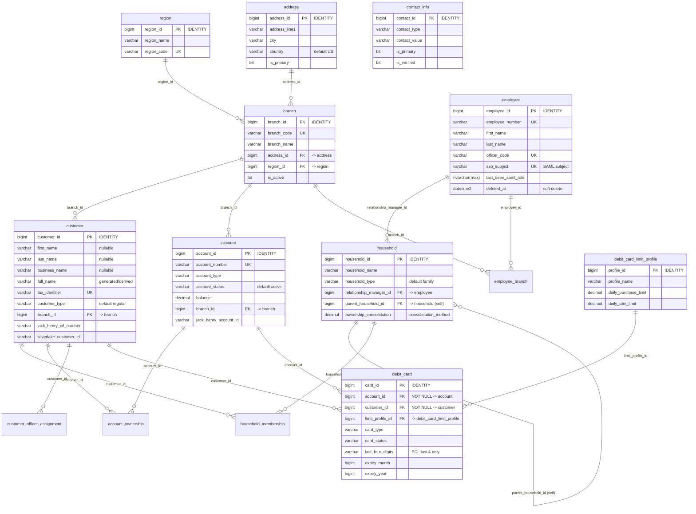
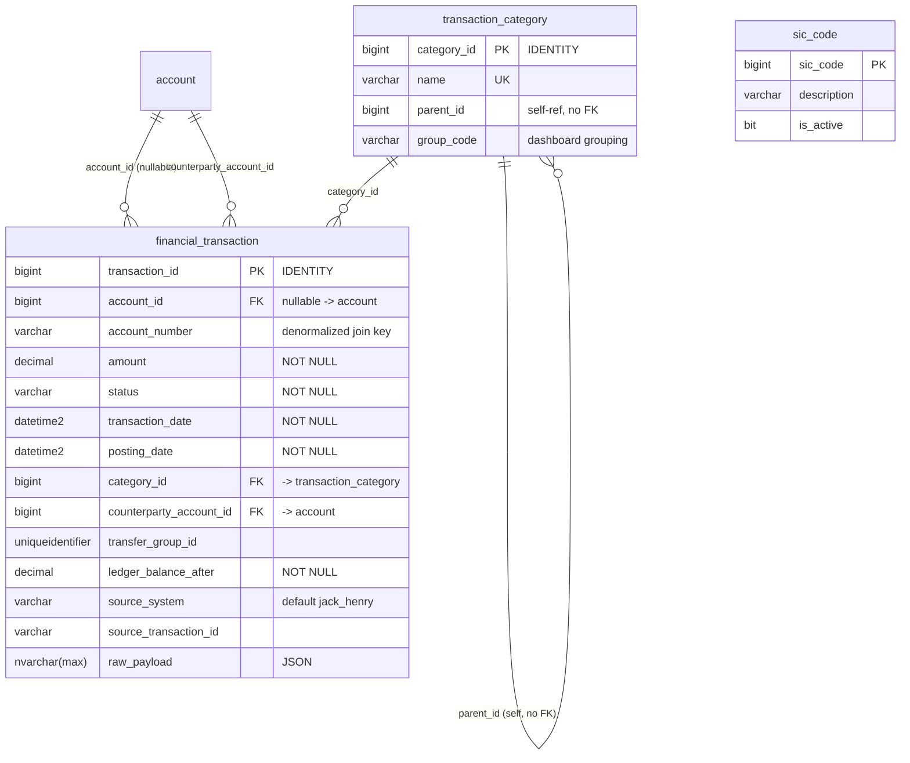
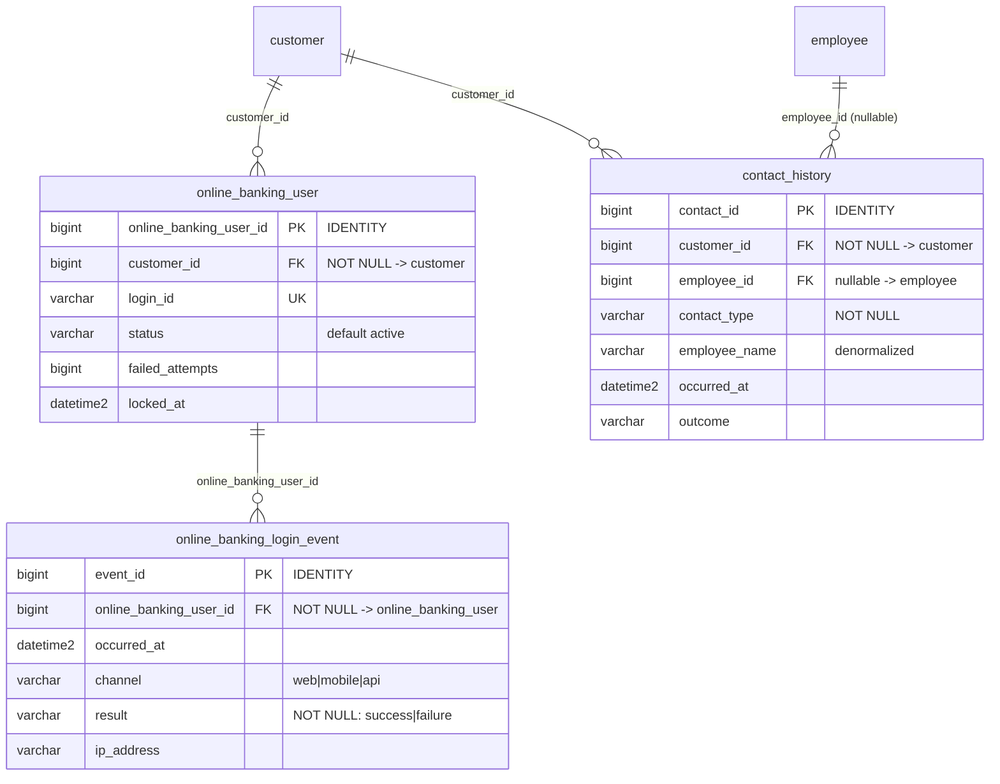
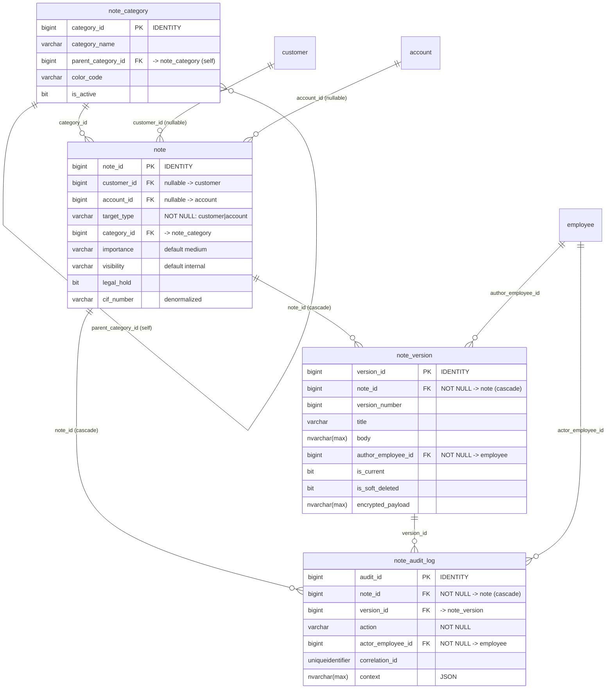
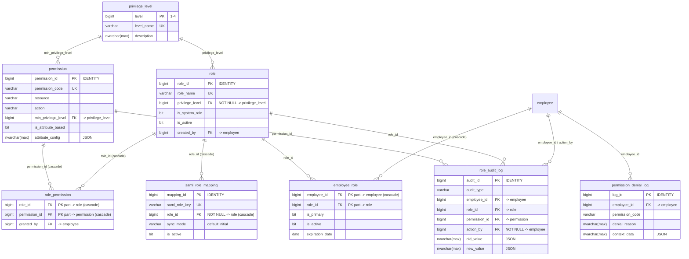
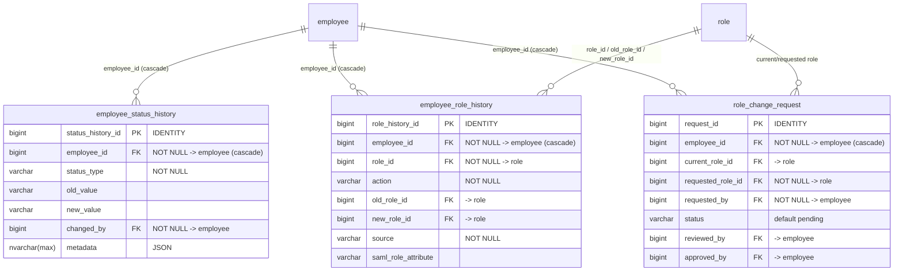
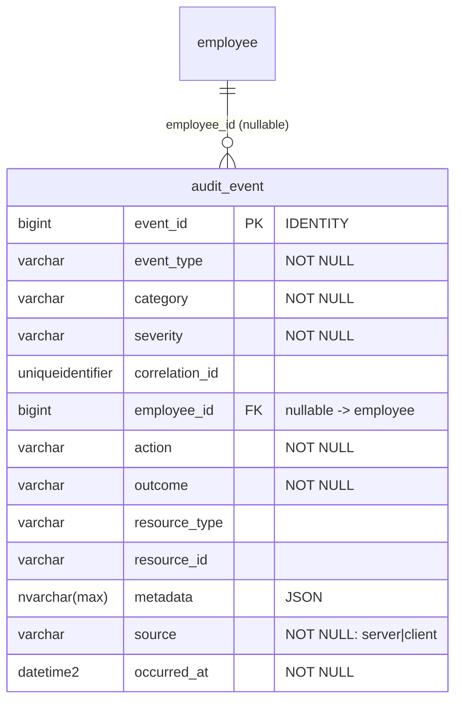

# Database ERD: ClientIQ / Banking Client 360

*Last reviewed: 2026-07-01 · Source of truth: application code (ClientIQ / Banking Client 360).*

## Purpose

This document is the entity-relationship reference for the ClientIQ (Banking Client 360) data model. It is regenerated directly from `shared/schema.ts`, which is the single authoritative definition of the schema. It covers all **40 tables**, grouped by domain, with the foreign keys, cardinalities, and constraints that actually exist in the code, nothing aspirational.

### Database engine

**Microsoft SQL Server 2019+ is the only production database engine, in every environment.**

The schema in `shared/schema.ts` is authored using Drizzle's `*-core` table builder for TypeScript type generation only. Those table objects and `drizzle.config.ts` are a type/tooling abstraction; they are **not** a runtime target and are never applied to production. Production DDL is managed by standalone idempotent SQL Server scripts (see [Change Management](#change-management)). The production database uses the `dbo` schema.

Column names in this document use the physical (snake_case) names as they exist in SQL Server; the TypeScript property names in `shared/schema.ts` are camelCase equivalents.

---

## Table inventory (40 tables)

| Domain | Tables | Count |
| --- | --- | --- |
| Core Banking | `region`, `branch`, `employee`, `address`, `contact_info`, `customer`, `household`, `account`, `debit_card_limit_profile`, `debit_card` | 10 |
| Relationship / Junction | `entity_address`, `entity_contact`, `household_membership`, `account_ownership`, `employee_branch`, `customer_officer_assignment`, `customer_sic_code`, `account_sic_code` | 8 |
| Reference / Lookup | `sic_code`, `transaction_category` | 2 |
| Financial Transactions | `financial_transaction` | 1 |
| Dashboard / Activity | `online_banking_user`, `online_banking_login_event`, `contact_history` | 3 |
| Notes | `note_category`, `note`, `note_version`, `note_audit_log` | 4 |
| RBAC / Roles | `privilege_level`, `role`, `permission`, `role_permission`, `employee_role`, `saml_role_mapping`, `role_audit_log`, `permission_denial_log` | 8 |
| User Management | `employee_status_history`, `employee_role_history`, `role_change_request` | 3 |
| Audit | `audit_event` | 1 |
| **Total** | | **40** |

Primary keys are `bigint IDENTITY` columns unless noted. Because these are 64-bit integers, they are returned to the Node/Express layer as **JavaScript strings**; coerce with `Number()` / `z.coerce.number()` at every boundary.

---

## Core Banking domain



Per-table notes:

- **`region`** (`schema.ts:24`): Geographic region lookup. `region_code` is unique.
- **`branch`** (`schema.ts:32`): Physical branches. FKs: `address_id → address`, `region_id → region`.
- **`employee`** (`schema.ts:45`): Bank staff and system users. Carries the SAML SSO fields `sso_subject` (unique), `email`, and `last_seen_saml_role` (the raw claim last observed at login). Soft-deleted via `deleted_at`. `modified_by` is a plain `bigint` (no FK constraint in the schema).
- **`address`** (`schema.ts:68`): Standalone address records; linked to entities polymorphically through `entity_address`.
- **`contact_info`** (`schema.ts:84`): Standalone contact records (phone/email/etc.); linked polymorphically through `entity_contact`.
- **`customer`** (`schema.ts:100`): Individuals and businesses in one table. Individual name fields and `business_name` are all nullable; the applicable set is enforced by the Zod `insertCustomerSchema` discriminated union on `customer_type` (`schema.ts:907`), **not** by a DB check constraint. Only FK is `branch_id → branch`. `full_name` is a derived column (see [Derived columns](#derived-and-denormalized-columns)).
- **`household`** (`schema.ts:165`): Supports B2B hierarchies via self-referencing `parent_household_id`. FK `relationship_manager_id → employee`.
- **`account`** (`schema.ts:188`): Deposit/loan accounts. `account_number` is unique. **Its only FK is `branch_id → branch`.** There is no `sic_code` column or FK on `account`; account↔SIC classification is modeled via the `account_sic_code` junction (see below).
- **`debit_card_limit_profile`** (`schema.ts:453`): Reusable card-limit templates.
- **`debit_card`** (`schema.ts:466`): Read-only card display from core banking; stores only `last_four_digits`, `card_brand`, and token references (PCI-DSS). FKs: `account_id → account` (**NOT NULL**), `customer_id → customer` (**NOT NULL**, ties the card to a valid account owner), and `limit_profile_id → debit_card_limit_profile` (nullable). Card account-type and owner-validation rules are enforced by SQL Server triggers whose DDL is external to `shared/schema.ts`.

> **[CONFIRM]** Location and current text of the SQL Server trigger(s) that enforce the debit-card business rules (`account_type IN ('checking','business_checking')` and cardholder-is-account-owner). The rules are documented in a code comment (`schema.ts:431-450`) but the trigger DDL is not present in `shared/schema.ts` or the reviewed `scripts/` files.

---

## Relationship / junction domain

```mermaid
erDiagram
    address ||--o{ entity_address : "address_id"
    contact_info ||--o{ entity_contact : "contact_id"
    customer ||--o{ customer_sic_code : "customer_id"
    sic_code ||--o{ customer_sic_code : "sic_code"
    account ||--o{ account_sic_code : "account_id"
    sic_code ||--o{ account_sic_code : "sic_code"

    entity_address {
        bigint entity_address_id PK "IDENTITY"
        varchar entity_type "customer|account|... (polymorphic)"
        bigint entity_id "no FK (polymorphic)"
        bigint address_id FK "NOT NULL -> address"
        varchar address_purpose "default primary"
        bit is_current
        date start_date
        date end_date
    }
    entity_contact {
        bigint entity_contact_id PK "IDENTITY"
        varchar entity_type "polymorphic"
        bigint entity_id "no FK (polymorphic)"
        bigint contact_id FK "NOT NULL -> contact_info"
        varchar contact_purpose "default primary"
        bit is_current
        varchar contact_type_cached "denormalized cache"
    }
    household_membership {
        bigint membership_id PK "IDENTITY"
        bigint household_id FK "NOT NULL -> household"
        bigint customer_id FK "NOT NULL -> customer"
        varchar relationship_role
        decimal ownership_percentage "NOT NULL"
        varchar control_type
    }
    account_ownership {
        bigint ownership_id PK "IDENTITY"
        bigint account_id FK "NOT NULL -> account"
        bigint customer_id FK "NOT NULL -> customer"
        varchar ownership_type
        decimal ownership_percentage
        bit is_primary_owner
    }
    employee_branch {
        bigint employee_branch_id PK "IDENTITY"
        bigint employee_id FK "NOT NULL -> employee"
        bigint branch_id FK "NOT NULL -> branch"
        bit is_primary
    }
    customer_officer_assignment {
        bigint customer_id FK "NOT NULL -> customer"
        varchar officer_code "PK part"
        varchar relationship_type
    }
    customer_sic_code {
        bigint customer_id FK "NOT NULL -> customer"
        bigint sic_code FK "NOT NULL -> sic_code"
    }
    account_sic_code {
        bigint account_sic_code_id PK "IDENTITY"
        bigint account_id FK "NOT NULL -> account"
        bigint sic_code FK "NOT NULL -> sic_code"
        date effective_date
        date end_date
    }
```



Per-table notes:

- **`entity_address`** (`schema.ts:222`): Polymorphic M:N between any entity and `address`. `entity_id` deliberately has **no FK** (polymorphic, discriminated by `entity_type`). `address_purpose` defaults to `primary`; effective range via `start_date` / `end_date`.
- **`entity_contact`** (`schema.ts:235`): Polymorphic M:N between any entity and `contact_info`. `entity_id` has no FK by design. Carries a denormalized `contact_type_cached` column (`schema.ts:246`).
- **`household_membership`** (`schema.ts:249`): M:N customer↔household with role, `ownership_percentage` (NOT NULL) and `control_type` for B2B modeling.
- **`account_ownership`** (`schema.ts:271`): M:N account↔customer with ownership type, percentage, and signing/transaction authority flags.
- **`employee_branch`** (`schema.ts:288`): M:N employee↔branch. Unique key `unq_employee_branch (employee_id, branch_id)`.
- **`customer_officer_assignment`** (`schema.ts:306`): Composite unique key `pk_customer_officer (customer_id, officer_code)`. Links customers to servicing officers by `officer_code` string (note: `officer_code` is not a declared FK to `employee.officer_code`, though `employee.officer_code` is unique).
- **`customer_sic_code`** (`schema.ts:335`): M:N customer↔SIC. Composite unique key `pk_customer_sic (customer_id, sic_code)`.
- **`account_sic_code`** (`schema.ts:348`): M:N account↔SIC with effective dating. Unique key `unq_account_sic (account_id, sic_code)`. This is how accounts are classified by industry; there is no `sic_code` FK on `account` itself.

---

## Reference / lookup and Financial Transactions domain



Per-table notes:

- **`sic_code`** (`schema.ts:324`): Standard Industrial Classification lookup. The `sic_code` numeric value is itself the primary key.
- **`transaction_category`** (`schema.ts:370`): Category lookup. `name` is unique. `parent_id` is a self-reference but declared **without** a FK constraint. `group_code` drives dashboard activity grouping (e.g. `direct_deposit`, `atm`, `billpay`, `zelle`, `wire`, `ach`).
- **`financial_transaction`** (`schema.ts:380`): Ledger of transactions. Its foreign keys are exactly: `account_id → account` (**nullable**), `category_id → transaction_category`, and `counterparty_account_id → account`. `related_transaction_id` is a plain `bigint` with no FK.
  - **There is no `debit_card_id` column or FK on this table**, and no `debit_card → financial_transaction` relationship exists in the schema. (A stale code comment at `schema.ts:448` claims such a linkage; the table definition contradicts it.)
  - `account_id` is nullable because the ETL no longer guarantees it (`schema.ts:382-384`). The denormalized `account_number` (`varchar(50)`, `schema.ts:404`) is the current join/filter source of truth for Operations queries.
  - Deduplication unique key: `unq_account_source_txn (account_id, source_system, source_transaction_id)` (`schema.ts:424`).

> **[CONFIRM]** A card↔transaction linkage does **not** exist in the current schema. If the business requires attributing transactions to a specific `debit_card`, treat it as a known data-model gap to be scoped, not as existing behavior.

---

## Dashboard / activity domain



Per-table notes:

- **`online_banking_user`** (`schema.ts:495`): Online-banking credential/status per customer. `login_id` is unique; tracks `failed_attempts` and `locked_at`.
- **`online_banking_login_event`** (`schema.ts:512`): Login event log. `result` is NOT NULL (`success`/`failure`); indexed by `idx_login_event_result (result, occurred_at)`.
- **`contact_history`** (`schema.ts:527`): Recent customer interactions for the dashboard. `customer_id` is NOT NULL; `employee_id` is a **nullable** FK. Carries a denormalized `employee_name` column (`schema.ts:533`).

---

## Notes domain



Per-table notes:

- **`note_category`** (`schema.ts:559`): Hierarchical categories via self-referencing `parent_category_id`.
- **`note`** (`schema.ts:575`): Immutable note identity and target. Both `customer_id` and `account_id` are nullable FKs; a table **CHECK constraint `check_note_one_target`** (`schema.ts:598-601`) enforces that exactly one of them is set. `legal_hold` prevents deletion; `cif_number` is denormalized for Operations queries.
- **`note_version`** (`schema.ts:605`): Versioned content with soft deletes. FK `note_id → note` with `ON DELETE CASCADE`; `author_employee_id → employee` (NOT NULL); `deleted_by_employee_id → employee`. Unique constraint `uq_note_current_version (note_id, is_current)` with `NULLS NOT DISTINCT` enforces one current version per note. `encrypted_payload` holds confidential note bodies.
- **`note_audit_log`** (`schema.ts:630`): All note operations (`create`, `update`, `delete`, `restore`, `view`). FKs `note_id → note` (cascade), `version_id → note_version`, `actor_employee_id → employee` (NOT NULL).

---

## RBAC / roles domain



Per-table notes:

- **`privilege_level`** (`schema.ts:654`): Levels 1 to 4; `level` is the PK, `level_name` is unique.
- **`role`** (`schema.ts:662`): Named roles. `role_name` unique; `privilege_level → privilege_level` (NOT NULL); `created_by → employee`.
- **`permission`** (`schema.ts:678`): Resource/action permissions. `permission_code` unique; unique key `uq_permission_resource_action (resource, action)`. Supports attribute-based access via `is_attribute_based` + `attribute_config` (`nvarchar(max)` JSON). `min_privilege_level → privilege_level`.
- **`role_permission`** (`schema.ts:697`): M:N role↔permission. Composite PK `(role_id, permission_id)`; both FKs cascade on delete. `granted_by → employee`.
- **`employee_role`** (`schema.ts:709`): M:N employee↔role. Composite PK `(employee_id, role_id)`; `employee_id → employee` cascades; `assigned_by → employee`. Supports effective/expiration dating and `is_primary`.
- **`saml_role_mapping`** (`schema.ts:728`): Maps a SAML role key to a `role`. `saml_role_key` unique; `role_id → role` cascades; `sync_mode` defaults to `initial`. (Note: this is the persisted SSO→role mapping table; AD-group-name-convention resolution is additionally handled in application code, scoped by `SAML_ROLE_ENV`.)
- **`role_audit_log`** (`schema.ts:744`): Compliance log of role/permission changes. `action_by → employee` is NOT NULL; `employee_id`, `role_id`, `permission_id` are nullable FKs.
- **`permission_denial_log`** (`schema.ts:765`): Records denied authorization attempts; `employee_id → employee` (nullable).

---

## User Management domain



Per-table notes:

- **`employee_status_history`** (`schema.ts:785`): Audit trail of employee status changes. `employee_id → employee` cascades; `changed_by → employee` (NOT NULL).
- **`employee_role_history`** (`schema.ts:802`): Audit trail of role assignments. `employee_id → employee` cascades; `role_id`, `old_role_id`, `new_role_id` all reference `role`; `assigned_by → employee`. `source` (NOT NULL) records the origin (e.g. manual vs SAML); `saml_role_attribute` captures the raw claim when applicable.
- **`role_change_request`** (`schema.ts:825`): Approval workflow for role changes. `employee_id → employee` cascades; `current_role_id`/`requested_role_id → role` (requested is NOT NULL); `requested_by`, `reviewed_by`, `approved_by` all reference `employee`. `status` defaults to `pending`.

---

## Audit domain



Per-table notes:

- **`audit_event`** (`schema.ts:854`): Cross-cutting application audit log for security/compliance events. Only FK is `employee_id → employee` (nullable, since some events have no authenticated actor). `source` is either `server` or `client`. Heavily indexed for reporting (see below).

---

## Derived and denormalized columns

The model uses several derived/denormalized columns to support search and dashboard read paths:

| Table.column | Nature | Notes |
| --- | --- | --- |
| `customer.full_name` | Generated / derived | Omitted from inserts by the Zod `insertCustomerSchema` as a "Generated column, not manually inserted" (`schema.ts:114,902`). Used as the unified search target. |
| `financial_transaction.account_number` | Denormalized from `account` | Current join/filter source of truth for Operations (`schema.ts:404`). |
| `entity_contact.contact_type_cached` | Denormalized cache | Cache of the linked `contact_info.contact_type` (`schema.ts:246`). |
| `contact_history.employee_name` | Denormalized | For display without a join (`schema.ts:533`). |
| `note.cif_number` | Denormalized Jack Henry CIF | For Operations queries (`schema.ts:586`). |
| `note_version.author_employee_name` | Denormalized | Author display name (`schema.ts:612`). |
| `note_audit_log.actor_employee_name` | Denormalized | Actor display name (`schema.ts:636`). |

> **[CONFIRM]** The exact SQL Server mechanism that maintains `customer.full_name` (persisted computed column vs. trigger vs. application-populated). `shared/schema.ts` only marks it as a derived column; the production DDL for this column was not located in the reviewed files.

---

## Explicit constraints

The only explicit CHECK constraint declared in `shared/schema.ts`:

| Constraint | Table | Rule | Location |
| --- | --- | --- | --- |
| `check_note_one_target` | `note` | Exactly one of `customer_id` / `account_id` is non-null | `schema.ts:598-601` |

Other business rules commonly assumed to be DB constraints are actually enforced elsewhere:

| Rule | Enforced by | Location |
| --- | --- | --- |
| Individual-vs-business required name fields | Zod discriminated union on `customer_type` | `insertCustomerSchema`, `schema.ts:907-929` |
| Debit-card expiry month 1-12, year ≥ current year | Zod validation | `insertDebitCardSchema`, `schema.ts:1117-1124` |
| Debit-card allowed account type; cardholder is a valid account owner | SQL Server trigger(s) | External DDL (see the [CONFIRM] under Core Banking) |

Notable UNIQUE constraints (from `shared/schema.ts`): `region.region_code`, `branch.branch_code`, `employee.employee_number`, `employee.officer_code`, `employee.sso_subject`, `customer.tax_identifier`, `account.account_number`, `transaction_category.name`, `online_banking_user.login_id`, `role.role_name`, `permission.permission_code`, `saml_role_mapping.saml_role_key`, plus the composite keys `unq_employee_branch`, `pk_customer_officer`, `pk_customer_sic`, `unq_account_sic`, `uq_permission_resource_action`, `unq_account_source_txn`, and `uq_note_current_version` (nulls-not-distinct).

---

## Index strategy

All production indexes are B-tree nonclustered indexes on SQL Server. Representative indexes declared in `shared/schema.ts` and in the production performance script (`scripts/create_performance_indexes.sql`):

| Purpose | Index | Columns | Source |
| --- | --- | --- | --- |
| Customer name lookup | `IX_customer_name` | `(last_name, first_name)` | `scripts/create_performance_indexes.sql:52-53` |
| Customer by CIF | `IX_customer_cif` | `jack_henry_cif_number` | `scripts/create_performance_indexes.sql:46-47` |
| Customer full-name search target | `idx_customer_full_name` | `full_name` | `schema.ts:157` |
| Account by type + status | `IX_account_type_status` | `(account_type, account_status)` | `scripts/create_performance_indexes.sql:36-37` |
| Account ownership by customer | `IX_account_ownership_customer` | `customer_id` | `scripts/create_performance_indexes.sql:26-27` |
| Transaction primary query | `idx_transaction_account_posting` | `(account_id, posting_date, transaction_id)` | `schema.ts:409` |
| Transaction by account_number (Operations) | `idx_transaction_account_number` | `account_number` | `schema.ts:422` |
| Transaction dedup | `unq_account_source_txn` (unique) | `(account_id, source_system, source_transaction_id)` | `schema.ts:424` |
| Audit event reporting | `idx_audit_event_occurred_at`, `idx_audit_event_employee_occurred`, etc. | various | `schema.ts:880-887` |

There is no index on `debit_card_id` in `financial_transaction`; that column does not exist.

### Customer search

Customer/household search runs through `server/adapters/search/SqlServerSearchProvider.ts`, which is the production path:

- **Exact / substring matches** (name, government ID, Silverlake ID, Jack Henry CIF) use a case-insensitive `LIKE` substring match with an explicit `COLLATE SQL_Latin1_General_CP1_CI_AS` (`SqlServerSearchProvider.ts:224,274,306,338`). This is **not** full-text/`CONTAINS()`, and not phonetic.
- **Fuzzy name matching** uses `STRING_SIMILARITY(full_name, @query)` on SQL Server 2022+ (version 16+), falling back to `SOUNDEX`/`DIFFERENCE` on SQL Server 2019 and earlier (`SqlServerSearchProvider.ts:114-129,157,194`). The provider detects the engine version at runtime and chooses the strategy accordingly.

There is no full-text catalog and no fuzzy-search index maintained in the production database; fuzzy matching is computed at query time over `full_name`.

---

## Change management

There is no numbered Drizzle migration workflow in production. The repo contains **no** `migrations/` or `drizzle/` directory and no ordered migration files. Production SQL Server schema is applied via standalone **idempotent** SQL scripts, for example:

- `scripts/create_audit_event_table.sql`
- `scripts/create_sessions_table.sql`
- `scripts/create_performance_indexes.sql`
- `scripts/ensure_rbac_provenance_columns.sql`
- `scripts/widen_employee_last_seen_saml_role.sql`
- additional DDL under `Insert Queries/Schema Changes/*.sql` (e.g. `financial_transaction_add_account_number.sql`)

These scripts guard every object with existence checks (`IF NOT EXISTS ...`) so they can be re-run safely across the four environments (dev, test, preprod, prod).

> **[CONFIRM]** The authoritative ordering/runbook for applying the `scripts/` and `Insert Queries/Schema Changes/` DDL to a fresh SQL Server database, and which scripts are baseline vs. incremental.

---

## Performance monitoring

Recommended SQL Server monitoring for the largest tables (`financial_transaction`, `audit_event`, `note_audit_log`, `contact_history`):

```sql
-- Index fragmentation / physical stats (run in the ClientIQ database)
SELECT
    OBJECT_NAME(ips.object_id)      AS table_name,
    i.name                          AS index_name,
    ips.avg_fragmentation_in_percent,
    ips.page_count
FROM sys.dm_db_index_physical_stats(DB_ID(), NULL, NULL, NULL, 'LIMITED') ips
JOIN sys.indexes i
    ON ips.object_id = i.object_id AND ips.index_id = i.index_id
WHERE ips.page_count > 1000
ORDER BY ips.avg_fragmentation_in_percent DESC;
```

```sql
-- Row counts / space by table
SELECT
    t.name                          AS table_name,
    SUM(p.rows)                     AS row_count,
    SUM(a.total_pages) * 8 / 1024   AS total_mb
FROM sys.tables t
JOIN sys.partitions p  ON t.object_id = p.object_id AND p.index_id IN (0, 1)
JOIN sys.allocation_units a ON p.partition_id = a.container_id
GROUP BY t.name
ORDER BY total_mb DESC;
```

---

## Growth projections

> **[CONFIRM]** Expected row-count and growth-rate projections per table (e.g. for `customer`, `financial_transaction`, `contact_history`, `audit_event`). These are capacity-planning inputs that are not derivable from code and must be supplied and dated by the data/operations owner. Treat any prior figures as illustrative only until confirmed.

---

## Summary statistics

Metrics recomputed against the current `shared/schema.ts` (40-table schema):

| Metric | Value | Basis |
| --- | --- | --- |
| Total tables | 40 | Count of table definitions in `shared/schema.ts` |
| Junction / association tables | 8 | `entity_address`, `entity_contact`, `household_membership`, `account_ownership`, `employee_branch`, `customer_officer_assignment`, `customer_sic_code`, `account_sic_code` |
| Reference / lookup tables | 2 | `sic_code`, `transaction_category` |
| Explicit CHECK constraints | 1 | `check_note_one_target` (`note`) |
| Self-referencing tables | 3 | `household` (FK), `note_category` (FK), `transaction_category` (no FK) |
| Polymorphic (no-FK) links | 2 | `entity_address.entity_id`, `entity_contact.entity_id` |
| Database engine | SQL Server 2019+ | Production, all environments |

> **[CONFIRM]** Documentation version. `package.json` reports application version `1.0.0`; a separate doc-version has not been established for this ERD.
