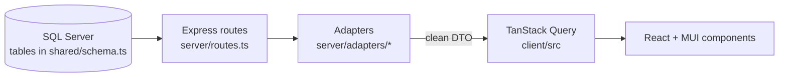

# Database-to-UI Field Mapping

*Last reviewed: 2026-07-01. Source of truth: application code (ClientIQ / Banking Client 360).*

## Purpose

This guide maps Microsoft SQL Server columns (defined in `shared/schema.ts`) to the React + MUI
UI components, API endpoints, adapter transformations, calculated fields, and formatting helpers
that display them in the ClientIQ banking customer-360 application.

It is scoped to the components that are actually wired into live routes (`client/src`). Alternate,
example, or commented-out components are explicitly marked as **inactive** so readers do not chase
fields to a screen no user ever sees. Column names use the SQL Server table/column names from
`shared/schema.ts`; server-side masking and shaping happen in the adapters under `server/adapters/`.

### Data-flow model



Adapters are the boundary where sensitive fields are masked (for example, `taxIdentifier` becomes
the DTO field `ssn` masked to `XXX-XX-1234` in `server/adapters/customerAdapter.ts:17-19`). Some
components apply an *additional* display mask client-side.

### Active vs. inactive components (read this first)

Several components referenced by earlier revisions of this guide are present in the repo but **not
wired into any live route**. Fields must not be attributed to them:

| Component | Status | Live replacement |
|---|---|---|
| `AccountCard.tsx` | Inactive: only imported by `AccountSummary.tsx`, which is itself off-route | `AccountList.tsx`, `AccountSummaryTableVersion.tsx`, `AccountDetailOption2.tsx` |
| `TotalRelationshipSummary.tsx` | Inactive: render commented out (`CustomerDashboard.tsx:849-855`) | `Middle.tsx` (Client-tab KPI band) |
| `HouseholdRelationships.tsx` | Inactive: only in the unreachable household branch (`CustomerDashboard.tsx:793`) | `pages/HouseholdPage.tsx` |
| `NotesTab.tsx` | Inactive: no active importers | `NotesSection.tsx` |
| `RiskCompliance.tsx` | Inactive: not on a live route | (risk/KYC fields not currently surfaced) |

Reference: frontend facts sheet §7 and `client/src/App.tsx:166-180` (route table).

---

## Table of Contents

1. [Customer Data Mappings](#1-customer-data-mappings)
2. [Account Data Mappings](#2-account-data-mappings)
3. [Transaction Data Mappings](#3-transaction-data-mappings)
4. [Household Data Mappings](#4-household-data-mappings)
5. [Contact & Address Mappings](#5-contact--address-mappings)
6. [Officer Data Mappings](#6-officer-data-mappings)
7. [Notes Data Mappings](#7-notes-data-mappings)
8. [Calculated / Derived Fields](#8-calculated--derived-fields)
9. [Formatting Functions Reference](#9-formatting-functions-reference)
10. [API Endpoints Summary](#10-api-endpoints-summary)

---

## 1. Customer Data Mappings

- **Table:** `customer` (`shared/schema.ts:100-163`)
- **API endpoint:** `GET /api/customers/:id/details` (`server/routes.ts:335`)
- **Active components:** `CustomerOverview.tsx`, `CustomerDetailModal.tsx` (opened from `CustomerOverview.tsx:317-321`, fetches `/api/customers/:id/details` at `CustomerDetailModal.tsx:89`), and `CustomerSearch.tsx` for search results.

### 1.1 Direct field mappings

| DB column | Component | Display element | Transformation |
|---|---|---|---|
| `firstName` | CustomerOverview | Name heading | Combined with `lastName` |
| `lastName` | CustomerOverview | Name heading | Combined with `firstName` |
| `fullName` | CustomerSearch | Search result item | Direct display |
| `preferredName` | CustomerOverview | Name (if present) | Direct display |
| `customerType` | CustomerOverview | Type chip | Label mapping |
| `customerStatus` | CustomerOverview | Status chip | Color mapping (active = green) |
| `taxIdentifier` | CustomerOverview | Tax ID field | Masked to `***-**-1234` (see §1.3) |
| `jackHenryCifNumber` | CustomerOverview | CIF number | Direct display |
| `silverlakeCustomerId` | CustomerOverview | Silverlake ID | Direct display |
| `customerSince` | CustomerOverview | "Customer Since" | Date formatted |
| `dateOfBirth` | CustomerDetailModal | Date of Birth | Date formatted + age calculated (`calculateAge()`) |
| `vipCustomer` | CustomerOverview | VIP chip | Boolean → chip |
| `isEmployee` | CustomerOverview | Employee chip | Boolean → chip |
| `occupation` | CustomerDetailModal | Occupation field | Direct display |
| `employerName` | CustomerDetailModal | Employer field | Direct display |
| `businessName` | CustomerOverview | Name (business) | Direct display |
| `dbaName` | CustomerDetailModal | DBA field | Direct display |
| `naicsCode` | CustomerDetailModal | NAICS code | Direct display |
| `branchId` → `branchName` | CustomerOverview | Branch indicator | Joined with branch, shown as "Branch: {name}" |
| `governmentId` | CustomerDetailModal | Gov ID | Masked display |
| `governmentIdType` | CustomerDetailModal | ID type label | Direct display |
| `maritalStatus` | CustomerDetailModal | Marital status | Direct display |
| `gender` | CustomerOverview / CustomerDetailModal | Gender | Direct display |
| `citizenship` | CustomerDetailModal | Citizenship | Direct display |
| `languagePreference` | CustomerDetailModal | Language | Direct display |

> **Note:** `riskRating`, `kycStatus`, and `kycLastUpdated` exist on the `customer` table but are
> **not surfaced** in the active Client tab. The component that displayed them (`RiskCompliance.tsx`)
> is not wired into any live route. Do not document these as user-visible.

### 1.2 Calculated fields

| Derived field | Source | Component | Calculation |
|---|---|---|---|
| `age` | `dateOfBirth` | CustomerDetailModal, CustomerDashboard | `calculateAge()` |
| `displayName` | `firstName`, `lastName`, `businessName` | CustomerOverview | Conditional concatenation |
| `isBirthday` | `dateOfBirth` | CustomerOverview | Compare month/day to today |

### 1.3 Tax ID masking

Two masks are applied on the customer-detail path:

- **Server adapter (DTO):** `taxIdentifier` is emitted as the DTO field `ssn`, masked to
  `XXX-XX-1234` (three `X`, two `X`, last 4 real digits) (`server/adapters/customerAdapter.ts:17-19`,
  `:58`). If the value is missing or shorter than 4 characters it renders `XXX-XX-XXXX`.
- **UI overlay:** `CustomerOverview.tsx:271` renders `***-**-<last4>` (three asterisks, two
  asterisks, then the last 4 digits of the value it holds) (`customer.taxId ? \`***-**-${customer.taxId.slice(-4)}\` : 'N/A'`).

Neither format is the legacy `****-**-XXXX` string from older documentation.

---

## 2. Account Data Mappings

- **Table:** `account` (`shared/schema.ts:188-247`)
- **API endpoint:** `GET /api/customers/:id/accounts` (`server/routes.ts:1233`)
- **Active components:**
  - `AccountList.tsx`: the account list on the Client tab and (via its exported `AccountTable`) the household accounts table.
  - `AccountSummaryTableVersion.tsx`: the account portfolio table on the Accounts tab.
  - `AccountDetailOption2.tsx`: the canonical account-detail screen (inline in the dashboard and at route `/account/:accountId`); fetches `/api/accounts/:id`, `/owners`, `/debit-cards`, `/transactions`.

`AccountCard.tsx` is **inactive** (§Active vs. inactive). Fields previously attributed to it are
re-attributed below to the live components.

### 2.1 Direct field mappings

| DB column | Component | Display element | Transformation |
|---|---|---|---|
| `accountNumber` | AccountList / AccountSummaryTableVersion | Account number | Masked `***12345`, last 5 digits (see §2.3) |
| `accountType` | AccountList / AccountSummaryTableVersion | Type badge + icon | Label mapping; icon via `getAccountIcon()` |
| `accountSubtype` | AccountList | Product name | `getProductName()` |
| `accountStatus` | AccountList / AccountSummaryTableVersion | Status chip | Normalized + color chip (`AccountList.tsx:91-120`) |
| `balance` | AccountList / AccountSummaryTableVersion | Balance column | Currency formatted, gated on `account.view.balances` |
| `availableBalance` | AccountDetailOption2 | Available balance | Currency formatted |
| `currency` | AccountDetailOption2 | Currency indicator | Direct display |
| `interestRate` | AccountList / AccountSummaryTableVersion | Rate column | Percentage formatted, gated on `account.view.balances` |
| `creditLimit` | AccountDetailOption2 | Credit limit | Currency formatted |
| `openedDate` | AccountDetailOption2 | Opened date | Date formatted |
| `closedDate` | AccountDetailOption2 | Closed date | Date formatted |
| `maturityDate` | AccountDetailOption2 | Maturity date (CDs) | Date formatted |
| `lastTransactionDate` | AccountDetailOption2 | Last activity | Date formatted |
| `productCode` | AccountDetailOption2 | Product code | Direct display |
| `jackHenryAccountId` | AccountDetailOption2 | JH account ID | Direct display |
| `silverlakeAccountStructure` | AccountDetailOption2 | SL structure | Direct display |
| `accountClass` | AccountDetailOption2 | Account class | Direct display |
| `statementCycle` | AccountDetailOption2 | Statement cycle | Direct display |
| `averageBalance` | AccountDetailOption2 | "Average Balance" | Currency formatted (`AccountDetailOption2.tsx:282`; also in CSV export `:108`) |

> **Note:** `averageBalance` is rendered on the account-detail screen (`AccountDetailOption2.tsx`),
> **not** in `Deposits.tsx`. `Deposits.tsx` does not reference `averageBalance`.

### 2.2 Calculated fields

| Derived field | Source | Component | Calculation |
|---|---|---|---|
| `productName` | `accountSubtype` | AccountList | `getProductName()` (`AccountList.tsx:179`); also defined in `AccountSummaryTableVersion.tsx` |
| `maskedAccountNumber` | `accountNumber` | AccountList | `maskAccountNumber()`, last 5 (`AccountList.tsx:188-190`) |
| `accountTypeLabel` | `accountType` | AccountSummaryTableVersion | Lookup-table mapping |
| `accountIcon` | `accountType` | AccountList | `getAccountIcon()` → MUI icon (`AccountList.tsx:151`) |

### 2.3 Account-number masking

`AccountList.tsx:187-190` masks to the **last 5 digits** behind a 3-asterisk prefix:

```ts
// Mask account number (show last 5 digits)
const maskAccountNumber = (accountNumber: string) => {
  ...
  return '***' + accountNumber.slice(-5);
};
```

So account `1234567890` renders as `***67890`. This is *not* the legacy `****1234` (last-4) format.
`maskAccountNumber()`, `getAccountIcon()`, and `getProductName()` are defined locally in
`AccountList.tsx` (`getProductName()` is also defined in `AccountSummaryTableVersion.tsx`).

### 2.4 Balance-permission gating

Balance and interest columns/totals render **only** when the user holds `account.view.balances`
(`AccountList.tsx:495`, `HouseholdPage.tsx:192`, `AccountDetailOption2.tsx:153`,
`CustomerSearch.tsx:133`). When absent, those columns are hidden and balance-bearing search
identifiers are filtered out.

---

## 3. Transaction Data Mappings

- **Table:** `financial_transaction` (`shared/schema.ts:380-425`)
- **API endpoints:**
  - `GET /api/accounts/:accountId/transactions` (`server/routes.ts:2345`)
  - `GET /api/customers/:customerId/transactions` (`server/routes.ts:2399`)
  - `GET /api/transactions` (`server/routes.ts:2303`)
- **Active component:** `TransactionHistory.tsx` (endpoint selected at `:88-92`, `limit=200`).

### 3.1 Direct field mappings

| DB column | Component | Display element | Transformation |
|---|---|---|---|
| `amount` | TransactionHistory | Amount column | Currency formatted, +/- indicator |
| `transactionCode` | TransactionHistory | Code chip + icon | Direct display; icon/label via `transactionCode` (see §3.3) |
| `transactionType` | TransactionHistory | Type | Label mapping |
| `status` | TransactionHistory | Status chip | Color mapping |
| `transactionDate` | TransactionHistory | Date column | Date formatted (PST) |
| `postingDate` | TransactionHistory | Posting date | Date formatted |
| `description` | TransactionHistory | Description column | Direct display |
| `referenceNumber` | TransactionHistory | Reference | Direct display |
| `merchantName` | TransactionHistory | Merchant | Direct display |
| `merchantCategoryCode` | TransactionHistory | MCC | Direct display |
| `ledgerBalanceAfter` | TransactionHistory | Running balance | Currency formatted |
| `availableBalanceAfter` | TransactionHistory | Available | Currency formatted |

### 3.2 Operational (non-UI) columns

`financial_transaction` carries several current columns that are **not surfaced in the UI**; they
support ETL and Operations queries (`shared/schema.ts:380-425`):

| DB column | Purpose |
|---|---|
| `accountNumber` | Denormalized join key. **Joins/filters now pivot on `account_number`** because `account_id` is nullable (`schema.ts:382-384, 404`). |
| `accountId` | Now **nullable**, no longer guaranteed by the ETL. |
| `counterpartyAccountId` | Counterparty account reference for transfers |
| `transferGroupId` (uniqueidentifier) | Groups the two legs of a transfer |
| `sourceSystem` (default `jack_henry`) | Originating core system |
| `sourceTransactionId` | Source system's transaction identifier |
| `rawPayload` (nvarchar(max), JSON) | Raw ingested payload |

### 3.3 Calculated fields

| Derived field | Source | Component | Calculation |
|---|---|---|---|
| Deposits / Spending / Net (quick-stats) | `amount` | TransactionHistory | Sum aggregation (see §3.4) |
| `transactionIcon` | `transactionCode` | TransactionHistory | `getTransactionIcon(code)` keyed on `transactionCode` (`:106-150`): DD/ATM/BILLPAY/MOBDEP/ZELLE/WIRE/ACH/POS/INT/FEE |
| `formattedAmount` | `amount` | TransactionHistory | `formatCurrency()` with +/- sign |

> **Note:** the transaction icon is derived from `transactionCode`, **not** from
> `transactionType`/`categoryId`.

### 3.4 Aggregation code

The quick-stats bar (labeled **Deposits / Spending / Net**, `TransactionHistory.tsx:240-252`)
is computed by the reduce at `TransactionHistory.tsx:170-178`:

```ts
const totals = filteredTransactions.reduce((acc: any, trans: Transaction) => {
  const amount = parseFloat(trans.amount) || 0;
  if (amount > 0) {
    acc.credits += amount;
  } else {
    acc.debits += Math.abs(amount);
  }
  return acc;
}, { credits: 0, debits: 0 });
```

`credits` surfaces as **Deposits**, `debits` as **Spending**, and `credits - debits` as **Net**.
Note the `|| 0` guard on `parseFloat`.

---

## 4. Household Data Mappings

- **Tables:** `household` (`shared/schema.ts:165-186`), `household_membership` (`shared/schema.ts:249-269`)
- **API endpoints:**
  - `GET /api/households/:id` (`server/routes.ts:1074`)
  - `GET /api/households/:id/members` (`server/routes.ts:1093`)
  - `GET /api/households/:id/accounts` (`server/routes.ts:1116`)
- **Active component:** `pages/HouseholdPage.tsx` (entered via `householdId`, or resolved from `customerId`). Member rows render through a search/sort/paginate members table, and household accounts reuse `AccountList.tsx`'s exported `AccountTable` (`HouseholdPage.tsx:63`).

`HouseholdRelationships.tsx` is **inactive** (§Active vs. inactive). Household and membership
fields are rendered by `HouseholdPage.tsx`.

### 4.1 Household direct field mappings

| DB column | Component | Display element | Transformation |
|---|---|---|---|
| `householdName` | HouseholdPage | Page title | Direct display |
| `householdType` | HouseholdPage | Type badge | Label mapping |
| `totalAssets` | HouseholdPage | Total assets | Currency formatted |
| `totalLiabilities` | HouseholdPage | Total liabilities | Currency formatted |
| `householdStatus` | HouseholdPage | Status chip | Color mapping |
| `riskRating` | HouseholdPage | Risk indicator | Color mapping |
| `establishedDate` | HouseholdPage | Established date | Date formatted |
| `taxFilingStatus` | HouseholdPage | Tax status | Direct display |
| `parentHouseholdId` | HouseholdPage | Parent link | Navigation link (parent drill-through) |
| `consolidationMethod` | HouseholdPage | Consolidation | Direct display |

### 4.2 Membership field mappings

| DB column | Component | Display element | Transformation |
|---|---|---|---|
| `relationshipRole` | HouseholdPage (members table) | Role label | Direct display, defaulting to "Primary Member"/"Member" when blank (`HouseholdPage.tsx:229-230`) |
| `isPrimaryMember` | HouseholdPage (members table) | Primary indicator | Boolean; also drives sort order (`:241`) |
| `isHeadOfHousehold` | HouseholdPage (members table) | Head indicator | Boolean → badge |
| `membershipStartDate` | HouseholdPage (members table) | Member since | Date formatted |
| `ownershipPercentage` | HouseholdPage (members table) | Ownership % | Percentage; sortable (`:272`) |
| `controlType` | HouseholdPage (members table) | Control type | Label mapping |

### 4.3 Calculated fields

| Derived field | Source | Component | Calculation |
|---|---|---|---|
| `netWorth` | `totalAssets`, `totalLiabilities` | HouseholdPage | assets − liabilities |
| `memberCount` | membership records | HouseholdPage | Count of active members |
| `totalHouseholdBalance` | member accounts | HouseholdPage | Sum of member account balances |

---

## 5. Contact & Address Mappings

- **Tables:** `contactInfo`, `address`, `entityContact`, `entityAddress`
- **API endpoint:** `GET /api/customers/:id/contacts` (`server/routes.ts:572`)
- **Active component:** `ContactInformation.tsx` (Client tab)

### 5.1 Contact info fields

| DB column | Component | Display element | Transformation |
|---|---|---|---|
| `contactType` | ContactInformation | Type icon | Icon mapping |
| `contactValue` | ContactInformation | Contact display | Formatted by type (phone mask, email `mailto:` link) |
| `contactSubtype` | ContactInformation | Subtype label | Direct display |
| `isPrimary` | ContactInformation | Primary indicator | Boolean → star icon |
| `isVerified` | ContactInformation | Verified icon | Boolean → checkmark |
| `canContact` | ContactInformation | Contact preference | Boolean indicator |

### 5.2 Address fields

| DB column | Component | Display element | Transformation |
|---|---|---|---|
| `addressLine1` | ContactInformation | Address line 1 | Direct display |
| `addressLine2` | ContactInformation | Address line 2 | Direct display |
| `city` | ContactInformation | City | Direct display |
| `state` | ContactInformation | State | Direct display |
| `postalCode` | ContactInformation | ZIP | Direct display |
| `country` | ContactInformation | Country | Direct display |
| `addressType` | ContactInformation | Type label | Label mapping |
| `isPrimary` | ContactInformation | Primary indicator | Boolean → badge |
| `validated` | ContactInformation | Validated icon | Boolean → checkmark |

### 5.3 Calculated fields

| Derived field | Source | Component | Calculation |
|---|---|---|---|
| `fullAddress` | all address fields | ContactInformation | Concatenation with formatting |
| `formattedPhone` | `contactValue` (phone) | ContactInformation | `(XXX) XXX-XXXX` format |

---

## 6. Officer Data Mappings

- **Tables:** `employee`, `customerOfficerAssignment`
- **API endpoint:** `GET /api/customers/:id/officers` (`server/routes.ts:732`)
- **Active component:** `Officers.tsx`

The active `Officers.tsx` card receives and renders only `{ name, title, department, isPrimary }`
(`Officers.tsx:16-22`). It shows the officer name with initials avatar, a title caption, a
department chip, and a "Primary" chip. It does **not** render `position`, `officerCode`, `email`,
`phone`, or a `relationshipType` label.

### 6.1 Rendered fields

| DTO field | Component | Display element | Transformation |
|---|---|---|---|
| `name` | Officers | Officer name + initials avatar | Composed server-side from first/last name |
| `title` | Officers | Title caption | Direct display (shown only when present) |
| `department` | Officers | Department chip | Color mapping (`getDepartmentColor()`) |
| `isPrimary` | Officers | "Primary" chip + avatar accent | Derived server-side (see §6.2) |

### 6.2 `isPrimary` derivation

`isPrimary` is not a raw column; the officer adapter derives it from the assignment's
`relationshipType`: `const isPrimary = dbOfficer.relationshipType === 'primary';`
(`server/adapters/officerAdapter.ts:44-45`). The adapter also sorts primary officers first
(`:78-82`).

> **Note:** `position`, `officerCode`, `email`, and `phone` may exist upstream but are **not
> surfaced** by the current Officers card.

---

## 7. Notes Data Mappings

- **Tables:** `note` (`shared/schema.ts:575`), `noteVersion` (`shared/schema.ts:605`), `noteCategory`
- **API endpoints:**
  - `GET /api/customers/:id/notes` (`server/routes.ts:2524`)
  - `GET /api/accounts/:id/notes` (account-scoped; `NotesSection` picks the path by `targetType`)
  - `GET /api/notes/:id/versions` (`server/routes.ts:2729`)
- **Active components:** `NotesSection.tsx` (+ `NoteEditorModal.tsx`, `NoteVersionHistoryModal.tsx`).

`NotesTab.tsx` is **inactive** (§Active vs. inactive) and must not be listed as a notes component.

### 7.1 Direct field mappings

| DB column | Component | Display element | Transformation |
|---|---|---|---|
| `title` | NotesSection | Note title | Direct display |
| `body` | NotesSection | Note content | Rich-text render |
| `categoryId` | NotesSection | Category badge | Joined with `noteCategory` |
| `importance` | NotesSection | Importance indicator | Color mapping |
| `isPinned` | NotesSection | Pin icon | Boolean → icon |
| `isDeleted` | NotesSection | Deleted state | Conditional styling |
| `createdAt` | NotesSection | Created date | Date formatted |
| `authorEmployeeName` | NotesSection | Author name | See §7.2 |
| `updatedAt` | NotesSection | Modified date | Date formatted |
| `versionNumber` | NoteVersionHistoryModal | Version number | Direct display (reads `/api/notes/:id/versions`, `NoteVersionHistoryModal.tsx:63`) |

### 7.2 Author name

The author column is `author_employee_name` → field `authorEmployeeName` on the **`note_version`**
table (denormalized for display, `shared/schema.ts:612`). `NotesSection` reads the current
version's `authorEmployeeName` with fallbacks to `note.lastModifiedByName` then `note.createdByName`
(`NotesSection.tsx:454`, `:652-653`). There is no `createdByEmployeeName` column.

### 7.3 Calculated fields

| Derived field | Source | Component | Calculation |
|---|---|---|---|
| `truncatedBody` | `body` | NotesSection | `truncateText()` preview |
| `relativeTime` | `createdAt` | NotesSection | `getRelativeTime()` → "2 days ago" |

---

## 8. Calculated / Derived Fields

### 8.1 Relationship / QoQ KPI band: `Middle.tsx`

The Client-tab relationship summary is the **`Middle`** component (permission
`customer.view.relationship_summary`), not the inactive `TotalRelationshipSummary.tsx`.

- **Endpoints:** `/api/customers/:id/relationship-summary` (`server/routes.ts:1826`),
  `/api/customers/:id/client-engagement` (`server/routes.ts:1740`),
  `/api/customers/:id/contact-history` (`server/routes.ts:1893`); see `Middle.tsx:55-74`.
- Renders four KPI cards (Total Deposits, Total Loans, Last Login, Recent Contacts), each with a
  quarter-over-quarter change formatted by `formatChange()` (`Middle.tsx:78-94`).

| Calculated field | Source | Calculation |
|---|---|---|
| `totalAssets` | deposit accounts | Server-side sum of positive balances |
| `totalLiabilities` | loan/credit accounts | Server-side sum of negative balances |
| `netWorth` | `totalAssets`, `totalLiabilities` | assets − liabilities |
| `quarterOverQuarterChange` | historical balances | current total − 3-months-ago total |
| `quarterOverQuarterPercent` | QoQ change | (change / previous) × 100 |

### 8.2 Client engagement: `ClientEngagement.tsx`

- **Endpoint:** `GET /api/customers/:id/client-engagement?days=<n>` (`ClientEngagement.tsx:48,51`; server `server/routes.ts:1740`). There is **no** bare `/engagement` route.

| Calculated field | Source | Calculation |
|---|---|---|
| `transactionCount30Days` | transactions | Count where date > 30 days ago |
| `lastLoginDate` | online-banking events | Max login date |
| `loginFrequency` | login events | Count per period |
| `channelUsage` | login events | Group by channel, count |
| `engagementScore` | multiple metrics | Weighted scoring |

### 8.3 Deposits: `Deposits.tsx`

- **Endpoints:** `GET /api/customers/:id/deposit-summary` (`Deposits.tsx:146`; server `server/routes.ts:1271`) and `GET /api/customers/:id/deposit-trend` (`Deposits.tsx:160`; server `server/routes.ts:1293`).
- **Legacy:** `/api/customers/:id/deposit-analytics` still exists server-side (`server/routes.ts:1352`) but is **no longer consumed** by `Deposits.tsx`.

| Calculated field | Source | Calculation |
|---|---|---|
| `totalBalance` | deposit accounts | Sum of balances |
| `balanceByType` | accounts grouped by type | `{ checking, savings, cd }` (read from `summary.balanceByType`) |
| `pieChartData` | `balanceByType` | Percentage per type |
| `monthOverMonthGrowth` | trend data | `calculateGrowth()` |
| `trendData` | historical balances | Time series for charts |

Pie-data calculation (`Deposits.tsx:182-207`) reads `summary.balanceByType` (`:185`):

```ts
const getPieData = () => {
  if (!summary?.balanceByType) return [];
  const { checking, savings, cd } = summary.balanceByType;
  const total = checking + savings + cd;
  return [
    { name: 'Checking', value: checking,
      percentage: total > 0 ? ((checking / total) * 100).toFixed(0) : '0' },
    { name: 'Savings', value: savings,
      percentage: total > 0 ? ((savings / total) * 100).toFixed(0) : '0' },
    { name: 'CD', value: cd,
      percentage: total > 0 ? ((cd / total) * 100).toFixed(0) : '0' }
  ].filter(item => item.value > 0);
};
```

---

## 9. Formatting Functions Reference

### 9.1 Date / time formatters: `useDateFormatter`

Location: `client/src/lib/dateFormatters.ts` (`useDateFormatter` hook, `:13-61`; formatting is
PST-based). There is no `formatCompactDate()`.

| Function | Purpose | Example output |
|---|---|---|
| `formatDate()` | Standard date | `Dec 10, 2024` |
| `formatDateLong()` | Long date | `December 10, 2024` |
| `formatTime()` | Time only | `2:30 PM` |
| `formatDateTime()` | Date + time | `Dec 10, 2024 2:30 PM` |
| `formatDateTimeWithTZ()` | Date + time with time-zone suffix | `Dec 10, 2024 2:30 PM PST` |
| `formatTransactionDate()` | Transaction date | `12/10/2024` |
| `formatStatementDate()` | Statement date | `December 2024` |
| `formatMonthYear()` | Month/year | `Dec 2024` |
| `getRelativeTime()` | Relative time | `2 days ago` |

Additional helpers exposed by the hook: `isToday`, `nowPST`.

### 9.2 Currency / number formatters

| Function | Purpose | Example output |
|---|---|---|
| `formatCurrency()` | Currency display | `$1,234.56` |
| `formatCurrencyCompact()` | Compact currency | `$1.2K` |
| `formatPercentage()` | Percentage | Defaults to **4 decimals** → `4.2500%` (`dateFormatters.ts:55,58`) |

> **Note:** `formatPercentage(value, decimals = 4)` renders 4 decimal places by default, so `4.25`
> becomes `4.2500%`. Pass a `decimals` argument to change precision.

### 9.3 Dual location of currency/percentage helpers

`formatCurrency` / `formatPercentage` are exposed via `useDateFormatter` (`dateFormatters.ts`) **and**
also defined independently in `client/src/helpers.tsx:1` (`formatCurrency = (amount, digits = 2)`).
Components import from whichever is convenient; behavior is consistent for currency (2 digits).

### 9.4 Utility functions

| Function | Location | Purpose |
|---|---|---|
| `calculateAge()` | CustomerDetailModal, CustomerDashboard | DOB → age |
| `maskAccountNumber()` | AccountList.tsx | Account number → `***12345` (last 5) |
| `getAccountIcon()` | AccountList.tsx | Account type → MUI icon |
| `getProductName()` | AccountList.tsx (also AccountSummaryTableVersion.tsx) | Subtype → display name |
| `getTransactionIcon()` | TransactionHistory.tsx | `transactionCode` → MUI icon |
| `truncateText()` | NotesSection.tsx (reused by HouseholdPage.tsx) | Text preview with ellipsis |
| `safeString()` | NotesSection.tsx | Null-safe string access |
| `safeNumber()` | NotesSection.tsx | Null-safe number access |

---

## 10. API Endpoints Summary

| Endpoint | Method | Active component(s) | Data |
|---|---|---|---|
| `/api/customers/search` | GET/POST | CustomerSearch | Unified search results (customer/account/household) |
| `/api/customers/:id/details` | GET | CustomerOverview, CustomerDetailModal | Customer + related data |
| `/api/customers/:id/accounts` | GET | AccountList, AccountSummaryTableVersion | Account list |
| `/api/customers/:id/contacts` | GET | ContactInformation | Contacts + addresses |
| `/api/customers/:id/officers` | GET | Officers | Officer list |
| `/api/customers/:id/notes` | GET | NotesSection | Customer notes |
| `/api/customers/:customerId/transactions` | GET | TransactionHistory | Customer transactions |
| `/api/customers/:id/deposit-summary` | GET | Deposits | Balances + `balanceByType` |
| `/api/customers/:id/deposit-trend` | GET | Deposits | 12-month trend series |
| `/api/customers/:id/relationship-summary` | GET | Middle | Relationship KPIs |
| `/api/customers/:id/client-engagement` | GET | ClientEngagement, Middle | Engagement metrics |
| `/api/customers/:id/contact-history` | GET | Middle, RecentContactHistory_VariantC | Recent contact activity |
| `/api/accounts/:id` | GET | AccountDetailOption2 | Account detail |
| `/api/accounts/:id/owners` | GET | AccountDetailOption2 | Account owners |
| `/api/accounts/:accountId/transactions` | GET | TransactionHistory | Account transactions |
| `/api/accounts/:id/debit-cards` | GET | AccountSummaryTableVersion, AccountDetailOption2 | Debit card list |
| `/api/notes/:id/versions` | GET | NoteVersionHistoryModal | Note version history |
| `/api/households/:id` | GET | HouseholdPage | Household details |
| `/api/households/:id/members` | GET | HouseholdPage | Member list |
| `/api/households/:id/accounts` | GET | HouseholdPage | Household accounts |

**Legacy / unused route:** `/api/customers/:id/deposit-analytics` (`server/routes.ts:1352`) remains
registered but is no longer consumed by any active component.

---

## Document Version

| Field | Value |
|---|---|
| Schema source | `shared/schema.ts` (1,599 lines) |
| Application version | See `package.json` (`1.0.0`); > **[CONFIRM]** the customer-facing "ClientIQ" version string with the doc owner |
| Last reviewed | 2026-07-01 |
| Doc version / owner | > **[CONFIRM]** doc version and owner (not derivable from the repo) |

> **[CONFIRM]** Reconcile the historical "Last Updated: December 2024" footer and the "Apr 14, 2026"
> edit stamp from prior revisions with the actual last-edit date, and confirm the application
> version string, with the document owner. These governance/ownership values are not derivable from
> code.
