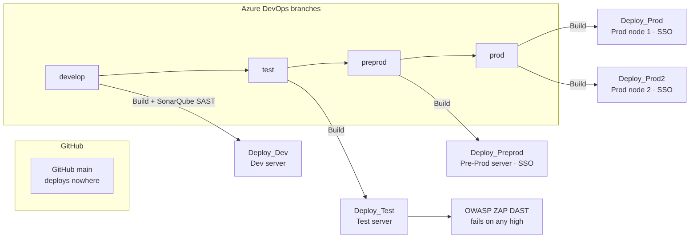

# Deployment Plan: ClientIQ (Banking Client 360)

*Last reviewed: 2026-07-01 · Source of truth: application code (ClientIQ / Banking Client 360).*

## Purpose / Overview

This document defines the deployment governance and process for ClientIQ ("Banking Client 360"),
the on-prem banking customer-360 CRM. It covers the Dev → Test → Pre-Prod → Prod promotion flow,
the branching model that drives the Azure DevOps (ADO) pipeline, environment entry/exit gates,
roles and responsibilities, per-environment deploy and rollback steps, and the documentation
required for software and data engineering.

The governance framework (cadence, roles, gates, rollback philosophy, required documentation) is
process-owned and confirmed with the release and change-management owner where noted with
`[CONFIRM]`. The concrete technical claims (branches, pipeline stages, target platform, database
engine) are derived directly from application and pipeline code and are cited to `file:line`.

Key facts a reader should carry into every section:

- **Database engine:** Microsoft SQL Server only, in every environment (`server/dbConnection.ts:1-4`).
- **CI/CD:** Azure DevOps, driven by the ADO branches `develop`, `test`, `preprod`, `prod`.
  GitHub `main` is **not** a deploy source and reaches no environment.
- **Target platform:** Windows Server; the app runs as a Windows Service under `C:\ClientIQ`,
  deployed over PowerShell Remoting.
- **Environments:** dev, test, preprod, prod. SSO (SAML) is enabled in **preprod and prod only**;
  dev and test use local/mock auth (`SAML_ENABLED=false`).

---

## 1. Objectives

- Safely deploy changes with automated CI/CD to all environments.
- Support parallel work between software engineering and data engineering.
- Minimize risk to production.
- Ensure data quality, performance, and security.

### Recommended Delivery Rhythm

> **[CONFIRM]** Delivery cadence below is a governance target, not derived from code. Confirm with
> the release and change-management owner that the sprint length and per-environment deployment
> frequency are current.

| Item | Cadence |
|------|---------|
| Sprint length | 1 week |
| Dev deployments | Daily / as needed |
| Test deployments | 2-3 times per week or by release candidate |
| Pre-Prod deployments | 2-3 times per week |
| Prod deployments | Weekly or biweekly |
| Emergency hotfixes | Expedited path only |

---

## 2. Environment Overview

There are four environments. Each runs its own application server and its own **Microsoft SQL
Server** database (per-environment `MSSQL_SERVER` / `MSSQL_DATABASE`; e.g. dev targets
`MSSQL_DATABASE=ClientIQdev`, `Start-Dev.ps1`). Dev, Test, and Pre-Prod each run a single
application server with a single SQL Server database; Prod is the high-availability tier and is
deployed to two application servers (see §8).

SSO differs by environment: SAML SSO (RSA SecurID Access via the F&M Bank portal) is enabled in
**preprod and prod only**. In dev and test, `SAML_ENABLED=false` and the app uses the local/mock
auth path (`server/index.ts:21-64`).

| Environment | Purpose | Characteristics | SSO |
|-------------|---------|-----------------|-----|
| Dev | Development & experimentation | Fast iteration, lower controls | Off (local/mock auth) |
| Test (QA) | Validation | Prod-like configuration | Off (local/mock auth) |
| Pre-Prod | Controlled business validation | Prod-like, stable | On (SAML SSO) |
| Prod | Live system | Highly controlled, two-node | On (SAML SSO) |

> **[CONFIRM]** Data-masking posture per environment (e.g. that Dev/Test use masked data and
> Pre-Prod uses production data) is a data-governance decision not expressible in the repo. Have
> data engineering / data governance confirm which environments hold production vs. masked data.
> This is compliance-sensitive.

### 2.1 DEV Environment

- **Purpose:** Active development, unit testing, integration checks, and early validation.
- **Rules:** Developers can deploy frequently; environment may be unstable; no production data
  (see the `[CONFIRM]` above).
- **Used for:** Feature development, bug fixes, API integration checks, technical validation.
- **Entry into DEV:** ADO work item approved and assigned; acceptance criteria defined; technical
  design understood.
- **Exit from DEV:** Code committed and peer reviewed; unit testing completed; build passed; no
  critical compile or integration failures; work item updated in ADO.

### 2.2 TEST Environment

- **Purpose:** Controlled validation environment for QA testing.
- **Rules:** Only tested build packages are deployed; no active coding directly in Test;
  environment should remain stable.
- **Used for:** QA functional testing, regression testing, defect validation, integration testing,
  user validation.
- **Entry into TEST:** Code review complete; CI build passes; deployment package versioned; unit
  testing evidence exists; deployment notes attached; linked ADO items in proper status.
- **Exit from TEST:** All planned stories completed; critical/high defects resolved or formally
  waived; test execution complete; release notes finalized; product owner sign-off obtained;
  change approval complete. The **OWASP ZAP DAST scan** that runs after the Test deploy must pass
  (see §5.3).

### 2.3 PRE-PROD Environment

- **Purpose:** Controlled validation environment for business testing.
- **Rules:** Only approved, tested build packages are deployed; no active coding directly in
  Pre-Prod; environment should remain stable. SAML SSO is enabled here.
- **Used for:** Business acceptance testing, functional testing, regression testing, defect
  validation, integration testing, user/business validation.
- **Entry into PRE-PROD:** Code review complete; CI build passes; deployment package versioned;
  unit testing evidence exists; deployment notes attached; linked ADO items in proper status.
- **Exit from PRE-PROD:** All planned stories completed; critical/high defects resolved or formally
  waived; test execution complete; release notes finalized; business/product owner sign-off
  obtained; change approval complete if required.

### 2.4 PROD Environment

- **Purpose:** Live business use.
- **Rules:** Only approved releases allowed; strict deployment window; rollback plan required.
  SAML SSO is enabled here. Prod is deployed to two application servers (§8).
- **Entry into PROD:** Test sign-off complete; release notes approved; deployment checklist
  completed; rollback/backout plan approved; change approval obtained if applicable; monitoring and
  support coverage confirmed.

### 2.5 Environment Rules

- Separate infrastructure and separate **SQL Server** database per environment.
- Separate credentials/secrets per environment (each ADO stage draws from its own variable group;
  see §4).
- Independent deploy and rollback for each environment.

---

## 3. Roles & Responsibilities

> **[CONFIRM]** Role assignments, the rotating Release Lead model, and approver identities are
> governance decisions not derived from code. The ADO pipeline defines deployment environments
> (`Dev`, `Test`, `PreProd`, `Prod`) that can carry approval checks, but it does not encode who
> approves them. Confirm the current owners with release and change management.

**Software Engineers**

- Build deployable artifacts.
- Deploy the application via CI/CD (ADO pipeline).
- Assess SAST/DAST scan results and remediate high/critical findings. SAST is **SonarQube**
  (runs on `develop` only); DAST is **OWASP ZAP** (runs after the Test deploy and fails the build
  on any high finding). See §5.3.
- Execute verification steps.
- Assist with rollbacks.

**Data Engineers**

- Prepare and apply SQL Server schema changes (see §5.4; applied out-of-band, not by the
  pipeline).
- Deploy data pipelines.
- Validate data quality and freshness.
- Coordinate schema changes with releases.

**Release Lead (rotating, `[CONFIRM]`)**

- Coordinates deployments.
- Runs checklists.
- Confirms readiness at each gate.
- Records deployment outcomes.

**QA / Product**

- Validate Test.
- Provide production approval.

---

## 4. Source Control & Branching

The Azure DevOps pipeline keys entirely off four branches. Each branch has a matching deploy stage
gated on `Build.SourceBranch` (`azure-pipelines.yml`), and the CI trigger fires on `develop`,
`test`, and `preprod` (`azure-pipelines.yml:1-4`).

| ADO branch | Deploy stage | ADO environment | Variable group | `SAMLRoleEnv` | Notes |
|------------|--------------|-----------------|----------------|---------------|-------|
| `develop` | `Deploy_Dev` | `Dev` | `VG-Dev` | `DEV` | SonarQube SAST runs here (§5.3) |
| `test` | `Deploy_Test` | `Test` | `VG-Test` | `TST` | OWASP ZAP DAST runs after this deploy (§5.3) |
| `preprod` | `Deploy_Preprod` | `PreProd` | `VG-Preprod` | `STG` | SSO enabled |
| `prod` | `Deploy_Prod` | `Prod` | `VG-Prod` | `PRD` | Prod node 1 |
| `prod` | `Deploy_Prod2` | `Prod` | `VG-Prod2` | `PRD` | Prod node 2 |

Branch → environment conditions: `develop` (`azure-pipelines.yml:106`), `test` (`:131`), `preprod`
(`:177`), `prod` (`:203`, `:229`).

> **Important: GitHub `main` deploys nowhere.** There is no `release/x.y`, `main`, or `master`
> branch referenced anywhere in `azure-pipelines.yml` or `PipelineTemplates/`. Preprod and prod
> deploy from the ADO branches above, not from GitHub `main`. Pushing to GitHub `main` does not
> reach any environment.

> **Pipeline gap (as written).** `prod` is not listed in the CI `trigger:` block
> (`azure-pipelines.yml:1-4`), yet two `prod`-gated deploy stages exist. A `prod` deployment
> therefore runs from a manual/other trigger, not the declared CI trigger. Confirm the intended
> `prod` trigger with the pipeline owner. `> **[CONFIRM]**`

**Promotion model.** The pipeline does **not** build once and promote a single artifact across
environments. Each branch push runs its own `Build` stage and then its branch-gated deploy stage,
so the artifact is **rebuilt per branch**. Promotion is therefore "advance the same commit through
`develop` → `test` → `preprod` → `prod`, rebuilding at each stage". A true build-once/deploy-many
model is not implemented today.

---

## 5. Pipeline, Platform & Build Mechanics

This section documents the concrete mechanics that make the abstract deploy steps in §6 to §8
actionable. All facts are from `azure-pipelines.yml` and `PipelineTemplates/`.

### 5.1 Target platform and runtime

- The app is deployed to **Windows Servers** over **PowerShell Remoting**
  (`New-PSSession -ComputerName`; `PipelineTemplates/deploy-nodejs.yml:16`).
- Install root on each host is `C:\ClientIQ`; logs are written to `C:\ClientIQ\logs\`.
- The app runs as a **Windows Service**. Deploy = copy artifact → `Stop-Service` → optional
  `npm ci` → `Start-Service` (`PipelineTemplates/deploy-nodejs.yml:16-38`).
- The deployed process is launched as `npx tsx watch --clear-screen=false server/index.ts`
  (`PipelineTemplates/start-script.yml:48`), i.e. it runs **TypeScript source in watch mode**,
  not the compiled `dist/index.js`, and starts under `NODE_ENV=development`
  (`PipelineTemplates/start-script.yml:16`).
- A single, un-firewalled **port 5000** serves both the API and the client; all other ports are
  firewalled (`server/index.ts:94-104`).

> The deployed runtime running under `NODE_ENV=development` via `tsx watch` (rather than
> `NODE_ENV=production node dist/index.js`) is a real dev/prod configuration mismatch. Whether the
> Windows Service environment overrides `NODE_ENV` in higher environments is not visible in the
> repo. `> **[CONFIRM]**` the runtime `NODE_ENV` actually in force in preprod and prod.

### 5.2 Web/proxy tier and TLS

The Node process listens on plain HTTP `:5000`. TLS is terminated in front of it by **IIS**
(Internet Information Services on Windows Server), which reverse-proxies to the Node process. SAML
callback and entity URLs are all `https://`, consistent with an external TLS terminator.

> **[CONFIRM]** The IIS site bindings, ARR/reverse-proxy configuration, TLS certificate paths, and
> certificate owner are not defined in this repository. Confirm the IIS front-end configuration and
> certificate ownership with infrastructure/operations.

### 5.3 Security gates (SAST / DAST)

| Gate | Tool | When it runs | Effect |
|------|------|--------------|--------|
| SAST | SonarQube | `develop` branch only (`azure-pipelines.yml:38, 67, 71`) | Analysis + publish on the `develop` build |
| DAST | OWASP ZAP | Stage after `Deploy_Test`, `dependsOn: Deploy_Test` + `succeeded()` (`azure-pipelines.yml:156-158`) | Spider + active scan; `exit 1` when highs > `allowedHighs` (default 0); **any high finding fails the build** (`PipelineTemplates/dast-scan.yml:8, 183-202`) |

Because the DAST scan runs after the Test deploy and fails on any high finding, an unresolved high
blocks promotion beyond Test.

### 5.4 Dependencies, artifact, and database schema

- **Dependency install is gated on the commit message.** On the build agent, `npm ci` runs only
  when the commit message contains the literal string `npm ci`
  (`condition: contains(Build.SourceVersionMessage, 'npm ci')`, `azure-pipelines.yml:59`). On the
  target server, the same gate applies (`if ($commitMessage -match "npm ci")`,
  `PipelineTemplates/deploy-nodejs.yml:25-32`). npm packages are pulled from the private **Nexus**
  proxy registry `farmers-merchants-bank.repo.sonatype.app` (`azure-pipelines.yml:47`).
- **The published artifact excludes `node_modules`** (CopyFiles exclusion, Build stage). Combined
  with the gate above, this means dependency changes are only applied when the commit message
  contains `npm ci`. **Whenever dependencies change, the commit that advances the branch must
  include `npm ci` in its message**, or the dependency update is silently skipped.
- **Database schema changes are applied out-of-band.** The pipeline contains no database-migration
  step. The only schema tooling in the repo is `db:push` = `drizzle-kit push` (`package.json:11`),
  and its Drizzle Kit config (`drizzle.config.ts`) targets a **non-production database
  configuration** (it requires `DATABASE_URL` and is not the SQL Server production path); it must
  not be used against production SQL Server. SQL Server schema changes are therefore applied
  manually / out-of-band by data engineering.

> **[CONFIRM]** Where the authoritative SQL Server schema-change scripts live, and the exact
> out-of-band process (who runs them, in what order, against which environment) for applying them.
> This is not defined in the repository.

---

## 6. Dev Environment Deployment

**Trigger**

- Push/merge to the `develop` branch (`Deploy_Dev` gated on `refs/heads/develop`).

**Software Engineering (Dev)**

1. Pull latest.
2. Build application (ADO build agent runs `npm run build`; local build optional for verification).
3. Run unit tests and basic integration checks.
4. Deploy to Dev (copy artifact to `C:\ClientIQ` on the Dev Windows Server).
5. Restart the Windows Service (`Stop-Service` → optional `npm ci` → `Start-Service`).
6. Verify:
   - App launches (Windows Service running, listening on `:5000`).
   - Core endpoints respond.
   - Logs (`C:\ClientIQ\logs\errors.log`) show no critical errors.

*No formal approval required for Dev.*

**Data Engineering (Dev)**

1. Review planned SQL Server schema changes.
2. Apply non-breaking schema changes out-of-band (§5.4).
3. Deploy pipelines with Dev configs.
4. Run pipelines with sample/synthetic data.
5. Validate:
   - Schema integrity.
   - Pipeline success.
   - Expected row counts.

*No production data in Dev (`[CONFIRM]` masking posture, §2).*

---

## 7. Test & Pre-Prod Deployment

**Trigger**

- Push/merge to the `test` branch (`Deploy_Test`), then to the `preprod` branch
  (`Deploy_Preprod`). Each triggers its own build and branch-gated deploy stage.

**Pre-Deployment Checklist**

- [ ] Code frozen for the candidate commit.
- [ ] Dev validation complete.
- [ ] Schema & pipeline changes reviewed.
- [ ] If dependencies changed, the advancing commit message contains `npm ci` (§5.4).

**Software Engineering (Test)**

1. Advance the candidate commit to the `test` branch (triggers the Test build + `Deploy_Test`).
2. Deploy to the Test Windows Server (`C:\ClientIQ`).
3. Ensure production-like configuration.
4. Restart the Windows Service.
5. Run smoke tests:
   - Login.
   - Core workflows.
   - API endpoints.
6. Confirm the **OWASP ZAP DAST** scan (runs after `Deploy_Test`) passes with zero high findings
   (§5.3).
7. Hand off to QA.

**Data Engineering (Test)**

1. Apply Test SQL Server schema changes (backward-compatible; out-of-band, §5.4).
2. Deploy Test pipelines.
3. Run data validation:
   - Row counts.
   - Null checks.
   - Key relationships.
4. Validate performance where applicable.

**Pre-Prod note.** Advancing the same commit to the `preprod` branch triggers `Deploy_Preprod`
(`SAMLRoleEnv=STG`). SAML SSO is enabled in Pre-Prod, so validate authentication via the SSO path.

### Approval Gates

- **Ready for Dev:** business requirements, acceptance criteria, priority, owner, dependencies.
- **Ready for Test:** test notes complete, deployment notes complete, build version complete.
- **Ready for Pre-Prod:** build version complete, smoke test notes complete, deployment notes
  complete.
- **Ready for Production:** validation evidence & sign-offs, critical/high defects resolved,
  release notes complete, sign-off status = complete.

> **[CONFIRM]** Whether "Bank Security" sign-off is a required, separate approval on the
> Ready-for-Production gate, and who owns it.

---

## 8. Production Deployment

**Trigger**

- Advance the approved commit to the `prod` branch. This gates both prod deploy stages,
  `Deploy_Prod` and `Deploy_Prod2` (`azure-pipelines.yml:203, 229`).

> **[CONFIRM]** Formal CAB / change-approval requirement and the scheduled deployment window are
> governance controls not defined in the repository. Confirm CAB applicability and the deployment
> window with change management.

**Two-node deployment.** Production is deployed to **two application servers** via two separate
stages: `Deploy_Prod` (node 1, variable group `VG-Prod`) and `Deploy_Prod2` (node 2, variable
group `VG-Prod2`). Both are gated on `refs/heads/prod` and both must be deployed and validated.

> **[CONFIRM]** The exact prod topology (load balancer, node roles, session affinity) is not
> defined in the repository. Confirm with infrastructure/operations.

**Pre-Deployment Checklist (Mandatory, Production go/no-go)**

- [ ] Test environment approved.
- [ ] Rollback plan confirmed.
- [ ] On-call engineers assigned.
- [ ] Monitoring systems ready.
- [ ] Backups/snapshots completed (`[CONFIRM]` backup cadence/owner).
- [ ] Coordinated deployment with App Services & DBAs (segregation of duties, `[CONFIRM]`).

**Software Engineering (Prod)**

1. Confirm the current production version on **both** nodes.
2. Deploy the new version to **both** nodes (`Deploy_Prod` and `Deploy_Prod2`).
3. Validate on both nodes:
   - Health checks (`/health`).
   - Error rates (`C:\ClientIQ\logs\errors.log`).
4. Monitor closely. Log issues/defects in ADO with proper tagging indicating the environment/stage
   (`#PROD`).

**Data Engineering (Prod)**

1. Apply SQL Server schema changes (non-destructive; out-of-band, §5.4).
2. Deploy production pipelines.
3. Execute smoke data checks:
   - Pipeline completion.
   - Freshness.
   - Key metrics.
4. Monitor for anomalies.

*Breaking data changes must be versioned and phased.*

---

## 9. Rollback Strategy (Manual)

**Application Rollback**

1. Re-deploy the previous known-good commit by advancing it through the relevant ADO branch
   (rebuilds and redeploys the artifact).
2. Disable features via configuration if applicable.
3. Restart the Windows Service on the affected node(s); for prod, both nodes.

> **Rollback caveat.** Because the published artifact excludes `node_modules` and dependencies are
> only refreshed when the commit message contains `npm ci` (§5.4), a rollback that changes
> dependencies must include the `npm ci` path in its commit message. Otherwise the previous
> artifact runs against mismatched `node_modules`.

**Data Rollback**

- Prefer additive, reversible changes.
- Use versioned tables or views.
- Disable pipelines if needed.
- Explicit approval required for rollback actions.

---

## 10. Post-Deployment Activities

- [ ] Validate critical user journeys (for prod, on both nodes).
- [ ] Confirm data accuracy and freshness.
- [ ] Record deployment details: version, time, issues, rollback actions.
- [ ] Communicate release summary.

---

## 11. Required Documentation

Referenced and linked in the ADO Wiki:

- Deployment checklists.
- Release notes.
- SQL Server schema-change scripts and the out-of-band procedure to apply them (§5.4).
- Rollback instructions (including the `npm ci` dependency caveat, §9).
- Known issues log.
- Lessons learned.

---

## 12. Deployment Flow (Reference)

Each deploy stage runs the same remote flow on its target Windows Server: generate
`C:\ClientIQ\Start-Server.ps1`, copy artifact → `Stop-Service` → optional `npm ci` →
`Start-Service`, with the app launched via `tsx watch` on port 5000.
