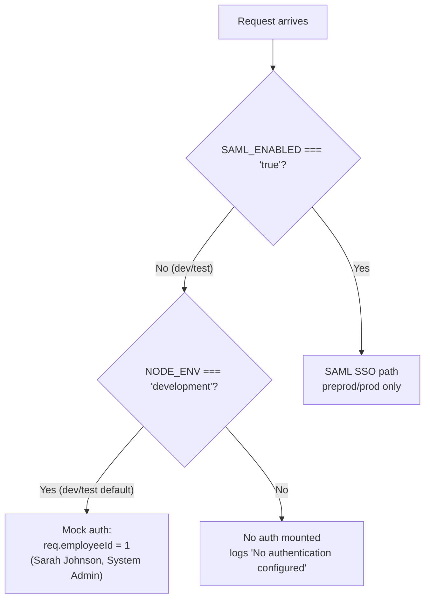

# Dev / Test Server Setup Guide

*Last reviewed: 2026-07-02 - Source of truth: application code*

## Purpose / Overview

This guide describes how to stand up a **dev** or **test** instance of ClientIQ ("Banking Client 360") on a single Windows Server host. In these two environments:

- **SSO is OFF.** `SAML_ENABLED=false`. The app runs on the local/mock authentication path (see [Authentication in Dev / Test](#authentication-in-dev--test)).
- **One app server + one Microsoft SQL Server database.** Dev and test are each a single app host talking to a single SQL Server instance. There is no HA/multi-server topology at these tiers (that is prod-only).
- **The app runs from TypeScript source** via `tsx watch` (not the compiled `dist/` bundle), matching the repo's own start scripts and the Azure DevOps deploy path.
- **The Node process listens on plain HTTP `:5000`.** A front-end web tier (IIS) terminates TLS and reverse-proxies to it.

> **Scope note.** This document covers *manual* host setup for a standalone dev/test box. The dev and test environments are normally provisioned automatically by the Azure DevOps pipeline (branches `develop` → Dev, `test` → Test). See the deployment guide for the pipeline path. Pushing to GitHub `main` deploys **nowhere**.

---

## 1. Target environment

| Item | Value | Source |
|------|-------|--------|
| OS | Windows Server (2019 / 2022) | host convention |
| App install root | `C:\ClientIQ` | `Start-Dev.ps1`; `PipelineTemplates/start-script.yml:45,51` |
| Log directory | `C:\ClientIQ\logs\` | `PipelineTemplates/start-script.yml:48` |
| Node.js | v20+ LTS | runtime requirement |
| Runtime | `npx tsx watch server/index.ts` (TypeScript, watch mode) | `Start-Dev.ps1`; `start-script.yml:48` |
| App listen address | `0.0.0.0:5000` (plain HTTP, hard-coded in code) | `server/index.ts:98-102` |
| Database | Microsoft SQL Server (dev/test instance) | `server/dbConnection.ts` |
| Web / TLS tier | IIS (terminates TLS, reverse-proxies to `127.0.0.1:5000`) | infra (not in repo) |
| SSO | **Disabled** (`SAML_ENABLED=false`) | `Start-Dev.ps1`; `Start-Server.ps1` |

> **[CONFIRM]** Real dev/test hostnames and FQDNs (e.g. a `test-clientiq.*` DNS name), the DNS record owner, and the SQL Server hostname for each environment. These are not derivable from the repo.

> **[CONFIRM]** TLS certificate: subject/FQDN, certificate and private-key file paths on the IIS host, issuing CA, and the certificate owner. Not defined in this repo.

> **[CONFIRM]** IIS site bindings (site name, HTTP/HTTPS bindings, host header) and the reverse-proxy mechanism (e.g. Application Request Routing / URL Rewrite) fronting the Node process. No IIS `web.config` or binding config exists in the repo.

---

## 2. Prerequisites

- Windows Server 2019 or 2022.
- Node.js v20+ LTS (default install path `C:\Program Files\nodejs`).
- Git (to clone the repository) or a copy of the source tree.
- Network access from the app host to the dev/test SQL Server instance on TCP `1433`.
- IIS installed and configured as the front-end reverse proxy / TLS terminator. See [Section 8](#8-web-tier-iis).
- A TLS certificate for the environment's FQDN, installed on the IIS host.

> **[CONFIRM]** Whether the dev/test SQL Server uses SQL authentication or Windows authentication. The repo start scripts use **SQL authentication** (`MSSQL_USER` / `MSSQL_PASSWORD`); the code does not implement Windows-integrated auth.

---

## 3. Directory structure

```powershell
# Application directories
New-Item -ItemType Directory -Path "C:\ClientIQ"      -Force
New-Item -ItemType Directory -Path "C:\ClientIQ\logs" -Force
```

IIS and its site/cert layout are configured separately on the web tier and are **not** part of the app tree (see [Section 8](#8-web-tier-iis)).

---

## 4. Get the source and install dependencies

```powershell
cd C:\ClientIQ
git clone <your-repo-url> .
# OR copy the source tree into C:\ClientIQ manually

npm install
```

> **npm registry.** In the Azure DevOps pipeline, dependency installs are pointed at the private Nexus proxy registry (`farmers-merchants-bank.repo.sonatype.app`) via a generated `.npmrc` (`azure-pipelines.yml:44-53`). For a manual host that cannot reach the public npm registry, configure `.npmrc` to use the same internal proxy.

> **[CONFIRM]** The clone URL / artifact source for a manually provisioned dev/test host.

---

## 5. Provision the database (do this before first run)

The setup is not complete after `npm install`. The SQL Server schema and baseline reference/RBAC data must exist before the app will function.

1. **Create the SQL Server database** for this environment (e.g. `ClientIQdev` for dev).
2. **Create the schema.**
3. **Seed baseline data**, including RBAC roles/permissions and reference data the app relies on at startup.

> **`db:push` is not the SQL Server path.** The `npm run db:push` script (`drizzle-kit push`) and `drizzle.config.ts` target the ORM's abstraction layer and **require `DATABASE_URL`** (`drizzle.config.ts` throws if it is unset). This is not the SQL Server provisioning path. Do not run `db:push` against the SQL Server instance expecting it to build the production schema.

> **[CONFIRM]** The authoritative SQL Server schema-creation and seed procedure for a fresh dev/test database (migration scripts, seed scripts, and their run order), and who owns/maintains them. This is not fully derivable from the repo; coordinate with the schema and data-seed owners.

---

## 6. Environment configuration

The app reads configuration from process environment variables. On Windows the supported launch method is the repo's PowerShell start script (see [Section 7](#7-run-the-server)), which sets these variables in-process before launching `tsx`. The variables below reflect what the code actually reads and the values the repo's own dev/test scripts use.

### 6.1 Variables the app reads

| Variable | Dev/Test value | Notes | Source (file:line) |
|----------|----------------|-------|--------------------|
| `NODE_ENV` | `development` | Selects mock-auth path, Vite dev middleware, relaxed DB TLS, `debug` log level. | `server/index.ts:56,88` |
| `PORT` | `5000` | HTTP listen port. | `server/index.ts:98` |
| `DATABASE_DIALECT` | `sqlserver` | DB dialect selector. | `server/dbConfig.ts:13` |
| `DB_VENDOR` | `mssql` | Search-provider selection. **Set this**: if unset it falls back to detecting from `DATABASE_URL` and defaults to the ORM abstraction with a warning. | `server/adapters/search/SearchProviderFactory.ts:25` |
| `MSSQL_SERVER` | SQL Server host | Falls back to `DB_SERVER`, then `localhost`. | `server/dbConnection.ts:25` |
| `MSSQL_DATABASE` | e.g. `ClientIQdev` | Falls back to `DB_NAME`, then `ClientIQ`. | `server/dbConnection.ts:26` |
| `MSSQL_USER` | SQL login | Falls back to `DB_USER`. | `server/dbConnection.ts:23` |
| `MSSQL_PASSWORD` | SQL password | Falls back to `DB_PASSWORD`. | `server/dbConnection.ts:24` |
| `MSSQL_ENCRYPT` | `false` | **Session store only.** See TLS note below. | `server/auth/session.ts:15` |
| `MSSQL_TRUST_SERVER_CERTIFICATE` | `true` | **Session store only.** See TLS note below. | `server/auth/session.ts:16` |
| `SAML_ENABLED` | `false` | SSO OFF in dev/test → mock auth. | `server/index.ts:21` |
| `SESSION_SECRET` | any non-empty string | Only used when SAML is enabled (session middleware is mounted only then), but harmless to set. | `server/auth/session.ts:34` |
| `LOG_LEVEL` | `debug` (default in dev) | Optional threshold override. | `server/services/loggerConfig.ts:7` |

> **SQL Server TLS behavior (read carefully).** `MSSQL_ENCRYPT` and `MSSQL_TRUST_SERVER_CERTIFICATE` are honored **only by the session-store connection** (`server/auth/session.ts:15-16`). The **main data pool** hard-codes `encrypt: true` and derives cert-trust solely from `NODE_ENV === 'development'`; it ignores both variables (`server/dbConnection.ts:28-29`). Setting `MSSQL_ENCRYPT=false` therefore affects only the session store, not the primary connection.

### 6.2 Variables that are set but NOT read (no-ops)

Do not rely on these; the code never reads them. They appear in older docs and in the repo start scripts but have no effect:

| Variable | Why it does nothing | Source |
|----------|---------------------|--------|
| `HOST` | `server.listen` hard-codes `host: "0.0.0.0"`; `process.env.HOST` is never read. | `server/index.ts:101` |
| `MSSQL_PORT` | No `process.env.MSSQL_PORT` in code; the pool uses the default port. | `env-vars` facts §2 |
| `SESSION_COOKIE_SECURE` | Never read. Cookie `secure` flag is derived from `NODE_ENV` (`false` in development). | `server/auth/session.ts:41` |
| `LOG_FORMAT` | Never read. Log formatting is controlled by the logger config, not this variable. | logger config |

> **[CONFIRM]** If your dev/test SQL Server listens on a non-default port, note that the app cannot target it via `MSSQL_PORT` (unread). This would require a code change or a SQL Server alias/DNS mapping. Confirm the SQL Server port per environment.

### 6.3 Example start script (`C:\ClientIQ\Start-Dev.ps1`)

The repo already ships `Start-Dev.ps1` (hard-coded dev values) and `Start-Server.ps1` (parameterized). Prefer those. A representative dev/test script:

```powershell
# ClientIQ Dev/Test startup: sets env in-process, then launches tsx.
$env:NODE_ENV                     = "development"
$env:PORT                         = "5000"
$env:DATABASE_DIALECT             = "sqlserver"
$env:DB_VENDOR                    = "mssql"

# SQL Server (SQL authentication): replace with this environment's values
$env:MSSQL_SERVER                 = "<sql-host>"
$env:MSSQL_DATABASE               = "ClientIQdev"
$env:MSSQL_USER                   = "<sql-login>"
$env:MSSQL_PASSWORD               = "<sql-password>"     # do not commit real secrets
$env:MSSQL_ENCRYPT                = "false"              # session store only
$env:MSSQL_TRUST_SERVER_CERTIFICATE = "true"            # session store only

# SSO OFF in dev/test
$env:SAML_ENABLED                 = "false"
$env:SESSION_SECRET               = "<random-64-char-string>"

Set-Location -Path "C:\ClientIQ"
Write-Host "Starting ClientIQ (dev/test) on http://localhost:5000" -ForegroundColor Cyan
npx tsx watch --clear-screen=false server/index.ts
```

> **Security.** Do not commit real credentials. The in-repo `Start-Dev.ps1` currently contains a hard-coded `MSSQL_PASSWORD` and `SESSION_SECRET` (`Start-Dev.ps1:16,23`); treat those as placeholders and inject real secrets from a secure source for any real host.

> **[CONFIRM]** The dev/test SQL Server hostname, database name, service-account login, and password for each environment (from the ADO variable groups `VG-Dev` / `VG-Test`, or your secrets store).

---

## 7. Run the server

### 7.1 Interactively (development)

From PowerShell:

```powershell
C:\ClientIQ\Start-Dev.ps1
```

If PowerShell blocks script execution, allow it once for your user:

```powershell
Set-ExecutionPolicy -ExecutionPolicy RemoteSigned -Scope CurrentUser
```

> **Do not use `npm run dev` on Windows.** The `dev` script is defined Unix-style as `NODE_ENV=development tsx server/index.ts` (`package.json:6-7`), and the leading `NODE_ENV=...` prefix is not parsable by Windows `cmd`/PowerShell; it fails with `'NODE_ENV' is not recognized`. Prefixing `set NODE_ENV=development && npm run dev` does **not** fix it, because the npm script itself still prefixes `NODE_ENV=...`. The supported Windows launch is the start script above (which sets env vars first, then calls `npx tsx watch ... server/index.ts` directly).

### 7.2 As a Windows service (persistent dev/test host)

To keep a dev/test instance running across reboots, run it as a Windows service. The best approach, and the one the real deploy uses, is to point the service at a start script that exports all environment variables in **one** process and launches `tsx`, rather than layering environment variables onto the service definition.

A service wrapper (e.g. NSSM) can be used:

```powershell
# Example: run the start script under a service wrapper.
# AppDirectory = C:\ClientIQ ; the script sets env in-process and launches tsx watch.
<nssm> install ClientIQ-Dev "powershell.exe" "-ExecutionPolicy Bypass -File C:\ClientIQ\Start-Dev.ps1"
<nssm> set     ClientIQ-Dev AppDirectory "C:\ClientIQ"
<nssm> set     ClientIQ-Dev AppStdout    "C:\ClientIQ\logs\stdout.log"
<nssm> set     ClientIQ-Dev AppStderr    "C:\ClientIQ\logs\stderr.log"
<nssm> set     ClientIQ-Dev Start        SERVICE_AUTO_START
<nssm> start   ClientIQ-Dev
```

> **Do not set env vars via repeated `AppEnvironmentExtra` calls.** A service wrapper's environment-extra field is a single multi-line value; each separate `set ... AppEnvironmentExtra "..."` invocation *overwrites* the previous one, so only the last line would survive. Set them all at once (newline-separated `KEY=VALUE` pairs) or, preferably, put them in the start script as shown. The `+VAR=...` "append" syntax seen in older docs does not merge across separate invocations.

> **Watch mode.** The repo's start scripts run `tsx watch` (`start-script.yml:48`; `Start-Dev.ps1`). Running under watch mode in a long-lived service is the repo's actual behavior. If you prefer to disable file-watching for a service, drop `watch` (`npx tsx server/index.ts`); this is an intentional deviation, not the shipped default.

> **[CONFIRM]** The service wrapper tool and its install path used in your environment (e.g. NSSM location), and the service account the ClientIQ service runs under.

### 7.3 Production-mode build (optional)

If you want to run the compiled bundle instead of TypeScript source in a test environment:

```powershell
cd C:\ClientIQ
npm run build      # → dist/index.js (server) + dist/public/ (client assets)
npm start          # = NODE_ENV=production node dist/index.js
```

- `npm run build` produces the **server bundle at `dist/index.js`** and **client static assets at `dist/public/`** (`package.json:8`).
- `npm start` runs `NODE_ENV=production node dist/index.js` (`package.json:9`).
- There is **no** `dist/server/index.js`; the server bundle is `dist/index.js`.

Running with `NODE_ENV=production` changes behavior: the app serves pre-built static assets (`serveStatic`, `dist/public`) instead of the Vite dev middleware, and it does **not** take the dev mock-auth path. With `SAML_ENABLED=false` and a non-development `NODE_ENV`, no auth is mounted and the app logs `"No authentication configured"` (`server/index.ts:62-64`). For a dev/test box you almost always want `NODE_ENV=development`.

---

## 8. Web tier (IIS)

ClientIQ's Node process listens only on plain **HTTP `0.0.0.0:5000`** (`server/index.ts:98-102`). TLS termination and reverse proxying are handled by **IIS** on the web tier, infrastructure configured outside the application repo. There is no IIS config, `web.config`, or reverse-proxy definition in the codebase.

At a high level, IIS should:

- Bind HTTPS on `443` for the environment FQDN using the installed certificate, and redirect HTTP `80` → HTTPS.
- Reverse-proxy incoming requests to the Node app at `http://127.0.0.1:5000`.
- Forward the standard proxy headers (`X-Forwarded-For`, `X-Forwarded-Proto`, `X-Forwarded-Host`, `Host`).
- Preserve WebSocket upgrades (the app uses WebSockets, including for the Vite dev middleware / HMR).

> **Health check.** The application's JSON health route is `GET /api/health` (`server/routes.ts:3133`). The app *also* allowlists a lightweight exact path `/health` in its auth/logging middleware (`server/middleware/authGate.ts:16`), but that is not the JSON health route. Point any external health probe at `/api/health`.

> **[CONFIRM]** The complete IIS configuration for each environment: site name and bindings, certificate binding (thumbprint / store), the reverse-proxy/rewrite rules to `127.0.0.1:5000`, request size limits, and any security headers applied at the proxy. None of this is in the repo; obtain it from the infra/IIS owner.

---

## 9. Authentication in dev / test

In dev and test, **SSO/SAML is disabled** (`SAML_ENABLED=false`). Authentication behavior depends on `NODE_ENV`:



- **Dev/test (the normal case):** `SAML_ENABLED=false` and `NODE_ENV=development` → the app injects a fixed mock identity, `req.employeeId = 1` (Sarah Johnson, System Admin), and logs `"Using mock authentication (development mode)"` (`server/index.ts:56-61`). No login screen; every request is authenticated as this user.
- **Non-development with SAML off:** if `NODE_ENV` is not `development` and `SAML_ENABLED` is not `true`, no auth is mounted and the app logs a warning (`server/index.ts:62-64`). Avoid this combination in dev/test.

SAML SSO (RSA SecurID Access via the F&M Bank portal) and AD-group→role mapping apply **only in preprod and prod**. They are out of scope for dev/test setup. If you must smoke-test SSO in a test environment, set `SAML_ENABLED=true` and configure the SAML variables below.

### 9.1 SAML placeholders (only if enabling SSO in test)

These are provided for completeness. In standard dev/test they stay unset (`SAML_ENABLED=false`).

| Variable | Value / format | Source (file:line) |
|----------|----------------|--------------------|
| `SAML_ENABLED` | `true` to enable | `server/index.ts:21` |
| `SAML_ENTRYPOINT` | IdP SSO entry URL, e.g. `https://portal.fmb.com/IdPServlet?idp_id=<issuer>` | `server/auth/samlStrategy.ts:130` |
| `SAML_ISSUER` | SP issuer / entity id sent to the IdP (defaults to `ClientIQ-Production` if unset) | `server/auth/samlStrategy.ts:128` |
| `SAML_CALLBACK_URL` | ACS callback: `https://<fqdn>/saml/acs` (**top-level `/saml/acs`, not under `/api/auth`**) | `server/auth/samlStrategy.ts:129`; `server/routes/auth.ts:264` |
| `SAML_CERT` | **Inline PEM** (if the value contains `BEGIN CERTIFICATE`) **or a path** to a `.pem` file resolved relative to `C:\ClientIQ` (e.g. `./saml_cert.pem`). **Not base64.** | `server/auth/samlStrategy.ts:11-28` |
| `SAML_ROLE_ENV` | Scopes AD-group→role mapping to one env. Test convention: `TST`. | `azure-pipelines.yml:135-136` |
| `SESSION_SECRET` | Required when SAML is on (session middleware mounts only then). | `server/auth/session.ts:34` |

> **Correct ACS path.** The SAML Assertion Consumer Service route is mounted at the **top level** `POST /saml/acs` (`server/routes/auth.ts:264`), matching the F&M Bank RSA IdP convention. Do not use `/api/auth/saml/acs`. If an IIS proxy is in play, ensure `/saml/*` and `/IdPServlet` are proxied through to the Node app (these are also on the app's auth allowlist).

> **[CONFIRM]** For any test SSO trial: the IdP entry-point URL, the SP issuer/entity id agreed with the IdP team, and the IdP signing certificate (contents/fingerprint). Obtain from the SAML/IdP owners.

---

## 10. Firewall

```powershell
# Inbound HTTPS (public): terminated at IIS
New-NetFirewallRule -DisplayName "HTTPS (Dev/Test)" -Direction Inbound  -LocalPort 443  -Protocol TCP -Action Allow

# Inbound HTTP (redirect to HTTPS)
New-NetFirewallRule -DisplayName "HTTP (Dev/Test)"  -Direction Inbound  -LocalPort 80   -Protocol TCP -Action Allow

# Outbound SQL Server
New-NetFirewallRule -DisplayName "SQL Server Outbound" -Direction Outbound -RemotePort 1433 -Protocol TCP -Action Allow
```

The Node app's port `5000` should **not** be exposed publicly. Per the code comment, `5000` is the only port that is not firewalled at the host/infra level and it serves both the API and the client; all other ports are firewalled (`server/index.ts:94-97`). External clients reach the app only through IIS on `443`.

> **[CONFIRM]** Whether `5000` should be reachable only from the local IIS worker (loopback) or also from a separate IIS host, and the exact host/infra firewall posture for each environment.

---

## 11. Verification

**1. Confirm the service is running (if installed as a service):**

```powershell
Get-Service -Name "ClientIQ-Dev" | Format-Table Name, Status, StartType
```

**2. Hit the app health endpoint directly (bypassing IIS):**

```powershell
Invoke-RestMethod -Uri "http://localhost:5000/api/health" -Method GET
```

**3. Hit it through IIS (TLS):**

```powershell
Invoke-RestMethod -Uri "https://<env-fqdn>/api/health" -Method GET -SkipCertificateCheck
```

**4. Tail the logs:**

```powershell
Get-Content "C:\ClientIQ\logs\stdout.log" -Tail 50
Get-Content "C:\ClientIQ\logs\errors.log" -Tail 50   # stderr, when launched via the deploy start script
```

On startup you should see, in dev/test, a log line indicating mock authentication is in use (`"Using mock authentication (development mode)"`) and the server listening on `:5000`.

> **[CONFIRM]** The environment FQDN to substitute for `<env-fqdn>` in step 3.

---

## 12. Troubleshooting

### `'NODE_ENV' is not recognized`
You ran `npm run dev` on Windows. The `dev` npm script is Unix-style and cannot be parsed by `cmd`/PowerShell. Use the start script (`Start-Dev.ps1`), which sets env vars first and then runs `npx tsx watch --clear-screen=false server/index.ts`. See [Section 7.1](#71-interactively-development).

### `ENOTSUP: operation not supported on socket 0.0.0.0:5000`
The app binds `0.0.0.0:5000`; this host/port is **hard-coded** in `server.listen` (`server/index.ts:101`), and `process.env.HOST` is **not read**. Setting `HOST=127.0.0.1` will **not** change the bind address (older docs that claim it does are wrong). If binding `0.0.0.0` fails on a particular Windows configuration, the real remedies are host-level (network stack / port reservation / running under a different account), or a code change to make `server.listen` honor a configurable host. It cannot be fixed by an environment variable today.

### Application won't start
```powershell
Get-Content "C:\ClientIQ\logs\errors.log" -Tail 50   # or stderr.log for a service
cd C:\ClientIQ; npm install                          # verify dependencies present
# Manual run to see errors on the console:
$env:NODE_ENV = "development"; $env:DATABASE_DIALECT = "sqlserver"; $env:DB_VENDOR = "mssql"
# ...set MSSQL_* vars...
npx tsx server/index.ts
```
Remember: `node_modules` is required at runtime (the server bundle uses `--packages=external`), so dependencies must be installed on the host.

### Database connection failed
```powershell
# TCP reachability to SQL Server
Test-NetConnection -ComputerName "<sql-host>" -Port 1433

# Credential check (if sqlcmd is installed)
sqlcmd -S <sql-host> -U <sql-login> -P <sql-password> -d ClientIQdev -Q "SELECT 1"
```
If TCP connects but the app still fails, verify `MSSQL_SERVER` / `MSSQL_DATABASE` / `MSSQL_USER` / `MSSQL_PASSWORD` and that the database has been provisioned ([Section 5](#5-provision-the-database-do-this-before-first-run)).

### Search returns nothing / behaves oddly
Confirm `DB_VENDOR=sqlserver` (scripts use `mssql`) is set. If `DB_VENDOR` is unset, the search-provider factory falls back to detecting from `DATABASE_URL` and then to the ORM abstraction default with a warning (`server/adapters/search/SearchProviderFactory.ts:25`). Note that ClientIQ search is a case-insensitive `LIKE` substring match.

---

## 13. Assumptions and open items

Confirmed from the repo:
- App root `C:\ClientIQ`; logs under `C:\ClientIQ\logs\`.
- Runtime is `tsx watch server/index.ts` (TypeScript, watch mode), `NODE_ENV=development` in dev/test.
- SQL Server via SQL authentication; `SAML_ENABLED=false` (mock auth) in dev/test.
- App listens on plain HTTP `0.0.0.0:5000`; single un-firewalled port serves API + client.

Requires human confirmation (do not assume):

> **[CONFIRM]** Document owner, version, and review cadence for this guide.

> **[CONFIRM]** Environment-specific values: FQDN/DNS records, TLS cert (subject, paths, CA, owner), SQL Server host/database/login per environment (from ADO variable groups `VG-Dev` / `VG-Test` or your secrets store).

> **[CONFIRM]** IIS site/binding/reverse-proxy configuration on the web tier.

> **[CONFIRM]** SQL Server schema-creation and seed procedure and its owner.

> **[CONFIRM]** Backup cadence, monitoring/alerting, support contacts, and any compliance posture for dev/test.
