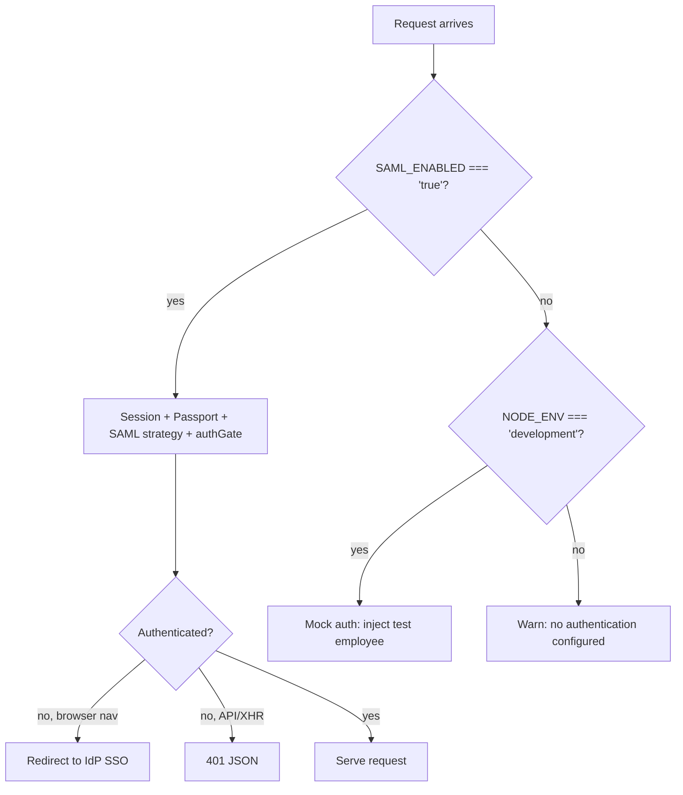

# Environment Variables Reference

*Last reviewed: 2026-07-01 · Source of truth: application code (ClientIQ / Banking Client 360).*

## Purpose

This document is the authoritative reference for every environment variable the ClientIQ (Banking Client 360) application actually reads at runtime, plus the variables that deploy scripts set but the code never consumes. It is rebuilt directly from `process.env.*` reads in the codebase; it does not describe an idealized configuration surface.

Key facts to keep in mind while reading:

- **SQL Server is the only database engine** in every environment (dev, test, preprod, prod). There is no other production data store.
- **The app does not use a `.env` file.** There is no `dotenv` dependency and no `.env` loader anywhere in the code. Configuration is delivered by PowerShell scripts that export process environment variables before launching the Node process (see [Where configuration comes from](#where-configuration-comes-from)).
- **SSO is per-environment.** SAML is enabled only in preprod and prod. In dev and test, `SAML_ENABLED=false` and the app uses the local/mock authentication path.
- **A large set of variables in the prior guide were never read by the code.** Those have been removed here or explicitly marked as dead (set-but-unread). See [Set-but-unread (dead) variables](#set-but-unread-dead-variables) and [Variables removed from this reference](#variables-removed-from-this-reference).

---

## Where configuration comes from

There is no dotenv loading. Environment variables reach the Node process through PowerShell scripts that set `$env:*` before invoking the app:

| Context | Script | How it is produced |
|---------|--------|--------------------|
| Local / dev | `Start-Dev.ps1` (repo root) | Static, hard-coded values. `SAML_ENABLED=false`. Contains committed plaintext secrets (see the security note below). |
| Parameterized dev-style server | `Start-Server.ps1` (repo root) | Same variable set as `Start-Dev.ps1`, but sourced from mandatory parameters (`$DBServer`, `$DBName`, `$DBUser`, `$DBPassword`, `$SessionSecret`). `SAML_ENABLED=false`. |
| Each deployed server (dev/test/preprod/prod) | Generated `C:\ClientIQ\Start-Server.ps1` on the target host | Written remotely by the Azure DevOps pipeline template `PipelineTemplates/start-script.yml`. Substitutes ADO pipeline / variable-group tokens (`$(DBServer)`, `$(SAMLEnabled)`, `$(SessionSecret)`, `$(SAMLRoleEnv)`, …) into the exported env vars. This is the only script that emits the full SAML block. |

Secrets for the deployed servers are supplied by Azure DevOps variable groups (`$(SessionSecret)`, `$(DBPassword)`, etc.), not files on disk.

> **[CONFIRM]** File-system ACLs / permissions on `C:\ClientIQ\Start-Server.ps1` on each host, the owner of the ADO variable groups (`VG-Dev`, `VG-Test`, `VG-Preprod`, `VG-Prod`, `VG-Prod2`), and the secret-rotation cadence/policy are governance items not derivable from the repo.

**Security note (fact, not speculation):** `Start-Dev.ps1` commits a plaintext `MSSQL_PASSWORD` (line 16) and a plaintext `SESSION_SECRET` (line 23). These should be rotated and removed from version control.

---

## Quick reference

| Category | Variable | Required | Notes |
|----------|----------|----------|-------|
| Runtime | `NODE_ENV` | Effectively required | Master mode switch (auth path, cookie security, log level, dev routes). Code uses `'development'` / `'production'`. |
| Runtime | `PORT` | Optional | HTTP listen port. Default `5000`. |
| Runtime | `ROLE_TESTING_ENABLED` | Optional | Role-testing/impersonation feature. Enabled unless exactly `'false'`. |
| Runtime | `TZ` | Set by app | Forced to `America/Los_Angeles` at startup. Not an operator input. |
| Database | `DATABASE_DIALECT` | Optional (deploy sets `sqlserver`) | Dialect selector for DB config resolution. |
| Database | `DB_VENDOR` | Optional (deploy sets `mssql`) | Selects the SQL Server search provider. |
| Database | `MSSQL_SERVER` / `DB_SERVER` | Optional (chain default `localhost`) | SQL Server host. |
| Database | `MSSQL_DATABASE` / `DB_NAME` | Optional (chain default `ClientIQ`) | Database name. |
| Database | `MSSQL_USER` / `DB_USER` | Required in prod | SQL Server login. |
| Database | `MSSQL_PASSWORD` / `DB_PASSWORD` | Required in prod | SQL Server password. |
| Database | `MSSQL_ENCRYPT` | Optional | Session-store connection TLS only. |
| Database | `MSSQL_TRUST_SERVER_CERTIFICATE` | Optional | Session-store connection trust only. |
| Database | `DATABASE_URL` | CLI-only | Required only for the `drizzle-kit` schema CLI, not the running server. |
| Session | `SESSION_SECRET` | Required when SAML enabled | express-session signing secret. |
| SAML / auth | `SAML_ENABLED` | Optional (default off) | Master SSO gate; exact string `'true'` enables SAML. |
| SAML / auth | `SAML_ENTRYPOINT` | Required when SAML enabled | IdP SSO entry-point URL. |
| SAML / auth | `SAML_CALLBACK_URL` | Required when SAML enabled | SAML ACS callback (`/saml/acs`). |
| SAML / auth | `SAML_CERT` | Required when SAML enabled | IdP signing cert (inline PEM or file path). |
| SAML / auth | `SAML_ISSUER` | Optional | SP issuer; defaults to `ClientIQ-Production`. |
| SAML / auth | `SAML_ROLE_ENV` | Optional | Scopes AD-group→role mapping to one environment. |
| SAML / auth | `SAML_DEFAULT_ROLE_NAME` | Optional | Fallback role; default `Branch Manager`. |
| SAML / auth | `RSA_PORTAL_URL` | Optional | Explicit IdP portal URL for logout; else derived from `SAML_ENTRYPOINT`. |
| Logging | `LOG_LEVEL` | Optional | Threshold; default `debug` in dev, `info` otherwise. |

---

## Runtime / application settings

### `NODE_ENV`

- **Required:** effectively required for correct behavior (technically optional).
- **Values used in code:** `'development'`, `'production'`.
- **Default:** none. When undefined it is treated as non-dev/non-prod: `isDev` is `false` in `server/services/loggerConfig.ts:6`, so the log level defaults to `info`; `server/services/logger.ts:237` reports a `'development'` fallback string.
- **Where read:** `server/index.ts:56`, `:88`; `server/auth/session.ts:17`, `:41`; `server/dbConnection.ts:29`; `server/middleware/authGate.ts:7`; `server/routes.ts:294`, `:1799`, `:1866`, `:1929`; `server/services/logger.ts:237`; `server/services/loggerConfig.ts:6`; `server/services/roleTestService.ts:20`.

`NODE_ENV` gates a wide range of behavior: mock-auth vs SAML selection, the secure-cookie flag, dev-only debug routes, the default log level, main-pool certificate trust, and role-testing production guards.

```powershell
$env:NODE_ENV = "development"
```

> **Deployment reality, read this.** The pipeline-generated `C:\ClientIQ\Start-Server.ps1` writes `NODE_ENV=development` for **all** environments, including prod (`PipelineTemplates/start-script.yml`). Consequences of running with `NODE_ENV=development`: the session cookie `secure` flag is `false` (`server/auth/session.ts:41`), the main data pool sets `trustServerCertificate: true` (`server/dbConnection.ts:29`), dev-only debug branches in `server/routes.ts` activate, and the default log level is `debug`.
>
> **[CONFIRM]** Whether prod overrides `NODE_ENV` to `production` at the Windows-service level is not visible in the repo. A human must confirm the effective `NODE_ENV` on the preprod and prod hosts; if it is not overridden, the security implications above apply in production.

### `PORT`

- **Required:** optional.
- **Default:** `'5000'`.
- **Where read:** `server/index.ts:98` (`parseInt(process.env.PORT || '5000', 10)`).

The single un-firewalled port `5000` serves both the API and the client. The listen **host** is hard-coded to `0.0.0.0` in code and is not configurable (see `HOST` under [Set-but-unread (dead) variables](#set-but-unread-dead-variables)).

### `ROLE_TESTING_ENABLED`

- **Required:** optional.
- **Default:** none (unset means enabled).
- **Where read:** `server/services/roleTestService.ts:14`.

Enables the role-testing / impersonation feature. It is enabled unless the value is exactly `'false'`. Note that role testing is additionally blocked at runtime when `NODE_ENV === 'production'` (`server/services/roleTestService.ts:20`), regardless of this flag.

### `TZ`

- **Required:** N/A. Set by the application, not by the operator.
- **Where set/read:** `server/utils/timezone.ts:13`, `:20` (assigned), `:23` (logged).

The app forces `process.env.TZ = 'America/Los_Angeles'` at module load and again in `initializeServerTimezone()` at startup. Any `TZ` supplied by the environment is overwritten. This is documented only so operators understand why the process timezone is fixed to Pacific Time; it is not a tunable knob.

---

## Database configuration

**SQL Server is the only production engine.** All deploy scripts set `DATABASE_DIALECT=sqlserver` and `DB_VENDOR=mssql`. The connection variables below configure the `mssql` driver.

### Connection variables (with fallback chain)

Every `MSSQL_*` connection variable falls back to a legacy `DB_*` equivalent, and some have a final literal default. Both the main data pool (`server/dbConnection.ts:23-26`) and the session store (`server/auth/session.ts:8-11`) use the same chain.

| Variable | Fallback | Final default | Required | Where read |
|----------|----------|---------------|----------|------------|
| `MSSQL_SERVER` | `DB_SERVER` | `'localhost'` | Optional | `session.ts:10`; `dbConnection.ts:25` |
| `MSSQL_DATABASE` | `DB_NAME` | `'ClientIQ'` | Optional | `session.ts:11`; `dbConnection.ts:26` |
| `MSSQL_USER` | `DB_USER` | none | Required (prod) | `session.ts:8`; `dbConnection.ts:23` |
| `MSSQL_PASSWORD` | `DB_PASSWORD` | none | Required (prod) | `session.ts:9`; `dbConnection.ts:24` |

- **`DB_USER`, `DB_PASSWORD`, `DB_SERVER`, `DB_NAME`** are legacy/fallback variables, used only when the corresponding `MSSQL_*` variable is unset. Deploy scripts set the `MSSQL_*` names, so the `DB_*` names are typically inactive.

### `DB_VENDOR`

- **Required:** optional (deploy sets `mssql`).
- **Where read:** `server/adapters/search/SearchProviderFactory.ts:25` (`.toLowerCase()`).

Selects the search provider. When set to `mssql` the SQL Server search provider is used. If unset, the factory attempts to detect a vendor and falls back to a non-production path; deploy scripts always set it to `mssql`, so the SQL Server provider is always selected in practice.

> **Search implementation note:** ClientIQ search is a case-insensitive `LIKE` substring match. It is not full-text, phonetic, or any specialized index feature.

### `DATABASE_DIALECT`

- **Required:** optional (deploy sets `sqlserver`).
- **Where read:** `server/dbConfig.ts:13` (`.toLowerCase()`).

Explicit dialect selector for DB config resolution. Deploy scripts set `sqlserver`.

### TLS variables: session store only

These two variables affect **only** the session-store connection (`server/auth/session.ts:15-16`). The main data pool ignores them.

| Variable | Effect (session store) | Default | Where read |
|----------|------------------------|---------|------------|
| `MSSQL_ENCRYPT` | TLS encrypt enabled unless the value is exactly `'false'` | unset → encrypt `true` | `session.ts:15` |
| `MSSQL_TRUST_SERVER_CERTIFICATE` | Trust self-signed cert when `'true'` **or** `NODE_ENV==='development'` | unset → `false` unless dev | `session.ts:16` |

- **Main data pool divergence:** the main pool hard-codes `encrypt: true` (`server/dbConnection.ts:28`) and derives `trustServerCertificate` solely from `NODE_ENV === 'development'` (`server/dbConnection.ts:29`). It reads neither `MSSQL_ENCRYPT` nor `MSSQL_TRUST_SERVER_CERTIFICATE`. Setting `MSSQL_ENCRYPT=false` (as all Start scripts do) changes only the session connection, not the main pool.

### `DATABASE_URL`: CLI only, not the server runtime

- **Required:** only for the `drizzle-kit` schema CLI (throws if unset). Optional (and unused on the SQL Server path) at server runtime.
- **Where read:** `drizzle.config.ts:3` (throws `"DATABASE_URL, ensure the database is provisioned"` if missing), `:12`; `server/dbConfig.ts:12` (defaults to `''`); `server/adapters/search/SearchProviderFactory.ts:34` (defaults to `''`).

`DATABASE_URL` belongs to the legacy schema-tooling abstraction, not the running application. It is required only when running the `drizzle-kit` command-line tool (`npm run db:push`); the SQL Server application server does not need it and defaults it to an empty string.

### Connection pool sizing (not configurable)

Pool sizes are hard-coded and cannot be tuned via environment variables:

- Main data pool: `max: 10`, `min: 0`, `idleTimeoutMillis: 30000` (`server/dbConnection.ts:34-37`).
- Session store pool: `max: 10`, `min: 0`, `idleTimeoutMillis: 30000` (`server/auth/session.ts:20-24`).

### Example (deployed server, PowerShell)

```powershell
$env:DATABASE_DIALECT = "sqlserver"
$env:DB_VENDOR        = "mssql"
$env:MSSQL_SERVER     = "<sql-host>"     # confirm real host
$env:MSSQL_DATABASE   = "ClientIQ"
$env:MSSQL_USER       = "<sql-login>"
$env:MSSQL_PASSWORD   = "<from ADO variable group>"
$env:MSSQL_ENCRYPT    = "false"          # session store only
$env:MSSQL_TRUST_SERVER_CERTIFICATE = "true"  # session store only
```

> **[CONFIRM]** Real SQL Server hostnames/instances and service-account logins per environment are not in the repo. `Start-Dev.ps1` references `HUB-SQL1TST-LIS` / `ClientIQdev` for local dev only.

---

## Session configuration

### `SESSION_SECRET`

- **Required:** required when SAML is enabled (the session middleware is mounted only on the SAML path).
- **Default:** none. Read with a non-null assertion (`process.env.SESSION_SECRET!`), so an undefined value would break session signing.
- **Where read:** `server/auth/session.ts:34`.

```powershell
# Generate a strong secret
node -e "console.log(require('crypto').randomBytes(32).toString('hex'))"
$env:SESSION_SECRET = "<generated value>"
```

### Session cookie / TTL settings: hard-coded, not env-configurable

The following are fixed in `server/auth/session.ts` and are **not** environment variables:

- Cookie name: `clientiq.sid` (`:45`).
- Cookie `maxAge`: `60 * 60 * 1000` = 1 hour idle, with `rolling: true` refreshing on activity (`:37`, `:39`).
- Cookie `secure`: derived from `NODE_ENV === 'production'` (`:41`).
- Cookie `httpOnly: true`, `sameSite: 'lax'`, `path: '/'` (`:40-43`).
- Session-store TTL (server side): `12 * 60 * 60` seconds = 12 hours, with auto-remove of expired sessions every 15 minutes (`:30-33`).

---

## SAML / authentication configuration

SAML SSO integrates with RSA SecurID Access via the F&M Bank portal. **SSO is enabled only in preprod and prod.** In dev and test, `SAML_ENABLED=false` and the app uses the local/mock auth path (dev injects a fixed test user).



### `SAML_ENABLED`

- **Required:** optional (default off). This is the master gate for all SSO.
- **Values:** must be the exact string `'true'` to enable SAML. Any other value (including unset) leaves SAML off.
- **Behavior when off:** in dev (`NODE_ENV==='development'`) the app falls back to mock auth; in non-dev it logs a "no authentication configured" warning and mounts no auth (`server/index.ts:63`).
- **Where read:** `server/index.ts:21`; `server/middleware/authGate.ts:6`; `server/routes/auth.ts:19`.
- **Set by:** `Start-Dev.ps1` / `Start-Server.ps1` set `false`; the ADO deploy sets it via `$(SAMLEnabled)`.

### `SAML_ENTRYPOINT`

- **Required:** required when SAML is enabled.
- **Default:** none in the real strategy config (`server/auth/samlStrategy.ts:130` uses it non-null). A `'<missing>'` string appears only in the startup log at `:116`.
- **Where read:** `server/auth/samlStrategy.ts:116`, `:130`; `server/routes/auth.ts:20` (gates `isSamlConfigured()`), `:47` (derives the portal origin for logout).

### `SAML_CALLBACK_URL`

- **Required:** required when SAML is enabled.
- **Default:** none in config (`server/auth/samlStrategy.ts:129`, non-null). `'<missing>'` appears only in the startup log at `:117`.
- **Purpose:** SAML ACS callback URL (`/saml/acs`).

### `SAML_CERT`

- **Required:** required when SAML is enabled.
- **Dual behavior:** if the value contains `BEGIN CERTIFICATE` it is treated as an inline PEM; otherwise it is treated as a **file path** and read from disk (`server/auth/samlStrategy.ts:16`).
- **Default:** none in the loader; `'<missing>'` appears only in the startup log at `:121`.
- **Deploy value:** the generated start script sets `SAML_CERT=./saml_cert.pem` (a file path relative to `C:\ClientIQ`).

> **[CONFIRM]** The owner, source, and rotation process for the IdP signing certificate at `C:\ClientIQ\saml_cert.pem` are not in the repo.

### `SAML_ISSUER`

- **Required:** optional.
- **Default:** `'ClientIQ-Production'` (the strategy config falls back to this when unset, `server/auth/samlStrategy.ts:128`). `'<missing>'` appears only in the log at `:118`.
- **Purpose:** SP issuer / entity identifier sent to the IdP. Deploy scripts set it explicitly.

### `SAML_ROLE_ENV`

- **Required:** optional.
- **Default:** none. When unset, AD groups from **all** environments are honored (the log shows `'<unset, AD groups from all environments honored>'`).
- **Values:** `DEV`, `TST`, `STG`, `PRD` (trimmed via `.trim()`).
- **Where read:** `server/auth/samlStrategy.ts:109`, `:122`; `server/routes/auth.ts:362`.

Scopes the AD-group-name-convention → role mapping to a single environment. Set per ADO stage via the `SAMLRoleEnv` pipeline variable → `$env:SAML_ROLE_ENV`:

| Stage | Branch | Variable group | `SAML_ROLE_ENV` | file:line |
|-------|--------|----------------|-----------------|-----------|
| `Deploy_Dev` | `develop` | `VG-Dev` | `DEV` | `azure-pipelines.yml:110-111` |
| `Deploy_Test` | `test` | `VG-Test` | `TST` | `azure-pipelines.yml:135-136` |
| `Deploy_Preprod` | `preprod` | `VG-Preprod` | `STG` | `azure-pipelines.yml:181-182` |
| `Deploy_Prod` | `prod` | `VG-Prod` | `PRD` | `azure-pipelines.yml:207-208` |
| `Deploy_Prod2` | `prod` | `VG-Prod2` | `PRD` | `azure-pipelines.yml:233-234` |

### `SAML_DEFAULT_ROLE_NAME`

- **Required:** optional.
- **Default:** `'Branch Manager'` (trimmed via `.trim()`).
- **Where read:** `server/auth/samlStrategy.ts:123`; `server/routes/auth.ts:357`, `:416`. Also referenced (not read) in error messages at `server/storage/sqlServerEmployee.ts:204`, `:266`.

Fallback role assigned when no AD-group role matches.

### `RSA_PORTAL_URL`

- **Required:** optional.
- **Default:** none. When unset, the logout portal origin is derived from `SAML_ENTRYPOINT`.
- **Where read:** `server/routes/auth.ts:39`.

Explicit RSA / IdP portal URL used to build the IdP-initiated logout link.

### SAML example (deployed preprod/prod, PowerShell)

```powershell
$env:SAML_ENABLED     = "true"
$env:SAML_ENTRYPOINT  = "https://<idp-portal>/IdPServlet?idp_id=<issuer>"
$env:SAML_ISSUER      = "<sp-entity-id>"
$env:SAML_CALLBACK_URL = "https://<app-host>/saml/acs"
$env:SAML_CERT        = "./saml_cert.pem"
$env:SAML_ROLE_ENV    = "PRD"   # DEV | TST | STG | PRD
$env:SAML_DEFAULT_ROLE_NAME = "Branch Manager"
```

> **[CONFIRM]** The real IdP entry-point / portal host, the SP entity ID, the application FQDN used in `SAML_CALLBACK_URL`, and the IIS site bindings / TLS certificate that terminate HTTPS in front of the Node process on port 5000 are not in the repo. IIS (not the Node process) terminates TLS and reverse-proxies to HTTP `:5000`; the SAML URLs are all `https://` while the app listens on plain HTTP.

### Attribute mapping is code-level, not configurable

There are no `SAML_ATTR_*` environment variables. SAML claim mapping is a hard-coded constant `ATTRIBUTE_MAP` in `server/auth/samlStrategy.ts:95-103` (using `http://schemas.xmlsoap.org/...` claim URLs), and the verify callback primarily resolves short `NameFormat=basic` attribute names. Attribute mapping cannot be changed through the environment.

---

## Logging configuration

### `LOG_LEVEL`

- **Required:** optional.
- **Default:** `debug` in development (`NODE_ENV !== 'production'`), `info` otherwise (`isDev ? 'debug' : 'info'`).
- **Where read:** `server/services/loggerConfig.ts:7` (exported), consumed in `server/services/logger.ts:140`.

Overrides the logger threshold. The application uses a custom console/structured logger; it does **not** use the Node `debug` module, and there is no `LOG_FORMAT` or `DEBUG` variable.

---

## Set-but-unread (dead) variables

These are exported by Start scripts or pipeline templates but are **never read** by any `process.env.*` reference in the codebase (verified by recursive grep). Documented so operators do not assume they have an effect.

| Variable | Set where | Intended purpose | Actual effect |
|----------|-----------|------------------|---------------|
| `HOST` | `Start-Dev.ps1:7`; `Start-Server.ps1:25`; `PipelineTemplates/start-script.yml:16` | Listen host | None: the server hard-codes `host: "0.0.0.0"` in its `listen` block (`server/index.ts`); `HOST` is never read. |
| `MSSQL_PORT` | `Start-Dev.ps1:17`; `Start-Server.ps1:34`; `PipelineTemplates/start-script.yml:26` | SQL Server port | None: no `process.env.MSSQL_PORT` in code; the `mssql` pool uses the default port. |
| `SAML_ENTITY_ID` | `PipelineTemplates/start-script.yml:32` | SP entity id | None: the strategy uses `SAML_ISSUER` instead. (The literal value also has a stray trailing `)`.) |
| `SAML_IDP_INITIATED_URL` | `PipelineTemplates/start-script.yml:36` | IdP-initiated login URL | None: logout origin derives from `RSA_PORTAL_URL` / `SAML_ENTRYPOINT`. |

---

## Variables removed from this reference

The prior guide documented a number of variables that the code has never read. They are listed here so anyone migrating from the old document knows they are non-functional and should not be set with any expectation of effect.

| Removed variable(s) | Reason |
|---------------------|--------|
| `DB_POOL_MIN`, `DB_POOL_MAX`, `DB_POOL_IDLE_TIMEOUT` | Not read. Pool sizes are hard-coded (`server/dbConnection.ts:34-37`; `server/auth/session.ts:20-24`). |
| `SESSION_TIMEOUT`, `SESSION_COOKIE_NAME`, `SESSION_COOKIE_SECURE` | Not read. Cookie name/`maxAge`/`secure` are hard-coded in `server/auth/session.ts`. |
| `LOG_FORMAT`, `DEBUG` | Not read. Only `LOG_LEVEL` controls logging. |
| `CORS_ORIGIN`, `RATE_LIMIT_WINDOW_MS`, `RATE_LIMIT_MAX_REQUESTS` | Not read anywhere. |
| `ENABLE_AUDIT_LOGGING`, `ENABLE_PERFORMANCE_MONITORING` | Not read. The only real runtime feature flag is `ROLE_TESTING_ENABLED`. |
| `SAML_LOGOUT_URL`, `SAML_LOGOUT_CALLBACK_URL`, `SAML_DECRYPT_KEY`, `SAML_SIGNATURE_ALGORITHM`, `SAML_DIGEST_ALGORITHM`, `SAML_CLOCK_SKEW_MS` | Not read. Logout portal is controlled by `RSA_PORTAL_URL`; signature/digest/clock-skew are not env-configurable. |
| `SAML_ATTR_EMPLOYEE_ID`, `SAML_ATTR_EMPLOYEE_NUMBER`, `SAML_ATTR_FIRST_NAME`, `SAML_ATTR_LAST_NAME`, `SAML_ATTR_EMAIL`, `SAML_ATTR_DEPARTMENT`, `SAML_ATTR_ROLE` | Not read. Attribute mapping is the hard-coded `ATTRIBUTE_MAP` in `server/auth/samlStrategy.ts:95-103`. |

---

## Startup behavior when required variables are missing

There is **no config-validation gate** in the application. The prior guide's `[Config] Validating environment configuration...` / `[Config] ERROR: Missing required environment variables` startup sequence does not exist (repo-wide grep for those strings returns nothing).

Instead, missing required variables fail at the point of use:

- Missing `SESSION_SECRET`: read with a non-null assertion at `server/auth/session.ts:34`; session signing breaks.
- Missing `SAML_ENTRYPOINT` / `SAML_CALLBACK_URL`: read non-null during SAML strategy construction (`server/auth/samlStrategy.ts:129-130`); the strategy fails to build.

---

## Security best practices

1. Deliver secrets through Azure DevOps variable groups (`$(SessionSecret)`, `$(DBPassword)`), not files checked into the repo.
2. Remove and rotate the plaintext `MSSQL_PASSWORD` (`Start-Dev.ps1:16`) and `SESSION_SECRET` (`Start-Dev.ps1:23`) currently committed to version control.
3. Use a strong, random `SESSION_SECRET` (≥ 32 bytes) and a distinct value per environment.
4. Restrict file-system permissions on the generated `C:\ClientIQ\Start-Server.ps1` and `C:\ClientIQ\saml_cert.pem`.

> **[CONFIRM]** Secret-rotation cadence, secret-management ownership, and the reconciliation plan for the committed plaintext secrets in `Start-Dev.ps1` are governance decisions that require a human owner. The listed rotation frequency is not derivable from code.

---

## Source references

| Concern | File(s) |
|---------|---------|
| Runtime / port / auth branch | `server/index.ts` |
| Session store + cookie | `server/auth/session.ts` |
| Main data pool | `server/dbConnection.ts` |
| SAML strategy + attribute map | `server/auth/samlStrategy.ts` |
| Auth routes / logout / role env | `server/routes/auth.ts` |
| Search provider selection | `server/adapters/search/SearchProviderFactory.ts` |
| DB config resolution | `server/dbConfig.ts` |
| Logger threshold | `server/services/loggerConfig.ts`, `server/services/logger.ts` |
| Role testing | `server/services/roleTestService.ts` |
| Timezone | `server/utils/timezone.ts` |
| Deploy env wiring | `Start-Dev.ps1`, `Start-Server.ps1`, `PipelineTemplates/start-script.yml`, `azure-pipelines.yml` |
| Schema CLI (`DATABASE_URL`) | `drizzle.config.ts` |

> **[CONFIRM]** Document version and owner. Using the application `package.json` version `1.0.0` as a placeholder; the doc version and its maintainer must be confirmed by a human.
