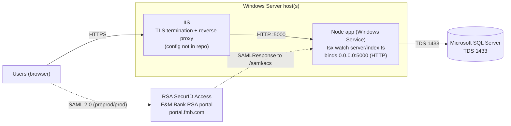
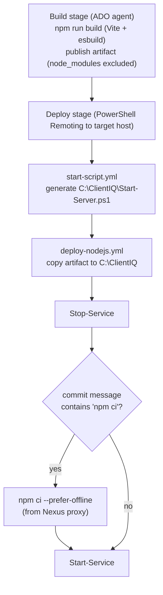

# ClientIQ / Banking Client 360: On-Premises Deployment Overview

*Last reviewed: 2026-07-01 · Source of truth: application code (ClientIQ / Banking Client 360).*

## Purpose

This is the operator-facing index and overview for deploying ClientIQ ("Banking Client 360"), an on-premises banking customer-360 CRM, to Windows Server with Microsoft SQL Server. It describes the real runtime and deployment mechanism (an Azure DevOps pipeline that deploys to a Windows Service over PowerShell Remoting) and links to the focused setup guides for each area (server setup, reverse proxy/TLS, SAML, database, environment variables).

Read this page first. It intentionally documents what the code and pipeline actually do, including several configuration realities (dev-mode runtime, single bound port, dead environment variables, out-of-band SQL schema scripts) that are easy to get wrong.

## The stack at a glance

| Layer | Technology | Notes |
|-------|-----------|-------|
| Host OS | Windows Server | App root is `C:\ClientIQ`; app runs as a Windows Service. > **[CONFIRM]** exact Windows Server version(s) in each environment. |
| Application | Node.js + TypeScript + Express (`server/`) with a React + MUI client (`client/`) | Single process; serves both the API and the client on one port. |
| Runtime launch | `npx tsx watch server/index.ts` | Runs from TypeScript **source** in watch mode, not compiled `dist/`. See [Deployed runtime reality](#deployed-runtime-reality-read-this). |
| Reverse proxy / TLS | IIS (Internet Information Services) | Terminates TLS and reverse-proxies to the Node process on HTTP `:5000`. Not defined in this repo; see [Reverse proxy and TLS](#reverse-proxy-and-tls-iis). |
| Database | Microsoft SQL Server only | Every environment. TDS on port 1433. |
| Authentication | SAML 2.0 via RSA SecurID Access (F&M Bank RSA portal) | SSO is enabled **only in preprod and prod**; dev and test use local/mock auth. |
| CI/CD | Azure DevOps pipeline (`azure-pipelines.yml`) | Deploys from ADO branches (`develop`/`test`/`preprod`/`prod`) to a Windows Service. Pushing GitHub `main` deploys nowhere. |

## Environments

There are four environments. Each of dev, test, and preprod runs a single application server plus a single SQL Server database. Production is the high-availability tier: the pipeline deploys to two application servers (`Deploy_Prod` and `Deploy_Prod2`).

| Environment | App servers | SSO (SAML) | Auth path |
|-------------|-------------|-----------|-----------|
| dev | 1 | Off (`SAML_ENABLED=false`) | Local/mock auth |
| test | 1 | Off (`SAML_ENABLED=false`) | Local/mock auth |
| preprod | 1 | On | RSA SecurID Access SSO |
| prod | 2 (`Deploy_Prod`, `Deploy_Prod2`) | On | RSA SecurID Access SSO |

> **[CONFIRM]** Production load-balancer product/VIP and the exact two-server topology (health-check path, session affinity, failover behavior). The pipeline confirms two deploy targets but the LB fronting them is not defined in the repo.

## Architecture

Notes on the diagram:

- The Node process listens on plain HTTP, host `0.0.0.0`, port `5000` (`server/index.ts:99-101`). TLS is terminated upstream by IIS. The application itself has no HTTPS listener.
- SAML endpoints (entry point, ACS callback) are all `https://` and point at the F&M Bank RSA portal host `portal.fmb.com` (`PipelineTemplates/start-script.yml:33-36`). SSO is active in preprod and prod only.

## Reverse proxy and TLS (IIS)

An IIS reverse proxy on the Windows host terminates TLS and forwards to the Node process on HTTP `:5000`. This is the front tier for all external HTTPS traffic.

Important: **no reverse-proxy configuration ships with the application repo.** There is no proxy config, site binding, or certificate material in the codebase. The evidence that an external TLS terminator is expected is indirect but clear: the Node app listens only on plain HTTP `:5000`, while all SAML URLs are `https://`. IIS binding specifics, ARR/URL-Rewrite rules, and certificate handling are managed outside this repo.

> **[CONFIRM]** IIS site bindings (hostnames/FQDNs, HTTPS binding), the reverse-proxy/ARR rule forwarding to `127.0.0.1:5000` (or the bound interface), TLS certificate subject/issuer, cert file paths, and cert owner/renewal cadence. None of this is derivable from code.

See the SSL/DNS setup guide below for certificate and DNS mapping.

## Deployed runtime reality (read this)

The runtime the pipeline actually deploys differs from the `npm start` production profile. Operators must understand this before deploying.

The pipeline generates `C:\ClientIQ\Start-Server.ps1` on the target host with:

- `NODE_ENV = "development"` for **every** environment (`PipelineTemplates/start-script.yml:15`).
- Launch command `npx tsx watch --clear-screen=false server/index.ts 2> C:\ClientIQ\logs\errors.log` (`start-script.yml:48`).

So the deployed app runs from **TypeScript source in watch mode** (`tsx watch`), not the compiled `dist/index.js`, and not with `NODE_ENV=production`. The `package.json` `start` script (`NODE_ENV=production node dist/index.js`) is **not** what the pipeline runs.

Consequences of `NODE_ENV=development` at runtime (all in `server/index.ts` / `server/vite.ts` / `server/auth/session.ts` / `server/dbConnection.ts`):

| Behavior | Effect in the deployed (dev-mode) runtime |
|----------|-------------------------------------------|
| Client serving | Served through **Vite dev middleware** (`setupVite`), not static `dist/public` (`server/index.ts:88-92`). |
| Session cookies | `secure` cookie flag is **false** (`server/auth/session.ts`). |
| Main SQL pool TLS | Trusts self-signed certificates because trust is derived from `NODE_ENV==='development'` (`server/dbConnection.ts:29`). |
| Debug routes | Dev-only debug branches in `server/routes.ts` are active. |
| Log level | Defaults to `debug` rather than `info`. |
| Auth when SAML off | The dev **mock-auth** branch injects `req.employeeId = 1` (Sarah Johnson, System Admin) (`server/index.ts:56-61`). In preprod/prod, `SAML_ENABLED=true` takes the SAML path instead. |

> **[CONFIRM]** Whether the Windows Service environment overrides `NODE_ENV` to `production` at the service level in preprod/prod. This cannot be determined from the repo. If it does not, preprod and prod run in dev mode, a real dev/prod configuration mismatch that should be resolved to align the deployed runtime with the intended production profile.

## Azure DevOps deployment pipeline

Deployments are driven by `azure-pipelines.yml` with templates in `PipelineTemplates/`. **Deploys originate from Azure DevOps branches, not from GitHub `main`.** Pushing to GitHub `main` deploys nowhere; there is no `main` trigger or `main` condition anywhere in the pipeline.

### Branch → environment mapping

| ADO branch | Deploy stage(s) | ADO environment | `SAMLRoleEnv` | DAST scan |
|-----------|-----------------|-----------------|---------------|-----------|
| `develop` | `Deploy_Dev` | `Dev` | `DEV` | No |
| `test` | `Deploy_Test` | `Test` | `TST` | Yes (after deploy) |
| `preprod` | `Deploy_Preprod` | `PreProd` | `STG` | No |
| `prod` | `Deploy_Prod` + `Deploy_Prod2` | `Prod` | `PRD` | No |

`SAMLRoleEnv` becomes the `SAML_ROLE_ENV` environment variable and scopes AD-group→role mapping to that environment (see [SAML and role mapping](#saml-and-role-mapping)). Production deploys to two servers via two separate stages, both gated on the `prod` branch.

> Note (pipeline gap as written): `prod` is not present in the `trigger:` block, yet the two `prod`-conditioned deploy stages exist. A `prod` deploy therefore comes from a manual/other trigger not declared in the pipeline file.

### Build → deploy flow

Key points:

1. The Build stage runs `npm run build` on the ADO agent and publishes the build artifact. `node_modules` is **excluded** from the artifact.
2. Each deploy stage opens a PowerShell Remoting session (`New-PSSession -ComputerName`) to the target host and copies the artifact into `C:\ClientIQ`.
3. The Windows Service is stopped, then started (`Stop-Service`/`Start-Service` on `$(serviceName)`, `PipelineTemplates/deploy-nodejs.yml`).
4. Dependency install (`npm ci`) on the target runs **only when the commit message contains the literal string `npm ci`** (`azure-pipelines.yml:59`, `deploy-nodejs.yml`). Because `node_modules` is not in the artifact, the target's dependencies are refreshed only on those commits.
5. The generated `Start-Server.ps1` is removed after the service starts.

> **[CONFIRM]** The Windows Service definition (service name per environment, how the service invokes `C:\ClientIQ\Start-Server.ps1`, the service account). The service-to-script binding is configured outside this repo.

### Security scanning in the pipeline

- **SonarQube (SAST)** runs on the `develop` branch only.
- **OWASP ZAP (DAST)** runs in the `DAST_Scan` stage after the Test deploy and **fails the build on any high-severity finding** (`PipelineTemplates/dast-scan.yml`).
- npm dependency installs pull from the private Nexus proxy registry `farmers-merchants-bank.repo.sonatype.app` (`azure-pipelines.yml:47,51`).

## SQL Server schema provisioning

The production SQL Server schema is **not** managed by `drizzle-kit` / `db:push`. That tooling targets a different (non-production) database abstraction and throws without a connection string it does not use in production. Do not run `db:push` to provision the production schema.

Instead, the schema is created and maintained by standalone, idempotent SQL Server scripts under `scripts/` and `Insert Queries/Schema Changes/`. Run these against the target SQL Server database as part of database setup.

Deployment-critical prerequisites (run in this order relative to their dependents):

| Script | Why it is required |
|--------|--------------------|
| `scripts/create_sessions_table.sql` | Creates `dbo.sessions` for the `connect-mssql-v2` session store. **Hard prerequisite when `SAML_ENABLED=true`**; SAML login fails without it. (`scripts/fix_sessions_table.sql` repairs an existing table with wrong column types.) |
| `scripts/ensure_branch_manager_role.sql` | Ensures the default SAML fallback role (`Branch Manager`) exists. |
| `scripts/ensure_rbac_provenance_columns.sql` | Adds `employee_role.assigned_by`, required for AD-group role sync/provenance. |
| `scripts/widen_employee_last_seen_saml_role.sql` | Widens the SAML role audit column to avoid a SQL truncation error (2628) that would strand SSO users. |
| `scripts/create_audit_event_table.sql` | Audit event table. |
| `scripts/create_performance_indexes.sql` | Performance indexes. |
| `Insert Queries/Schema Changes/financial_transaction_add_account_number.sql`, `financial_transaction_backfill_account_number.sql`, `note_add_cif_number.sql` | Denormalization / column additions for transactions and notes. |

> **[CONFIRM]** Reference/seed data import procedure, SQL Server backup cadence and retention, DBA-owned security configuration (logins, roles, TDE), and DBA ownership. These are operational/governance decisions not derivable from the repo.

## SAML and role mapping

SSO is provided by **RSA SecurID Access** via the **F&M Bank RSA portal** (host `portal.fmb.com`), and is enabled only in preprod and prod. The login shell prompts users to "Sign in via the F&M Bank RSA portal" (`server/routes/auth.ts`).

Configuration realities from the code:

- **Tile-launch requirement.** RSA emits a `SAMLResponse` only when SSO is launched from the ClientIQ portal tile. Direct `IdPServlet` links do not initiate SSO.
- **Signature model.** RSA SecurID Access signs the SAML **Response wrapper**, not the Assertion. The strategy therefore sets both `wantAssertionsSigned=false` and `wantAuthnResponseSigned=false` (`server/auth/samlStrategy.ts:135-139`); passport-saml accepts whichever element is signed.
- **Role assignment is convention-based from AD group names** carried in the SAML `role` attribute (`server/auth/adGroupRoleMap.ts`), keyed to the pattern `<PREFIX>_<ENV>_APP_ClientIQ_<RoleToken>_<Access>`.
- **`SAML_ROLE_ENV` scoping is required.** Because one on-prem Active Directory carries every environment's groups, `SAML_ROLE_ENV` (`DEV`/`TST`/`STG`/`PRD`) scopes which environment's AD groups are honored, preventing cross-environment role bleed. It is set per ADO stage (see the branch→environment table).
- **Default role safety net.** `SAML_DEFAULT_ROLE_NAME` (default `Branch Manager`) is assigned when no AD-group role matches, so users are not stranded on "Awaiting Role Assignment."
- **The `saml_role_mapping` DB table is dormant.** It is admin-CRUD only and does **not** drive login-time role assignment.

> **[CONFIRM]** SP/IdP metadata exchange procedure, the signing certificate (`saml_cert.pem`) owner and rotation, and the AD-group owners for each role. Cert/AD governance is not in the repo.

## Networking and ports

| Port | Protocol | Direction | Purpose |
|------|----------|-----------|---------|
| 443 | TCP | Inbound | HTTPS to IIS (TLS termination). > **[CONFIRM]** exact IIS HTTPS binding. |
| 5000 | TCP | Internal | Node application (HTTP). The single un-firewalled application port; serves both API and client. |
| 1433 | TCP | Outbound (to DB) | SQL Server (TDS). |

Binding and isolation reality:

- The app binds **`0.0.0.0:5000`** (all interfaces), not `127.0.0.1` (`server/index.ts:99-101`). The `HOST` environment variable that the deploy scripts set is **ignored** (see [Environment variable cautions](#environment-variable-cautions)).
- Port 5000 is the only port that is not firewalled; isolation of the Node process depends entirely on host/infra firewalling of every other port (per the code comment at `server/index.ts:94-97`). Do not assume the app self-restricts to loopback.

> **[CONFIRM]** Host/infra firewall rules that enforce "only 5000 open," and whether IIS reaches the app over loopback or the bound interface.

## Environment variable cautions

Full details are in the environment variable reference (linked below). Two categories matter for deployment correctness:

**Dead variables (set by the deploy scripts but never read by code).** Do not rely on them to change behavior:

- `HOST`: the server hard-codes `0.0.0.0` (`server/index.ts:101`).
- `MSSQL_PORT`: no code reads it; the SQL pool uses the default port.
- `SAML_ENTITY_ID`: no code reads it (the strategy uses `SAML_ISSUER`); its literal value also contains a stray trailing `)` (`start-script.yml:33`).
- `SAML_IDP_INITIATED_URL`: no code reads it; logout origin derives from `RSA_PORTAL_URL`/`SAML_ENTRYPOINT`.

**Divergent TLS variables.** `MSSQL_ENCRYPT` and `MSSQL_TRUST_SERVER_CERTIFICATE` are honored **only by the session store** (`server/auth/session.ts`). The main data pool hard-codes `encrypt: true` and derives certificate trust solely from `NODE_ENV==='development'` (`server/dbConnection.ts:28-29`). The deploy's `MSSQL_ENCRYPT=false` therefore affects only the session connection.

## Documentation index

| Guide | Audience | Description |
|-------|----------|-------------|
| Windows Server setup | System Admin | Node.js runtime, `C:\ClientIQ` layout, Windows Service, logging. |
| Reverse proxy (IIS) | System Admin | IIS reverse-proxy setup forwarding to Node `:5000`. No proxy config ships in the repo. |
| SSL/DNS setup | System Admin | TLS certificates and DNS mapping for the IIS HTTPS binding. |
| SAML configuration | Security Team | SAML 2.0 with RSA SecurID Access; AD-group role mapping; `SAML_ROLE_ENV` scoping. |
| Database design | Data Engineer | SQL Server schema, relationships, data model. |
| SQL Server DBA guide | Database Admin | SQL Server setup, security, maintenance, backups. |
| Environment variables | All | Complete environment configuration reference, including dead/divergent variables. |
| Troubleshooting | All | Common issues and resolutions. |
| Dev/test server setup | System Admin | Dev and test deployment (local/mock auth; `SAML_ENABLED=false`). |

> **[CONFIRM]** Final filenames/links for each companion guide once published alongside this overview.

## Deployment checklist

**Pre-deployment**

- [ ] Windows Server host(s) provisioned. > **[CONFIRM]** minimum/recommended CPU, RAM, and disk (capacity numbers not derivable from the repo).
- [ ] SQL Server instance reachable on TCP 1433 with a service login. > **[CONFIRM]** SQL Server edition/version and sizing.
- [ ] DNS record and TLS certificate for the IIS HTTPS binding. > **[CONFIRM]** hostname/FQDN and cert.
- [ ] IIS reverse proxy configured to forward HTTPS → Node `:5000`.
- [ ] For preprod/prod: RSA SecurID Access SP/IdP metadata exchanged; `saml_cert.pem` in place; portal tile configured.
- [ ] Host/infra firewall rules: 443 inbound to IIS, 1433 outbound to SQL Server, all ports except 5000 firewalled on the app host.
- [ ] Node.js LTS installed. > **[CONFIRM]** the exact Node.js version supported.

**Deployment**

- [ ] Provision the SQL Server schema via the `scripts/` and `Insert Queries/Schema Changes/` SQL files (not `db:push`). Confirm `dbo.sessions` exists before enabling SAML.
- [ ] Deploy from the correct ADO branch for the target environment (`develop`/`test`/`preprod`/`prod`), not GitHub `main`.
- [ ] Confirm the Windows Service is installed and bound to `C:\ClientIQ\Start-Server.ps1`.
- [ ] For preprod/prod, set `SAML_ENABLED=true` and the correct `SAML_ROLE_ENV` (`STG`/`PRD`) for the environment.

**Post-deployment verification**

- [ ] HTTPS reachable through IIS. > **[CONFIRM]** production URL/FQDN.
- [ ] For preprod/prod: launching the ClientIQ portal tile redirects to RSA and returns a valid session; role is assigned from AD groups.
- [ ] SQL Server queries execute; session store (`dbo.sessions`) is populated on login.
- [ ] Application logs are written to `C:\ClientIQ\logs\errors.log`.
- [ ] Prod: both `Deploy_Prod` and `Deploy_Prod2` targets are serving and behind the load balancer.

## Support contacts

> **[CONFIRM]** Support-contact addresses and escalation tiers (Application Support, DBA, Security/SSO, Infrastructure). In-repo hosts indicate the deployed organization is Farmers & Merchants Bank (`portal.fmb.com`, `farmers-merchants-bank.repo.sonatype.app`); replace any `yourbank.com`-style placeholders with the real bank domain. Ownership/contact governance is not derivable from the repo.

## Version history

| Item | Value |
|------|-------|
| Application version | 1.0.0 (`package.json`) |
| Document version | > **[CONFIRM]** documentation revision and owner. This is a documentation version, distinct from the application version. |

*The application version above (1.0.0) is the value in `package.json`. The documentation revision is a separate number and must be set by the doc owner.*
