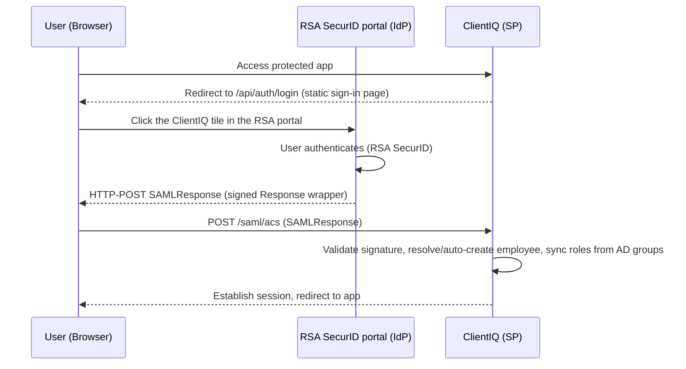

# SAML 2.0 SSO Configuration Guide

*Last reviewed: 2026-07-01 · Source of truth: application code (ClientIQ / Banking Client 360).*

## Purpose

This is the operator/administrator guide for configuring SAML 2.0 single sign-on (SSO) between ClientIQ (the Service Provider) and the bank's RSA SecurID Access identity provider. It covers the Service Provider environment variables, IdP metadata and attribute release, login-time role synchronization, testing, security settings, and troubleshooting.

Scope note on environments: SAML SSO is enabled **only in preprod and prod**. In **dev and test** the master switch `SAML_ENABLED` is `false`, and the application uses a local/mock authentication path instead of SSO. None of the SAML configuration in this guide is active there. Configure SAML only for the preprod and prod deployments.

> **[CONFIRM]** Current document owner and governance sign-off. The prior byline ("Haroun Ahmady, Apr 14, 2026") cannot be verified from code; confirm the responsible owner and re-stamp the last-reviewed date after any further change.

---

## 1. Architecture

ClientIQ is the SAML Service Provider (SP). The IdP is **RSA SecurID Access**, fronted by the F&M Bank RSA portal. RSA emits a `SAMLResponse` **only when the user launches the ClientIQ tile from the portal**; the SP does not initiate an interactive `AuthnRequest` flow against this IdP in normal use (see Section 6, Login entry points).



The Node/Express app listens on plain HTTP `:5000`; TLS is terminated by **IIS** in front of the Node process (see the Deployment guide). All SAML endpoint URLs registered with the IdP are therefore `https://`, terminating at IIS.

> **[CONFIRM]** IIS site bindings, ARR/reverse-proxy rules, and the public FQDN used for the SP (`SAMLHost`) per environment. These are not defined in the repository.

---

## 2. Prerequisites

1. RSA SecurID Access administrator access, or coordination with the RSA/IdP team, for the target environment (preprod or prod).
2. The IdP signing certificate (X.509, PEM).
3. A public HTTPS endpoint for the SP, fronted by IIS, resolvable by the IdP and by users.
4. The SP entity ID / issuer value agreed with the IdP team.

Single Logout (SLO) is optional. ClientIQ derives its logout redirect from `RSA_PORTAL_URL` / `SAML_ENTRYPOINT` rather than a dedicated logout-URL variable; if the IdP provides no logout capability, logout degrades to destroying the local ClientIQ session (see Section 6.4).

> **[CONFIRM]** IdP signing certificate owner, storage location, renewal cadence, and the RSA/IdP-team contact for coordinating metadata exchange.

---

## 3. Environment Variables (Service Provider)

Set these on the target host (preprod/prod). In the Azure DevOps deployment, `PipelineTemplates/start-script.yml` writes `C:\ClientIQ\Start-Server.ps1` on the target with these values sourced from pipeline variable groups (`$(SAMLEnabled)`, `$(SAMLHost)`, `$(SAMLIssuer)`, `$(SAMLRoleEnv)`, `$(SessionSecret)`, etc.).

| Variable | Required | Default | Purpose |
|---|---|---|---|
| `SAML_ENABLED` | Yes (to turn SSO on) | off unless exactly `'true'` | Master switch. When `=== 'true'`, mounts the session store, passport, the SAML strategy, and the global auth gate. Must be `true` in preprod/prod; `false` in dev/test (`server/index.ts:21`). |
| `SAML_ENTRYPOINT` | Yes | none (non-null asserted) | IdP SSO entry-point URL; the strategy's `entryPoint`. Also used to derive the RSA portal origin when `RSA_PORTAL_URL` is unset (`server/auth/samlStrategy.ts:130`, `server/routes/auth.ts:47`). |
| `SAML_ISSUER` | No | `'ClientIQ-Production'` | SP entity ID / issuer sent to the IdP (`server/auth/samlStrategy.ts:128`). |
| `SAML_CALLBACK_URL` | Yes | none (non-null asserted) | SP ACS URL registered with the IdP; the strategy's `callbackUrl` (`server/auth/samlStrategy.ts:129`). |
| `SAML_CERT` | Yes | none (throws if unset) | IdP signing certificate. **Inline PEM** if the value contains `BEGIN CERTIFICATE`; otherwise treated as a **file path** (absolute or resolved against the process CWD). BOM/CRLF tolerant; validated for `BEGIN`/`END` markers (`server/auth/samlStrategy.ts:16-91`). |
| `RSA_PORTAL_URL` | No | derived; final fallback `https://portal.fmb.com/WebPortal/` | Explicit RSA portal URL the sign-in page links to and the logout redirect target. Must parse as `https:`; if unset/invalid, `${SAML_ENTRYPOINT origin}/WebPortal/` is derived (`server/routes/auth.ts:38-52`). |
| `SAML_ROLE_ENV` | No (recommended in preprod/prod) | unset means all environments honored | Scopes AD-group→role mapping to one deployment environment (`DEV`/`TST`/`STG`/`PRD`; aliases below). See Section 5.3 (`server/auth/adGroupRoleMap.ts:78-163`, `server/routes/auth.ts:362`). |
| `SAML_DEFAULT_ROLE_NAME` | No | `'Branch Manager'` (trimmed) | Fallback role applied when AD groups map to no role, and by the "never strand a user" safety net (`server/routes/auth.ts:357,416`). See Section 5.4. |
| `SESSION_SECRET` | Yes | none (non-null asserted) | `express-session` signing secret. The session middleware is only mounted when SAML is enabled, so this is required in preprod/prod (`server/auth/session.ts:34`). |

### 3.1 Variables the code does NOT read

The following do **not** exist in the codebase and must not be set with any expectation of effect. If present in older `.env` files or notes, remove them:

- `SAML_LOGOUT_URL`, `SAML_LOGOUT_CALLBACK_URL`: no code reference. Logout targets are derived from `RSA_PORTAL_URL` / `SAML_ENTRYPOINT`; the logout callback is the fixed route `/saml/logout/callback`.
- `SAML_DECRYPT_KEY`: no code reference. The strategy sets no `decryptionPvk`; **encrypted assertions are not supported.**
- `SAML_ATTR_*` (e.g. `SAML_ATTR_EMPLOYEE_ID`, `SAML_ATTR_ROLE`, …): no code reference. Attribute URIs are hardcoded (see Section 4.2); changing them requires a code edit.
- `SESSION_TIMEOUT`: no code reference. Session lifetime is hardcoded (see Section 7).

The deploy pipeline additionally sets `SAML_ENTITY_ID` and `SAML_IDP_INITIATED_URL`, but **no code reads either**; they are inert (`PipelineTemplates/start-script.yml`). The strategy uses `SAML_ISSUER`, not `SAML_ENTITY_ID`.

### 3.2 Certificate handling

`SAML_CERT` accepts either an inline PEM string or a file path. In the pipeline it is set to `./saml_cert.pem` (relative to `C:\ClientIQ`). The loader:

- Reads the file (or uses the inline value), stripping a UTF-8 BOM and decoding UTF-16LE if present.
- Normalizes CRLF/CR to LF and trims.
- Requires both `-----BEGIN CERTIFICATE-----` and `-----END CERTIFICATE-----` markers; throws otherwise.
- Logs, for IdP-team confirmation, the cert length, cert count, whether a BOM was present, the **SHA-256 fingerprint** of the first cert, and parsed X.509 details (subject, issuer, validFrom/validTo, serial, public-key algorithm/bit length).

Because inline PEM is auto-detected by the presence of `BEGIN CERTIFICATE`, you may supply the full multi-line PEM directly; stripping the header/footer to a single base64 line is **not** required (`server/auth/samlStrategy.ts:23-91`).

> **[CONFIRM]** On-host certificate file path/permissions and the certificate rotation process per environment.

---

## 4. IdP Configuration (RSA SecurID Access)

### 4.1 SP metadata and manual settings

The SP exposes metadata (generated by the passport-saml strategy) at:

```
https://<clientiq-host>/saml/metadata
```

(also reachable at `/api/auth/saml/metadata`; see Section 6.5). If you provide settings manually to the IdP team instead:

| Setting | Value |
|---|---|
| Entity ID / Issuer | value of `SAML_ISSUER` (default `ClientIQ-Production`) |
| ACS URL | value of `SAML_CALLBACK_URL` (e.g. `https://<clientiq-host>/saml/acs`) |
| ACS Binding | HTTP-POST |
| NameID Format | `urn:oasis:names:tc:SAML:2.0:nameid-format:persistent` |
| Response signing | RSA signs the **Response wrapper** (see Section 8) |

The SP requests the **persistent** NameID format (`identifierFormat`, `server/auth/samlStrategy.ts:133`). Email is resolved from the `emailaddress` attribute, falling back to `profile.nameID` if that attribute is absent; if neither resolves, the login fails with `SAML profile missing email/nameID` (`server/auth/samlStrategy.ts:163,176-179`).

### 4.2 Required attributes

The SP reads attributes by **short name first** (RSA SecurID for ClientIQ uses `NameFormat=basic` short names), then falls back to the long-form claim URI. Both are hardcoded in `ATTRIBUTE_MAP` (`server/auth/samlStrategy.ts:95-103`) and are **not** environment-overridable.

| Attribute | Long-form claim URI (fallback) | Required | Notes |
|---|---|---|---|
| Employee ID | `.../claims/employeeid` | Recommended | Used to derive `employee_number`. |
| Employee Number | `.../claims/employeenumber` | Recommended | Preferred source for `employee_number`. |
| First Name | `.../claims/givenname` | No | Defaults to email local-part / `Unknown`. |
| Last Name | `.../claims/surname` | No | Defaults to email local-part / `User`. |
| Email | `.../claims/emailaddress` | **Yes** (or NameID) | Login fails if neither email nor NameID resolves. |
| Department | `.../claims/department` | No | Backfilled onto the employee row if empty. |
| Role (AD groups) | `.../claims/role` | Yes for role assignment | **Carries the user's AD group list**, not a single role. Parsed into individual groups; drives role mapping (Section 5). |

Important: the `role` attribute delivers the user's **AD group membership list** (typically a quoted, comma/semicolon-separated string). It is *not* an application role name. Do not release a free-text role such as `Relationship_Manager` and expect it to map. Role assignment is driven by AD **group names** that follow the convention in Section 5.

---

## 5. Role assignment on login (AD-group convention)

Role assignment at login is **convention-based**: it derives application roles from the **names of the AD groups** delivered in the `role` attribute. It does **not** read any database mapping table. The relevant code is `server/auth/adGroupRoleMap.ts` (mapping) invoked from the ACS handler `server/routes/auth.ts:363-368`, with the enforced sync in `server/storage/sqlServerEmployee.ts`.

> The `saml_role_mapping` database table is **not on the login path** (see Section 5.5). Do not configure login role assignment by inserting rows into it.

### 5.1 AD group naming convention

Groups follow:

```
<PREFIX>_<ENV>_APP_ClientIQ_<RoleToken>_<Access>
```

Examples (`server/auth/adGroupRoleMap.ts:5-15`):

| AD group | Resolves to |
|---|---|
| `CTRL_PRD_APP_ClientIQ_BranchManager_MOD` | Branch Manager |
| `CTRL_STG_APP_ClientIQ_Teller_RO` | Teller |
| `CTRL_TST_APP_ClientIQ_AppAdmin_ADM` | System Admin |
| `IAM_PRD_APP_RSA_ClientIQ_GEN_EXEC` | (access entitlement only, no role) |

Only the `<RoleToken>` segment selects a role. The `<ENV>` segment (`DEV`/`TST`/`STG`/`PRD`) and the `<Access>` suffix (`RO`/`RW`/`MOD`/`ADM`/`EXEC`) do not affect which role is chosen (the ENV segment is used only for scoping; see Section 5.3). Matching is case-insensitive.

### 5.2 Token to application-role map

The right-hand role names must exist as rows in the `role` table (resolved case-insensitively, trimmed, `is_active = 1`). Source: `AD_GROUP_TOKEN_TO_ROLE` (`server/auth/adGroupRoleMap.ts:41-58`).

| AD role token | Application role |
|---|---|
| `appsvcs` | System Admin |
| `appadmin` | System Admin |
| `branchmanager` | Branch Manager |
| `businessbanker` | BRS |
| `assistantmanager` | BRS |
| `loanofficer` | Loan Officer |
| `risk` | Risk Analyst |
| `compliance` | Compliance Officer |
| `teller` | Teller |
| `dataanalyst` | Teller |

Notes:
- The admin token differs by environment (`AppAdmin` in dev/test/prod, `APPSVCS` in preprod), so both map to System Admin.
- `GEN` is an **access-only** entitlement token (`ACCESS_ONLY_TOKENS`): it grants "may access the app" but no role. A user holding only `GEN`/RSA access falls back to the default role (Section 5.4).
- Groups matching the ClientIQ pattern but carrying an unknown token are recorded as `unmatched` (logged, no role assigned).

### 5.3 Environment scoping: `SAML_ROLE_ENV`

The bank runs **one on-prem Active Directory**, so a user is typically a member of the ClientIQ groups for *every* environment at once (both `STG` and `PRD`, for example). Without scoping, preprod would honor a user's `PRD` groups and prod would honor their `STG` groups. `SAML_ROLE_ENV` restricts role selection to groups whose `<ENV>` segment matches the target environment.

Set per environment via the deploy pipeline (`SAMLRoleEnv` variable):

| Environment | `SAML_ROLE_ENV` |
|---|---|
| dev (SSO off) | `DEV` |
| test (SSO off) | `TST` |
| preprod | `STG` |
| prod | `PRD` |

Normalization (`normalizeRoleEnv`, `server/auth/adGroupRoleMap.ts:78-86`) accepts aliases:
- `DEV` / `DEVELOPMENT` → `DEV`
- `TST` / `TEST` → `TST`
- `STG` / `STAGE` / `STAGING` / `PRE` / `PREPROD` / `PRE-PROD` → `STG`
- `PRD` / `PROD` / `PRODUCTION` → `PRD`
- unset or unknown → unscoped (every environment's groups are honored)

Example: a user who is `Teller` in `STG` and `Branch Manager` in `PRD` resolves to **Teller in preprod** and **Branch Manager in prod**. Groups whose env does not match `SAML_ROLE_ENV` are recorded as `ignoredOtherEnv` (logged, skipped).

### 5.4 Default role and the "never strand a user" safety net

`SAML_DEFAULT_ROLE_NAME` (default `'Branch Manager'`) is the fallback role. There are two independent fallbacks, both defaulting to `Branch Manager`:

1. **Inside the AD sync**: if the AD groups map to no role, or the mapped role names do not exist in the `role` table, the sync applies the default role (`server/routes/auth.ts:357,365-368`; `server/storage/sqlServerEmployee.ts`).
2. **Bulletproof ACS fallback**: after loading permissions, if the user still has zero roles, `ensureEmployeeHasDefaultRoleSqlServer` grants the default role via a column-safe INSERT (`server/routes/auth.ts:412-424`). This guards against an AD group matching nothing, a sync error, or a nightly ETL that emptied `employee_role`.

An authenticated RSA user is therefore never left role-less **unless the default role itself is missing from the `role` table**, in which case the session flag `defaultRoleMissing` is set true and the SPA surfaces that distinctly from "Awaiting Role Assignment" (`server/routes/auth.ts:428-430`). If the default role is not found, the log lists all available active role names so you can correct `SAML_DEFAULT_ROLE_NAME` or seed the role.

### 5.5 Enforced revoke-on-login and role provenance

Login role sync is **enforced** and idempotent (`syncEmployeeRolesFromAdGroupsSqlServer`, `server/storage/sqlServerEmployee.ts`):

- **AD/SAML-derived roles** are marked by `assigned_by IS NULL`. On each login, an AD-derived role whose group is no longer present (within the scoped env) is **deactivated**.
- **Admin-granted roles** (`assigned_by IS NOT NULL`) are **never touched** by sync.
- A login with unchanged groups performs no writes.
- Every assign/revoke is recorded in `employee_role_history` (`source='saml'`) as a best-effort audit.

Employees are **auto-provisioned** on first SAML login. Resolution matches on `sso_subject`, then `email`, then `employee_number`; if none match, a new active employee row is created. This is considered safe because RSA already gates who can authenticate.

### 5.6 `saml_role_mapping` table: admin-managed, NOT used at login

The `saml_role_mapping` table exists and is editable through admin CRUD routes (`/api/admin/saml-mappings`, gated by `user_management.*` permissions), but it **does not drive role assignment on login**. Its service method `processSamlRole` (`server/services/samlRoleMappingService.ts`) is never invoked anywhere in the login path. The table is part of the ORM abstraction layer and is not read by the SQL Server login flow. Do not use it to configure SSO role assignment; use the AD-group convention above.

---

## 6. SAML endpoints and login flow

SP endpoints are mounted at **both** the top level (`/saml/*`) and under `/api/auth` (`/api/auth/saml/*`), so `/saml/acs` and `/api/auth/saml/acs` both resolve. The top-level mount matches the RSA IdP's POST target. All `/saml/*` responses are `no-store`/`no-cache`.

| Endpoint | Method | Path(s) | Description |
|---|---|---|---|
| Sign-in page | GET | `/api/auth/login` | Renders the static sign-in page linking to the RSA portal (primary entry point). |
| SP-initiated login | GET | `/saml/login`, `/api/auth/saml/login` | `passport.authenticate('saml')` redirect to the IdP entry point. See note below. |
| ACS | POST | `/saml/acs`, `/api/auth/saml/acs` | Receives and validates the `SAMLResponse`; establishes the session and syncs roles. |
| Metadata | GET | `/saml/metadata`, `/api/auth/saml/metadata` | SP metadata via `generateServiceProviderMetadata`. |
| Logout | GET | `/saml/logout`, `/api/auth/saml/logout` | Emits `AUTH_LOGOUT`, calls the strategy logout, destroys the session. |
| Logout callback | GET | `/saml/logout/callback` | Redirects to the SPA login path. |
| Status | GET | `/api/auth/status` | Reports `isAuthenticated`, `employeeId`, `email`, `isLinked`, `samlEnabled`, `defaultRoleMissing`. |
| App logout | POST | `/api/auth/logout` | Clears the session and the `clientiq.sid` cookie. |

There is **no** `/api/auth/session` endpoint; use `/api/auth/status` (`server/routes/auth.ts:183`).

### 6.1 Login entry points

`GET /api/auth/login` is the primary entry point. When SAML is enabled it renders a **static sign-in page** directing the user to the RSA portal (`resolveRsaPortalUrl()`). The user must **click the ClientIQ tile in the RSA portal**; RSA emits a `SAMLResponse` only when the app is launched from the tile. Auto-redirecting to `IdPServlet` does **not** initiate SSO. `GET /saml/login` (`passport.authenticate('saml')`) exists for SP-initiated redirect, but with this IdP it does not by itself produce a login; the portal-tile launch is the working flow (`server/routes/auth.ts:122-153`).

The global auth gate redirects unauthenticated browser navigations to `/api/auth/login` and returns `401` for API/XHR calls. It allowlists `/api/auth/*`, `/saml/*`, `/assets/*`, `/IdPServlet`, `/health`, and `/favicon.ico` (`server/middleware/authGate.ts`).

### 6.2 ACS processing (`POST /saml/acs`)

On receiving the `SAMLResponse` the handler (`server/routes/auth.ts:264-476`):

1. Validates the response signature (via `SAML_CERT`), clock skew, etc.
2. On error or no user → audits `AUTH_LOGIN_FAILED` → redirects to the SPA login page with a `login_error` reason.
3. Regenerates the session (fixation defense) and logs in.
4. Resolves or auto-creates the employee (Section 5.5).
5. Runs AD-group role sync + default-role fallback (Section 5).
6. Populates the session, loads permissions, applies the bulletproof default-role fallback if needed.
7. Audits `AUTH_LOGIN_SUCCESS` and redirects into the app.

### 6.3 Session establishment

The session uses `express-session` backed by a SQL Server session store (`connect-mssql-v2`), configured from `MSSQL_*` (falling back to `DB_*`) variables (`server/auth/session.ts`). See Section 7 for lifetime and cookie details.

### 6.4 Logout

`GET /saml/logout` audits `AUTH_LOGOUT`, calls the strategy's `logout`, destroys the local session, and redirects to the IdP logout URL, or, if the strategy exposes no logout, to the SPA login path. The redirect target derives from `RSA_PORTAL_URL` / `SAML_ENTRYPOINT`; there is no dedicated logout-URL variable. `POST /api/auth/logout` performs a local session destroy and clears the `clientiq.sid` cookie.

### 6.5 Metadata

`GET /saml/metadata` returns SP metadata generated by the passport-saml strategy. Provide this URL (or the saved XML) to the RSA/IdP team.

---

## 7. Session security and lifetime

- Sessions are **regenerated** after successful authentication (fixation defense).
- Cookie is `httpOnly`; `secure` is set only when `NODE_ENV === 'production'`. Note the deployed runtime runs with `NODE_ENV=development`, so the `secure` flag is not set at the app layer; TLS is enforced at IIS (see the Deployment guide).
- Cookie `sameSite` is **`lax`** (deliberate: `strict` would break the cross-site HTTP-POST binding to `/saml/acs` and cause a re-auth loop).
- Cookie name is **`clientiq.sid`**.
- **Idle timeout is a hardcoded 1-hour rolling cookie** (`maxAge` 3,600,000 ms, refreshed on activity). The **server-side store TTL is 12 hours**, with expired sessions swept every 15 minutes. These are changeable only in code (`server/auth/session.ts:28-45`).
- There is **no** `SESSION_TIMEOUT` variable. The only session-related environment variable is the required `SESSION_SECRET`.

---

## 8. Security settings (as configured in code)

These reflect the actual strategy options in `server/auth/samlStrategy.ts:127-151`. RSA SecurID Access signs the **Response wrapper**, not the individual assertion, so both "want signed" flags are `false`; passport-saml still requires at least one signed element and validates the signed Response.

| Setting | Value | Notes |
|---|---|---|
| `wantAssertionsSigned` | `false` | RSA signs the Response wrapper, not the assertion. |
| `wantAuthnResponseSigned` | `false` | Same reason. At least one signed element is still required. |
| `signatureAlgorithm` | `'sha256'` | No separate `digestAlgorithm` option is set. |
| `audience` | `false` | **Audience restriction is NOT validated.** |
| `acceptedClockSkewMs` | `10000` | **10 seconds**, not 5 minutes. Keep servers NTP-synchronized. |
| `validateInResponseTo` | `never` | InResponseTo correlation is not validated. |
| `identifierFormat` | `...:2.0:nameid-format:persistent` | Requested NameID format. |
| `disableRequestedAuthnContext` | `true` | |
| `skipRequestCompression` | `true` | |
| `forceAuthn` | `false` | |

Encrypted assertions are **not supported** (no `decryptionPvk` / `SAML_DECRYPT_KEY`). If the IdP encrypts assertions, coordinate to disable encryption for the ClientIQ SP.

> **[CONFIRM]** Whether the audience-restriction and InResponseTo settings meet the bank's SAML security/compliance posture. These are relaxed deliberately to match the current RSA integration; confirm with the security team before hardening.

---

## 9. Testing

### 9.1 Fetch SP metadata

```powershell
Invoke-WebRequest -Uri "https://<clientiq-host>/saml/metadata" `
    -OutFile "C:\ClientIQ\certs\sp-metadata.xml"
Get-Content "C:\ClientIQ\certs\sp-metadata.xml"
```

### 9.2 Test the login flow

1. Navigate to the app; you are redirected to `/api/auth/login` (the static sign-in page).
2. Go to the **RSA SecurID portal** and click the **ClientIQ tile** (this is what makes RSA emit a `SAMLResponse`; there is no in-app "Sign In with SSO" button that initiates SSO with this IdP).
3. Authenticate with RSA SecurID.
4. RSA POSTs the `SAMLResponse` to `/saml/acs`; you are redirected into ClientIQ, logged in with roles resolved from your AD groups.
5. Verify session and role resolution via `GET /api/auth/status` (`isAuthenticated`, `isLinked`, `defaultRoleMissing`).

### 9.3 Inspect logs

On strategy startup the app logs the resolved SAML config (`entryPoint`, `callbackUrl`, `issuer`, cert fingerprint/X.509 details) and both `SAML_ROLE_ENV_received` vs `SAML_ROLE_ENV_resolved`. The ACS handler logs a rich role-sync diagnostic per login (resolved env, group count, desired roles, assigned/revoked, `usedFallback`, unmatched, ignored-other-env).

> **[CONFIRM]** Log file locations and log-viewing procedure on the IIS/Windows hosts (the repo does not define the on-host log paths for preprod/prod).

---

## 10. Troubleshooting

**"Invalid Signature" error**
1. Verify `SAML_CERT` is the correct, complete IdP signing certificate (check the SHA-256 fingerprint logged at startup against what the IdP team expects).
2. Confirm the certificate has not expired (startup log prints validFrom/validTo).
3. Ensure the RSA IdP is signing the **Response wrapper** with SHA-256.

**"Missing email/nameID" / user not created**
1. Confirm the IdP releases the `emailaddress` attribute, or that a usable NameID is present; login fails without one.
2. Verify SQL Server connectivity (employee upsert and session store both require it).
3. Users are **auto-provisioned** on first login (matched by `sso_subject` / `email` / `employee_number`); a numeric employee ID is **not** required.

**User logs in but has no/incorrect roles**
1. Confirm the user's AD groups follow the `<PREFIX>_<ENV>_APP_ClientIQ_<RoleToken>_<Access>` convention and that the RoleToken maps (Section 5.2).
2. Verify `SAML_ROLE_ENV` matches the target environment; otherwise the user's groups for other environments are ignored.
3. Check the ACS role-sync log for `unmatched` (unknown token) and `ignoredOtherEnv` (wrong env) entries.
4. If the user has the default role unexpectedly, their groups matched nothing for this env, which is expected fallback behavior.

**"Awaiting Role Assignment" or `defaultRoleMissing`**
1. `defaultRoleMissing = true` means even the default role (`SAML_DEFAULT_ROLE_NAME`, default `Branch Manager`) could not be applied; the role is absent from the `role` table. Seed it or correct the variable (the startup/ACS log lists available role names).

**Redirect loop**
1. Confirm the ACS URL registered with the IdP matches `SAML_CALLBACK_URL`.
2. Verify IIS is forwarding correct headers/host to the Node app so cookies are set on the correct host.
3. Confirm the `clientiq.sid` cookie is being set (browser dev tools). `sameSite=lax` is required for the POST-then-GET chain.

**Logout not fully clearing IdP session**
1. ClientIQ destroys the local session on logout; the RSA IdP session may persist if the IdP does not honor SP-initiated SLO.
2. The logout redirect derives from `RSA_PORTAL_URL` / `SAML_ENTRYPOINT`; confirm those are correct.

---

## 11. Next steps / related docs

1. Deployment guide (IIS, Azure DevOps branches `develop`/`test`/`preprod`/`prod`, Windows Service).
2. RBAC / role and privilege model.
3. Environment Variable Reference.

> **[CONFIRM]** Document version. No authoritative doc version exists in the repository; the application `package.json` version is `1.0.0`.
