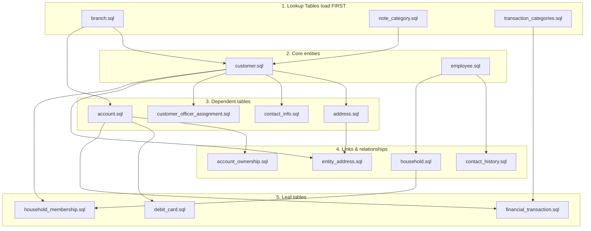

# SQL Server DBA Setup: ClientIQ / Banking Client 360

*Last reviewed: 2026-07-02. Source of truth: application code*

## Purpose / Overview

This runbook is for Database Administrators standing up or maintaining the **ClientIQ** (Banking Client 360) database on **Microsoft SQL Server**. ClientIQ is an on-prem banking customer-360 CRM. SQL Server is the **only** production database engine in every environment (dev, test, preprod, prod); the Node/Express application connects to it through the `mssql` driver.

This guide covers database creation, schema materialization, the ClientIQ-specific prerequisite scripts the application requires, the SAML/RBAC bootstrap, security, backup, index/statistics maintenance, monitoring, connection configuration, and disaster recovery.

> **Read this first: the schema is *not* built from a single consolidated DDL file.** Earlier versions of this guide referenced `database-scripts/v3/schema/sqlserver-schema-v3.sql` and `sqlserver-test-data-v3.sql`. **Neither file exists in the repository.** The physical SQL Server schema is materialized by out-of-band DDL together with the standalone scripts under `scripts/` and `Insert Queries/Schema Changes/` documented below. Do not look for a v3 schema script.

---

## 1. How ClientIQ Connects to SQL Server (read before configuring)

Understanding the runtime connection behavior is essential before you provision logins or set TLS policy, because the deployed app does **not** behave like a conventional hardened production connection.

### 1.1 Main data pool

`server/dbConnection.ts` builds one `mssql` `ConnectionPool` (`server/dbConnection.ts:17-44`).

| Config key | Value | Source |
|---|---|---|
| `user` | `MSSQL_USER` \|\| `DB_USER` | env |
| `password` | `MSSQL_PASSWORD` \|\| `DB_PASSWORD` | env |
| `server` | `MSSQL_SERVER` \|\| `DB_SERVER` \|\| `'localhost'` | env |
| `database` | `MSSQL_DATABASE` \|\| `DB_NAME` \|\| `'ClientIQ'` | env |
| `options.encrypt` | **hard-coded `true`** | code |
| `options.trustServerCertificate` | **`NODE_ENV === 'development'`** | code |
| `options.enableArithAbort` | `true` | code |
| `connectTimeout` / `requestTimeout` | `30000` ms each | code |
| pool | `max: 10, min: 0, idleTimeoutMillis: 30000` | code |

The pool is a lazily-initialized module-level singleton, reused while `connected` (`server/dbConnection.ts:12,18-20`).

> **Important, and a security consideration for the DBA.** The main pool **ignores** `MSSQL_ENCRYPT` and `MSSQL_TRUST_SERVER_CERTIFICATE`. It always sets `encrypt: true`, and it decides certificate trust **solely** from `NODE_ENV`. All deploy/start scripts run with **`NODE_ENV=development`** (`PipelineTemplates/start-script.yml`), so the deployed application connects with `trustServerCertificate: true`, meaning it will **trust a self-signed SQL Server certificate**. If you present a self-signed cert on the SQL Server, connections still succeed; if you require the app to validate a CA-issued cert, that is not achievable through configuration alone today (it is gated by `NODE_ENV`).

### 1.2 Session-store connection (SAML environments only)

The SAML session store (`connect-mssql-v2`) opens its **own** connection in `server/auth/session.ts` and is the **only** consumer of `MSSQL_ENCRYPT` and `MSSQL_TRUST_SERVER_CERTIFICATE`:

- `MSSQL_ENCRYPT`: encrypt enabled unless exactly `'false'` (`server/auth/session.ts:15`).
- `MSSQL_TRUST_SERVER_CERTIFICATE`: trust if `'true'` **or** `NODE_ENV==='development'` (`server/auth/session.ts:16`).

The session store is mounted only when `SAML_ENABLED=true` (preprod and prod). Deploy scripts set `MSSQL_ENCRYPT=false` and `MSSQL_TRUST_SERVER_CERTIFICATE=true`, which affects **only** this session connection, not the main pool.

### 1.3 Two independent engine switches (both default to the non-SQL-Server path)

Two subsystems each read a **different** env var to pick the engine, and **each defaults away from SQL Server if unset**. Deployments must set **both**:

| Switch | Env var | Deploy value | Read at | Default if unset |
|---|---|---|---|---|
| DB config / helpers | `DATABASE_DIALECT` | `sqlserver` | `server/dbConfig.ts:13` | non-SQL-Server |
| Search provider | `DB_VENDOR` | `mssql` | `server/adapters/search/SearchProviderFactory.ts:25` | non-SQL-Server (with warning) |

Setting one does **not** set the other. If `DB_VENDOR` is missing, the search subsystem selects the wrong provider even though the main data pool is hard-wired to SQL Server. The code accepts either `mssql` or `sqlserver` for `DB_VENDOR`; the start scripts use `mssql`.

### 1.4 Deployment context

The app is deployed by **Azure DevOps** as a **Windows Service** under `C:\ClientIQ`, launched via `tsx` with `NODE_ENV=development`, serving both API and client on **HTTP port 5000**. IIS (not covered here) fronts the Node process and terminates TLS. Deploys come from ADO branches (`develop` / `test` / `preprod` / `prod`); pushing GitHub `main` deploys nowhere. **prod** is the HA tier (two app servers, `Deploy_Prod` + `Deploy_Prod2`); dev, test, and preprod each run a single app server plus a single SQL Server database.

> **[CONFIRM]** Exact SQL Server host FQDN(s) per environment, instance names, and listener/port for prod. `MSSQL_PORT` is set in deploy scripts but is a **dead variable**: no code reads it, and the `mssql` pool uses the driver default (1433). Do not rely on it to change the port.

---

## 2. Prerequisites

- Microsoft SQL Server (on-prem, Windows Server). Version/edition per environment build.
- SQL Server Management Studio (SSMS) or `sqlcmd` for running the scripts below.
- `sysadmin` (or equivalent) on the target instance to create the database, logins, and objects.
- Access to the repository so you can run the actual `.sql` scripts under `scripts/` and `Insert Queries/`.

> **[CONFIRM]** Supported/target SQL Server major version, edition, and compatibility level for each environment. The database-settings block in §4 uses values (e.g. compatibility level 160) that must be validated against the real server build before applying.

---

## 3. Step 1: Create the Database

The following is a starting template. **Drive letters, file sizes, growth, and log sizing are infrastructure decisions and are not derivable from the repository.** Confirm before use.

```sql
-- Adjust FILENAME drive paths and sizes to your server's storage layout.
CREATE DATABASE ClientIQ
ON PRIMARY (
    NAME     = 'ClientIQ_Data',
    FILENAME = 'D:\SQLData\ClientIQ.mdf',
    SIZE     = 500MB, MAXSIZE = UNLIMITED, FILEGROWTH = 100MB
),
FILEGROUP [ClientIQ_Index] (
    NAME     = 'ClientIQ_Index',
    FILENAME = 'D:\SQLData\ClientIQ_Index.ndf',
    SIZE     = 200MB, MAXSIZE = UNLIMITED, FILEGROWTH = 50MB
)
LOG ON (
    NAME     = 'ClientIQ_Log',
    FILENAME = 'E:\SQLLogs\ClientIQ.ldf',
    SIZE     = 200MB, MAXSIZE = 2GB, FILEGROWTH = 50MB
);
GO
```

> **[CONFIRM]** Data/index/log **drive layout** (`D:\SQLData`, `E:\SQLLogs`, backup volume), initial sizes, autogrowth, and `MAXSIZE`. These are placeholders. Confirm against the real server build and storage standards.

The default database name is `ClientIQ` (the app falls back to `'ClientIQ'` when `MSSQL_DATABASE`/`DB_NAME` are unset, per `server/dbConnection.ts:26`). Environment-specific names are set via env vars; for example the dev start scripts use `ClientIQdev` and the ETL targets `ClientIQPreProd`.

---

## 4. Step 2: Database Settings

These are recommended SQL Server settings. Validate the compatibility level against your installed version.

```sql
ALTER DATABASE ClientIQ SET RECOVERY FULL;   -- see backup/DR notes in §11-12
GO

-- Compatibility level: set to match the installed SQL Server major version.
ALTER DATABASE ClientIQ SET COMPATIBILITY_LEVEL = 160;   -- [CONFIRM] matches server version

ALTER DATABASE ClientIQ SET ALLOW_SNAPSHOT_ISOLATION ON;
ALTER DATABASE ClientIQ SET READ_COMMITTED_SNAPSHOT ON;

ALTER DATABASE ClientIQ SET AUTO_UPDATE_STATISTICS ON;
ALTER DATABASE ClientIQ SET AUTO_CREATE_STATISTICS ON;

ALTER DATABASE ClientIQ SET PAGE_VERIFY CHECKSUM;
GO
```

> **[CONFIRM]** Whether `RECOVERY FULL` is desired in every environment. Full recovery requires transaction-log backups to prevent unbounded log growth (see §11). Lower environments may use `SIMPLE`.

---

## 5. Step 3: Materialize the Schema

**There is no single consolidated schema script.** The structural source of truth is `shared/schema.ts`, which defines the tables (as Drizzle table definitions used for application types and validation). The physical SQL Server tables are created by out-of-band DDL plus the required scripts in §6 to §8.

### 5.1 What the schema looks like

- `shared/schema.ts` defines **40** table definitions (the current count in the schema source of truth).
- ID convention: most primary keys are `BIGINT IDENTITY`; foreign keys are `BIGINT`. Natural-key PKs exist on `sic_code.sic_code` and `privilege_level.level`. Composite/junction keys are declared via unique constraints or composite PKs.
- **SQL Server returns BIGINT values as JS strings.** The application coerces numeric IDs at its boundaries; this is a runtime concern, not a DDL one, but DBAs should be aware BIGINT identity columns are expected throughout.
- Several columns that are JSON on SQL Server are stored as `NVARCHAR(MAX)` (e.g. `audit_event.metadata`), and a few columns are `UNIQUEIDENTIFIER`/`uuid` (`financial_transaction.transfer_group_id`, `note_audit_log.correlation_id`, `audit_event.correlation_id`).

> **[CONFIRM]** The authoritative DDL used to create the 40 base tables on each SQL Server host, since no consolidated schema script is committed. Reconcile the physically-created table set against `shared/schema.ts` before relying on the verification counts below. Note that some objects (`audit_event`, `sessions`) are created by their own scripts in §6, not by the base DDL.

### 5.2 Verify object counts after creating the schema

```sql
-- Base table count
SELECT COUNT(*) AS TableCount
FROM INFORMATION_SCHEMA.TABLES
WHERE TABLE_TYPE = 'BASE TABLE';
-- Expected: 40 base tables from shared/schema.ts, PLUS any created by the
-- prerequisite scripts (e.g. [dbo].[sessions]). Reconcile to your applied DDL.

-- List tables with row counts
SELECT s.name AS SchemaName, t.name AS TableName, p.rows AS [RowCount]
FROM sys.tables t
JOIN sys.schemas s   ON t.schema_id  = s.schema_id
JOIN sys.partitions p ON t.object_id = p.object_id AND p.index_id IN (0, 1)
ORDER BY t.name;
```

ClientIQ uses the **`dbo`** schema (SQL Server has no `public` schema). Any tooling that queries `information_schema ... WHERE table_schema = 'public'` is not valid against this database.

---

## 6. Step 4: Required Application Objects (prerequisite scripts)

These scripts under `scripts/` create objects the application needs at runtime but that are **not** part of the base table DDL. Run the ones relevant to the environment. All are idempotent.

| Script | Creates / does | When required |
|---|---|---|
| `scripts/create_sessions_table.sql` | `[dbo].[sessions]` (`sid NVARCHAR(255) PK`, `session NVARCHAR(MAX)`, `expires DATETIME`) + index `idx_sessions_expires`. | **Required when `SAML_ENABLED=true`** (preprod, prod); used by `connect-mssql-v2` for the SAML session store (`server/auth/session.ts`). |
| `scripts/fix_sessions_table.sql` | Repairs an existing `sessions` table whose `sid` column is too narrow: if `sid` length `< 255`, DROP and recreate correctly. | Fixes *"String or binary data would be truncated ... column 'sid'"* on first login. Sessions are non-durable, so dropping is safe. |
| `scripts/create_audit_event_table.sql` | `[dbo].[audit_event]` (`event_id BIGINT IDENTITY PK`, `metadata NVARCHAR(MAX)`, `occurred_at DATETIME2`, `created_at DATETIME2 DEFAULT GETUTCDATE()`) + FK `employee_id → employee` + 7 audit indexes. | Required for audit logging. The application's `audit_event` table on SQL Server comes from **this script**, not from the base schema definition. |
| `scripts/create_performance_indexes.sql` | Nonclustered indexes (created only if absent) on `financial_transaction`, `account_ownership`, `account`, `customer`. | Run after large data loads. See §6.1. |

> **The SQL login used for the sessions store must have `db_datareader`, `db_datawriter`, and `db_ddladmin`** (`scripts/create_sessions_table.sql:3`). `db_ddladmin` is needed because `connect-mssql-v2`/the fix script may create or recreate the table.

### 6.1 Performance indexes created by `create_performance_indexes.sql`

| Index | On | Notes |
|---|---|---|
| `IX_financial_transaction_account_date` | `financial_transaction(account_id, transaction_date DESC, transaction_id DESC)` INCLUDE (amount, ledger_balance_after, transaction_code, description) | Transaction history queries. |
| `IX_financial_transaction_date_desc` | `financial_transaction(transaction_date DESC, transaction_id DESC)` INCLUDE (account_id, amount, ledger_balance_after) | Recent-activity queries. |
| `IX_account_ownership_customer` | `account_ownership(customer_id)` INCLUDE (account_id) | Customer→accounts lookups. |
| `IX_account_type_status` | `account(account_type, account_status)` INCLUDE (balance, interest_rate, account_id) | Account filtering. |
| `IX_customer_cif` | `customer(jack_henry_cif_number)` INCLUDE (customer_id, first_name, last_name, customer_status) | CIF lookups. |
| `IX_customer_name` | `customer(last_name, first_name)` INCLUDE (customer_id, customer_status, customer_type) | Name search (a case-insensitive `LIKE` substring match). |

---

## 7. Step 5: Schema-Change Migrations (out-of-band)

`Insert Queries/Schema Changes/` holds incremental, idempotent migrations that add columns/indexes the current application depends on. Apply them after the base schema and before loading/repointing dependent data.

| Script | Effect | Ordering / why |
|---|---|---|
| `financial_transaction_add_account_number.sql` | Adds nullable `financial_transaction.account_number VARCHAR(50)` + index `idx_transaction_account_number`. | The ETL no longer reliably populates `financial_transaction.account_id` (it is intentionally **nullable** now); joins/filters pivot on `account_number`. |
| `financial_transaction_backfill_account_number.sql` | Backfills `account_number` from `account.account_number` for legacy rows where `account_number IS NULL AND account_id IS NOT NULL` (INNER JOIN on `account_id`). | **Run after** the add script and **before** app queries repoint onto `account_number`. Remaining NULLs after the run are orphans needing separate ETL repair. Verify with `SELECT COUNT(*) FROM financial_transaction WHERE account_number IS NULL`. |
| `note_add_cif_number.sql` | Adds nullable `note.cif_number VARCHAR(20)` (denormalized Jack Henry CIF) + index `idx_note_cif_number`. | Populated server-side on note create/update; legacy notes stay NULL until edited. |

> Note: `financial_transaction.account_id` being nullable is intentional (`shared/schema.ts` comment); do not "fix" it by adding a NOT NULL constraint.

---

## 8. Step 6: RBAC / SAML SSO Bootstrap (SQL Server)

SAML SSO is enabled in **preprod and prod only** (RSA SecurID Access via the F&M Bank portal); dev and test run with SAML off and use the local/mock auth path. For SSO logins and role assignment to work on SQL Server, run these standalone idempotent scripts. The data ETL (`Insert Queries/*.sql`) does **not** populate RBAC tables.

| Script | Does | Why it matters |
|---|---|---|
| `scripts/ensure_branch_manager_role.sql` | Ensures a **"Branch Manager"** row in `[dbo].[role]` (`privilege_level=3`, `is_system_role=1`, `is_active=1`); reactivates an inactive row rather than duplicating. | SAML auto-provisioned users get a default role on first sign-in. |
| `scripts/ensure_rbac_provenance_columns.sql` | Adds `employee_role.assigned_by BIGINT NULL` and (if the table exists) `employee_role_history` provenance columns (`assigned_by`, `reason`, `is_primary`). | **Required before enforced AD-group role sync.** Provenance rule: `assigned_by IS NULL` = AD/system-derived (enforced sync may revoke); `IS NOT NULL` = admin-assigned (never auto-revoked). |
| `scripts/widen_employee_last_seen_saml_role.sql` | Widens `[dbo].[employee].[last_seen_saml_role]` to `NVARCHAR(MAX)`. | IdPs may send the user's full AD group list (multi-KB) in the SAML role attribute. A `varchar(255)` column overflows → **SQL error 2628** ("String or binary data would be truncated"), which aborts the employee upsert and leaves SSO users stuck on *"Awaiting Role Assignment."* |

### 8.1 Role names are the contract

AD-group → application-role mapping is **application code** (`server/auth/adGroupRoleMap.ts`), keyed on `role.role_name`. There is **no** DB mapping table on the primary path; the resolved role *names* are looked up against the `role` table. Therefore **a `role` row must exist for every name the AD map can emit** (e.g. `System Admin`, `Branch Manager`, `Teller`, `Loan Officer`, `Risk Analyst`, `Compliance Officer`, and any `BRS` target). If a name is missing, matching SSO users land on "Awaiting Role Assignment."

> The `saml_role_mapping` table exists for admin-managed enforced-sync mappings, but **no seed or SQL script populates it**; it is managed at runtime through the UI (Level-4 permissions). Do not assume it is pre-populated in a fresh environment.

> **[CONFIRM]** The exact set of AD group names/tokens in the target directory and their mapping to role names, and which role names your environment's `SAML_ROLE_ENV` scope expects. Verify any `BRS` target against the role rows that actually exist (the faker seed uses "Business Banker"/"Assistant Manager", which differ from `BRS`).

---

## 9. Step 7: Load Data

There are **two distinct data-load paths**. Do not conflate them.

### 9.1 SQL Server ETL: `Insert Queries/*.sql` (preprod/prod path)

The real SQL Server ETL grooms data from upstream Jack Henry views (`TheSpot` / `TheSpotPreProd` / `TheVault`) into `ClientIQPreProd.dbo.*` (or the environment's DB). There is **no orchestrator script**; run the files manually in **FK-dependency order**:



Load order (each depends on the prior tier):

1. **Lookup Tables** (`Insert Queries/Lookup Tables/`): `branch.sql`, `note_category.sql`, `transaction_categories.sql`. Load first, since `customer`/`account` join on `branch_code` and `financial_transaction` joins `transaction_category` on `category_code`.
2. **Core entities**: `customer.sql` (needs `branch`), `employee.sql` (dedups on `officer_code`).
3. **Dependent**: `address.sql`, `contact_info.sql`, `account.sql` (needs `branch`), `customer_officer_assignment.sql`.
4. **Links**: `entity_address.sql` (needs `customer` + `address`), `account_ownership.sql` (needs `account` + `customer`), `household.sql` (needs `employee`), `contact_history.sql` (needs `customer` + `employee`).
5. **Leaf**: `household_membership.sql`, `debit_card.sql`, `financial_transaction.sql`.

Every downstream join is on `jack_henry_cif_number`, `account_number`, `officer_code`, or `branch_code`.

**Load-path caveats:**

- **Time-boxed transactions.** `financial_transaction.sql` loads only the **last 13 months** (`transaction_date >= DATEADD(MONTH, -13, ...)`). Date-range tests older than 13 months will see no data.
- **Debit cards** are created only for **active checking / business-checking** accounts with an active customer and a primary-owner ownership row. SQL Server debit cards carry **inline** limit columns (there is no `limit_profile_id` on this path).
- **Idempotency varies.** Most loaders use `MERGE` or `NOT EXISTS` guards (safe to re-run). The plain-INSERT loaders `address.sql` and `contact_info.sql` are **not** guarded and will **duplicate on re-run**; load on a clean target or add guards.
- **Verify `account.sql` deposit MERGE.** The deposit `MERGE` block in `account.sql` appears to lack its `WHEN MATCHED / NOT MATCHED` action clauses (the loan MERGE has them). Confirm deposit accounts actually load as intended.
- Run `scripts/create_performance_indexes.sql` (§6.1) **after** large loads.

> The `Insert Queries/Copy of Data Loading Tracker.xlsx` workbook is an earlier **planning artifact** (references a dev DB and contains typos/incomplete SELECTs). Treat the committed `.sql` files as authoritative, not the spreadsheet.

### 9.2 Faker/dev fixtures: `scripts/seed.ts` (do NOT use against SQL Server)

`scripts/seed.ts` generates deterministic synthetic (faker) data through the repository's non-SQL-Server development abstraction. It uses idioms that **do not apply to SQL Server** and is **not** the production loader.

> **Do not run `scripts/seed.ts` against a SQL Server database.** Its sequence-reset step is a no-op/errors on SQL Server, and it does not target the SQL Server pool. There is no npm `seed` script wired in `package.json`. Use the `Insert Queries/*.sql` ETL for SQL Server environments. The seed's guaranteed admin login (employee #1, "Sarah Johnson", System Admin) exists **only** in the faker path; SQL Server environments must provision an admin via SAML (AD group) or a manual `employee_role` insert.

### 9.3 Verify a data load

```sql
SELECT 'customer' AS TableName, COUNT(*) AS Records FROM customer
UNION ALL SELECT 'account',               COUNT(*) FROM account
UNION ALL SELECT 'household',             COUNT(*) FROM household
UNION ALL SELECT 'financial_transaction', COUNT(*) FROM financial_transaction
UNION ALL SELECT 'employee',              COUNT(*) FROM employee;
```

For transaction-coverage troubleshooting, `scripts/diagnose_transaction_data.sql` is **read-only** (no DDL/DML): it counts transactions, checks orphaned `account_id` values not present in `account`, and reports per-customer coverage via `account_ownership`.

---

## 10. Step 8: Security Configuration

The application connects with a single SQL login (`MSSQL_USER`/`DB_USER`). Create a least-privilege login/user and role for it.

```sql
-- Application login
CREATE LOGIN svc_clientiq
WITH PASSWORD = N'<set-a-strong-password>',   -- [CONFIRM] managed per your secret policy
     CHECK_POLICY = ON, CHECK_EXPIRATION = ON,
     DEFAULT_DATABASE = ClientIQ;
GO

USE ClientIQ;
GO
CREATE USER svc_clientiq FOR LOGIN svc_clientiq;
GO

-- Application role
CREATE ROLE app_clientiq;
ALTER ROLE app_clientiq ADD MEMBER svc_clientiq;
GO

-- CRUD + execute (adjust to actual needs)
GRANT SELECT, INSERT, UPDATE, DELETE ON SCHEMA::dbo TO app_clientiq;
GRANT EXECUTE ON SCHEMA::dbo TO app_clientiq;
GO
```

> **The application login needs DDL rights on SQL Server if it is also the sessions-store user.** `create_sessions_table.sql` states the DB user requires **`db_datareader`, `db_datawriter`, and `db_ddladmin`** because `connect-mssql-v2`/the fix script may create/recreate `[dbo].[sessions]`. If you `DENY ALTER`/`DENY CREATE TABLE` to the app role, use a **separate** login for the sessions store, or provision the sessions table ahead of time and confirm the runtime never needs to (re)create it.

Read-only (reporting/BI) login:

```sql
CREATE LOGIN svc_clientiq_readonly
WITH PASSWORD = N'<set-a-strong-password>',    -- [CONFIRM]
     CHECK_POLICY = ON, DEFAULT_DATABASE = ClientIQ;
GO
USE ClientIQ;
GO
CREATE USER svc_clientiq_readonly FOR LOGIN svc_clientiq_readonly;
ALTER ROLE db_datareader ADD MEMBER svc_clientiq_readonly;   -- add the login directly to db_datareader
GO
```

> **[CONFIRM]** Password management/rotation policy and the account under which the Windows Service and SQL login run. Passwords must never be committed; the repo's start scripts contain plaintext dev credentials that must not be reused for higher environments.

**Access control is enforced in application code, not in the database.** ClientIQ enforces authorization via RBAC + attribute-based checks in `server/` (roles, permissions, `adGroupRoleMap`). The application does **not** use SQL Server Row-Level Security or `SESSION_CONTEXT`. Any RLS predicate is illustrative only and is not part of the standard setup.

---

## 11. Step 9: Backup Strategy

Standard SQL Server backup mechanics apply. The **cadence, retention, and backup volume are governance/infra decisions and are not in the repository.**

```sql
-- Full
BACKUP DATABASE ClientIQ TO DISK = 'F:\SQLBackups\ClientIQ_Full.bak'
WITH FORMAT, INIT, NAME = 'ClientIQ Full Backup', COMPRESSION, STATS = 10, CHECKSUM;
GO
RESTORE VERIFYONLY FROM DISK = 'F:\SQLBackups\ClientIQ_Full.bak';
GO

-- Differential
BACKUP DATABASE ClientIQ TO DISK = 'F:\SQLBackups\ClientIQ_Diff.bak'
WITH DIFFERENTIAL, FORMAT, INIT, NAME = 'ClientIQ Differential Backup', COMPRESSION, STATS = 10;
GO

-- Transaction log (required under FULL recovery to control log growth)
BACKUP LOG ClientIQ TO DISK = 'F:\SQLBackups\ClientIQ_Log.trn'
WITH FORMAT, INIT, NAME = 'ClientIQ Log Backup', COMPRESSION, STATS = 10;
GO
```

Automate via SQL Server Agent / a maintenance plan.

> **[CONFIRM]** Backup **cadence** (full/differential/log frequency), retention period, backup **volume/drive**, off-host copy, and whether log backups are required (depends on the recovery model chosen in §4). None of these are derivable from code.

> **Note:** `[dbo].[sessions]` is non-durable (SAML session state). It does not require point-in-time protection and can be dropped/recreated (`fix_sessions_table.sql`).

---

## 12. Step 10: Index & Statistics Maintenance

### Fragmentation check

```sql
SELECT OBJECT_SCHEMA_NAME(ips.object_id) AS SchemaName,
       OBJECT_NAME(ips.object_id)        AS TableName,
       i.name                            AS IndexName,
       ips.avg_fragmentation_in_percent  AS Fragmentation,
       ips.page_count                    AS PageCount
FROM sys.dm_db_index_physical_stats(DB_ID(), NULL, NULL, NULL, 'LIMITED') ips
JOIN sys.indexes i ON ips.object_id = i.object_id AND ips.index_id = i.index_id
WHERE ips.avg_fragmentation_in_percent > 10 AND ips.page_count > 1000
ORDER BY ips.avg_fragmentation_in_percent DESC;
```

Rebuild/reorganize per your fragmentation thresholds (rebuild > 30%, reorganize 10-30% is a common policy). Use `ONLINE = ON` only on editions that support it.

### Statistics

```sql
EXEC sp_updatestats;
GO
UPDATE STATISTICS customer              WITH FULLSCAN;
UPDATE STATISTICS account               WITH FULLSCAN;
UPDATE STATISTICS financial_transaction WITH FULLSCAN;
GO
```

`financial_transaction` is the highest-volume table; run statistics maintenance after each large ETL load, together with `create_performance_indexes.sql`.

---

## 13. Step 11: Monitoring

Useful DMV queries (no ClientIQ specifics required):

```sql
-- Expensive queries (avg elapsed)
SELECT TOP 20
    qs.total_elapsed_time / qs.execution_count AS avg_elapsed_us,
    qs.execution_count,
    SUBSTRING(st.text, (qs.statement_start_offset/2)+1,
        ((CASE qs.statement_end_offset WHEN -1 THEN DATALENGTH(st.text)
             ELSE qs.statement_end_offset END - qs.statement_start_offset)/2) + 1) AS statement_text
FROM sys.dm_exec_query_stats qs
CROSS APPLY sys.dm_exec_sql_text(qs.sql_handle) st
ORDER BY avg_elapsed_us DESC;

-- Blocking
SELECT r.blocking_session_id AS BlockingSession, r.session_id AS BlockedSession,
       r.wait_type, r.wait_time / 1000 AS wait_seconds, t.text AS BlockedQuery
FROM sys.dm_exec_requests r
CROSS APPLY sys.dm_exec_sql_text(r.sql_handle) t
WHERE r.blocking_session_id > 0;
```

> **[CONFIRM]** Monitoring/alerting integration (SQL Agent alerts, Ops tooling), thresholds, and who receives alerts.

---

## 14. Step 12: Connection Configuration Reference

The app builds its connection from environment variables (§1.1). A DBA-oriented reference of the DB-related variables:

```bash
# Engine selection: BOTH must be set for SQL Server behavior across subsystems
DATABASE_DIALECT=sqlserver     # server/dbConfig.ts
DB_VENDOR=mssql                # server/adapters/search/SearchProviderFactory.ts (also accepts 'sqlserver')

# Main pool connection (server/dbConnection.ts)
MSSQL_SERVER=<sql-host>        # falls back to DB_SERVER, then 'localhost'
MSSQL_DATABASE=<db-name>       # falls back to DB_NAME, then 'ClientIQ'
MSSQL_USER=<login>             # falls back to DB_USER
MSSQL_PASSWORD=<secret>        # falls back to DB_PASSWORD

# Session store ONLY (server/auth/session.ts): ignored by the main pool
MSSQL_ENCRYPT=false                    # deploy value; main pool always encrypt:true
MSSQL_TRUST_SERVER_CERTIFICATE=true    # deploy value; main pool trusts self-signed when NODE_ENV=development

# MSSQL_PORT is set by deploy scripts but NOT read by any code; the pool uses the driver default (1433).
```

Key points a DBA must internalize:

- The **main pool always uses `encrypt: true`** and trusts the server certificate whenever `NODE_ENV === 'development'`, which is how the app is deployed in **all** environments. It does **not** read `MSSQL_ENCRYPT` / `MSSQL_TRUST_SERVER_CERTIFICATE`.
- `MSSQL_ENCRYPT` / `MSSQL_TRUST_SERVER_CERTIFICATE` affect **only** the SAML session-store connection.
- `MSSQL_PORT` is a **dead variable**; do not use it to move the instance off 1433.
- `DATABASE_URL` is used only by non-SQL-Server tooling and is **not** the SQL Server production connection; do not set it as the app's data connection.

> **[CONFIRM]** Whether any environment overrides `NODE_ENV` to `production` at the Windows-Service level. As committed, the generated `Start-Server.ps1` sets `NODE_ENV=development` in every environment, which relaxes DB TLS trust (§1.1). Confirm the intended posture with the platform owner and, if strict cert validation is required, plan a code change (it is not configurable today).

---

## 15. Step 13: Disaster Recovery

Point-in-time restore (requires FULL recovery + log backups):

```sql
USE master;
GO
RESTORE DATABASE ClientIQ_Restored
FROM DISK = 'F:\SQLBackups\ClientIQ_Full.bak'
WITH MOVE 'ClientIQ_Data' TO 'D:\SQLData\ClientIQ_Restored.mdf',
     MOVE 'ClientIQ_Log'  TO 'E:\SQLLogs\ClientIQ_Restored.ldf',
     NORECOVERY, REPLACE;

RESTORE DATABASE ClientIQ_Restored
FROM DISK = 'F:\SQLBackups\ClientIQ_Diff.bak' WITH NORECOVERY;

RESTORE LOG ClientIQ_Restored
FROM DISK = 'F:\SQLBackups\ClientIQ_Log.trn'
WITH STOPAT = '<yyyy-mm-dd hh:mm:ss>', RECOVERY;
GO
```

High availability: **prod is the HA tier**, and the pipeline deploys the application to two app servers (`Deploy_Prod` + `Deploy_Prod2`). The database HA topology (e.g. Always On Availability Groups, failover cluster, log shipping) is an infrastructure decision.

> **[CONFIRM]** Database HA topology for prod (AG vs FCI vs none), secondary replica hosts, listener name, read-routing, and RPO/RTO targets. dev, test, and preprod each run a single SQL Server database (no HA).

---

## 16. Maintenance Checklist

The tasks below are standard; the **cadence is not defined in the repository**.

| Frequency | Tasks |
|---|---|
| Daily | Verify backup completion; check SQL Agent job status; review error logs; monitor disk space. |
| Weekly | Index maintenance; update statistics; review query performance; check for blocking. |
| Monthly | Test backup restoration; review audit logs (`audit_event`); analyze growth trends. |
| Quarterly | Review maintenance plans; capacity planning; security review; performance baseline. |

> **[CONFIRM]** The actual maintenance **cadence/windows** and who owns each task for the on-prem SQL Server hosts.

---

## 17. Troubleshooting (ClientIQ-specific)

| Symptom | Likely cause | Fix |
|---|---|---|
| SSO users stuck on **"Awaiting Role Assignment"** | `employee.last_seen_saml_role` too narrow → SQL error **2628** on employee upsert when the IdP sends the full AD group list | Run `scripts/widen_employee_last_seen_saml_role.sql` (widens to `NVARCHAR(MAX)`). |
| SSO user authenticates but has no permissions | No matching `role` row for the name `adGroupRoleMap.ts` emits, or RBAC provenance columns missing | Run `scripts/ensure_branch_manager_role.sql` and `scripts/ensure_rbac_provenance_columns.sql`; ensure `role` rows exist for every emitted name. |
| **"String or binary data would be truncated ... column 'sid'"** on first login | `sessions.sid` column too narrow | Run `scripts/fix_sessions_table.sql` (recreates with `sid NVARCHAR(255)`). Sessions are non-durable. |
| Login fails to create/repair the sessions table | App login lacks DDL rights | Grant `db_ddladmin` (plus `db_datareader`/`db_datawriter`) to the sessions-store login, or pre-create the table. |
| Customer shows no transactions | Data older than 13 months (ETL time-box) or orphaned `financial_transaction.account_id`/missing `account_number` | Run read-only `scripts/diagnose_transaction_data.sql`; if legacy rows, run `financial_transaction_backfill_account_number.sql`. |
| Search returns unexpected results / wrong provider selected | `DB_VENDOR` unset (defaults away from SQL Server) | Set `DB_VENDOR=mssql` **in addition to** `DATABASE_DIALECT=sqlserver`. |
| Connection timeouts | Network/firewall/service | Verify SQL Server service is up, network path, and firewall; the app uses a 30 s connect/request timeout and driver-default port. |

---

## 18. Support & Ownership

> **[CONFIRM]** Support contacts, escalation paths, and SLAs (DBA on-call, performance, security, data-corruption). These are governance decisions and are **not** derivable from the repository; do not assume any published SLA values.

---

## Next Steps / Related Docs

1. Environment Variables Reference: full app configuration variable list.
2. Data Grooming / Load Requirements: detailed FK-ordered ETL procedure.
3. RBAC / SAML SSO documentation: AD-group to role mapping behavior.
