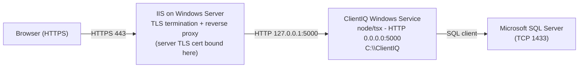

# TLS / SSL Certificate and DNS Setup

*Last reviewed: 2026-07-01 · Source of truth: application code (ClientIQ / Banking Client 360).*

## Purpose

ClientIQ (Banking Client 360) is a Node/Express application that runs as a **Windows Service** from `C:\ClientIQ` and listens on **plain HTTP, port 5000** (`server/index.ts:98-102`). The application does **not** terminate TLS itself; there is no HTTPS listener in the Node process. Yet all externally facing SAML endpoints are `https://` URLs (`PipelineTemplates/start-script.yml:32-36`), so a **TLS terminator / reverse proxy sits in front of the app** and forwards decrypted traffic to `http://127.0.0.1:5000`.

In this environment the web tier is **IIS (Internet Information Services on Windows Server)**: IIS terminates TLS and reverse-proxies to the Node process on HTTP `:5000`. The exact IIS site bindings, Application Request Routing (ARR) rules, and certificate store paths are configured **outside this repository** and are not derivable from code; those specifics are flagged `[CONFIRM]` throughout.

This runbook covers, for each environment (dev, test, preprod, prod):

- DNS record configuration for the application FQDN.
- Obtaining and installing the **server TLS certificate** used by IIS.
- Verifying TLS termination and the application health endpoint.
- Certificate renewal.

> **Not the same as the SAML signing certificate.** This document is about the **server TLS certificate** presented by IIS to browsers. It is *not* the SAML IdP signing certificate the app loads from the `SAML_CERT` environment variable (default `./saml_cert.pem` relative to `C:\ClientIQ`; `server/auth/samlStrategy.ts:16`, `PipelineTemplates/start-script.yml:37`). Operators frequently confuse the two. For SAML certificate handling, see the SAML authentication setup doc (`saml-auth-setup.md`).

---

## 1. Architecture: where TLS terminates



Verified facts that shape this topology:

| Fact | Source |
|------|--------|
| App listens on plain HTTP, host `0.0.0.0`, port `5000` (all other ports firewalled). | `server/index.ts:94-102` |
| App runs as a Windows Service in `C:\ClientIQ` via `npx tsx watch ... server/index.ts`. | `PipelineTemplates/start-script.yml:45-48`, `deploy-nodejs.yml:22,36` |
| SAML ACS / entity / entry-point URLs are all `https://`, implying external TLS. | `PipelineTemplates/start-script.yml:32-36` |
| The database is **Microsoft SQL Server** (TCP 1433); no TLS work is required in this doc for the DB tier. | `PipelineTemplates/start-script.yml:19-28` |

> **[CONFIRM]** The reverse-proxy product and version fronting ClientIQ (IIS + ARR is the expected terminator on the Windows hosts, but the site configuration is not in the repo). Confirm with the infrastructure owner: IIS site name, HTTPS binding, ARR / URL Rewrite rules that forward to `http://127.0.0.1:5000`, and whether TLS 1.2+ enforcement is applied at the IIS/Windows Schannel level.

> **[CONFIRM]** Whether prod uses a hardware/software load balancer in front of the two prod app servers (`Deploy_Prod` and `Deploy_Prod2`; `azure-pipelines.yml:203,229`), and if so where TLS terminates (LB vs each IIS host). Confirm the prod LB/topology and certificate placement with the infrastructure owner.

---

## 2. Environments and FQDNs

ClientIQ has four environments. Each of dev, test, and preprod runs a **single app server + single SQL Server database**; **prod** is the HA tier deployed to two app servers.

The application's own hostname is **not hard-coded** anywhere in the repository. It is supplied per environment as the Azure DevOps pipeline variable `$(SAMLHost)`, which is written into the SAML callback URL at deploy time:

```
SAML_CALLBACK_URL = https://$(SAMLHost)/saml/acs
```
*(`PipelineTemplates/start-script.yml:35`)*

The **certificate CN/SAN, the DNS record, and `$(SAMLHost)` must all agree** for each environment. The only `fmb.com` hostname that appears in code is the **IdP portal** `portal.fmb.com` (used for SAML entry-point and IdP-initiated URLs; `PipelineTemplates/start-script.yml:33,36`). That is the identity provider, **not** the ClientIQ application host. The older documentation used `clientiq.fmb.com`; that string appears nowhere in the codebase and must be treated as a placeholder, not a fact.

| Environment | App servers | SSO / SAML | DNS record → | Certificate CN/SAN |
|-------------|-------------|------------|--------------|--------------------|
| dev | 1 | Off (`SAML_ENABLED=false`, local/mock auth) | `<dev-app-fqdn>` | `<dev-app-fqdn>` |
| test | 1 | Off (`SAML_ENABLED=false`, local/mock auth) | `<test-app-fqdn>` | `<test-app-fqdn>` |
| preprod | 1 | **On** (SAML via RSA SecurID Access, F&M Bank portal) | `<preprod-app-fqdn>` | `<preprod-app-fqdn>` |
| prod | 2 (`Deploy_Prod`, `Deploy_Prod2`) | **On** (SAML via RSA SecurID Access, F&M Bank portal) | `<prod-app-fqdn>` (LB or per-host) | `<prod-app-fqdn>` |

> **[CONFIRM]** The real per-environment application FQDNs (the actual values bound to `$(SAMLHost)` in the `VG-Dev`, `VG-Test`, `VG-Preprod`, and `VG-Prod`/`VG-Prod2` variable groups). Obtain these from the DNS/infra owner. Each value must match its TLS certificate CN/SAN and the `SAML_CALLBACK_URL` for that environment.

> **[CONFIRM]** Whether dev and test are published over HTTPS at all. SSO is off in those environments (the app uses the local/mock auth path), so external TLS may or may not be required there; confirm with the infrastructure owner.

---

## 3. DNS configuration

Work with your DNS administrator to create the record for each environment's application FQDN.

**Single app server (dev / test / preprod):**

| Type | Name | Value | TTL |
|------|------|-------|-----|
| A | `<app-fqdn>` | *(server IP)* | *(per DNS standard)* |

**Prod (two app servers): either round-robin A records or a load-balancer CNAME:**

| Type | Name | Value | TTL |
|------|------|-------|-----|
| A | `<prod-app-fqdn>` | *(prod app server 1 IP)* | *(per DNS standard)* |
| A | `<prod-app-fqdn>` | *(prod app server 2 IP)* | *(per DNS standard)* |

or

| Type | Name | Value | TTL |
|------|------|-------|-----|
| CNAME | `<prod-app-fqdn>` | `<load-balancer-fqdn>` | *(per DNS standard)* |

> **[CONFIRM]** DNS ownership/zone, the actual server/VIP IP addresses, the DNS record TTL standard, and whether prod uses round-robin A records or a load-balancer CNAME. These are infrastructure facts not present in the repo.

Verify resolution from a Windows host:

```powershell
nslookup <app-fqdn>
Resolve-DnsName <app-fqdn>
```

---

## 4. Obtaining the server TLS certificate

The certificate presented by IIS must have its **CN and SAN equal to the environment's application FQDN** (`<app-fqdn>` = the `$(SAMLHost)` value for that environment).

### Option 1: Internal certificate authority (typical for enterprise / banking)

Request the certificate from your internal PKI / security team with:

| Attribute | Value |
|-----------|-------|
| Common Name (CN) | `<app-fqdn>` |
| Subject Alternative Names (SAN) | `<app-fqdn>` |
| Key size | 2048-bit or 4096-bit RSA |
| Signature algorithm | SHA-256 |
| Key usage | Digital Signature, Key Encipherment |
| Extended key usage | Server Authentication |
| Validity | Per PKI policy |

> **[CONFIRM]** Whether an internal CA is the issuer for ClientIQ server certificates, the CA's request process/portal, and the mandated validity period. These are governance facts not in the repo.

### Option 2: Generate a CSR and submit to the CA

On Windows Server, the native approach is to create the CSR through IIS or `certreq`. Using `certreq` with an INF policy file:

```powershell
# request.inf  (edit CN/SAN to the environment FQDN)
@"
[NewRequest]
Subject = "CN=<app-fqdn>"
KeySpec = 1
KeyLength = 2048
HashAlgorithm = SHA256
Exportable = TRUE
MachineKeySet = TRUE
KeyUsage = 0xa0                 ; Digital Signature, Key Encipherment
ProviderName = "Microsoft RSA SChannel Cryptographic Provider"
RequestType = PKCS10

[EnhancedKeyUsageExtension]
OID = 1.3.6.1.5.5.7.3.1        ; Server Authentication

[Extensions]
2.5.29.17 = "{text}"           ; Subject Alternative Name
_continue_ = "dns=<app-fqdn>&"
"@ | Out-File -FilePath "C:\Temp\request.inf" -Encoding ASCII

# Generate the CSR (private key stays in the Windows machine store)
certreq -new C:\Temp\request.inf C:\Temp\<app-fqdn>.csr

# Submit C:\Temp\<app-fqdn>.csr to the CA; accept the issued cert with:
certreq -accept C:\Temp\<app-fqdn>.cer
```

> Using `certreq -new` keeps the private key in the Windows certificate store bound to the pending request; `certreq -accept` installs the issued certificate into that same store, ready for the IIS HTTPS binding. Do not attempt to move a private key out of the store unless your PKI process requires it.

### Option 3: Wildcard certificate

If your organization holds a wildcard certificate covering the ClientIQ FQDNs, obtain the PFX (certificate + private key) from your security team and import it into the Windows certificate store (see §5).

> **[CONFIRM]** Whether a wildcard certificate covering the ClientIQ application FQDNs is issued and approved for use, and who owns it.

---

## 5. Installing the certificate in IIS

Because IIS is the TLS terminator, the certificate is installed into the **Windows certificate store** and then bound to the IIS site's HTTPS binding, not copied into an application directory. (There is no `C:\ClientIQ\ssl` directory or app-level TLS material; the Node app never reads a server TLS cert.)

1. **Import the certificate** into the Local Computer store (if delivered as a PFX):

   ```powershell
   Import-PfxCertificate -FilePath "C:\Temp\<app-fqdn>.pfx" `
       -CertStoreLocation Cert:\LocalMachine\My `
       -Password (Read-Host -AsSecureString -Prompt "PFX password")
   ```

   If the certificate was issued via `certreq -accept` (Option 2), it is already in `Cert:\LocalMachine\My`.

2. **Bind the certificate to the IIS site's HTTPS binding.**

   > **[CONFIRM]** The exact IIS site name and HTTPS binding for each environment (hostname, port 443, SNI on/off), and whether binding is done via IIS Manager, `New-WebBinding` + `netsh http add sslcert`, or the `WebAdministration` PowerShell module. This is infrastructure configuration not present in the repo.

3. **Confirm the reverse-proxy rule** forwards decrypted traffic to the app on `http://127.0.0.1:5000`.

   > **[CONFIRM]** The IIS ARR / URL Rewrite reverse-proxy rule that forwards to `http://127.0.0.1:5000`, including whether `X-Forwarded-Proto` / `X-Forwarded-Host` headers are injected by IIS. The application does **not** set `trust proxy` and does not read forwarded-proto headers (see §7), so any HTTPS-awareness must be handled at the IIS tier.

---

## 6. Verifying TLS and the application

### 6.1 Browser check

1. Navigate to `https://<app-fqdn>`.
2. Open the certificate details (padlock icon) and confirm:
   - Certificate is valid and not expired.
   - **Issued to** = `<app-fqdn>`.
   - **Issued by** = your CA.

### 6.2 Health endpoint check

The application's health route is **`/api/health`** (`server/routes.ts:3133-3138`). It returns:

```json
{ "status": "healthy", "timestamp": "<ISO-8601>", "service": "Banking Customer API" }
```

> **Do not use `/health`.** `/health` is only allow-listed in the auth gate (`server/middleware/authGate.ts:16`); **no handler serves it**, so a request to `/health` falls through to the SPA catch-all rather than returning health JSON. The real endpoint is `/api/health`.

```powershell
# Verify TLS termination + app reachability end to end
$response = Invoke-WebRequest -Uri "https://<app-fqdn>/api/health" -UseBasicParsing
$response.StatusCode              # expect 200
$response.Content                 # expect {"status":"healthy",...}
```

Inspect the presented certificate:

```powershell
$uri = [System.Uri]"https://<app-fqdn>"
$request = [System.Net.HttpWebRequest]::Create($uri)
try {
    $response = $request.GetResponse()
    $cert = $request.ServicePoint.Certificate
    Write-Host "Subject:   $($cert.Subject)"
    Write-Host "Issuer:    $($cert.Issuer)"
    Write-Host "Valid To:  $($cert.GetExpirationDateString())"
} finally {
    if ($response) { $response.Close() }
}
```

### 6.3 Confirm the app is receiving proxied traffic

On the app host, confirm the Node service is listening on `:5000` and that IIS is the only thing exposed publicly:

```powershell
Get-NetTCPConnection -LocalPort 5000 -State Listen
Get-Service -Name "<ClientIQ service name>"      # the app Windows Service
```

> **[CONFIRM]** The exact ClientIQ Windows Service name per host (the pipeline sets it from `$(serviceName)`; `PipelineTemplates/deploy-nodejs.yml:22,36`) and the IIS service/site name, for the commands above.

---

## 7. Security considerations (verified from code)

The following behaviours are set in the application code and directly affect how TLS/proxy security must be handled at the IIS tier. Flag them for security review.

- **Session cookies are not marked `secure` in deployed environments.** The cookie `secure` flag is `process.env.NODE_ENV === 'production'` (`server/auth/session.ts:41`), but the Azure DevOps deploy launches **every** environment with `NODE_ENV=development` (`PipelineTemplates/start-script.yml:16`). Behind a TLS terminator this means the `Secure` attribute is currently **off** even in preprod/prod.

- **No `trust proxy`, no forwarded-proto handling in the app.** There is no `app.set('trust proxy', …)` and no `X-Forwarded-Proto` handling in `server/index.ts`, the routes, or the auth layer. The app treats every request it receives on `:5000` as plain HTTP.

- **No HSTS / helmet in the app.** There is no `helmet`, no `Strict-Transport-Security` header, and no HSTS logic anywhere in the server. HSTS, TLS-version enforcement (TLS 1.2+), cipher-suite hardening, and OCSP stapling must therefore be configured at the **IIS / Windows Schannel** tier, not in the application.

> **[CONFIRM]** Security posture decisions that are not in the repo: HSTS rollout (max-age, `includeSubDomains`, preload), TLS-version and cipher policy on the IIS hosts, OCSP stapling, and whether the `secure` cookie / `NODE_ENV` mismatch should be remediated in the deploy pipeline. Route to the security owner.

---

## 8. Certificate renewal

Because the certificate lives in the Windows certificate store and is bound to IIS, renewal is a store-and-bind operation on the IIS host(s), **not** an application deploy. ClientIQ does not need to be redeployed to pick up a new server TLS certificate.

### 8.1 Expiry monitoring

Monitor the certificate in the Local Computer store. Example daily check (adjust the store thumbprint/subject filter to your certificate):

```powershell
$cert = Get-ChildItem Cert:\LocalMachine\My |
    Where-Object { $_.Subject -like "*CN=<app-fqdn>*" } |
    Sort-Object NotAfter -Descending | Select-Object -First 1

$daysUntilExpiry = ($cert.NotAfter - (Get-Date)).Days
if ($daysUntilExpiry -lt 30) {
    $msg = "ClientIQ TLS certificate on $env:COMPUTERNAME expires $($cert.NotAfter) ($daysUntilExpiry days)."
    Write-EventLog -LogName Application -Source "ClientIQ" -EventId 1001 -EntryType Warning -Message $msg
    Write-Host $msg -ForegroundColor Red
} else {
    Write-Host "Certificate valid for $daysUntilExpiry days" -ForegroundColor Green
}
```

Schedule it (SYSTEM, daily):

```powershell
$action  = New-ScheduledTaskAction -Execute "PowerShell.exe" `
    -Argument "-NoProfile -ExecutionPolicy Bypass -File C:\ClientIQ\scripts\check-cert.ps1"
$trigger = New-ScheduledTaskTrigger -Daily -At "8:00AM"
$principal = New-ScheduledTaskPrincipal -UserId "SYSTEM" -RunLevel Highest
Register-ScheduledTask -TaskName "ClientIQ-CertCheck" -Action $action -Trigger $trigger -Principal $principal
```

> The `Write-EventLog` call requires an existing event source named `ClientIQ` (create once with `New-EventLog -LogName Application -Source "ClientIQ"`).

### 8.2 Renewal timeline

1. **~30 days before expiry:** generate a new CSR if key rotation is required (§4 Option 2).
2. **~14 days before expiry:** submit the CSR to the CA.
3. **~7 days before expiry:** import the issued certificate into the Local Computer store.
4. **Cutover:** update the IIS HTTPS binding to the new certificate (repeat on **both** prod app servers), then verify per §6:

   ```powershell
   Import-PfxCertificate -FilePath "C:\Temp\new-<app-fqdn>.pfx" -CertStoreLocation Cert:\LocalMachine\My -Password (Read-Host -AsSecureString)
   # Re-bind the IIS site HTTPS binding to the new cert (IIS Manager or netsh http add sslcert), then:
   Invoke-WebRequest -Uri "https://<app-fqdn>/api/health" -UseBasicParsing | Select-Object StatusCode
   ```

> **[CONFIRM]** The renewal SLA/thresholds, certificate/renewal ownership, and the alert distribution list (the legacy doc referenced a `30/14/7`-day cadence and an `ops@fmb.com` alias, neither of which is defined in code). Confirm with the security/PKI and DNS owners.

---

## 9. Troubleshooting

| Symptom | Check |
|---------|-------|
| Certificate not trusted in browser | Confirm the issuing CA (and any intermediates) are in the Windows trust store on clients; confirm the IIS binding uses the full chain. |
| HTTPS works but app returns 502 / connection refused | Confirm the ClientIQ Windows Service is running and listening on `127.0.0.1:5000` (`Get-NetTCPConnection -LocalPort 5000 -State Listen`); confirm the IIS ARR reverse-proxy rule targets `http://127.0.0.1:5000`. |
| `/health` returns the SPA/HTML, not JSON | Use `/api/health`; `/health` has no handler (see §6.2). |
| Login redirect loops or cookie not persisting behind HTTPS | Session cookies are not `Secure` in deployed environments (`NODE_ENV=development`; §7). Review with security. |
| Certificate/key mismatch after import | Re-import the correct PFX; the private key must correspond to the certificate being bound in IIS. |
| Mixed-content warnings | Ensure all app resources load over HTTPS; the app itself emits relative URLs, so mixed content usually indicates the IIS binding/host mismatch. |

---

## 10. Related documentation

- **SAML authentication setup:** the SAML IdP signing certificate (`SAML_CERT` / `saml_cert.pem`) and SSO configuration (preprod/prod only).
- **Environment variables reference:** `SAML_*`, `SESSION_SECRET`, `NODE_ENV`, `PORT`, and the SQL Server `MSSQL_*` variables.
- **Deployment / infrastructure:** Azure DevOps pipeline, Windows Service layout in `C:\ClientIQ`, and branch→environment mapping.

---

## Document metadata

- **Application version:** 1.0.0 (`package.json`). Doc version: > **[CONFIRM]** documentation version/owner.
