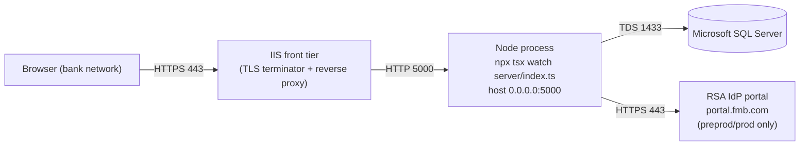

# Windows Server Setup

*Last reviewed: 2026-07-02 - Source of truth: application code*

## Purpose / Overview

This guide describes how the ClientIQ / Banking Client 360 Node application is installed and run on a Windows Server host. It reflects the runtime the Azure DevOps pipeline actually configures, not a hand-built production install.

Key facts an operator must internalize before touching a host:

- The app is a **Node.js process launched from TypeScript source** via `npx tsx watch server/index.ts`. There is no compiled `dist/server/index.js` service. The pipeline does **not** run the esbuild bundle.
- The process runs with **`NODE_ENV=development`** in every environment (this is what the deploy scripts set). That has real consequences for auth, static serving, cookies, and logging. See [Runtime behavior under NODE_ENV=development](#runtime-behavior-under-node_envdevelopment).
- The app listens on **plain HTTP `:5000`** and binds `0.0.0.0`. TLS is terminated by an external tier in front of the Node process.
- The web/proxy tier is **IIS** on Windows Server. The database is **Microsoft SQL Server** only.
- Deployment is performed by the **Azure DevOps pipeline over PowerShell Remoting**, not by a manual NSSM/node-windows install. This guide documents the host so you can understand, verify, and troubleshoot what the pipeline puts there.

Environments are **dev, test, preprod, prod**. dev/test/preprod each run a single app server + single SQL Server database; prod is deployed to two app servers. SAML SSO is on in **preprod and prod only**; dev and test use local/mock auth (`SAML_ENABLED=false`).

---

## 1. Topology



- **IIS** fronts the Node app: it terminates TLS and reverse-proxies to the Node process on HTTP `:5000`. The exact IIS site bindings, ARR/rewrite rules, and certificate configuration are not in this repo.

  > **[CONFIRM]** IIS site name, host header/bindings, ARR reverse-proxy or URL-rewrite rule targeting `http://127.0.0.1:5000`, and the TLS certificate (subject, path/store, owner, renewal) for each environment.

- The Node app itself has **no HTTPS listener**; it serves plain HTTP on port 5000 (`server/index.ts:98-102`). Everything HTTPS (SAML callback/entry URLs, browser access) depends on the IIS tier in front.

---

## 2. Prerequisites

- Windows Server 2019 or 2022.
- Administrator access to the target host.
- **Node.js 20.x LTS** installed and on `PATH` (the pipeline invokes `npx tsx` and `npm ci`).
- Network connectivity from the app host to Microsoft SQL Server (TDS, port 1433).
- For **preprod/prod**: outbound HTTPS to the RSA IdP portal (`portal.fmb.com`) for SAML SSO.
- The app host must be reachable by the Azure DevOps deploy agent over **PowerShell Remoting** (WinRM), because the pipeline opens a `New-PSSession` to the host.

  > **[CONFIRM]** WinRM/PowerShell-Remoting configuration (listener, authentication, firewall) between the ADO deploy pool and each app host, plus the service account used for the remote session and to run the Windows service.

---

## 3. Application layout on the host

The app root on every Windows host is **`C:\ClientIQ`** (`start-script.yml`, `deploy-nodejs.yml`, the repo-root Start scripts).

```
C:\ClientIQ\
├── server\               # TypeScript source (server/index.ts is the entry)
├── client\               # React/MUI source (served via Vite middleware)
├── shared\               # shared/schema.ts etc.
├── node_modules\         # deps, NOT in the build artifact; installed on host (see §6)
├── package.json
├── package-lock.json
├── saml_cert.pem         # IdP signing cert (preprod/prod); SAML_CERT=./saml_cert.pem
├── Start-Server.ps1      # GENERATED by the pipeline at deploy time (see §5)
└── logs\
    └── errors.log        # stderr from the tsx process
```

Notes:

- The runtime runs **from source** (`server/index.ts`), so the `server/`, `client/`, and `shared/` trees are what the process uses. There is no `dist\server\` or `dist\client\` directory in the deployed runtime.
- `npm run build` (used on the ADO build agent) does produce a bundle (`dist/index.js`, esbuild single file, plus `dist/public/` Vite client assets, `vite.config.ts:20`), but the pipeline does **not** launch that bundle. It launches `server/index.ts` directly. If you ever run the compiled path manually, the server bundle is `dist/index.js` (not `dist/server/index.js`) and static assets are under `dist/public/`.
- `node_modules` is **excluded** from the build artifact (`azure-pipelines.yml` CopyFiles excludes) and is installed/refreshed on the host only when the commit message contains the literal string `npm ci` (see §6).

---

## 4. Runtime behavior under NODE_ENV=development

The generated `Start-Server.ps1` sets `NODE_ENV=development` for **all** environments (`start-script.yml`). This is deliberate to document, because several behaviors key off it:

| Concern | Behavior when `NODE_ENV=development` | Code |
|---|---|---|
| Static serving | Vite **dev middleware** (`setupVite`) with HMR, not `serveStatic`/`dist/public` | `server/index.ts:88`; `server/vite.ts` |
| Auth (SAML off) | **Mock auth**: injects `req.employeeId = 1` (Sarah Johnson, System Admin) | `server/index.ts:56-61` |
| Session cookie | `secure` flag **false** | `server/auth/session.ts:41` |
| Main DB pool TLS | `trustServerCertificate` **true** (derived solely from `NODE_ENV==='development'`) | `server/dbConnection.ts:29` |
| Log level | Defaults to `debug` | `server/services/loggerConfig.ts:6-7` |
| Dev/debug routes | Dev-only branches active | `server/routes.ts:294, 1799, 1866, 1929` |

**Consequences:**

- Because the runtime depends on the **Vite dev middleware** and runs from TypeScript via `tsx`, the host needs the **dev dependencies** (`tsx`, `vite`) present at runtime. A production-only dependency install (`npm ci --production`) would omit them and break the app. Always install the full dependency set (see §6).
- In **preprod/prod**, `SAML_ENABLED=true` moves the app onto the SAML auth path even though `NODE_ENV` is still `development`; the mock-auth branch only applies when SAML is off (dev/test).

  > **[CONFIRM]** Whether the prod Windows-service environment overrides `NODE_ENV` to `production` outside the repo. Nothing in the repo does so; the generated start script sets `development` for every environment. If prod is intended to run in production mode, this is a divergence to resolve with ops.

---

## 5. How the app is started (generated Start-Server.ps1)

At deploy time the pipeline template `start-script.yml` opens a remote PowerShell session to the host and **writes `C:\ClientIQ\Start-Server.ps1`** on it. That generated script exports environment variables inline and then launches the app. There is **no `.env` file** and no `DOTENV_CONFIG_PATH`; env vars are set directly in the PowerShell process before `tsx` starts.

The generated launch line is:

```powershell
Set-Location -Path "C:\ClientIQ"
npx tsx watch --clear-screen=false server/index.ts 2> C:\ClientIQ\logs\errors.log
```

The environment block the generated script exports (values in `$(...)` come from Azure DevOps variable groups):

```powershell
# Runtime
$env:NODE_ENV = "development"
$env:PORT = "5000"
$env:HOST = "127.0.0.1"          # inert - see note below
$env:DATABASE_DIALECT = "sqlserver"
$env:DB_VENDOR = "mssql"

# SQL Server connection
$env:MSSQL_SERVER   = "$(DBServer)"
$env:MSSQL_DATABASE = "$(DBName)"
$env:MSSQL_USER     = "$(DBUser)"
$env:MSSQL_PASSWORD = "$(DBPassword)"
$env:MSSQL_PORT     = "1433"       # inert - see note below
$env:MSSQL_ENCRYPT  = "false"      # session store only - see §7
$env:MSSQL_TRUST_SERVER_CERTIFICATE = "true"   # session store only - see §7

# SSO (values effective only where SAML is enabled: preprod/prod)
$env:SAML_ENABLED  = "$(SAMLEnabled)"
$env:SAML_ENTITY_ID   = "https://$(SAMLHost))"                                  # inert (dead var; note stray ')')
$env:SAML_ENTRYPOINT  = "https://portal.fmb.com/IdPServlet?idp_id=$(SAMLIssuer)"
$env:SAML_ISSUER      = "$(SAMLIssuer)"
$env:SAML_CALLBACK_URL = "https://$(SAMLHost)/saml/acs"
$env:SAML_IDP_INITIATED_URL = "https://portal.fmb.com/IdPServlet?idp_id=$(SAMLIssuer)"  # inert (dead var)
$env:SAML_CERT     = "./saml_cert.pem"
$env:SAML_ROLE_ENV = "$(SAMLRoleEnv)"   # DEV/TST/STG/PRD, scopes AD-group role mapping

# Session
$env:SESSION_SECRET = "$(SessionSecret)"
```

**Inert / no-effect variables** (set by the script but never read by application code; do not rely on them):

- `HOST`: the server hard-codes `host: "0.0.0.0"` in `server.listen(...)` (`server/index.ts`); `process.env.HOST` is never read. The process binds all interfaces regardless.
- `MSSQL_PORT`: no code reads it; the SQL Server pool uses the default port (1433).
- `SAML_ENTITY_ID`: no code reads it; the SAML strategy uses `SAML_ISSUER`. (Also note the stray trailing `)` in the literal value.)
- `SAML_IDP_INITIATED_URL`: no code reads it; logout origin derives from `RSA_PORTAL_URL` or `SAML_ENTRYPOINT` (`server/routes/auth.ts`).

The two repo-root scripts, `Start-Dev.ps1` (fully hard-coded local dev, SQL host `HUB-SQL1TST-LIS`, DB `ClientIQdev`, `SAML_ENABLED=false`) and `Start-Server.ps1` (parameterized: `-DBServer -DBName -DBUser -DBPassword -SessionSecret`, `SAML_ENABLED=false`), have the same shape but do **not** include the SAML block or the `errors.log` redirect. The pipeline-generated `C:\ClientIQ\Start-Server.ps1` is the authoritative one on a deployed host.

> **Secrets note:** `Start-Dev.ps1` contains a hard-coded MSSQL password (`Start-Dev.ps1:16`) and a hard-coded `SESSION_SECRET` (`Start-Dev.ps1:23`) committed to the repo. That script is for local dev only; do not use it as a template for a real host, and rotate any secret that has been exposed by it.

---

## 6. Deployment (Azure DevOps, PowerShell Remoting)

Do not hand-install the app as a Windows service. It is deployed by the Azure DevOps pipeline. Deployment source-of-truth is **ADO branches, not GitHub `main`**; pushing to GitHub `main` deploys nowhere.

Branch → environment mapping:

| Branch | Stage(s) | Environment | `SAML_ROLE_ENV` | SSO |
|---|---|---|---|---|
| `develop` | `Deploy_Dev` | dev | `DEV` | off (mock auth) |
| `test` | `Deploy_Test` (then `DAST_Scan`) | test | `TST` | off (mock auth) |
| `preprod` | `Deploy_Preprod` | preprod | `STG` | on (SAML) |
| `prod` | `Deploy_Prod` + `Deploy_Prod2` | prod | `PRD` | on (SAML) |

Prod deploys to **two app servers** (`Deploy_Prod`, `Deploy_Prod2`).

> **[CONFIRM]** Prod topology in front of the two app servers: load balancer / IIS ARR farm, health-probe path, and session affinity (the app uses a SQL Server-backed session store, so affinity may not be required; confirm).

**Per-host deploy flow** (`deploy-nodejs.yml`, over a `New-PSSession` to the host):

1. Copy the published artifact into `C:\ClientIQ` (`Copy-Item ... -ToSession`).
2. `Stop-Service -Name $(serviceName)`.
3. **Conditional** dependency install: only when the triggering commit message contains `npm ci`, run `npm ci --prefer-offline --loglevel=info` in `C:\ClientIQ`, then remove `.npmrc`. Otherwise the existing `node_modules` is reused (it is not in the artifact).
4. `Start-Service -Name $(serviceName)`, then delete the generated `Start-Server.ps1`.

The `start-script.yml` template (which regenerates `C:\ClientIQ\Start-Server.ps1`) runs alongside the deploy so the service starts the app with the correct per-environment env block.

- Dependencies are installed with a full `npm ci` (**not** `--production`), which is required because the runtime needs `tsx`/`vite`.
- The private npm registry is the Nexus proxy `https://farmers-merchants-bank.repo.sonatype.app/repository/npm-proxy/` (injected via a temporary `.npmrc`).

**The Windows service itself**: the service named `$(serviceName)` already exists on each host; the pipeline only stops/starts it. The binding between that service and the start script/node process is configured **outside this repo**.

> **[CONFIRM]** The Windows service name(s) per environment, the service manager/wrapper used to create them, the exact command/working directory the service runs (expected to invoke `C:\ClientIQ\Start-Server.ps1` → `npx tsx watch server/index.ts`), the service account, and recovery/restart settings.

---

## 7. Database connection

Microsoft SQL Server is the only database engine, in every environment.

- Connection is configured by `MSSQL_SERVER` / `MSSQL_DATABASE` / `MSSQL_USER` / `MSSQL_PASSWORD` (legacy fallbacks `DB_SERVER` / `DB_NAME` / `DB_USER` / `DB_PASSWORD` exist). `DATABASE_DIALECT=sqlserver` and `DB_VENDOR=mssql` select the SQL Server code paths; if `DB_VENDOR` is unset the search-provider factory would fall back to the wrong engine, so it is set explicitly.
- The pool connects on port **1433** (the default; `MSSQL_PORT` is not read).
- **TLS split behavior (important):** `MSSQL_ENCRYPT` and `MSSQL_TRUST_SERVER_CERTIFICATE` are honored **only by the session store** (`server/auth/session.ts:15-16`). The **main data pool** hard-codes `encrypt: true` and derives `trustServerCertificate` solely from `NODE_ENV==='development'` (`server/dbConnection.ts:28-29`), ignoring both env vars. So the deploy's `MSSQL_ENCRYPT=false` / `MSSQL_TRUST_SERVER_CERTIFICATE=true` affect only the session connection; the main pool always encrypts and (because `NODE_ENV=development`) trusts the server certificate.

Quick connectivity check from the host:

```powershell
Test-NetConnection -ComputerName "<MSSQL_SERVER>" -Port 1433
```

> **[CONFIRM]** Per-environment SQL Server host/FQDN, database name, and the service login used by the app (owner, permissions). These come from ADO variable groups (`VG-Dev`, `VG-Test`, `VG-Preprod`, `VG-Prod`, `VG-Prod2`) and are not in the repo.

---

## 8. Firewall

The app listens on `0.0.0.0:5000` in code; host exposure of that port is controlled by the firewall, not by the app bind (the `HOST` env var is inert). Per the code comment, port 5000 "is the only port that is not firewalled"; all other app ports are expected to be firewalled at the host/infra level.

**Inbound**

- Allow TCP **5000** only from the IIS front tier (loopback if IIS is co-located on the same host, otherwise from the IIS host). Restricting inbound 5000 is what keeps the plain-HTTP port from being reachable directly.

```powershell
# Example: allow inbound 5000 from loopback only (IIS co-located on the same host)
New-NetFirewallRule -DisplayName "ClientIQ App (Node 5000)" `
    -Direction Inbound -Protocol TCP -LocalPort 5000 `
    -Action Allow -Profile Domain -LocalAddress 127.0.0.1
```

  > **[CONFIRM]** Whether IIS runs on the same host (restrict to `127.0.0.1`) or a separate host (restrict inbound 5000 to the IIS host's address).

**Outbound**

| Destination | Port | Purpose | Required in |
|---|---|---|---|
| SQL Server host | 1433 (TCP) | Database | all |
| RSA IdP portal `portal.fmb.com` | 443 (HTTPS) | SAML SSO | preprod, prod |
| Nexus npm proxy `farmers-merchants-bank.repo.sonatype.app` | 443 (HTTPS) | `npm ci` during deploy | during deploys with `npm ci` |

```powershell
New-NetFirewallRule -DisplayName "ClientIQ SQL Outbound" `
    -Direction Outbound -Protocol TCP -RemotePort 1433 -Action Allow
```

A firewall that allows only 1433 outbound will break SSO (preprod/prod). Add the HTTPS egress rules above accordingly.

  > **[CONFIRM]** The RSA IdP host IPs/FQDNs and whether egress is via a proxy; adjust rules to your egress model.

---

## 9. Logging and log management

- The generated start script redirects **stderr** to `C:\ClientIQ\logs\errors.log` (`2> C:\ClientIQ\logs\errors.log`). Stdout goes wherever the Windows service captures it.
- Application logging is structured; the effective log level defaults to `debug` because `NODE_ENV=development` (`server/services/loggerConfig.ts:6-7`), overridable with `LOG_LEVEL`.

  > **[CONFIRM]** Where the Windows service writes stdout (service wrapper config), and the current `LOG_LEVEL` per environment if overridden.

A daily scheduled task can prune/compress old logs. Example:

```powershell
$action = New-ScheduledTaskAction -Execute "PowerShell.exe" `
    -Argument "-NoProfile -ExecutionPolicy Bypass -File C:\ClientIQ\scripts\cleanup-logs.ps1"
$trigger  = New-ScheduledTaskTrigger -Daily -At "3:00AM"
$principal = New-ScheduledTaskPrincipal -UserId "SYSTEM" -RunLevel Highest
$settings = New-ScheduledTaskSettingsSet -StartWhenAvailable
Register-ScheduledTask -TaskName "ClientIQ-LogCleanup" `
    -Action $action -Trigger $trigger -Principal $principal -Settings $settings
```

Where `cleanup-logs.ps1` deletes files under `C:\ClientIQ\logs` older than 30 days and compresses `*.log` older than 7 days.

  > **[CONFIRM]** Log-retention policy (retention window, compression, off-host shipping) and any compliance requirement for retaining application/audit logs.

---

## 10. Verification

After a deploy, confirm the host is healthy.

**Service state**

```powershell
Get-Service -Name "<serviceName>"
```

**Process / port**

```powershell
Get-Process node | Select-Object Id, WorkingSet64, CPU
Test-NetConnection -ComputerName localhost -Port 5000
```

**Health endpoint**: the app exposes `GET /api/health` (`server/routes.ts:3133-3139`). It returns a static payload and does **not** check database connectivity:

```powershell
Invoke-RestMethod -Uri "http://localhost:5000/api/health" -Method GET
```

Expected response:

```json
{
  "status": "healthy",
  "timestamp": "2026-07-02T00:00:00.000Z",
  "service": "Banking Customer API"
}
```

There is no `database` field and the status string is `"healthy"` (not `"ok"`). A 200 from `/api/health` means the process is up and routing; it does not confirm SQL Server connectivity. `authGate` allowlists the exact path `/health` (`server/middleware/authGate.ts`); `/api/health` is reachable via normal `/api` handling.

**Database reachability** (separate from the health endpoint): use the `Test-NetConnection` to port 1433 in §7, and inspect `C:\ClientIQ\logs\errors.log` for connection errors.

---

## 11. Service management commands

```powershell
Start-Service   -Name "<serviceName>"
Stop-Service    -Name "<serviceName>"
Restart-Service -Name "<serviceName>"
Get-Service     -Name "<serviceName>" | Format-List *
```

Tail the error log:

```powershell
Get-Content "C:\ClientIQ\logs\errors.log" -Tail 100 -Wait
```

---

## 12. Troubleshooting

**Service won't start**

1. Event Viewer → Windows Logs → Application (`eventvwr.msc`).
2. `C:\ClientIQ\logs\errors.log` (stderr from `tsx`).
3. Confirm `node`/`npx` are on the service account's `PATH` and that `node_modules` exists (it is not in the artifact; a deploy without an `npm ci` commit relies on the pre-existing `node_modules`).
4. Run the app by hand to see startup errors directly:

   ```powershell
   Set-Location C:\ClientIQ
   npx tsx watch --clear-screen=false server/index.ts
   ```

   (Set the same `$env:*` variables the generated `Start-Server.ps1` sets, or invoke that script.)

**"Cannot find module tsx" / Vite errors at startup**
This means dev dependencies are missing; the runtime needs `tsx` and `vite`. Re-run `npm ci` (full, not `--production`) in `C:\ClientIQ`, or redeploy with a commit message containing `npm ci` so the pipeline reinstalls dependencies.

**Database connection issues**

```powershell
Test-NetConnection -ComputerName "<MSSQL_SERVER>" -Port 1433
```

Check the app is using the SQL Server path (`DATABASE_DIALECT=sqlserver`, `DB_VENDOR=mssql`) and verify the login. Remember the main pool always uses `encrypt: true`.

**Port 5000 not reachable from IIS**
Confirm the inbound firewall rule and that IIS's reverse-proxy target is `http://127.0.0.1:5000` (or the app host:5000). The app binds `0.0.0.0`, so a local `Test-NetConnection localhost -Port 5000` on the app host should succeed even if the firewall blocks external access.

**SSO not working (preprod/prod)**
Confirm `SAML_ENABLED=true`, outbound HTTPS to `portal.fmb.com` is allowed, `C:\ClientIQ\saml_cert.pem` exists and contains valid `-----BEGIN CERTIFICATE-----` / `-----END CERTIFICATE-----` markers, and `SAML_ROLE_ENV` is set to the correct value (`STG` for preprod, `PRD` for prod). `SAML_CERT` is treated as inline PEM only if it contains `BEGIN CERTIFICATE`; otherwise it is read as a file path (`server/auth/samlStrategy.ts:16-38`).

**Node memory**

```powershell
Get-Process node | Select-Object WorkingSet64, CPU
```

  > **[CONFIRM]** Host sizing (CPU/RAM) and any Node memory limit (`--max-old-space-size`) required per environment.

---

## 13. Known divergences and caveats

- **Runs from source, not a compiled bundle.** The pipeline launches `npx tsx watch server/index.ts`. It never runs `dist/index.js`. The esbuild/Vite build exists but is not the deployed runtime.
- **`NODE_ENV=development` in every environment.** This puts the app on the Vite dev-middleware and mock-auth (SAML-off) paths, disables the secure-cookie flag, and defaults logging to `debug`. Treat this as the current reality, not production mode. See §4.
- **No `.env` / `DOTENV_CONFIG_PATH`.** Environment is exported inline by the generated `Start-Server.ps1`. The code has no dotenv wiring.
- **TLS is external.** The Node process is plain HTTP:5000; IIS terminates TLS in front. SAML endpoints are `https://` because they are reached through that external tier.
- **Split DB TLS.** `MSSQL_ENCRYPT` / `MSSQL_TRUST_SERVER_CERTIFICATE` affect only the session store; the main pool is fixed at `encrypt: true` with cert trust following `NODE_ENV`.
- **Dead env vars.** `HOST`, `MSSQL_PORT`, `SAML_ENTITY_ID`, `SAML_IDP_INITIATED_URL` are set by the deploy scripts but never read by code.

  > **[CONFIRM]** Document owner, review cadence, and whether NSSM/node-windows was ever the real service-creation method (the ADO PowerShell-Remoting pipeline is the authoritative deploy path in the repo). The prior guide was attributed to an individual author and listed no owning team.
